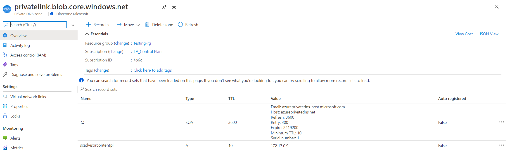

# Setting up your Private Link
Setting up a Private Link requires a few steps: 
* Creating a Private Link Scope with resources
* Creating a Private Endpoint on your network and connecting it to the scope
* Configuring the required access on your Azure Monitor resources.

This article reviews how it's done through the Azure portal and provides an example Azure Resource Manager (ARM) template to automate the process. 

## Create a Private Link connection

Start by creating an Azure Monitor Private Link Scope resource.

1. Go to **Create a resource** in the Azure portal and search for **Azure Monitor Private Link Scope**.

   

2. Select **create**.
3. Pick a Subscription and Resource Group.
4. Give the AMPLS a name. It's best to use a meaningful and clear name, such as "AppServerProdTelem".
5. Select **Review + Create**. 

   

6. Let the validation pass, and then select **Create**.

### Connect Azure Monitor resources

Connect Azure Monitor resources (Log Analytics workspaces and Application Insights components) to your AMPLS.

1. In your Azure Monitor Private Link scope, select **Azure Monitor Resources** in the left-hand menu. Select the **Add** button.
2. Add the workspace or component. Selecting the **Add** button brings up a dialog where you can select Azure Monitor resources. You can browse through your subscriptions and resource groups, or you can type in their name to filter down to them. Select the workspace or component and select **Apply** to add them to your scope.

    

> [!NOTE]
> Deleting Azure Monitor resources requires that you first disconnect them from any AMPLS objects they are connected to. It's not possible to delete resources connected to an AMPLS.

### Connect to a private endpoint

Now that you have resources connected to your AMPLS, create a private endpoint to connect our network. You can do this task in the [Azure portal Private Link center](https://portal.azure.com/#blade/Microsoft_Azure_Network/PrivateLinkCenterBlade/privateendpoints), or inside your Azure Monitor Private Link Scope, as done in this example.

1. In your scope resource, select **Private Endpoint connections** in the left-hand resource menu. Select **Private Endpoint** to start the endpoint create process. You can also approve connections that were started in the Private Link center here by selecting them and selecting **Approve**.

    

2. Pick the subscription, resource group, and name of the endpoint, and the region it should live in. The region needs to be the same region as the VNet you connect it to.

3. Select **Next: Resource**. 

4. In the Resource screen,

   a. Pick the **Subscription** that contains your Azure Monitor Private Scope resource. 

   b. For **resource type**, choose **Microsoft.insights/privateLinkScopes**. 

   c. From the **resource** drop-down, choose your Private Link scope you created earlier. 

   d. Select **Next: Configuration >**.
      

5. On the configuration pane,

   a.    Choose the **virtual network** and **subnet** that you want to connect to your Azure Monitor resources. 
 
   b.    Choose **Yes** for **Integrate with private DNS zone**, and let it automatically create a new Private DNS Zone. The actual DNS zones may be different from what is shown in the screenshot below. 
   > [!NOTE]
   > If you choose **No** and prefer to manage DNS records manually, first complete setting up your Private Link - including this Private Endpoint and the AMPLS configuration. Then, configure your DNS according to the instructions in [Azure Private Endpoint DNS configuration](../../private-link/private-endpoint-dns.md). Make sure not to create empty records as preparation for your Private Link setup. The DNS records you create can override existing settings and impact your connectivity with Azure Monitor.
 
   c.    Select **Review + create**.
 
   d.    Let validation pass. 
 
   e.    Select **Create**. 

    

You've now created a new private endpoint that is connected to this AMPLS.


## Configure access to your resources
So far we covered the configuration of your network, but you should also consider how you want to configure network access to your monitored resources - Log Analytics workspaces and Application Insights components.

Go to the Azure portal. In your resource's menu, there's a menu item called **Network Isolation** on the left-hand side. This page controls both which networks can reach the resource through a Private Link, and whether other networks can reach it or not.


> [!NOTE]
> Starting August 16, 2021, Network Isolation will be strictly enforced. Resources set to block queries from public networks, and that aren't associated with an AMPLS, will stop accepting queries from any network.


### Connected Azure Monitor Private Link scopes
Here you can review and configure the resource's connections to Azure Monitor Private Links scopes. Connecting to scopes (AMPLSs) allows traffic from the virtual network connected to each AMPLS to reach the resource. It has the same effect as connecting it from the scope as we did in [Connecting Azure Monitor resources](#connect-azure-monitor-resources). 

To add a new connection, select **Add** and select the Azure Monitor Private Link Scope. Select **Apply** to connect it. Your resource can connect to five AMPLS objects, as mentioned in [Restrictions and limitations](./private-links-planning#restrictions-and-limitations).

### Virtual networks access configuration - Managing access from outside of private links scopes
The settings on the bottom part of this page control access from public networks, meaning networks not connected to the listed scopes (AMPLSs).

If you set **Allow public network access for ingestion** to **No**, then clients (machines, SDKs, etc.) outside of the connected scopes can't upload data or send logs to the resource.

If you set **Allow public network access for queries** to **No**, then clients (machines, SDKs etc.) outside of the connected scopes can't query data in the resource. That data includes access to logs, metrics, and the live metrics stream, as well as experiences built on top such as workbooks, dashboards, query API-based client experiences, insights in the Azure portal, and more. Experiences running outside the Azure portal and that query Log Analytics data also have to be running within the private-linked VNET.


### Exceptions

#### Diagnostic logs
Logs and metrics uploaded to a workspace via [Diagnostic Settings](../essentials/diagnostic-settings.md) go over a secure private Microsoft channel, and are not controlled by these settings.

#### Azure Resource Manager
Restricting access as explained above applies to data in the resource. However, configuration changes, including turning these access settings on or off, are managed by Azure Resource Manager. To control these settings, you should restrict access to resources using the appropriate roles, permissions, network controls, and auditing. For more information, see [Azure Monitor Roles, Permissions, and Security](../roles-permissions-security.md)

Additionally, specific experiences (such as the LogicApp connector, Update Management solution, and the Workspace Summary blade in the portal, showing the solutions dashboard) query data through Azure Resource Manager and therefore won't be able to query data unless Private Link settings are applied to the Resource Manager as well.


## Review and validate your Private Link setup

### Reviewing your Endpoint's DNS settings
The Private Endpoint you created should now have an five DNS zones configured:

* privatelink-monitor-azure-com
* privatelink-oms-opinsights-azure-com
* privatelink-ods-opinsights-azure-com
* privatelink-agentsvc-azure-automation-net
* privatelink-blob-core-windows-net

> [!NOTE]
> Each of these zones maps specific Azure Monitor endpoints to private IPs from the VNet's pool of IPs. The IP addresses showns in the below images are only examples. Your configuration should instead show private IPs from your own network.

#### Privatelink-monitor-azure-com
This zone covers the global endpoints used by Azure Monitor, meaning these endpoints serve requests considering all resources, not a specific one. This zone should have endpoints mapped for:
* `in.ai` - Application Insights ingestion endpoint (both a global and a regional entry)
* `api` - Application Insights and Log Analytics API endpoint
* `live` - Application Insights live metrics endpoint
* `profiler` - Application Insights profiler endpoint
* `snapshot` - Application Insights snapshots endpoint
[](./media/private-link-security/dns-zone-privatelink-monitor-azure-com-expanded.png#lightbox)

#### privatelink-oms-opinsights-azure-com
This zone covers workspace-specific mapping to OMS endpoints. You should see an entry for each workspace linked to the AMPLS connected with this Private Endpoint.
[](./media/private-link-security/dns-zone-privatelink-oms-opinsights-azure-com-expanded.png#lightbox)

#### privatelink-ods-opinsights-azure-com
This zone covers workspace-specific mapping to ODS endpoints - the ingestion endpoint of Log Analytics. You should see an entry for each workspace linked to the AMPLS connected with this Private Endpoint.
[](./media/private-link-security/dns-zone-privatelink-ods-opinsights-azure-com-expanded.png#lightbox)

#### privatelink-agentsvc-azure-automation-net
This zone covers workspace-specific mapping to the agent service automation endpoints. You should see an entry for each workspace linked to the AMPLS connected with this Private Endpoint.
[](./media/private-link-security/dns-zone-privatelink-agentsvc-azure-automation-net-expanded.png#lightbox)

#### privatelink-blob-core-windows-net
This zone configures connectivity to the global agents' solution packs storage account. Through it, agents can download new or updated solution packs (also known as management packs). Only one entry is required to handle to Log Analytics agents, no matter how many workspaces are used.
[](./media/private-link-security/dns-zone-privatelink-blob-core-windows-net-expanded.png#lightbox)
> [!NOTE]
> This entry is only added to Private Links setups created at or after April 19, 2021 (or starting June, 2021 on Azure Sovereign clouds).


### Validating you are communicating over a Private Link
* To validate your requests are now sent through the Private Endpoint, you can review them with a network tracking tool or even your browser. For example, when attempting to query your workspace or application, make sure the request is sent to the private IP mapped to the API endpoint, in this example it's *172.17.0.9*.

    Note: Some browsers may use other DNS settings (see [Browser DNS settings](./private-links-planning#browser-dns-settings)). Make sure your DNS settings apply.

* To make sure your workspace or component aren't receiving requests from public networks (not connected through AMPLS), set the resource's public ingestion and query flags to *No* as explained in [Configure access to your resources](#configure-access-to-your-resources).

* From a client on your protected network, use `nslookup` to any of the endpoints listed in your DNS zones. It should be resolved by your DNS server to the mapped private IPs instead of the public IPs used by default.


## Use APIs and command line

You can automate the process described earlier using Azure Resource Manager templates, REST, and command-line interfaces.

To create and manage private link scopes, use the [REST API](/rest/api/monitor/privatelinkscopes(preview)/private%20link%20scoped%20resources%20(preview)) or [Azure CLI (az monitor private-link-scope)](/cli/azure/monitor/private-link-scope).

To manage the network access flag on your workspace or component, use the flags `[--ingestion-access {Disabled, Enabled}]` and `[--query-access {Disabled, Enabled}]`on [Log Analytics workspaces](/cli/azure/monitor/log-analytics/workspace) or [Application Insights components](/cli/azure/ext/application-insights/monitor/app-insights/component).

### Example Azure Resource Manager (ARM) template
The below Azure Resource Manager template creates:
* A private link scope (AMPLS) named "my-scope"
* A Log Analytics workspace named "my-workspace"
* Add a scoped resource to the "my-scope" AMPLS, named "my-workspace-connection"

```
{
    "$schema": https://schema.management.azure.com/schemas/2019-04-01/deploymentTemplate.json#,
    "contentVersion": "1.0.0.0",
    "parameters": {
        "private_link_scope_name": {
            "defaultValue": "my-scope",
            "type": "String"
        },
        "workspace_name": {
            "defaultValue": "my-workspace",
            "type": "String"
        }
    },
    "variables": {},
    "resources": [
        {
            "type": "microsoft.insights/privatelinkscopes",
            "apiVersion": "2019-10-17-preview",
            "name": "[parameters('private_link_scope_name')]",
            "location": "global",
            "properties": {}
        },
        {
            "type": "microsoft.operationalinsights/workspaces",
            "apiVersion": "2020-10-01",
            "name": "[parameters('workspace_name')]",
            "location": "westeurope",
            "properties": {
                "sku": {
                    "name": "pergb2018"
                },
                "publicNetworkAccessForIngestion": "Enabled",
                "publicNetworkAccessForQuery": "Enabled"
            }
        },
        {
            "type": "microsoft.insights/privatelinkscopes/scopedresources",
            "apiVersion": "2019-10-17-preview",
            "name": "[concat(parameters('private_link_scope_name'), '/', concat(parameters('workspace_name'), '-connection'))]",
            "dependsOn": [
                "[resourceId('microsoft.insights/privatelinkscopes', parameters('private_link_scope_name'))]",
                "[resourceId('microsoft.operationalinsights/workspaces', parameters('workspace_name'))]"
            ],
            "properties": {
                "linkedResourceId": "[resourceId('microsoft.operationalinsights/workspaces', parameters('workspace_name'))]"
            }
        }
    ]
}
```

## Next steps

- Learn about [private storage](private-storage.md)
- Learn about [Private Link for Automation](../../automation/how-to/private-link-security.md)