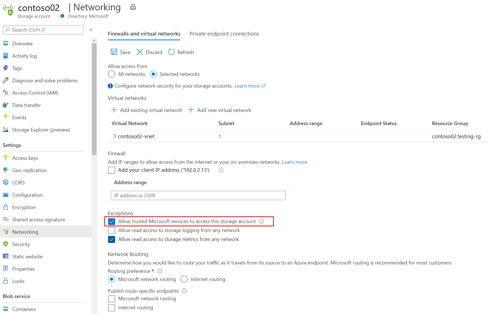
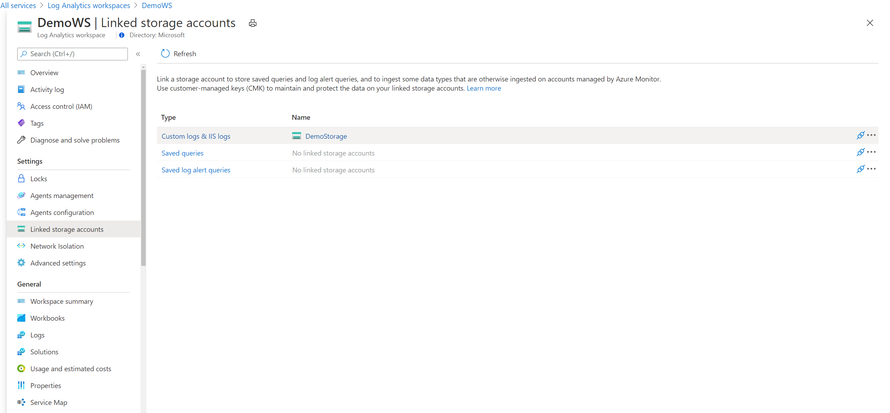
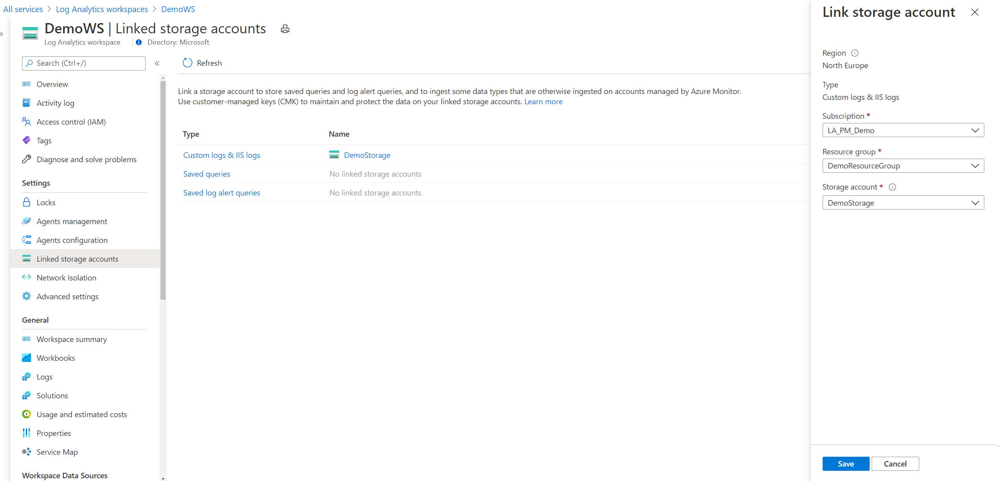

# Use customer-managed storage accounts in Azure Monitor Logs

Azure Monitor Logs relies on Azure Storage in various scenarios. Azure Monitor typically manages this type of storage automatically, but some cases require you to provide and manage your own storage account, also known as a customer-managed storage account. This article describes the use cases and requirements for setting up customer-managed storage for Azure Monitor Logs and explains how to link a storage account to a Log Analytics workspace. 

> [!NOTE]
> We recommend that you don't take a dependency on the contents that Azure Monitor Logs uploads to customer-managed storage because formatting and content might change.

## Private links
Customer-managed storage accounts are used to ingest custom logs when private links are used to connect to Azure Monitor resources. The ingestion process of these data types first uploads logs to an intermediary Azure Storage account, and only then ingests them to a workspace.

### Workspace requirements
When you connect to Azure Monitor over a private link, Azure Monitor Agent can only send logs to workspaces accessible over a private link. This requirement means you should:

* Configure an Azure Monitor Private Link Scope (AMPLS) object.
* Connect it to your workspaces.
* Connect the AMPLS to your network over a private link.

For more information on the AMPLS configuration procedure, see [Use Azure Private Link to securely connect networks to Azure Monitor](./private-link-security.md).

### Storage account requirements
For the storage account to connect to your private link, it must:

* Be located on your virtual network or a peered network and connected to your virtual network over a private link.
* Be located on the same region as the workspace it's linked to.
* Allow Azure Monitor to access the storage account. To allow only specific networks to access your storage account, select the exception **Allow trusted Microsoft services to access this storage account**.

  

If your workspace handles traffic from other networks, configure the storage account to allow incoming traffic coming from the relevant networks/internet.

Coordinate the TLS version between the agents and the storage account. We recommend that you send data to Azure Monitor Logs by using TLS 1.2 or higher. Review the [platform-specific guidance](./data-security.md#sending-data-securely-using-tls-12). If necessary, [configure your agents to use TLS 1.2](../agents/agent-windows.md#configure-agent-to-use-tls-12). If that's not possible, configure the storage account to accept TLS 1.0.

## Customer-managed key data encryption
Azure Storage encrypts all data at rest in a storage account. By default, it uses Microsoft-managed keys (MMKs) to encrypt the data. However, Azure Storage also allows you to use customer-managed keys (CMKs) from Azure Key Vault to encrypt your storage data. You can either import your own keys into Key Vault or use the Key Vault APIs to generate keys.

### CMK scenarios that require a customer-managed storage account

A customer-managed storage account is required for:

* Encrypting log-alert queries with CMKs.
* Encrypting saved queries with CMKs.

### Apply CMKs to customer-managed storage accounts

Follow this guidance to apply CMKs to customer-managed storage accounts.

#### Storage account requirements
The storage account and the key vault must be in the same region, but they also can be in different subscriptions. For more information about Azure Storage encryption and key management, see [Azure Storage encryption for data at rest](../../storage/common/storage-service-encryption.md).

#### Apply CMKs to your storage accounts
To configure your Azure Storage account to use CMKs with Key Vault, use the [Azure portal](../../storage/common/customer-managed-keys-configure-key-vault.md?toc=%252fazure%252fstorage%252fblobs%252ftoc.json), [PowerShell](../../storage/common/customer-managed-keys-configure-key-vault.md?toc=%252fazure%252fstorage%252fblobs%252ftoc.json), or the [Azure CLI](../../storage/common/customer-managed-keys-configure-key-vault.md?toc=%252fazure%252fstorage%252fblobs%252ftoc.json).

## Link storage accounts to your Log Analytics workspace

> [!NOTE]
> If you link a storage account for queries, or for log alerts, existing queries will be removed from the workspace. Copy saved searches and log alerts that you need before you undertake this configuration. For directions on moving saved queries and log alerts, see [Workspace move procedure](./move-workspace-region.md).
>
> You can connect up to:
> - Five storage accounts for the ingestion of custom logs and IIS logs.
> - One storage account for saved queries.
> - One storage account for saved log alert queries.

### Use the Azure portal
On the Azure portal, open your workspace menu and select **Linked storage accounts**. A pane shows the linked storage accounts by the use cases previously mentioned (ingestion over Private Link, applying CMKs to saved queries or to alerts).

Selecting an item on the table opens its storage account details, where you can set or update the linked storage account for this type.

You can use the same account for different use cases if you prefer.

### Use the Azure CLI or REST API
You can also link a storage account to your workspace via the [Azure CLI](/cli/azure/monitor/log-analytics/workspace/linked-storage) or [REST API](/rest/api/loganalytics/linkedstorageaccounts).

The applicable `dataSourceType` values are:

* `CustomLogs`: To use the storage account for custom logs and IIS logs ingestion.
* `Query`: To use the storage account to store saved queries (required for CMK encryption).
* `Alerts`: To use the storage account to store log-based alerts (required for CMK encryption).

## Manage linked storage accounts

Follow this guidance to manage your linked storage accounts.

### Create or modify a link
When you link a storage account to a workspace, Azure Monitor Logs starts using it instead of the storage account owned by the service. You can:

* Register multiple storage accounts to spread the load of logs between them.
* Reuse the same storage account for multiple workspaces.

### Unlink a storage account
To stop using a storage account, unlink the storage from the workspace. When you unlink all storage accounts from a workspace, Azure Monitor Logs uses service-managed storage accounts. If your network has limited access to the internet, these storage accounts might not be available and any scenario that relies on storage will fail.

### Replace a storage account
To replace a storage account used for ingestion:

1. **Create a link to a new storage account**. The logging agents will get the updated configuration and start sending data to the new storage. The process could take a few minutes.
2. **Unlink the old storage account so agents will stop writing to the removed account**. The ingestion process keeps reading data from this account until it's all ingested. Don't delete the storage account until you see that all logs were ingested.

### Maintain storage accounts

Follow this guidance to maintain your storage accounts.

#### Manage log retention
When you use your own storage account, retention is up to you. Azure Monitor Logs doesn't delete logs stored on your private storage. Instead, you should set up a policy to handle the load according to your preferences.

#### Consider load
Storage accounts can handle a certain load of read and write requests before they start throttling requests. For more information, see [Scalability and performance targets for Azure Blob Storage](../../storage/common/scalability-targets-standard-account.md).

Throttling affects the time it takes to ingest logs. If your storage account is overloaded, register another storage account to spread the load between them. To monitor your storage account's capacity and performance, review its [Insights in the Azure portal](../../storage/common/storage-insights-overview.md?toc=%2fazure%2fazure-monitor%2ftoc.json).

### Related charges
You're charged for storage accounts based on the volume of stored data, the type of storage, and the type of redundancy. For more information, see [Block blob pricing](https://azure.microsoft.com/pricing/details/storage/blobs) and [Azure Table Storage pricing](https://azure.microsoft.com/pricing/details/storage/tables).

## Next steps

- Learn about [using Private Link to securely connect networks to Azure Monitor](private-link-security.md).
- Learn about [Azure Monitor customer-managed keys](../logs/customer-managed-keys.md).
