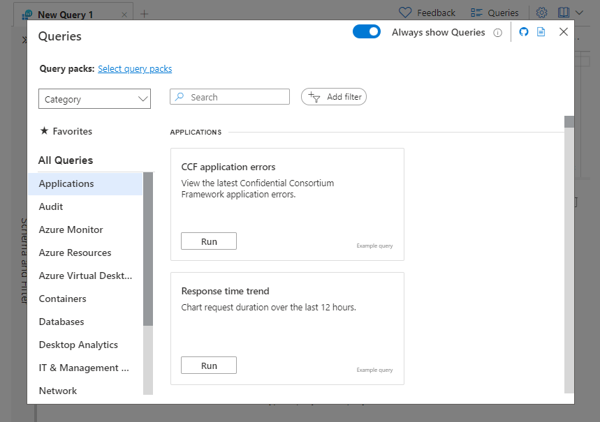
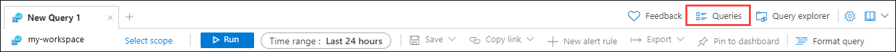
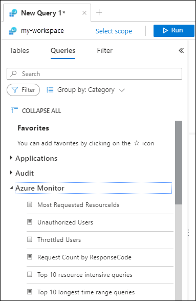

# Use queries in Log Analytics
When you open Log Analytics, you can access existing log queries. You can either run these queries without modification or use them as a starting point for your own queries. The available queries include examples provided by Azure Monitor and queries saved by your organization. This article describes the queries that are available and how you can discover and use them.

[!INCLUDE [Log Analytics agent deprecation](../../../includes/log-analytics-query-permissions.md)]

## Queries interface
Select queries from the query interface, which is available from two different locations in Log Analytics.

### Queries dialog

When you open Log Analytics, the **Queries** dialog automatically appears. If you don't want this dialog to automatically appear, turn off the **Always show Queries** toggle.

Each query is represented by a card. You can quickly scan through the queries to find what you need. You can run the query directly from the dialog or choose to load it to the query editor for modification.

You can also access it by selecting **Queries** in the upper-right corner.

### Query sidebar

You can access the same functionality of the dialog experience from the **Queries** pane on the left sidebar of Log Analytics. Hover over a query name to get the query description and more functionality.

## Find and filter queries

The options in this section are available in both the dialog and sidebar query experience, but with a slightly different user interface.

### [Group by](#tab/groupby)

Change the grouping of the queries by selecting the **group by** dropdown list. The grouping values also act as an active table of contents. Selecting one of the values on the left side of the screen scrolls the **Queries** view directly to the item selected. If your organization created query packs with tags, the custom tags will be included in this list.

### [Filter](#tab/filter)

You can also filter the queries according to the **group by** values mentioned earlier. In the **Example queries** dialog, the filters are found at the top.

### [Combine group by and filter](#tab/combinegroupbyandfilter)

The filter and group by functionalities are designed to work in tandem. They provide flexibility in how queries are arranged. For example, if you're using a resource group with multiple resources, you might want to filter down to a specific resource type and arrange the resulting queries by topic.

---

## Query properties
Each query has multiple properties that help you group and find them. These properties are available for sorting and filtering. You can define several of them when you [save your own query](save-query.md). The types of properties are:

| Query property | Description |
| :--- | :--- |
| Resource type | A resource as defined in Azure, such as a virtual machine. For a full mapping of Azure Monitor Logs and Log Analytics tables to resource type, see the [Azure Monitor table reference](/azure/azure-monitor/reference/tables/tables-resourcetype). |
| Category | A type of information, such as Security or Audit. Categories are identical to the categories defined in the Tables side pane. For a full list of categories, see the [Azure Monitor table reference](/azure/azure-monitor/reference/tables/tables-category). |
| Solution | An Azure Monitor solution associated with the queries. |
| Topic | The topic of the example query, such as Activity logs or App logs. The topic property is unique to example queries and might differ according to the specific resource type. |
| Query type | Defines the type of the query. Query type might be Example queries, Query pack queries, or Legacy queries. |
| Labels | Custom labels that you can define and assign when you [save your own query](save-query.md). |
| Tags | Custom properties that you can define when you [create a query pack](query-packs.md). You can use tags to create your own taxonomies for organizing queries. |

## Favorites
You can identify frequently used queries as favorites to give you quicker access. Select the star next to the query to add it to **Favorites**. View your favorite queries from the **Favorites** option in the query interface.

## Types of queries
The query interface is populated with the following types of queries:

| Type | Description |
| :--- | :--- |
| Example queries | Example queries can provide instant insight into a resource and offer a way to start learning and using Kusto Query Language (KQL). They can help you shorten the time it takes to start using Log Analytics. We've collected and curated more than 500 example queries to provide you with instant value. The number of example queries is continually growing. |
| Query packs | A [query pack](query-packs.md) holds a collection of log queries. Queries that you save yourself, the [default query pack](query-packs.md#default-query-pack), and query packs that your organization might have created in the subscription are included. |
| Legacy queries | Log queries previously saved in the query explorer experience are legacy queries. Also, queries associated with Azure solutions that are installed in the workspace are legacy queries. These queries are listed in the **Queries** dialog under **Legacy queries**. |

>[!TIP]
> Legacy queries are only available in a Log Analytics workspace.

## Effect of query scope
The queries that are available when you open Log Analytics are determined by the current [query scope](scope.md). For example:

| Query scope | Description |
| :--- | :--- |
| Workspace | All example queries and queries from query packs. Legacy queries in the workspace. |
| Single resource | Example queries and queries from query packs for the resource type. |
| Resource group | Example queries and queries from query packs for resource types in the resource. |

> [!TIP]
> The more resources you have in your scope, the longer the time it takes for the portal to filter and show the **Queries** dialog.

## Next steps

[Get started with KQL queries](get-started-queries.md)