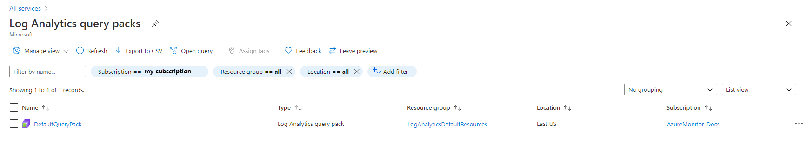

# Query packs in Azure Monitor Logs (preview)
A query pack is a Resource Manager object that acts as a container for log queries in Azure Monitor that provide a way to save log queries and share them across multiple workspaces and other contexts in Log Analytics. 

## View query packs
You can view and manage query packs in the Azure portal from the **Log Analytics query packs** menu. Select a query pack to view and edit its permissions. See below for details on creating a query pack using the API.

[](media/query-packs/view-query-pack.png#lightbox)

## Permissions
You can set the permissions on a query pack when you view it in the Azure portal. Users require the following permissions to use query packs:

- **Reader** - User can see and run all queries in the query pack.
- **Contributor** - User can modify existing queries and add new queries to the query pack.

## Default query pack
A query pack, called **DefaultQueryPack** is automatically created in each subscription in a resource group called **LogAnalyticsDefaultResources** when the first query is saved. You can create queries in this query pack or create additional query packs depending on your requirements.

## Using multiple query packs
The single default query pack will be sufficient for most users to save and reuse queries. There are reasons that you may want to create multiple query packs for users in your organization though, including loading different sets of queries in different Log Analytics sessions and providing different permissions for different collections of queries. 

When you create a new query pack using the API, you can add tags that classify queries according to your business requirements. For example, you could tag a query pack to relate it to a particular department in your organization or to severity of issues that the included queries are meant to address. This allows you to create different sets of queries intended for different sets of users and different situations.

## Query pack definition
Each query pack is defined in a JSON file that includes the definition for one or more queries. Each query is represented by a block as follows:

```json
{
    "properties":
       {
        "displayName": "Query name that will be displayed in the UI",
        "description": "Query description that will be displayed in the UI",
        "body": "<<query text, standard KQL code>>",
        "related": {
            "categories": [
                "workloads"
            ],
            "resourceTypes": [
                "microsoft.insights/components"
            ],
            "solutions": [
                "logmanagement"
            ]
        },
        "tags": {
            "Tag1": [
                "Value1",
                "Value2"
            ]
        },
   }
}
```


## Query properties
Each query in the query pack has the following properties.


| Property | Description |
|:---|:---|
| displayName | Display name listed in Log Analytics for each query. | 
| description | Description of the query displayed in Log Analytics for each query. |
| body        | Query written in KQL. |
| related     | Related categories, resource types, and solutions for the query. Used for grouping and filtering in Log Analytics by the user to help locate their query. Each query can have up to ten of each type. Retrieve allowed values from  https://api.loganalytics.io/v1/metadata?select=resourceTypes,solutions,categories. |
| tags        | Additional tags used by the user for sorting and filtering in Log Analytics. Each tag will be added to Category, Resource Type, and Solution when [grouping and filtering queries](queries.md#finding-and-filtering-queries). |


## Create a query pack
The only way to currently install a query pack is with the REST API. 

### Create token
You require a token for authentication of the API request. There are multiple methods to get a token including using **armclient**.

First login to Azure using the following command:

```
armclient login
```

Then create the token with the following command. The token is automatically copied to the clipboard so you can paste it into another tool.

```
armclient token
```

### Create payload
The payload of the request is the JSON defining one or more queries and the location where the query pack should be stored. The name of the query pack is specified in the API request described in the next section.

```json
{
    "location": "eastus",
    "properties":
    {
        "displayName": "Query name that will be displayed in the UI",
        "description": "Query description that will be displayed in the UI",
        "body": "<<query text, standard KQL code>>",
        "related": {
            "categories": [
                "workloads"
            ],
            "resourceTypes": [
                "microsoft.insights/components"
            ],
            "solutions": [
                "logmanagement"
            ]
        },
        "tags": {
            "Tag1": [
                "Value1",
                "Value2"
            ]
        }
    }
}
```

### Create request
Use the following request to create a new query pack using the REST API. The request should use bearer token authorization. Content type should be application/json.

```rest
POST https://management.azure.com/subscriptions/00000000-0000-0000-0000-000000000000/resourceGroups/my-resource-group/providers/Microsoft.Insights/querypacks/my-query-pack?api-version=2019-09-01-preview
```

Use a tool that can submit a REST API request such as Fiddler or Postman to submit the request using the payload described in the previous section. The query ID will be generated and returned in the payload. 

## Update a query pack
To update a query pack, submit the following request with an updated payload. This command requires the query pack ID.

```rest
POST https://management.azure.com/subscriptions/00000000-0000-0000-0000-000000000000/resourceGroups/my-resource-group/providers/Microsoft.Insights/querypacks/my-query-pack/queries/query-id/?api-version=2019-09-01-preview
```

## Next steps

- See [Using queries in Azure Monitor Log Analytics](queries.md) to see how users interact with query packs in Log Analytics.
