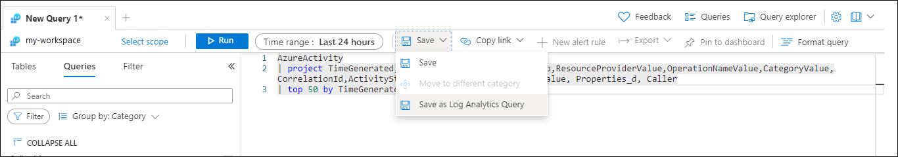
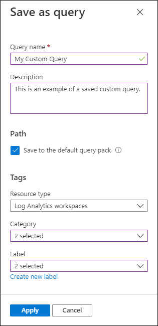

# Save a query in Azure Monitor Log Analytics
[Log queries](log-query-overview.md) are requests in Azure Monitor that you can use to process and retrieve data in a Log Analytics workspace. Saving a log query allows you to:

- Use the query in all Log Analytics contexts, including workspace and resource centric.
- Allow other users to run the same query.
- Create a library of common queries for your organization.

## Permissions
- To save a query, you need the **Log Analytics Contributor** role.
- To view a saved query, you need the **Log Analytics Reader** role.

## Save options
When you save a query, it's stored in a query pack, which has benefits over the previous method of storing the query in a workspace, including:

- Easier discoverability with the ability to filter and group queries by different properties.
- Queries are available when you use a resource scope in Log Analytics.
- Queries are made available across subscriptions.
- More data is available to describe and categorize the query.

## Save a query
To save a query to a query pack, select **Save as query** from the **Save** dropdown in Log Analytics.

When you save a query to a query pack, the following dialog box appears where you can provide values for the query properties. The query properties are used for filtering and grouping of similar queries to help you find the query you're looking for. For a detailed description of each property, see [Query properties](queries.md#query-properties).

Most users should leave the option to **Save to the default query pack**, which will save the query in the [default query pack](query-packs.md#default-query-pack). Clear this checkbox if there are other query packs in your subscription. For information on how to create a new query pack, see [Query packs in Azure Monitor Logs](query-packs.md).

## Edit a query
You might want to edit a query that you've already saved. You might want to change the query itself or modify any of its properties. After you open an existing query in Log Analytics, you can edit it by selecting **Edit query details** from the **Save** dropdown. Now you can save the edited query with the same properties or modify any properties before saving.

If you want to save the query with a different name, select **Save as query** as if you were creating a new query.

## Save as a legacy query
We don't recommend saving as a legacy query because of the advantages of query packs. You can save a query to the workspace to combine it with other queries that were saved to the workspace before the release of query packs.

To save a legacy query, select **Save as query** from the **Save** dropdown in Log Analytics. Choose the **Save as Legacy query** option. The only option available will be the legacy category.

## Troubleshooting

### Can't select the option to save to the default query pack

This error can occur when the subscription you try to save the query to doesn't have a default query pack.
If you clear the option to **Save to the default query pack**, select a subscription that doesn't have a default query pack, and then select a subscription that has a default query pack, you won't be able to select this option.

To resolve this error, close the **Save as query** dialog box, save the query again, and only select a subscription that has a default query pack.

### Fix the "You need permissions to create resource groups in subscription 'xxxx'" error message

When you attempt to save a query to the default query pack, the following error message may appear on the screen: *You need permissions to create resource groups in subscription 'xxxx'*. 

This error can occur when the [default query pack](query-packs.md#default-query-pack) doesn't exist and you don't have the Contributor permission for the subscription.

To resolve this error, someone with Contributor permissions for the subscription needs to save the first query to the default query pack.

## Next steps

[Get started with KQL queries](get-started-queries.md)
