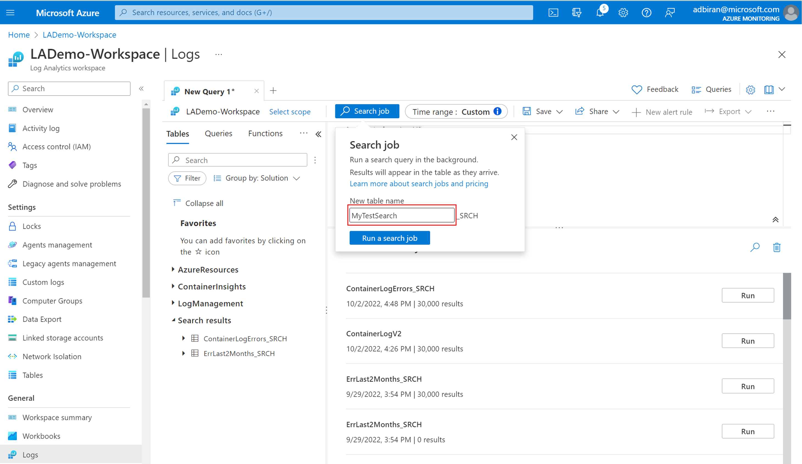
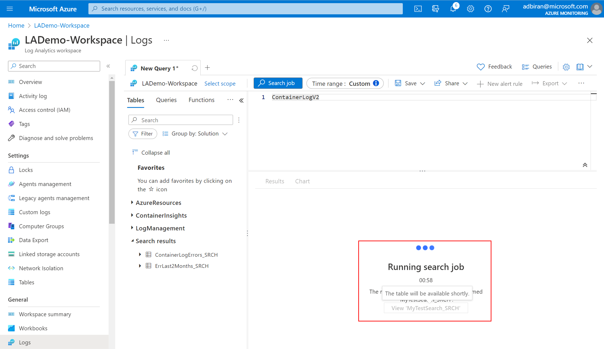
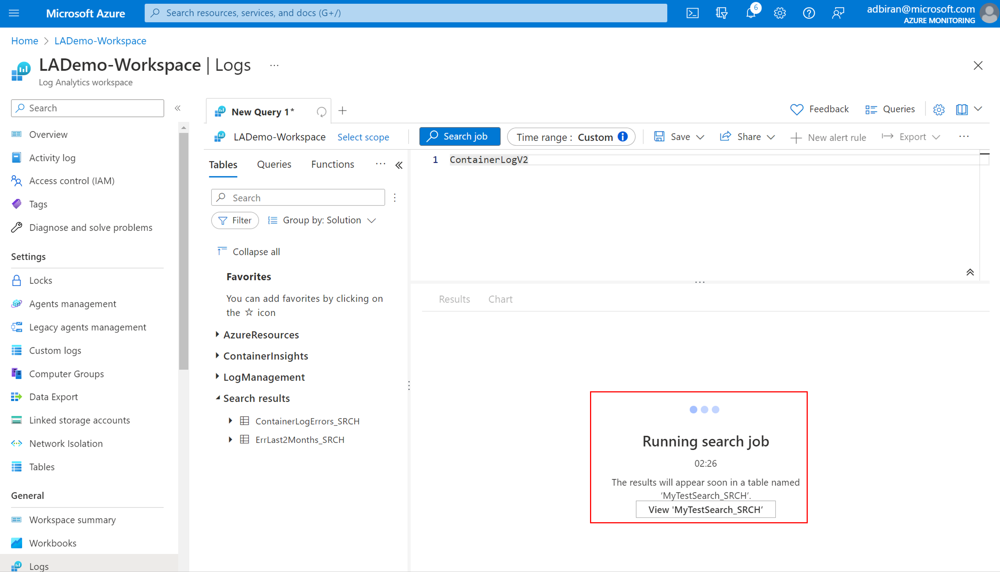
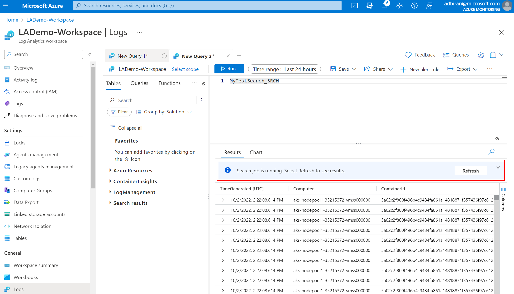
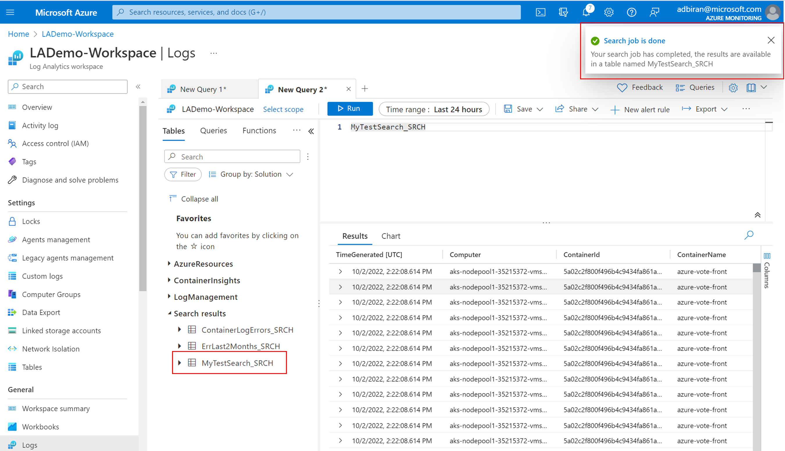
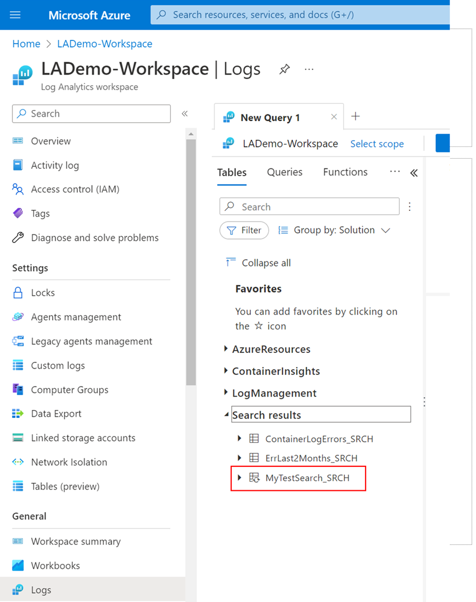
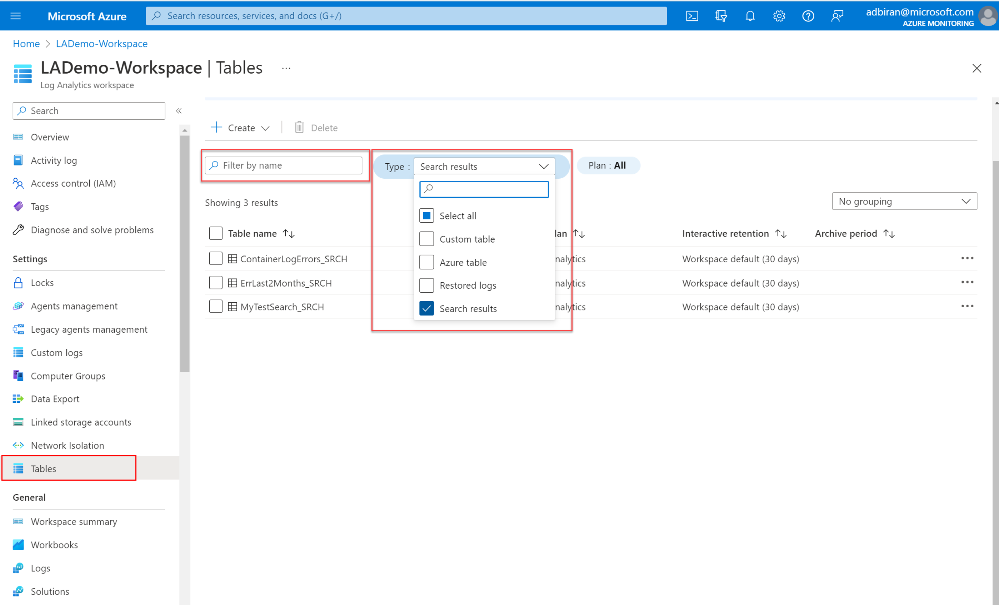
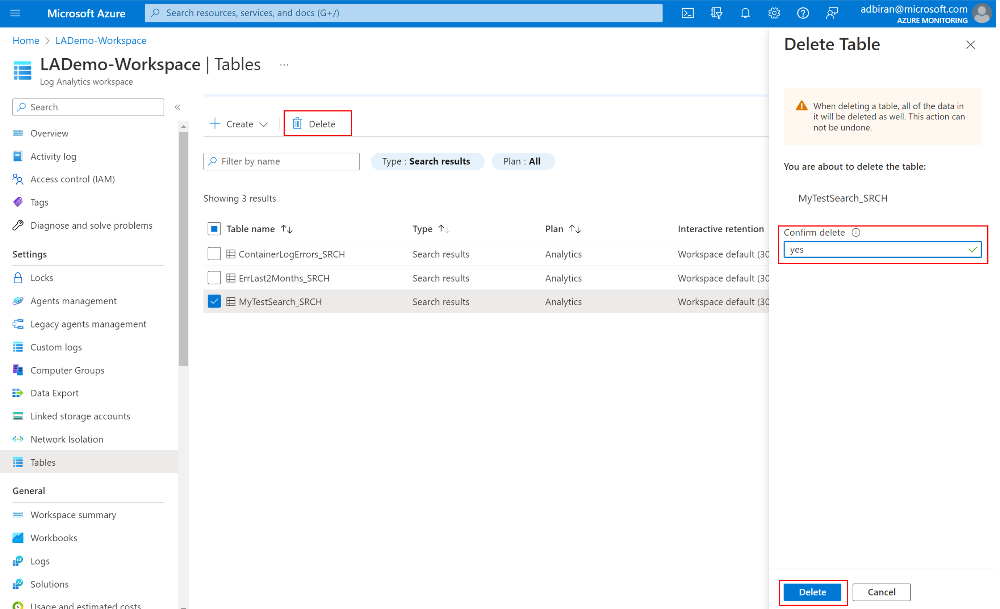

# Search jobs in Azure Monitor

Search jobs are asynchronous queries that fetch records into a new search table within your workspace for further analytics. The search job uses parallel processing and can run for hours across extremely large datasets. This article describes how to create a search job and how to query its resulting data.

## When to use search jobs

Use a search job when the log query timeout of 10 minutes isn't enough time to search through large volumes of data or when you're running a slow query.

Search jobs also let you retrieve records from [Archived Logs](data-retention-archive.md) and [Basic Logs](basic-logs-configure.md) tables into a new log table you can use for queries. In this way, running a search job can be an alternative to:

- [Restoring data from Archived Logs](restore.md) for a specific time range.<br/>
    Use restore when you have a temporary need to run many queries on a large volume of data. 

- Querying Basic Logs directly and paying for each query.<br/>
    To decide which alternative is more cost-effective, compare the cost of querying Basic Logs with the cost of performing a search job and storing the resulting data based on your needs.

## What does a search job do?

A search job sends its results to a new table in the same workspace as the source data. The results table is available as soon as the search job begins, but it may take time for results to begin to appear. 

The search job results table is a [Log Analytics](log-analytics-workspace-overview.md#log-data-plans-preview) table that is available for log queries and other Azure Monitor features that use tables in a workspace. The table uses the [retention value](data-retention-archive.md) set for the workspace, but you can modify this value after the table is created.

The search results table schema is based on the source table schema and the specified query. The following additional columns help you track the source records:

| Column | Value |
|:---|:---|
| _OriginalType          | *Type* value from source table. |
| _OriginalItemId        | *_ItemID* value from source table. |
| _OriginalTimeGenerated | *TimeGenerated* value from source table. |
| TimeGenerated          | Time at which the search job retrieved the record from the original table. |

Queries on the results table appear in [log query auditing](query-audit.md) but not the initial search job.

## Create a search job

> [!NOTE] 
> Since search jobs incus cost, it is recommended to compose and optimize your query before submitting a search job. 

# [Portal](#tab/portal-1)
To run a search job, in Azure portal:
1. From the **Log Analytics workspace** menu, select **Logs** 
1. Go to the ellipsis menu on the right hand side of the screen and toggle **Search job mode** on. 

This will switch from interactive query mode to search job mode and will optimize your experience for ruining search jobs:
    1. Run button will change it's appearance to indicate Azure Monitor Logs is in Search Job mode.
    1. Azure Monitor Logs intellisense will adjust to support reduced KQL and assist when composing a search job query. See 
1. Specify the search job date range, that can be up to one year, using the time picker.
1. Type the search job query and when your query is ready click the 'Search Job' button to execute the search job.
1. You will be asked to provide a name for the result set table, and acknowledge that the search job is subject to billing.

1. Once you initiate the search job, a new table will be created in your workspace for your search job results. Once the table is created you can switch to the results:


1. Results will start flowing to the newly created results table and you can see the results as they become available:

1. As the search job is done, the new results table is ready with all the records that match the search query. 



# [API](#tab/api-1)
To run a search job, call the **Tables - Create or Update** API. The call includes the name of the results table to be created. The name of the results table must end with *_SRCH*.
 
```http
PUT https://management.azure.com/subscriptions/{subscriptionId}/resourcegroups/{resourceGroupName}/providers/Microsoft.OperationalInsights/workspaces/{workspaceName}/tables/<TableName>_SRCH?api-version=2021-12-01-preview
```

**Request body**

Include the following values in the body of the request:

|Name | Type | Description |
| --- | --- | --- |
|properties.searchResults.query | string  | Log query written in KQL to retrieve data. |
|properties.searchResults.limit | integer  | Maximum number of records in the result set, up to one million records. (Optional)|
|properties.searchResults.startSearchTime | string  |Start of the time range to search. |
|properties.searchResults.endSearchTime | string  | End of the time range to search. |


**Sample request**

This example creates a table called *Syslog_suspected_SRCH* with the results of a query that searches for particular records in the *Syslog* table.

**Request**

```http
PUT https://management.azure.com/subscriptions/00000000-0000-0000-0000-00000000000/resourcegroups/testRG/providers/Microsoft.OperationalInsights/workspaces/testWS/tables/Syslog_suspected_SRCH?api-version=2021-12-01-preview
```

**Request body**

```json
{
    "properties": { 
        "searchResults": {
                "query": "Syslog | where * has 'suspected.exe'",
                "limit": 1000,
                "startSearchTime": "2020-01-01T00:00:00Z",
                "endSearchTime": "2020-01-31T00:00:00Z"
            }
    }
}
```

**Response**

Status code: 202 accepted.

# [CLI](#tab/cli-1)

To run a search job, run the [az monitor log-analytics workspace table search-job create](/cli/azure/monitor/log-analytics/workspace/table/search-job#az-monitor-log-analytics-workspace-table-search-job-create) command. The name of the results table, which you set using the `--name` parameter, must end with *_SRCH*.

For example:

```azurecli
az monitor log-analytics workspace table search-job create --subscription ContosoSID --resource-group ContosoRG  --workspace-name ContosoWorkspace --name HeartbeatByIp_SRCH --search-query 'Heartbeat | where ComputerIP has "00.000.00.000"' --limit 1500 --start-search-time "2022-01-01T00:00:00.000Z" --end-search-time "2022-01-08T00:00:00.000Z" --no-wait
```

---

## Get search job status and details
# [Portal](#tab/portal-1)
1. From the **Log Analytics workspace** menu, select **Logs** 
1. All the search results tables can be found in the Tables tab, under **Search results** 
1. While a search job is running, the results table will have an update indication. When the search job that initiated the results table is completed the table icon become like any other Analytics table in Azure workspace. 


# [API](#tab/api-2)

Call the **Tables - Get** API to get the status and details of a search job:
```http
GET https://management.azure.com/subscriptions/{subscriptionId}/resourcegroups/{resourceGroupName}/providers/Microsoft.OperationalInsights/workspaces/{workspaceName}/tables/<TableName>_SRCH?api-version=2021-12-01-preview
```

**Table status**<br>

Each search job table has a property called *provisioningState*, which can have one of the following values:

| Status | Description |
|:---|:---|
| Updating | Populating the table and its schema. |
| InProgress | Search job is running, fetching data. |
| Succeeded | Search job completed. |
| Deleting | Deleting the search job table. |


**Sample request**

This example retrieves the table status for the search job in the previous example.

**Request**

```http
GET https://management.azure.com/subscriptions/00000000-0000-0000-0000-00000000000/resourcegroups/testRG/providers/Microsoft.OperationalInsights/workspaces/testWS/tables/Syslog_SRCH?api-version=2021-12-01-preview
```

**Response**

```json
{
        "properties": {
        "retentionInDays": 30,
        "totalRetentionInDays": 30,
        "archiveRetentionInDays": 0,
        "plan": "Analytics",
        "lastPlanModifiedDate": "Mon, 01 Nov 2021 16:38:01 GMT",
        "schema": {
            "name": "Syslog_SRCH",
            "tableType": "SearchResults",
            "description": "This table was created using a Search Job with the following query: 'Syslog | where * has 'suspected.exe'.'",
            "columns": [...],
            "standardColumns": [...],
            "solutions": [
                "LogManagement"
            ],
            "searchResults": {
                "query": "Syslog | where * has 'suspected.exe'",
                "limit": 1000,
                "startSearchTime": "Wed, 01 Jan 2020 00:00:00 GMT",
                "endSearchTime": "Fri, 31 Jan 2020 00:00:00 GMT",
                "sourceTable": "Syslog"
            }
        },
        "provisioningState": "Succeeded"
    },
    "id": "subscriptions/00000000-0000-0000-0000-00000000000/resourcegroups/testRG/providers/Microsoft.OperationalInsights/workspaces/testWS/tables/Syslog_SRCH",
    "name": "Syslog_SRCH"
}
```

# [CLI](#tab/cli-2)

To check the status and details of a search job table, run the [az monitor log-analytics workspace table show](/cli/azure/monitor/log-analytics/workspace/table#az-monitor-log-analytics-workspace-table-show) command.

For example:

```azurecli
az monitor log-analytics workspace table show --subscription ContosoSID --resource-group ContosoRG --workspace-name ContosoWorkspace --name HeartbeatByIp_SRCH --output table \
```

---

## Delete search job table
We recommend deleting the search job table when you're done querying the table. This reduces workspace clutter and extra charges for data retention. 
# [Portal](#tab/portal-3)
1. From the Log Analytics workspace menu, select **Tables.**
1. Serch for the table you want to delete by its name, or by the type: Search results

1. Select the table(s) you want to delete, click the delete icon and confirm the deletion by typing 'yes'


# [API](#tab/api-3)

To delete a table, call the **Tables - Delete** API: 

```http
DELETE https://management.azure.com/subscriptions/{subscriptionId}/resourcegroups/{resourceGroupName}/providers/Microsoft.OperationalInsights/workspaces/{workspaceName}/tables/<TableName>_SRCH?api-version=2021-12-01-preview
```

# [CLI](#tab/cli-3)

To delete a search table, run the [az monitor log-analytics workspace table delete](/cli/azure/monitor/log-analytics/workspace/table#az-monitor-log-analytics-workspace-table-delete) command.

For example:

```azurecli
az monitor log-analytics workspace table delete --subscription ContosoSID --resource-group ContosoRG --workspace-name ContosoWorkspace --name HeartbeatByIp_SRCH
```

---

## Limitations
Search jobs are subject to the following limitations:

- Optimized to query one table at a time.
- Search date range is up to one year.
- Supports long running searches up to a 24-hour time-out.
- Results are limited to one million records in the record set.
- Concurrent execution is limited to five search jobs per workspace.
- Limited to 100 search results tables per workspace.
- Limited to 100 search job executions per day per workspace. 

When you reach the record limit, Azure aborts the job with a status of *partial success*, and the table will contain only records ingested up to that point. 

### KQL query limitations
Log queries in a search job are intended to scan very large sets of data of a specific table, hence only tables-based query that starts with a table name is supported. To allow a-synchronous execution of the query, using distribution and segmentation, the query should use a subset of KQL, including the operators: 

- [where](/azure/data-explorer/kusto/query/whereoperator)
- [extend](/azure/data-explorer/kusto/query/extendoperator)
- [project](/azure/data-explorer/kusto/query/projectoperator)
- [project-away](/azure/data-explorer/kusto/query/projectawayoperator)
- [project-keep](/azure/data-explorer/kusto/query/project-keep-operator)
- [project-rename](/azure/data-explorer/kusto/query/projectrenameoperator)
- [project-reorder](/azure/data-explorer/kusto/query/projectreorderoperator)
- [parse](/azure/data-explorer/kusto/query/whereoperator)
- [parse-where](/azure/data-explorer/kusto/query/whereoperator)

You can use all functions and binary operators within these operators.

## Pricing model
The charge for a search job is based on: 

- Search job executions: the amount of data the search job needs to scan.
- Search job results: the amount of data ingested in the results table (per the normal Log Data Ingestion prices).

For example, if your table holds 500 GB per day, for a query on three days, you'll be charged for 1500 GB of scanned data. If the job returns 1000 records, you'll be charged for ingesting these 1000 records into the results table. 

> [!NOTE]
> Billing of search job execution is not yet enabled. Search jobs can be used for free until February 1, 2023, suxh that the billing will be just for the cost of ingesting the search results. 

For more information, see [Azure Monitor pricing](https://azure.microsoft.com/pricing/details/monitor/).

## Next steps

- [Learn more about data retention and archiving data.](data-retention-archive.md)
- [Learn about restoring data, which is another method for retrieving archived data.](restore.md)
- [Learn about directly querying Basic Logs.](basic-logs-query.md)
