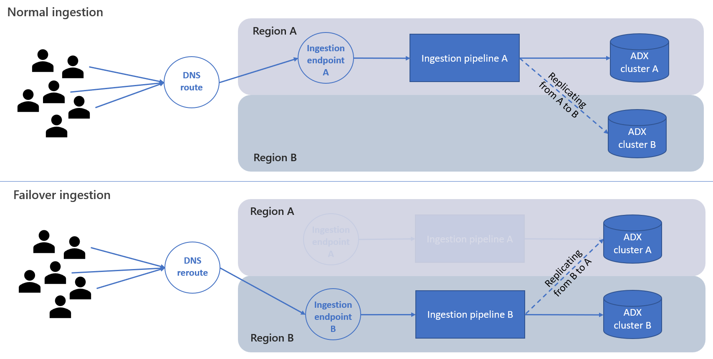
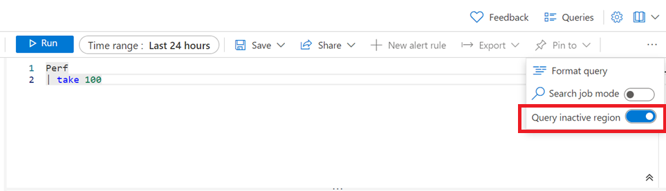

# Workspace replication across regions

## What is workspace replication
Workspace replication is a new capability that provides higher availability to Log Analytics workspace and service by allowing you to create a replication of your workspace on another region, and fail over and back between these regions. The original region of your workspace is referred to as the primary region, and the region you choose for your replication is referred to as secondary.

### How it works
When workspace replication is enabled, a second instance of your workspace is created in another region. This secondary workspace is created with the same configuration as your primary workspace. Any changes to your workspace configuration are automatically synced to the secondary workspace. The second workspace created for you is a "shadow" workspace - you can’t see in the Azure Portal, manage it or access it directly. It’s only used for resiliency purposes.

Once workspace replication is enabled, new logs ingested to your workspace are replicated to your secondary region as well. Logs that were ingested to the workspace before enabling workspace replication aren’t copied.

If an outage affects your primary region, you can trigger failover to reroute all ingestion and query requests to your secondary region. When the outage is mitigated and your primary workspace is healthy again, you can trigger failback to return to your primary region.

If you choose to fail over, the secondary workspace becomes active, and your primary becomes inactive. This also means ingestion will be done through your secondary region ingestion pipeline, instead of the primary region. Similarly, replication during failover is done from the **secondary** region to the **primary** region. Replication is done asynchronously, so it doesn't affect your ingestion latency. If the primary region isn’t able to process incoming logs, the logs are buffered on the secondary region for up to 11 days. During the first four days, replication attempts are repeated periodically. If your primary workspace isn't functional for a longer period, reach out to us to initiate replication once the issue is resolved.




#### Replication scope
When enabled, the workspace itself is replicated to another region, including its set configuration. Later, all new logs coming in can be replicated as they are being ingested.
* Platform logs (Diagnostic logs) - all platform logs targetting a workspace are replicated if workspace replication is enabled on the target workspace.
* Logs collected through MMA (the classic Microsoft Monitoring Agent) - all MMA logs are replicated if workspace replication is enabled on the target workspace.
* Logs collected through AMA (Azure Monitoring agent) - logs coming from AMA are managed via Data Collection Rules (DCR). This provides better control over the scope of replication, as replication can be set **per DCR**. In other words, you can configure replication for one stream of logs (such as Security logs) while not replicating others (such as Perf logs). Replicating AMA logs requires enabling replication both on the target workspace, and per relevant DCR, as explained later.
* Custom logs (v1) - logs sent through the Data Collector API are replicated if workspace replication is enabled on the target workspace.
* Custom logs (v2) - custom logs and transformation logs configured through DCRs require enabling replication both on the target workspace and per DCR.


### Supported regions and region groups
Each workspace has a primary location, which is the region in which the workspace resides. When enabling replication, you choose a secondary location - another region in which a "shadow" workspace is created, and that you can later switch to.

Workspace replication is currently supported for workspaces in a limited set of regions, organized by region groups (groups of geographically adjacent regions). When you enable replication, you select a secondary location from the list of supported regions, and from the same region group as the workspace primary location. For example, for a workspace in West Europe you can enable replication to North Europe, South UK or West UK, but you can't replicate it to Central US (the region isn't supported yet) or to West US 2 (the region is in another region group). 

The following regions and groups are currently supported.
* Region group: US regions
    * East US 2 (JSON value: `eastus2`)
    * West US 2 (JSON value: `westus2`)

* Region group: European regions
    * West Europe (JSON value: `westeurope`)
    * North Europe (JSON value: `northeurope`)
    * UK South (JSON value: `uksouth`)
    * UK West (JSON value: `ukwest`)

#### Data residency
Different customers have different data residency requirements, which is why it’s important that **you** control where your data is stored. Workspace logs are only stored in primary and secondary locations you chose, and processed in the Azure geography(s) of your select regions. See [Supported regions and region groups](#supported-regions-and-region-groups) for more details.


## Enabling workspace replication
Workspace replication can be enabled through a REST command. This is a long running operation, meaning it can take a few minutes for the new settings to apply. Once replication is set, it may take up to **one hour** to be operational for all data types. Some data types may start replicating before others. Similarly, schema changes done at any time after enabling workspace replication can take up to one hour to start replicating. Examples are custom logs using new tables or custom fields, or diagnostic logs set up for new resource types.

### How to enable workspace replication
To enable workspace replication, use the PUT command below. This call returns 202 Accepted and not 200, because it's a long running operation, which may take time to complete.

> [!NOTE]
> The Log Analytics Contributor role is required to enable replication.

 ```
PUT 

https://management.azure.com/subscriptions/<subscription_id>/resourcegroups/<resourcegroup_name>/providers/microsoft.operationalinsights/workspaces/<workspace_name>?api-version=2023-01-01-preview

body:
{
    "properties": {
        "replication": {
            "enabled": true,
            "location": "<secondary_location>"
        }
    },
    "location": "<primary_location>"
}

Expected response: 202 Accepted
```

You can then validate that workspace replication operation completed successfully. Use this GET request to check that the provisioning state changed from 'Updating' to 'Succeeded' and that the secondary location is set as expected:
 
```
GET
https://management.azure.com/subscriptions/<subscription_id>/resourceGroups/<resourcegroup_name>/providers/Microsoft.OperationalInsights/workspaces/<workspace_name>?api-version=2023-01-01-preview
```

> [!NOTE]
> For Sentinel enabled workspaces, it may take up to 12 days to fully replicate Watchlist and Threat Intelligence data to the secondary workspace.

### How to enable replication of Data Collection Rules (DCRs)
When you enable replication on your workspace, a System [Data Collection Endpoint](../essentials/data-collection-endpoint-overview.md) (DCE) is created. The DCE created to support replication is named by the workspace ID (For example, if your workspace ID is "e56...c373", the DCE will be named "e56...c373").
**If you use Data Collection Rules (DCRs) to send logs to this workspace, you must connect each of your DCRs to the newly created DCE, for replication and failover to be supported.**


To learn how to connect a DCR to a DCE, see step 5 in [Create a data collection rule](../agents/data-collection-rule-azure-monitor-agent.md?tabs=portal#create-a-data-collection-rule).

> [!NOTE]
> Only DCRs that are connected to the workspace's system DCE will enable replication and failover. This provides you with control over which log streams are replicated and which are not, which also impacts your replication costs.

> [!WARNING]
> DCRs connected to a workspace's System DCE should target only this specific workspace. They **must not** target other destinations, such as additional workspaces or storage accounts.

## Monitoring your workspace and service health
Ingestion latency or query failures are examples of issues that can often be handled by failing over to your secondary region. Such issues can be detected using Service Health notifications and log queries.

While Service Health notifications indicate an issue impacting the entire service, you can create your own monitoring queries, serving as custom-made health indicators for your workspace.

For example, queries allow you to:
* Measure ingestion latency, per data type or for all types
* Identify the cause of latency - agents vs ingestion pipeline
* Monitor ingestion volume anomalies, per data type and resource
* Monitor query success rate, per data type, per user or resource
* Create alerts based on your queries.

For more information about monitoring your workspace, see [Using queries to monitor workspace performance](#using-queries-to-monitor-workspace-performance).


> [!NOTE]
> You can use queries to monitor your secondary workspace before you trigger failover. Since logs replication is done in batch operations, the measured latency may fluctuate and doesn’t indicate any health issue with your secondary workspace. For more information, see [Querying the inactive workspace](#querying-the-inactive-workspace).


## Failover
Choosing when to trigger failover or failback is entirely up to you. It should be based on continuous performance/health monitoring you run on your workspace, and according to your standards and requirements.

### Considerations
#### The type and scope of the issue you encounter
Failover routes ingestion and query requests to the secondary region, which likely bypasses the faulty component causing latency or failure on your primary region. Failover isn't expected to help if:
* You know there's a cross-regional issue with an underlying resource. For example, if AKS failures are reported in both your primary and secondary regions, you may find that your secondary region experiences the same issues as the primary.
* You experience an issue related to workspace management (for example, changing workspace retention) – workspace management operations are always handled in your primary region. During failover, workspace management operations are blocked.

#### Is the issue momentary of continuous
Failover isn’t instantaneous. The rerouting of requests relies on DNS updates, which some clients pick up within minutes while others may take more time. It therefore makes sense to understand if the issues you experience are momentary and resolved within minutes or not.
On the other hand, if the issues observed are consistent or continuous, don't wait a long time:
* Ingestion – issues with the ingestion pipeline on your primary region may affect the replication to your secondary workspace since replication is done at the end of the pipeline. During failover, logs are sent to the ingestion pipeline on the secondary region instead.
* Query – if queries on your primary workspace fail or time out, Log search alerts may be affected. Trigger failover to make sure all your alerts are triggered correctly.

#### The data available in your secondary workspace
Logs replication to your secondary workspace starts when you enable workspace replication. Replication isn’t applied retroactively, meaning logs already ingested to your primary workspace aren’t copied to the secondary workspace. But, from the moment you enable replication, all logs ingested to the primary are eventually (asynchronously) replicated. For example, if you enabled workspace replication 3 hours ago and you now trigger failover, your queries can only return data from the last 3 hours.

### How to trigger failover
Before triggering failover, validate that workspace replication operation completed successfully. Use this GET request to check that the state changed from 'Updating' to 'Succeeded' and that the secondary location is set as expected:
 
```
GET
https://management.azure.com/subscriptions/<subscription_id>/resourceGroups/<resourcegroup_name>/providers/Microsoft.OperationalInsights/workspaces/<workspace_name>?api-version=2023-01-01-preview
```

Now, you can trigger failover with the below POST command. This call returns 202 Accepted and not 200, because it's a long running operation, which may take time to complete. Failover updates your DNS records, and even when that’s complete, it may take time for clients to get the updated DNS settings.
 
 ```
 POST 
https://management.azure.com/subscriptions/<subscription_id>/resourceGroups/<resourcegroup_name>/providers/Microsoft.OperationalInsights/locations/<secondary_location>/workspaces/<workspace_name>/failover?api-version=2023-01-01-preview

Expected response: 202 Accepted
```

### What to expect during failover

During failover, you're using the secondary instance of your workspace placed on its secondary region. While most operations can work exactly as before, some are slightly different, or blocked.

#### Clients
You may be ingesting logs to your workspace through different types of clients – MMA (legacy) agents, AMA (new) agents, code (using the Http data collection API), custom logs and even other services, such as Sentinel.

All ingestion requests sent during the time the workspace is in failover are rerouted to your secondary region and processed through it. Rerouting is done by updating the DNS mapping of the ingestion endpoints. Once the DNS is updated, clients typically pick up the new endpoints within minutes. 

> [!NOTE]
> Some Http clients may have "sticky connections”, and take a longer while to create new connections, meaning they will attempt to ingest through the primary region for some time. We’re working on forcing all clients to refresh their connections.

**AMA agents** use DCR (Data collection rules) to send logs to the workspace. When you enabled workspace replication, a special System DCE is created with the required configuration (you can find its details in the workspace object properties). To make traffic from AMA agents support failover, you need to manually update your DCRs to use this System DCE.
Additionally, DCRs pointing to a System DCE must not send logs to any destination except the workspace owning the DCE.

> [!WARNING]
> Azure Monitor agents that use DCRs not pointing to the workspace DCE will not get the replication settings. As a result, logs collected by these DCRs are not replicated and won't be available when you failover.

#### Restrictions and limitations
* During failover, workspace management operations aren't supported, including:
    * Changing workspace retention, pricing tier, daily cap, etc.
    * Changing network settings
    * Schema changes – done through new custom logs or connecting platform logs from new resource providers (for example, sending diagnostic logs from a new resource type)
    * Any other management operation of the workspace (enabling new capabilities etc.)
 * Solution targeting – this capability of MMA agents isn't supported during failover.
 > [!WARNING]
> Since solution targeting can't work during failover, solutions data will be ingested from **all** agents during that time.

The following features are partly supported or not supported yet:
* Search Jobs and Restore operations - both search jobs ad Restore oprations create tables and populate them with the operation outputs (the search results, or restored data). Once you enable workspace replication, new tables created for future search jobs and restore operations will be replicated to your secondary workspace. Tables populated **before** replication was enabled aren't replicated. 
If a search job or a restore operation is still processed when you trigger failover, the outcome is unexpected. It may complete successfully but not be replicated or it may fail, depending on your workspace health and the exact timing.
* Private links - Private links are currently not supported during failover.

## Failback

### Considerations
Triggering failover cancels the rerouting of queries and ingestion requests, so they can once again reach the primary region of your workspace. During the failover period, logs are ingested to your secondary region, and then (asynchronously) replicated to your primary region. If during that time an outage impacts the ingestion process on the primary region, it may take time for these logs to complete their ingestion process.

It's advised that you verify all logs ingested during failover completed their replication before your trigger failback. Failing back before all logs were replicated to the primary region can cause your queries to return partial results, until log ingestion is completed.

### Monitor the health of your primary workspace
Before triggering failback to your primary workspace, verify there are no outstanding Service Health notifications regarding this region, and make sure your workspace is ingesting and can be queried properly. See [Querying the inactive workspace](#querying-the-inactive-workspace) for examples on how to query your primary region during failover, and bypass the rerouting of request to your secondary region.

### Evaluate the state of logs ingestion to your primary workspace
Before switching back to your primary region, make sure it already contains the logs ingested during your failover period.
To see which logs were replicated to your primary workspace, query the inactive region through the Azure portal as explained [here](#querying-the-inactive-workspace).


### How to trigger failback
You can trigger failover using the below POST command. Like failover, failback also returns 202 Accepted and not 200 because it’s a long running operation, which may take time to complete. Failback updates your DNS records, and even when that’s complete, it may take time for clients to get the updated DNS settings.

```
POST
https://management.azure.com/subscriptions/<subscription_id>/resourceGroups/<resourcegroup_name>/providers/Microsoft.OperationalInsights/workspaces/<workspace_name>/failback?api-version=2023-01-01-preview

Expected response: 202 Accepted
``` 

## Querying the inactive workspace
By default, queries targeting your workspace are sent to its active region. The active region is typically the primary workspace region, unless the workspace is in failover mode, during which the secondary region becomes the active one, handling all queries.
Yet, in some cases you may want to intentionally query the inactive region. For example, before triggering failover you may want to ensure your secondary workspace has logs ingested to it.

### How to query the inactive workspace
To see which logs are available on the inactive workspace, go to the Azure Portal and open your Workspace's Logs blade.
Click the ‘…’ on the upper right area and turn on the “Query inactive region” option.



If the workspace is in failover mode (meaning failover was triggered), queries are sent to the secondary region, since it is  now the active region.

> [!NOTE]
> You can use query auditing to see which workspace region was used to run the query, and whether the workspace is in failover mode or not. These properties were added to LAQueryLogs schema:
> * isWorkspaceInFailover
>     *	Type: Boolean (true/false)
>     *	Description: Indicates whether the workspace was in failover mode when the query ran
> *	workspaceRegion
>     *	Type: String
>     *	Description: The region of the workspace the query targeted

## Using queries to monitor workspace performance

> [!Tip]
> We recommend using the queries in this section to create alert rules that would notify you of possible workspace health or performance issues. Yet, the decision to trigger failover should require your careful consideration, and not be done automatically.  
>
> You can also set your rules to fire only after a number of violations. For more information about this setting, see section 8h in [Create a new alert rule](../alerts/alerts-create-new-alert-rule.md?tabs=log#create-a-new-alert-rule-in-the-azure-portal).

### Ingestion latency monitoring
Ingestion latency measures how much time it takes for logs to be ingested to the workspace - from the time an event occurred and until it's stored in your workspace. The total Ingestion latency is composed of two parts:
1.	Agent latency – the time it took the agent to report an event.
2.	Pipeline (backend) latency – the time it took for the ingestion pipeline to process the logs and write them to your workspace.

Different data types have different ingestion latency, so a general measurement may not be what you want. Instead, you can measure ingestion for each data type separately, or create a generic query for all types, and a more fine-grained query for specific types that are of higher priority to you. Prefer to measure the 90th percentile of the ingestion latency, which is more sensitive to changes than the average or the 50th percentile (median).

#### Monitor end-to-end ingestion latency
##### Evaluate the baseline ingestion latency
First, measure the baseline, ongoing latency of the specific data types (tables), over a number of days. The below example creates a chart of the 90th percentile of ingestion latency on the Perf table.
```
// assess the ingestion latency baseline for each data type
Perf
| where TimeGenerated > ago(3d) 
| project TimeGenerated, 
IngestionDurationSeconds = (ingestion_time()-TimeGenerated)/1s
| summarize LatencyIngestion90Percentile=percentile(IngestionDurationSeconds, 90) by datatype, bin(TimeGenerated, 1h) 
| render timechart
```

Review the rendered chart and table to assess what’s considered an expected latency for that data type.

##### Measure current ingestion latency
Create an alert for a specific data type, over a short period of time. The below example calculates latency over the past 20 minutes. Since some fluctuations are expected, the alert rule condition you write should check if the query returns a value significantly greater than the baseline.

```
// track the recent ingestion latency (in seconds) of a specific data type
Perf
| where TimeGenerated > ago(20m) 
| extend IngestionDurationSeconds = (ingestion_time()-TimeGenerated)/1s
| summarize Ingestion90Percent_seconds=percentile(IngestionDurationSeconds, 90)
```

#### Monitor ingestion latency breakdown
The ingestion process is composed of two distinct parts:
* Agents – collecting logs and sending them to the ingestion endpoint, which is the entry point to of the ingestion pipeline.
* Ingestion pipeline – processing the logs and storing them in your workspace (specifically, the database cluster underlying your workspace).

When you notice your total ingestion latency is going up, you can use queries to find if the source of the latency is the agents or the ingestion pipeline.
The following query charts the 90th percentile latency of the agents, and of the pipeline, separately. Although displayed as stacked columns, the agent’s 90th percentile and the pipeline’s 90th percentile don’t add up to be the total ingestion 90th percentile.

```
// Agent and pipeline (backend) latency
Perf
| where TimeGenerated > ago(1h) 
| extend AgentLatencySeconds = (_TimeReceived-TimeGenerated)/1s,
	  PipelineLatencySeconds=(ingestion_time()-_TimeReceived)/1s
| summarize percentile(AgentLatencySeconds,90), percentile(PipelineLatencySeconds,90) by bin(TimeGenerated,5m)
| render columnchart
```

### Ingestion volume monitoring
#### Monitor total volume per data type
Alerts can also check for unexpected changes to the total or table-specific ingestion volume. The following query calculates the total ingestion volume over the past hour per data type, in MBs:
```
Usage 
| where TimeGenerated > ago(1h) 
| summarize BillableDataMB = sum(_BilledSize)/1.E6 by bin(TimeGenerated,1h) , DataType
```

#### Monitor ingestion standstill
If you ingest logs through agents, you can use the agents heartbeat to detect connectivity:
```
Heartbeat | where TimeGenerated>ago(10m) | count
```

#### Monitor ingestion anomalies: spikes and dips
Spikes and dips can be identified in various ways.

##### Decompose anomalies
The operator “series_decompose_anomalies” can be used to identify anomalies in a series of values. We can calculate the ingestion volume per data type, per hour, and use this operator to identify anomalies:
```
Usage
| where TimeGenerated > ago(24h)
| project TimeGenerated, DataType, Quantity
| summarize IngestionVolumeMB=sum(Quantity) by bin(TimeGenerated, 1h), DataType
| summarize
    Timestamp=make_list(TimeGenerated),
    IngestionVolumeMB=make_list(IngestionVolumeMB)
    by DataType
| extend series_decompose_anomalies(IngestionVolumeMB)
| mv-expand
    Timestamp,
    IngestionVolumeMB,
    series_decompose_anomalies_IngestionVolumeMB_ad_flag,
    series_decompose_anomalies_IngestionVolumeMB_ad_score,
    series_decompose_anomalies_IngestionVolumeMB_baseline
| where series_decompose_anomalies_IngestionVolumeMB_ad_flag != 0
```
##### Create your own anomaly detector
The following query calculates:
* The expected ingestion volume – per hour, by data type (based on median of medians, you can customize that logic)
* The actual ingestion volume – per hour, by data type

To filter out insignificant differences between the expected and the actual ingestion volume, the query applies two filters:
* Rate of change – over 150% or under 66% of the expected volume, per type
* Volume of change – whether the increased/decreased volume is over 0.1% of the monthly volume of that type

```
let TimeRange=24h;
let MonthlyIngestionByType=
    Usage
    | where TimeGenerated > ago(30d)
    | summarize MonthlyIngestionMB=sum(Quantity) by DataType;
// calculating the expected ingestion volume by median of hourly medians
let ExpectedIngestionVolumeByType=
    Usage
    | where TimeGenerated > ago(TimeRange)
    | project TimeGenerated, DataType, Quantity
    | summarize IngestionMedian=percentile(Quantity, 50) by bin(TimeGenerated, 1h), DataType
    | summarize ExpectedIngestionVolumeMB=percentile(IngestionMedian, 50) by DataType;
Usage
| where TimeGenerated > ago(TimeRange)
| project TimeGenerated, DataType, Quantity
| summarize IngestionVolumeMB=sum(Quantity) by bin(TimeGenerated, 1h), DataType
| join kind=inner (ExpectedIngestionVolumeByType) on DataType
| extend GapVolumeMB = round(IngestionVolumeMB-ExpectedIngestionVolumeMB,2)
| where GapVolumeMB != 0
| extend Trend=iff(GapVolumeMB > 0, "Up", "Down")
| extend IngestedVsExpectedAsPercent = round(IngestionVolumeMB * 100 / ExpectedIngestionVolumeMB, 2)
| join kind=inner (MonthlyIngestionByType) on DataType
| extend GapAsPercentOfMonthlyIngestion = round(abs(GapVolumeMB) * 100 / MonthlyIngestionMB, 2)
| project-away DataType1, DataType2
// Find if the spike/deep is substantial: over 150% or under 66% of the expected volume for this data type
| where IngestedVsExpectedAsPercent > 150 or IngestedVsExpectedAsPercent < 66
// Find if the volume of the gap is significant: over 0.1% of the total monthly ingestion volume to this workspace
| where GapAsPercentOfMonthlyIngestion > 0.1
| project
    Timestamp=format_datetime(todatetime(TimeGenerated), 'yyyy-MM-dd HH:mm:ss'),
    Trend,
    IngestionVolumeMB,
    ExpectedIngestionVolumeMB,
    IngestedVsExpectedAsPercent,
    GapAsPercentOfMonthlyIngestion
```

### Query monitoring
#### Monitor query success and failure
Queries return response codes, which indicate whether they succeeded or failed, and what types of error occurred. A high surge of errors may indicate a problem with the workspace availability or service performance. The following query counts how many queries returned a server error code.
```
LAQueryLogs | where ResponseCode>=500 and ResponseCode<600 | count
```
