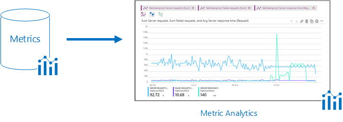
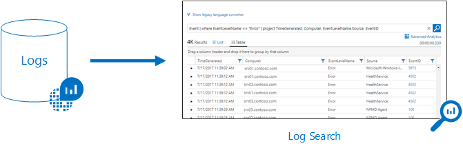
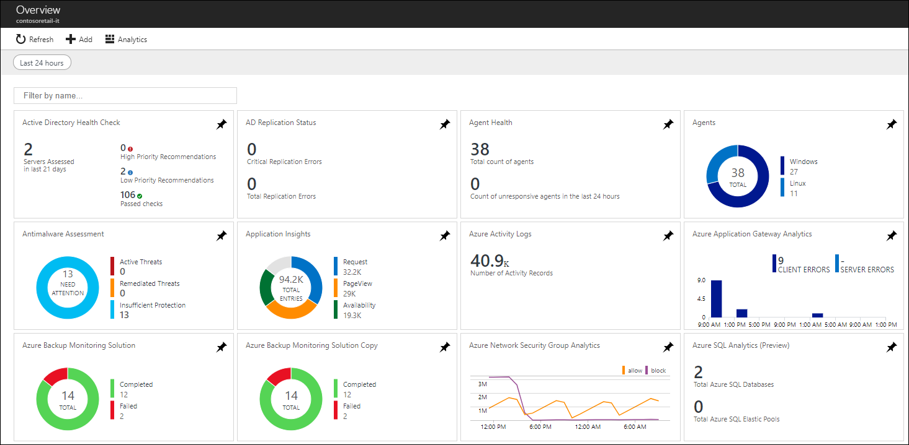
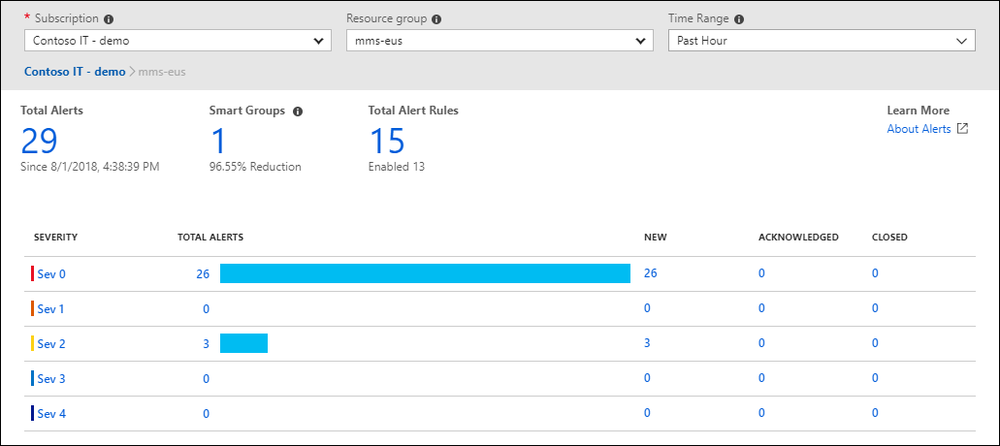
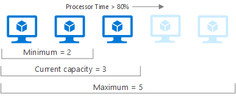
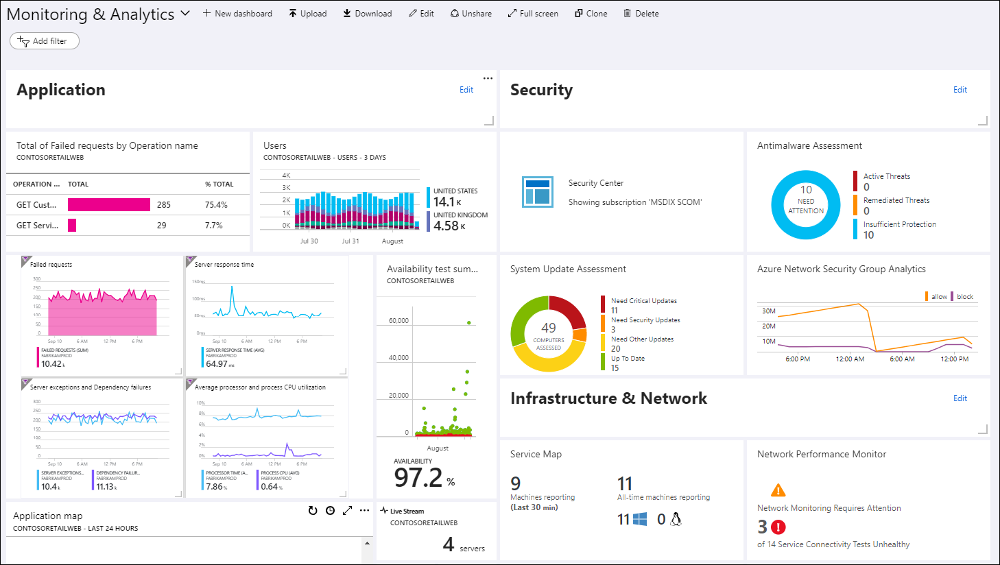
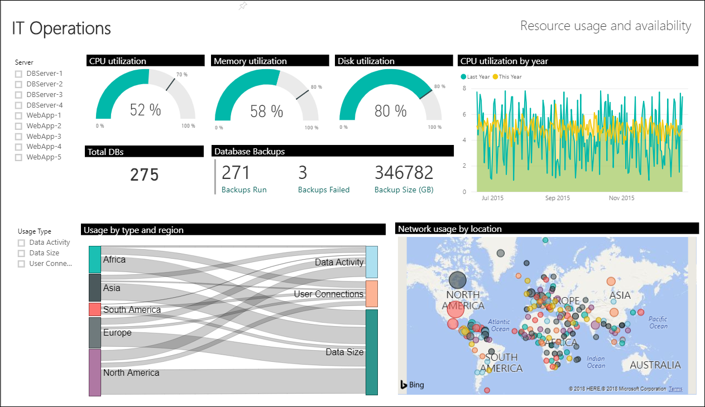

# Azure Monitor overview

Azure Monitor maximizes the availability and performance of your applications and services by delivering a comprehensive solution for collecting, analyzing, and acting on telemetry from your cloud and on-premises environments. It helps you understand how your applications are performing and proactively identifies issues affecting them and the resources they depend on.

Just a few examples of what you can do with Azure Monitor include:

- Detect and diagnose issues across applications and dependencies with [Application Insights](app/app-insights-overview.md).
- Correlate infrastructure issues with [Azure Monitor for VMs](insights/vminsights-overview.md) and [Azure Monitor for Containers](insights/container-insights-overview.md).
- Drill into your monitoring data with [Log Analytics](log-query/log-query-overview.md) for troubleshooting and deep diagnostics.
- Support operations at scale with [smart alerts](platform/alerts-smartgroups-overview.md) and [automated actions](platform/alerts-action-rules.md).
- Create visualizations with Azure [dashboards](learn/tutorial-logs-dashboards.md) and [workbooks](platform/workbooks-overview.md).

> [!VIDEO https://www.microsoft.com/en-us/videoplayer/embed/RE4qXeL]

[!INCLUDE [azure-lighthouse-supported-service](../../includes/azure-lighthouse-supported-service.md)]

## Overview

The following diagram gives a high-level view of Azure Monitor. At the center of the diagram are the data stores for metrics and logs, which are the two fundamental types of data used by Azure Monitor. On the left are the [sources of monitoring data](platform/data-sources.md) that populate these [data stores](platform/data-platform.md). On the right are the different functions that Azure Monitor performs with this collected data such as analysis, alerting, and streaming to external systems.

## Monitoring data platform

All data collected by Azure Monitor fits into one of two fundamental types, [metrics and logs](platform/data-platform.md). [Metrics](platform/data-platform-metrics.md) are numerical values that describe some aspect of a system at a particular point in time. They are lightweight and capable of supporting near real-time scenarios. [Logs](platform/data-platform-logs.md) contain different kinds of data organized into records with different sets of properties for each type. Telemetry such as events and traces are stored as logs in addition to performance data so that it can all be combined for analysis.

For many Azure resources, you'll see data collected by Azure Monitor right in their Overview page in the Azure portal. Have a look at any virtual machine for example, and you'll see several charts displaying performance metrics. Click on any of the graphs to open the data in [metrics explorer](platform/metrics-charts.md) in the Azure portal, which allows you to chart the values of multiple metrics over time.  You can view the charts interactively or pin them to a dashboard to view them with other visualizations.

Log data collected by Azure Monitor can be analyzed with [queries](log-query/log-query-overview.md) to quickly retrieve, consolidate, and analyze collected data.  You can create and test queries using [Log Analytics](log-query/portals.md) in the Azure portal and then either directly analyze the data using these tools or save queries for use with [visualizations](visualizations.md) or [alert rules](platform/alerts-overview.md).

Azure Monitor uses a version of the [Kusto query language](/azure/kusto/query/) used by Azure Data Explorer that is suitable for simple log queries but also includes advanced functionality such as aggregations, joins, and smart analytics. You can quickly learn the query language using [multiple lessons](log-query/get-started-queries.md).  Particular guidance is provided to users who are already familiar with [SQL](log-query/sql-cheatsheet.md) and [Splunk](log-query/splunk-cheatsheet.md).

## What data does Azure Monitor collect?

Azure Monitor can collect data from a variety of sources. You can think of monitoring data for your applications in tiers ranging from your application, any operating system and services it relies on, down to the platform itself. Azure Monitor collects data from each of the following tiers:

- **Application monitoring data**: Data about the performance and functionality of the code you have written, regardless of its platform.
- **Guest OS monitoring data**: Data about the operating system on which your application is running. This could be running in Azure, another cloud, or on-premises. 
- **Azure resource monitoring data**: Data about the operation of an Azure resource.
- **Azure subscription monitoring data**: Data about the operation and management of an Azure subscription, as well as data about the health and operation of Azure itself. 
- **Azure tenant monitoring data**: Data about the operation of tenant-level Azure services, such as Azure Active Directory.

As soon as you create an Azure subscription and start adding resources such as virtual machines and web apps, Azure Monitor starts collecting data.  [Activity logs](platform/platform-logs-overview.md) record when resources are created or modified. [Metrics](platform/data-platform.md) tell you how the resource is performing and the resources that it's consuming. 

Extend the data you're collecting into the actual operation of the resources by [enabling diagnostics](platform/platform-logs-overview.md) and [adding an agent](platform/agent-windows.md) to compute resources. This will collect telemetry for the internal operation of the resource and allow you to configure different [data sources](platform/agent-data-sources.md) to collect logs and metrics from Windows and Linux guest operating system. 

Enable monitoring for your [App Services application](app/azure-web-apps.md) or [VM and virtual machine scale set application](app/azure-vm-vmss-apps.md), to enable Application Insights to collect detailed information about your application including page views, application requests, and exceptions. Further verify the availability of your application by configuring an [availability test](app/monitor-web-app-availability.md) to simulate user traffic.

### Custom sources

Azure Monitor can collect log data from any REST client using the [Data Collector API](platform/data-collector-api.md). This allows you to create custom monitoring scenarios and extend monitoring to resources that don't expose telemetry through other sources.

## Insights
Monitoring data is only useful if it can increase your visibility into the operation of your computing environment. Azure Monitor includes several features and tools that provide valuable insights into your applications and other resources that they depend on. [Monitoring solutions](insights/solutions.md) and features such as [Application Insights](app/app-insights-overview.md) and [Azure Monitor for containers](insights/container-insights-overview.md) provide deep insights into different aspects of your application and specific Azure services. 

### Application Insights
[Application Insights](app/app-insights-overview.md) monitors the availability, performance, and usage of your web applications whether they're hosted in the cloud or on-premises. It leverages the powerful data analysis platform in Azure Monitor to provide you with deep insights into your application's operations and diagnose errors without waiting for a user to report them. Application Insights includes connection points to a variety of development tools and integrates with Visual Studio to support your DevOps processes.

### Azure Monitor for containers
[Azure Monitor for containers](insights/container-insights-overview.md) is a feature designed to monitor the performance of container workloads deployed to managed Kubernetes clusters hosted on Azure Kubernetes Service (AKS). It gives you performance visibility by collecting memory and processor metrics from controllers, nodes, and containers that are available in Kubernetes through the Metrics API. Container logs are also collected.  After you enable monitoring from Kubernetes clusters, these metrics and logs are automatically collected for you through a containerized version of the Log Analytics agent for Linux.

### Azure Monitor for VMs
[Azure Monitor for VMs](insights/vminsights-overview.md) monitors your Azure virtual machines (VM) at scale by analyzing the performance and health of your Windows and Linux VMs, including their different processes and interconnected dependencies on other resources and external processes. The solution includes support for monitoring performance and application dependencies for VMs hosted on-premises or another cloud provider.  

### Monitoring solutions
[Monitoring solutions](insights/solutions.md) in Azure Monitor are packaged sets of logic that provide insights for a particular application or service. They include logic for collecting monitoring data for the application or service, [queries](log-query/log-query-overview.md) to analyze that data, and [views](../log-analytics/log-analytics-view-designer.md) for visualization. Monitoring solutions are [available from Microsoft](insights/solutions-inventory.md) and partners to provide monitoring for various Azure services and other applications.

## Responding to critical situations
In addition to allowing you to interactively analyze monitoring data, an effective monitoring solution must be able to proactively respond to critical conditions identified in the data that it collects. This could be sending a text or mail to an administrator responsible for investigating an issue. Or you could launch an automated process that attempts to correct an error condition.

### Alerts
[Alerts in Azure Monitor](platform/alerts-overview.md) proactively notify you of critical conditions and potentially attempt to take corrective action. Alert rules based on metrics provide near real time alerting based on numeric values, while rules based on logs allow for complex logic across data from multiple sources.

Alert rules in Azure Monitor use [action groups](platform/action-groups.md), which contain unique sets of recipients and actions that can be shared across multiple rules. Based on your requirements, action groups can perform such actions as using webhooks to have alerts start external actions or to integrate with your ITSM tools.

### Autoscale
Autoscale allows you to have the right amount of resources running to handle the load on your application. It allows you to create rules that use metrics collected by Azure Monitor to determine when to automatically add resources to handle increases in load and also save money by removing resources that are sitting idle. You specify a minimum and maximum number of instances and the logic for when to increase or decrease resources.

## Visualizing monitoring data
[Visualizations](visualizations.md) such as charts and tables are effective tools for summarizing monitoring data and presenting it to different audiences. Azure Monitor has its own features for visualizing monitoring data and leverages other Azure services for publishing it to different audiences.

### Dashboards
[Azure dashboards](../azure-portal/azure-portal-dashboards.md) allow you to combine different kinds of data, including both metrics and logs, into a single pane in the [Azure portal](https://portal.azure.com). You can optionally share the dashboard with other Azure users. Elements throughout Azure Monitor can be added to an Azure dashboard in addition to the output of any log query or metrics chart. For example, you could create a dashboard that combines tiles that show a graph of metrics, a table of activity logs, a usage chart from Application Insights, and the output of a log query.

### Views
[Views](../log-analytics/log-analytics-view-designer.md) visually present log data in Azure Monitor.  Each view includes a single tile that drills down to a combination of visualizations such as bar and line charts in addition to lists summarizing critical data.  Monitoring solutions include views that summarize data for a particular application, and you can create your own views to present data from any log query. Like other elements in Azure Monitor, views can be added to Azure dashboards.

### Power BI
[Power BI](https://powerbi.microsoft.com) is a business analytics service that provides interactive visualizations across a variety of data sources and is an effective means of making data available to others within and outside your organization. You can configure Power BI to [automatically import log data from Azure Monitor](../log-analytics/log-analytics-powerbi.md) to take advantage of these additional visualizations.

## Integrate and export data
You'll often have the requirement to integrate Azure Monitor with other systems and to build custom solutions that use your monitoring data. Other Azure services work with Azure Monitor to provide this integration.

### Event Hub
[Azure Event Hubs](https://docs.microsoft.com/azure/event-hubs) is a streaming platform and event ingestion service that can transform and store data using any real-time analytics provider or batching/storage adapters. Use Event Hubs to [stream Azure Monitor data](platform/stream-monitoring-data-event-hubs.md) to partner SIEM and monitoring tools.

### Logic Apps
[Logic Apps](https://azure.microsoft.com/services/logic-apps) is a service that allows you to automate tasks and business processes using workflows that integrate with different systems and services. Activities are available that read and write metrics and logs in Azure Monitor, which allows you to build workflows integrating with a variety of other systems.

### API
Multiple APIs are available to read and write metrics and logs to and from Azure Monitor in addition to accessing generated alerts. You can also configure and retrieve alerts. This provides you with essentially unlimited possibilities to build custom solutions that integrate with Azure Monitor.

## Next steps
Learn more about:

* [Metrics and logs](platform/data-platform.md) for the data collected by Azure Monitor.
* [Data sources](platform/data-sources.md) for how the different components of your application send telemetry.
* [Log queries](log-query/log-query-overview.md) for analyzing collected data.
* [Best practices](https://docs.microsoft.com/azure/architecture/best-practices/monitoring) for monitoring cloud applications and services.
