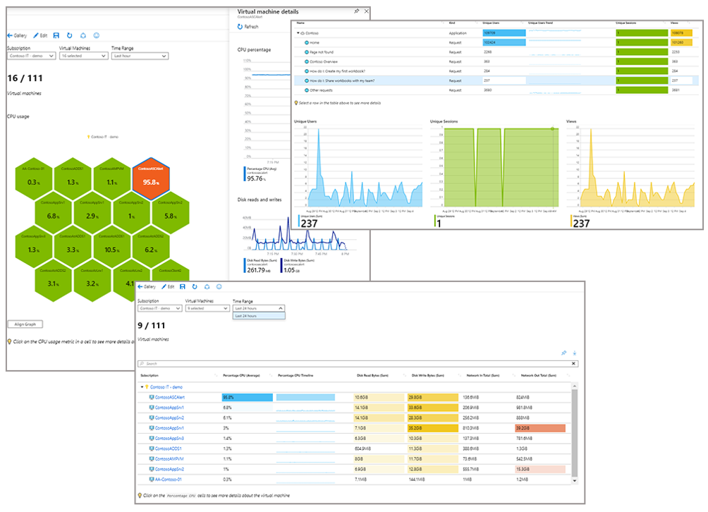

# Azure Monitor overview

Azure Monitor helps you maximize the availability and performance of your applications and services. It delivers a comprehensive solution for collecting, analyzing, and acting on telemetry from your cloud and on-premises environments. This information helps you understand how your applications are performing and proactively identify issues that affect them and the resources they depend on.

A few examples of what you can do with Azure Monitor include:

- Detect and diagnose issues across applications and dependencies with [Application Insights](app/app-insights-overview.md).
- Correlate infrastructure issues with [VM insights](vm/vminsights-overview.md) and [Container insights](containers/container-insights-overview.md).
- Drill into your monitoring data with [Log Analytics](logs/log-query-overview.md) for troubleshooting and deep diagnostics.
- Support operations at scale with [automated actions](alerts/alerts-action-rules.md).
- Create visualizations with Azure [dashboards](visualize/tutorial-logs-dashboards.md) and [workbooks](visualize/workbooks-overview.md).
- Collect data from [monitored resources](./monitor-reference.md) by using [Azure Monitor Metrics](./essentials/data-platform-metrics.md).
- Investigate change data for routine monitoring or for triaging incidents by using [Change Analysis](./change/change-analysis.md).

[!INCLUDE [azure-lighthouse-supported-service](../../includes/azure-lighthouse-supported-service.md)]

## Overview
The following diagram gives a high-level view of Azure Monitor. 

- The stores for the **[data platform](data-platform.md)** are at the center of the diagram. Azure Monitor stores these fundamental types of data: metrics, logs, traces, and changes.
- The **[sources of monitoring data](data-sources.md)** that populate these data stores are on the left.
- The different functions that Azure Monitor performs with this collected data are on the right. This includes such actions as analysis, alerting.
- At the bottom is a layer of integration pieces. These are actually integrated throughout other parts of the diagram, but that is too complex to show visually.

:::image type="content" source="media/overview/azure-monitor-overview-2022_10_15-add-prometheus-opt.svg" alt-text="Diagram that shows an overview of Azure Monitor." border="false" lightbox="media/overview/azure-monitor-overview-2022_10_15-add-prometheus-opt.svg":::

## Observability and the Azure Monitor data platform
Metrics, logs, and distributed traces are commonly referred to as the three pillars of observability. Observability can be achieved by aggregating and correlating these different types of data across the entire system being monitored. 

Natively, Azure Monitor stores data as metrics, logs, or changes. Traces are stored in the Logs store. Each storage platform is optimized for particular monitoring scenarios, and each supports different features in Azure Monitor. It's important for you to understand the differences between features such as data analysis, visualizations, or alerting, so that you can implement your required scenario in the most efficient and cost effective manner.  

| Pillar | Description |
|:---|:---|
| Metrics | Metrics are numerical values that describe some aspect of a system at a particular point in time. Metrics are collected at regular intervals and are identified with a timestamp, a name, a value, and one or more defining labels. Metrics can be aggregated using various algorithms, compared to other metrics, and analyzed for trends over time.  Metrics in Azure Monitor are stored in a time-series database, which is optimized for analyzing time-stamped data. For more information, see [Azure Monitor Metrics](essentials/data-platform-metrics.md). |
| Logs    | [Logs](logs/data-platform-logs.md) are events that occurred within the system. They can contain different kinds of data and may be structured or free-form text with a timestamp. They may be created sporadically as events in the environment generate log entries, and a system under heavy load will typically generate more log volume.  Azure Monitor stores logs in the Azure Monitor Logs store.  The store allows you to segregate logs into separate "Log Analytics workspaces". There you can analyze them using the Log Analytics tool. Log Analytics workspaces are based on [Azure Data Explorer](/azure/data-explorer/), which provides a powerful analysis engine and the [Kusto rich query language](/azure/kusto/query/). For more information, see [Azure Monitor Logs](logs/data-platform-logs.md). |
| Distributed traces | Traces are series of related events that follow a user request through a distributed system. They can be used to determine behavior of application code and the performance of different transactions. While logs will often be created by individual components of a distributed system, a trace measures the operation and performance of your application across the entire set of components.  Distributed tracing in Azure Monitor is enabled with the [Application Insights SDK](app/distributed-tracing.md). Trace data is stored with other application log data collected by Application Insights and stored in Azure Monitor Logs. For more information, see [What is Distributed Tracing?](app/distributed-tracing.md). |
| Changes | Changes are tracked using [Change Analysis](change/change-analysis.md). Changes are a series of events that occur in your Azure application and resources. Change Analysis is a subscription-level observability tool that's built on the power of Azure Resource Graph.    Once Change Analysis is enabled, the `Microsoft.ChangeAnalysis` resource provider is registered with an Azure Resource Manager subscription. Change Analysis' integrations with Monitoring and Diagnostics tools provide data to help users understand what changes might have caused the issues. Read more about Change Analysis in [Use Change Analysis in Azure Monitor](./change/change-analysis.md). |

Azure Monitor aggregates and correlates data across multiple Azure subscriptions and tenants, in addition to hosting data for other services.  Because this data is stored together, it can be correlated and analyzed using a common set of tools. 

> [!NOTE]
> It's important to distinguish between Azure Monitor Logs and sources of log data in Azure. For example, subscription level events in Azure are written to an [activity log](essentials/platform-logs-overview.md) that you can view from the Azure Monitor menu. Most resources will write operational information to a [resource log](essentials/platform-logs-overview.md) that you can forward to different locations. Azure Monitor Logs is a log data platform that collects activity logs and resource logs along with other monitoring data to provide deep analysis across your entire set of resources.

For many Azure resources, you'll see data collected by Azure Monitor right in their overview page in the Azure portal. Look at any virtual machine (VM), for example, and you'll see several charts that display performance metrics. Select any of the graphs to open the data in [Metrics Explorer](essentials/metrics-charts.md) in the Azure portal. With Metrics Explorer, you can chart the values of multiple metrics over time.  You can view the charts interactively or pin them to a dashboard to view them with other visualizations.

Log data collected by Azure Monitor can be analyzed with [queries](logs/log-query-overview.md) to quickly retrieve, consolidate, and analyze collected data.  You can create and test queries by using the [Log Analytics](./logs/log-query-overview.md) user interface in the Azure portal. You can then either directly analyze the data by using different tools or save queries for use with [visualizations](best-practices-analysis.md) or [alert rules](alerts/alerts-overview.md).

Azure Monitor Logs uses a version of the [Kusto Query Language](/azure/kusto/query/) that's suitable for simple log queries but also includes advanced functionality such as aggregations, joins, and smart analytics. You can quickly learn the query language by using [multiple lessons](logs/get-started-queries.md). Particular guidance is provided to users who are already familiar with [SQL](/azure/data-explorer/kusto/query/sqlcheatsheet) and [Splunk](/azure/data-explorer/kusto/query/splunk-cheat-sheet).

Change Analysis alerts you to live site issues, outages, component failures, or other change data. It also provides insights into those application changes, increases observability, and reduces the mean time to repair. You automatically register the `Microsoft.ChangeAnalysis` resource provider with an Azure Resource Manager subscription by going to Change Analysis via the Azure portal. For web app in-guest changes, you can enable Change Analysis by using the [Diagnose and solve problems tool](./change/change-analysis-enable.md#enable-azure-functions-and-web-app-in-guest-change-collection-via-the-change-analysis-portal).

Change Analysis builds on [Azure Resource Graph](../governance/resource-graph/overview.md) to provide a historical record of how your Azure resources have changed over time. It detects managed identities, platform operating system upgrades, and hostname changes. Change Analysis securely queries IP configuration rules, TLS settings, and extension versions to provide more detailed change data.

## What data can Azure Monitor collect?

Azure Monitor can collect data from [sources](monitor-reference.md) that range from your application to any operating system and services it relies on, down to the platform itself. Azure Monitor collects data from each of the following tiers:

- **Application** - Data about the performance and functionality of the code you've written, regardless of its platform.
- **Container** - Data about containers and applications running inside containers, such as Azure Kubernetes. 
- **Guest operating system** - Data about the operating system on which your application is running. The system could be running in Azure, another cloud, or on-premises.
- **Azure resource** - Data about the operation of an Azure resource. For a list of the resources that have metrics and/or logs, see [What can you monitor with Azure Monitor?](monitor-reference.md).
- **Azure subscription** - Data about the operation and management of an Azure subscription, and data about the health and operation of Azure itself.
- **Azure tenant** - Data about the operation of tenant-level Azure services, such as Azure Active Directory.
- **Azure resource changes** - Data about changes within your Azure resources and how to address and triage incidents and issues.

As soon as you create an Azure subscription and add resources such as VMs and web apps, Azure Monitor starts collecting data. [Activity logs](essentials/platform-logs-overview.md) record when resources are created or modified. [Metrics](essentials/data-platform-metrics.md) tell you how the resource is performing and the resources that it's consuming.

[Enable diagnostics](essentials/platform-logs-overview.md) to extend the data you're collecting into the internal operation of the resources. [Add an agent](agents/agents-overview.md) to compute resources to collect telemetry from their guest operating systems.

Enable monitoring for your application with [Application Insights](app/app-insights-overview.md) to collect detailed information including page views, application requests, and exceptions. Further verify the availability of your application by configuring an [availability test](app/monitor-web-app-availability.md) to simulate user traffic.

### Custom sources

Azure Monitor can collect log data from any REST client by using the [Data Collector API](logs/data-collector-api.md). You can create custom monitoring scenarios and extend monitoring to resources that don't expose telemetry through other sources.

## Insights and curated visualizations

Monitoring data is only useful if it can increase your visibility into the operation of your computing environment. Some Azure resource providers have a "curated visualization," which gives you a customized monitoring experience for that particular service or set of services. They generally require minimal configuration. Larger, scalable, curated visualizations are known as "insights" and marked with that name in the documentation and the Azure portal.  

For more information, see [List of insights and curated visualizations using Azure Monitor](insights/insights-overview.md). Some of the larger insights are described here.

### Application Insights

[Application Insights](app/app-insights-overview.md) monitors the availability, performance, and usage of your web applications whether they're hosted in the cloud or on-premises. It takes advantage of the powerful data analysis platform in Azure Monitor to provide you with deep insights into your application's operations. You can use it to diagnose errors without waiting for a user to report them. Application Insights includes connection points to various development tools and integrates with Visual Studio to support your DevOps processes.

### Container insights

[Container insights](containers/container-insights-overview.md) monitors the performance of container workloads that are deployed to managed Kubernetes clusters hosted on Azure Kubernetes Service. It gives you performance visibility by collecting metrics from controllers, nodes, and containers that are available in Kubernetes through the Metrics API. Container logs are also collected. After you enable monitoring from Kubernetes clusters, these metrics and logs are automatically collected for you through a containerized version of the Log Analytics agent for Linux.

### VM insights

[VM insights](vm/vminsights-overview.md) monitors your Azure VMs at scale. It analyzes the performance and health of your Windows and Linux VMs and identifies their different processes and interconnected dependencies on external processes. The solution includes support for monitoring performance and application dependencies for VMs hosted on-premises or another cloud provider.  

## Respond to critical situations

In addition to allowing you to interactively analyze monitoring data, an effective monitoring solution must be able to proactively respond to critical conditions identified in the data that it collects. The response could be sending a text or email to an administrator responsible for investigating an issue. Or you could launch an automated process that attempts to correct an error condition.

### Alerts

[Alerts in Azure Monitor](alerts/alerts-overview.md) proactively notify you of critical conditions and potentially attempt to take corrective action. Alert rules based on metrics provide near-real-time alerts based on numeric values. Rules based on logs allow for complex logic across data from multiple sources.

Alert rules in Azure Monitor use [action groups](alerts/action-groups.md), which contain unique sets of recipients and actions that can be shared across multiple rules. Based on your requirements, action groups can perform such actions as using webhooks to have alerts start external actions or to integrate with your IT service management tools.

### Autoscale

Autoscale allows you to have the right amount of resources running to handle the load on your application. Create rules that use metrics collected by Azure Monitor to determine when to automatically add resources when load increases. Save money by removing resources that are sitting idle. You specify a minimum and maximum number of instances and the logic for when to increase or decrease resources.

## Visualize monitoring data

[Visualizations](best-practices-analysis.md) such as charts and tables are effective tools for summarizing monitoring data and presenting it to different audiences. Azure Monitor has its own features for visualizing monitoring data and uses other Azure services for publishing it to different audiences.

### Dashboards

[Azure dashboards](../azure-portal/azure-portal-dashboards.md) allow you to combine different kinds of data into a single pane in the [Azure portal](https://portal.azure.com). You can optionally share the dashboard with other Azure users. Add the output of any log query or metrics chart to an Azure dashboard. For example, you could create a dashboard that combines tiles that show a graph of metrics, a table of Activity logs, a usage chart from Application Insights, and the output of a log query.

### Workbooks

[Workbooks](visualize/workbooks-overview.md) provide a flexible canvas for data analysis and the creation of rich visual reports in the Azure portal. You can use them to tap into multiple data sources from across Azure and combine them into unified interactive experiences. Use workbooks provided with Insights or create your own from predefined templates.

### Power BI

[Power BI](https://powerbi.microsoft.com) is a business analytics service that provides interactive visualizations across various data sources. It's an effective means of making data available to others within and outside your organization. You can configure Power BI to [automatically import log data from Azure Monitor](./logs/log-powerbi.md) to take advantage of these visualizations.

## Integrate and export data

You'll often have the requirement to integrate Azure Monitor with other systems and to build custom solutions that use your monitoring data. Other Azure services work with Azure Monitor to provide this integration.

### Event Hubs

[Azure Event Hubs](../event-hubs/index.yml) is a streaming platform and event ingestion service. It can transform and store data by using any real-time analytics provider or batching/storage adapters. Use Event Hubs to [stream Azure Monitor data](essentials/stream-monitoring-data-event-hubs.md) to partner SIEM and monitoring tools.

### Logic Apps

[Azure Logic Apps](https://azure.microsoft.com/services/logic-apps) is a service you can use to automate tasks and business processes by using workflows that integrate with different systems and services. Activities are available that read and write metrics and logs in Azure Monitor.

### API

Multiple APIs are available to read and write metrics and logs to and from Azure Monitor in addition to accessing generated alerts. You can also configure and retrieve alerts. With APIs, you have unlimited possibilities to build custom solutions that integrate with Azure Monitor.

## Next steps

Learn more about:
* [Metrics and logs](./data-platform.md#metrics) for the data collected by Azure Monitor.
* [Data sources](data-sources.md) for how the different components of your application send telemetry.
* [Log queries](logs/log-query-overview.md) for analyzing collected data.
* [Best practices](/azure/architecture/best-practices/monitoring) for monitoring cloud applications and services.