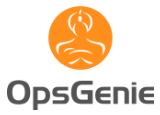

# Azure Monitor partner integrations

Listed in alphabetical order. 

## AIMS

AIMS AIOps (Artificial Intelligence for IT Operations) automates analysis of Azure performance metrics (for infrastructure and services) to provide actionable insight to drive efficiency, scale appropriately, control costs and provide business insights.  AIMS use machine learning to alleviate IT Ops teams from tedious manual work.  AIMS also supports on-premise technologies for seamless hybrid control.  AIMS is available in the Azure Marketplace and as a fully functional Free Community Edition.

[AIMS AIOps documentation for Azure](https://www.aims.ai/platform/azure)

## AlertLogic Log Manager

Alert Logic Log Manager collects VM, application, and Azure platform logs for security analysis and retention. It also collects the Azure Activity Log through the Azure Monitor API. This information is used to detect malfeasance and meet compliance requirements.

[AlertLogic documentation.](https://legacy.docs.alertlogic.com/userGuides/log-manager-collection-sources.htm)

## AppDynamics

AppDynamics Application Performance Management (APM) enables application owners to rapidly troubleshoot performance bottlenecks and optimize the performance of their applications running in Azure environment. It can monitor Azure Cloud Services (PaaS), web & worker roles, Virtual Machines (IaaS), Remote Service Detection (Microsoft Azure Service Bus), Microsoft Azure Queue, Microsoft Azure Remote Services (Azure Blob), Azure Queue (Microsoft Service Bus), Data Storage, and Microsoft Azure Blob Storage. AppDynamics APM is available in the Azure Marketplace.

[AppDynamics documentation](https://www.appdynamics.com/net/azure/) 

## Atlassian JIRA

You can create JIRA tickets on Azure Monitor alerts.

[Atlassian documentation for Azure Monitor](https://azure.microsoft.com/blog/automated-notifications-from-azure-monitor-for-atlassian-jira/)

## BMC Helix

BMC Helix is an autonomous enterprise service and operations SaaS platform. Integrated with 360-degree intelligence, it empowers businesses to proactively and predictively discover, monitor, service, remediate, optimize, and deliver omni-channel experiences for IT and lines-of-business.
Furthermore, by seamlessly integrating ITSM and IT Operations Management (ITOM), BMC Helix enables IT and business users to eliminate IT silos, make data-driven business decisions, and deliver industry leading customer experiences.
Customers can deploy the BMC Helix platform with the cloud deployment of their choice – public, private, or hybrid. Additionally, customers have a choice of AI/ML solutions to leverage from industry leading providers.

[Learn more about BMC Helix](https://www.bmc.com/it-solutions/bmc-helix.html?vu=helix)

## Botmetric

[Botmetric introduction for Azure](https://www.botmetric.com/blog/announcing-botmetric-cost-governance-beta-microsoft-azure/)

## Circonus

Circonus is the machine data intelligence expert, providing the only machine data intelligence platform capable of handling billions of metric streams in real time to drive unprecedented business insight and value. Use Circonus to collect, track, and visualize key metrics related to your Microsoft Azure setup. Gain system-wide visibility into Azure’s resource utilization, application performance, and operational health.

[Circonus documentation](https://docs.circonus.com/circonus/agents/cloud-agent/azure/)

## CloudHealth

Unite and automate your cloud with a platform built to save time and money. CloudHealth provides visibility, intuitive optimization, and rock-solid governance practices for cloud management. The CloudHealth platform enables enterprises and MSPs to maximize return on cloud investments. Make confident decisions around cost, usage, performance, and security.

[Cloud Health docs](https://www.cloudhealthtech.com/products/azure-management)

## CloudMonix

CloudMonix offers monitoring, automation, and self-healing services for Microsoft Azure platform.

[CloudMonix introduction](https://cloudmonix.com/features/azure-management/)

## Datadog

Azure enables customers to migrate and modernize their applications to run in the cloud, in coordination with many partner solutions. One such partner is Datadog, which provides observability and security tools for users to understand the health and performance of their applications across hybrid and multi-cloud environments.  But configuring the necessary integrations often requires navigating between the Azure portal and Datadog.  This process adds complexity, takes time, and makes it difficult to troubleshoot if things aren’t working.  To reduce the burden of managing across multiple portals, Microsoft has worked with Datadog to create an integrated Datadog solution on the Azure cloud platform.  Available via the Azure Marketplace, this solution provides a seamless experience for using the Datadog’s cloud monitoring solution in Azure.  

With the new Azure-Datadog integration, organizations can now fully map their legacy and cloud-based systems, monitoring real-time data during every phase of the cloud transition, and ensure that migrated applications meet performance targets. This integration combines Azure’s global presence, flexibility, security, and compliance with Datadog's logging and monitoring capabilities to create the best experience for enterprises. 
Through this unified experience, you will be able to: 

- Provision a new Datadog organization and configure their Azure resources to send logs and metrics to Datadog—a fully managed setup with no infrastructure for customers to set up and operate.  
- Seamlessly send logs and metrics to Datadog. The log-forwarding process has been completely automated; rather than building out a log-forwarding pipeline with Diagnostic Settings, Event Hubs, and Functions, you can configure everything with just a few clicks.
-	Easily install the Datadog agent on VM hosts through a single-click.
-	Streamline single-sign on (SSO) to Datadog—a separate sign-on from the Datadog portal is no longer required. 
-	Get unified billing for the Datadog service through Azure subscription invoicing.

Sign up for the [Public Preview](https://forms.microsoft.com/Pages/ResponsePage.aspx?id=v4j5cvGGr0GRqy180BHbR4z3T2aGXUZPslUNJ3YpcapURFBHSUJIMVJTWDM5VUFPMVkyTVhMVlYzMS4u) of the new Datadog integration with Azure.  Public preview will be available on Azure Marketplace starting October 2020.

Subscribe to the preview of "Datadog integration with Azure" available in the [Azure Marketplace](https://azuremarketplace.microsoft.com/marketplace/apps/datadog1591740804488.dd_liftr_v2?tab=Overview)

If you are still using the previous manually configured integration, see the [documentation on the DataDog website](https://docs.datadoghq.com/integrations/azure/).

## Dynatrace

The Dynatrace OneAgent integrates with Azure VMs and App Services via the Azure extension mechanism. This way Dynatrace OneAgent can gather performance metrics about hosts, network, and services. Besides just displaying metrics, Dynatrace visualizes environments end-to-end. It shows transactions from the client side to the database layer. Dynatrace provides AI-based correlation of problems and fully integrated root-cause-analysis to give method level insights into code and database. This insight makes troubleshooting and performance optimizations much easier.

[Dynatrack documentation](https://help.dynatrace.com/infrastructure-monitoring/paas/how-do-i-monitor-microsoft-azure-web-apps/)

## Elastic

Elastic is a search company. As the creators of the Elastic Stack (Elasticsearch, Kibana, Beats, and Logstash), Elastic builds self-managed and SaaS offerings that make data usable in real time and at scale for search, logging, security, and analytics use cases.

[Elastic documentation](https://www.elastic.co/guide/en/logstash/master/azure-module.html)

## Grafana

Grafana is an open-source application that enables you to visualize time series metric data.

[Azure Monitor Grafana integration](visualize/grafana-plugin.md)

## InfluxData

InfluxData is the creator of InfluxDB, the open-source time series database. Our technology is purpose-built to handle the massive volumes of time-stamped data produced by IoT devices, applications, networks, containers, and computers. We are on a mission to help developers and organizations, such as IBM, Visa, Siemens, Tesla and NASA, store and analyze real-time data, empowering them to build transformative monitoring, analytics, and IoT applications quicker and to scale. Microsoft Azure Monitor's metrics and events collection capabilities can be expanded with InfluxData's Telegraf Agent enabling Microsoft users to benefit from a leading time series database solution and leverage the growing open-source contributions to Telegraf.

[Azure Monitor Influx data Telegraf integration](essentials/collect-custom-metrics-linux-telegraf.md) 

## Logic Monitor

LogicMonitor&reg; is the leading SaaS-based, performance monitoring platform for complex IT infrastructure. With coverage for thousands of technologies, LogicMonitor provides granular visibility into infrastructure and application performance. LM Cloud's comprehensive Azure monitoring enables users to correlate the performance of Azure cloud, on-premises, and hybrid cloud resources--all from a single platform. Automated resource discovery, built in monitoring templates, preconfigured alert thresholds, and customizable dashboards combine to give IT the speed, flexibility, and visibility required to succeed.

[Logic Monitor documentation](https://www.logicmonitor.com/lp/azure-monitoring/)

## LogRhythm

LogRhythm, a leader in NextGen SIEM, empowers organizations on six continents to measurably reduce risk by rapidly detecting, responding to, and neutralizing cyberthreats. LogRhythm's Threat Lifecycle Management (TLM) workflow is the foundation for security operations centers, helping customers secure their cloud, physical, and virtual infrastructures for IT and OT environments. If you're a LogRhythm customer and are ready to start your Azure journey, you'll need to install and configure the LogRhythm Open Collector and EventHub integration. For more information, see [documentation on both configuring Azure Monitor and the Open Collector](https://logrhythm.com/six-tips-for-securing-your-azure-cloud-environment/). 

## Microfocus

Microfocus **ArcSight** has a smart connector for Azure Monitor event hubs.

[See the ArcSight documentation](https://community.softwaregrp.com/t5/Discussions/Announcing-General-Availability-of-ArcSight-Smart-Connectors-7/m-p/1671852)

Microfocus **Operations Bridge** automatically monitors all Hybrid IT resources – any device, operating system, database, application, or service, regardless of where it runs and applies AIOps to all data types – events, metrics, logs, and dependencies. It provides a unique combination of quality-of-service monitoring, coupled with deep application health analytics, and includes comprehensive performance and availability monitoring of Microsoft Azure services. Operations Bridge enables customers to provide a single pane of glass, available on any device with a browser, in ways both business and IT stakeholders can understand.

Learn more
- [OB Suite overview](https://www.microfocus.com/products/operations-bridge-suite/overview)
- [Download](https://marketplace.microfocus.com/itom/content/obm-management-pack-for-microsoft-azure)
- [SiteScope](https://docs.microfocus.com/itom/SiteScope:2019.05/MSAzureMonitor) - SiteScope is a component in the Operations Bridge Suite.

## Moogsoft

Moogsoft AIOps accelerates the agile business transformation.

Microsoft Azure Automation and Control tools provide a real-time window into the status of the Applications and microservices deployed in Azure. They help orchestrate diagnostics and runbooks for faster remediation. Other third-party tools provide a window into the on-premises Applications and infrastructure status.

Moogsoft AIOps automates the Event to Remediation workflow without changing existing processes and organizational structure. 

Moogsoft runs in your Azure real-estate with integration to monitoring and automation tools across the hybrid fabric. Moogsoft 
 - actively detects application impacting incidents earlier 
 - dynamically orchestrates the appropriate resources to make them situation aware 
 - reduces the mean time to remediate and adverse impact on customer experience. 

[Moogsoft documentation](https://www.moogsoft.com/partners/microsoft-azure)

## NewRelic

[Newrelic documentation](https://newrelic.com/azure)

## OpsGenie

OpsGenie acts as a dispatcher for the alerts generated by Azure. OpsGenie determines the right people to notify based on on-call schedules and escalations. It can notify them using by email, text messages (SMS), phone calls, or push notifications. Azure generates alerts for detected problems. OpsGenie ensures the right people are working on the problem.

[opsgenie documentation](https://www.opsgenie.com/docs/integrations/azure-integration)

## PagerDuty

PagerDuty, the leading incident management solution, has provided first-class support for Azure Alerts on metrics. PagerDuty supports notifications on Azure Monitor alerts, autoscale notifications, activity log events, and platform-level metrics for Azure services. These enhancements give you increased visibility into the core Azure Platform. You can take full advantage of PagerDuty's incident management capabilities for real-time response. The expanded Azure integration is made possible through webhooks. Webhooks allow you to set up and customize the solution quickly and easily.

[Pagerduty documentation](https://www.pagerduty.com/docs/guides/azure-integration-guide/)

## Promitor

Promitor is an Azure Monitor scraper that makes the metrics available in systems like Atlassian Statuspage, Prometheus, and StatsD.

Push all metrics to Azure Monitor and consume them where you need them.

[Promitor documentation](https://promitor.io/)

## QRadar

The Microsoft Azure DSM and Microsoft Azure Event Hub Protocol are available for download from [the IBM support website](https://www.ibm.com/support). You can learn more about the integration with Azure in the [QRadar documentation](https://www.ibm.com/support/knowledgecenter/SS42VS_DSM/c_dsm_guide_microsoft_azure_overview.html?cp=SS42VS_7.3.0).

## RSA

The RSA NetWitness Platform is a leading threat detection and response platform that brings together evolved SIEM and extended detection and response solutions. The solutions deliver unsurpassed visibility, analytics, and automated response capabilities. These combined capabilities help security teams work more efficiently and effectively, up-leveling their threat hunting skills and enabling them to investigate and respond to threats faster, across their organization’s entire infrastructure—whether in the cloud, on premises, or virtual. 

RSA NetWitness Platform's integration with Azure Monitor provides quick out of the box capabilities to ingest event data and logs from Azure Monitor natively into the RSA NetWitness Platform through an intuitive UI and robust native parsing capabilities. Gain rapid visibility into Activity, Diagnostic, Active Directory Events and other Event Hub data and see this data alongside your other enterprise security information in a complete threat detection and response solution.

[Learn more.](https://community.rsa.com/docs/DOC-101239)

## ScienceLogic

ScienceLogic delivers the next generation IT service assurance platform for managing any technology, anywhere. ScienceLogic delivers the scale, security, automation, and resiliency necessary to simplify the tasks of managing IT resources, services, and applications. The ScienceLogic platform uses Azure APIs to interface with Microsoft Azure. ScienceLogic gives you real-time visibility into your Azure services and resources. So you know when something's not working and you can fix it faster. You can also manage Azure alongside your other clouds and data center systems and services.

[ScienceLogic documentation](https://www.sciencelogic.com/product/technologies/microsoft/azure)

## Serverless360

Serverless360 is a one platform tool to operate, manage, and monitor Azure serverless components. Manageability is one of the key challenges with serverless implementations. Hundreds of small, discrete serverless services are scattered in various places – managing and operating such solutions is complex. Serverless360 solves these challenges with rich set of sophisticated tools. It can monitor serverless services like Azure Functions, Logic Apps, Event Grids, Service Bus Queues, Topics, Relays, Event Hubs, Storage queues, files, blob, and tables. Serverless360 is available in the Azure Marketplace. These capabilities are available on both SaaS and private hosting (hosted on your own environment).  

[Serverless360 documentation](https://docs.serverless360.com/docs/)

## ServiceNow

Reduce incidents and MTTR with NOW AIOps platform to eliminate noise, prioritize, identify root cause detection using ML, and remediate with ITX workflows.  Understand the current state of your Iaas/PaaS/FaaS services from Azure and build service maps from tags to build application service context for the business impact analysis.    

[Learn more about Service Now](https://www.servicenow.com/solutions/aiops.html)

## SignalFx

SignalFx is the leader in real-time operational intelligence for data-driven DevOps. The service discovers and collects metrics across every component in the cloud. It replaces traditional point tools and provides real-time visibility into today's dynamic environments. Leveraging the massively scalable SignalFx platform, the SaaS platform is optimized for container and microservices based architectures and provides powerful visualization, proactive alerting, and collaborative triage capabilities across organizations of all sizes. SignalFx integrates directly with Azure Monitor as well as through open-source connectors such as *Telegraf*, *statsD*, and *collectd* to provide best in class dashboards, analytics, and alerts for Azure.

[signalfx Documentation](https://docs.signalfx.com/en/latest/getting-started/send-data.html#connect-to-azure)

## SIGNL4

SIGNL4 - the mobile alerting app for operations teams - is the fastest way to route critical alerts from Azure Monitor to the right people at the right time – anywhere by push, text, and voice calls. SIGNL4 manages on-call duties and shifts of your team, tracks delivery and ownership of alerts and escalates if necessary. Full transparency across your team is provided. Using the super-easy REST web-hook of SIGNL4 any Azure service can be connected with no effort. With SIGNL4, you will see up to 10x faster response over email notifications and manual alerting.

[SIGNL4 documentation](https://www.signl4.com/blog/mobile-alert-notifications-azure-monitor/)

## Site24x7

Site24x7 provides advanced and full stack Azure monitoring solution, delivering visibility and insight into your applications allowing application owners to detect performance bottlenecks rapidly, automate fault resolution, and optimize their performance.
With Site24x7 Azure Monitoring, you will be able to:

* Monitor more than 100 Azure IaaS and PaaS services.
* Get in-depth monitoring for Windows and Linux VMs with exclusive Azure extensions, right from the Azure Marketplace.
* Troubleshoot applications with insight on logs from Azure. Send logs to Site24x7, save search queries, set query-based alerts, and manage Azure logs from a single dashboard.
* Detect any service health issues and ensure reliable deployments via the Azure Deployment Manager (ADM) Health Check.
* Automate fault resolution with a set of IT Automation tools.
* Monitor your complete Microsoft ecosphere including SQL, Exchange, Active Directory, Office 365, IIS, and Hyper-V applications.
* Integrate seamlessly with third party services like Microsoft Teams, PagerDuty, Zapier, and more.

[Site24X7 documentation](https://www.site24x7.com/azure/?utm_source=microsoft-partner-page&utm_medium=webpage&utm_campaign=ms-partner)

## SolarWinds

[SolarWinds documentation](https://www.solarwinds.com/topics/azure-monitoring)

## SpearTip

SpearTip’s 24/7 security operations center continuously monitors Azure environments for cyber threats. Utilizing the ShadowSpear integration with Azure Monitor, security events are collected and analyzed for advanced threats, while SpearTip engineers investigate and respond to stop threat actors in their tracks. The integration is seamless and provides instant value once the integration is deployed.

[SpearTip documentation](https://www.speartip.com/identify/)

## Splunk

The Azure Monitor Add-on for Splunk is [available in the Splunkbase here](https://splunkbase.splunk.com/app/3534/).

[Splunk documentation for Azure Monitor add on](https://github.com/Microsoft/AzureMonitorAddonForSplunk/wiki/Azure-Monitor-Addon-For-Splunk)

## SquaredUp 

SquaredUp for Azure makes visualizing your Azure applications beautifully simple. It gives you real time, interactive dashboards. You can drill down into subscriptions, resource groups, tags, and individual resources to see metrics such as CPU, most inbound connections, Application Insights response time, total cost, and summary health status, and drill across to see related data such as alerts, Log Analytics events, more detailed metrics, or to see related data from the other tools you use – such as ServiceNow, Dynatrace, PagerDuty, or Pingdom for example.  You can customize your own dashboards, publish, and share them with individuals or on intranet pages. 

[SquaredUp website](https://squaredup.com/)

## Sumo Logic

Sumo Logic is a secure, cloud-native, machine data analytics service, delivering real-time, continuous intelligence from structured, semi-structured, and unstructured data across the entire application lifecycle and stack. More than 1,000 customers around the globe rely on Sumo Logic for the analytics and insights to build, run, and secure their applications and cloud infrastructures. With Sumo Logic, customers gain a multi-tenant, service-model advantage to help increase competitive advantage, business value, and growth.

[Sumologic documentation](https://www.sumologic.com/azure) 

## Turbonomic

Turbonomic delivers workload automation for hybrid clouds by simultaneously optimizing performance, cost, and compliance in real time. Turbonomic helps organizations be elastic in their Azure estate by continuously optimizing the estate to ensure applications constantly get the resources they require to deliver their SLA and nothing more across compute, storage, and network for the IaaS and PaaS layer. Organizations can simulate migrations, properly scale workloads, and retire datacenter resources to responsibly migrate to Azure on-time, within budget, while assuring both performance and compliance. Turbonomic is API driven and runs as an agentless VM in Azure and on-premises.

[Turbonomic introduction](https://turbonomic.com/)

## Partner tools with Event Hub integration

Using Azure Monitor to route monitoring data to an Azure Event Hub  allows you to easily integrate with some external SIEM and monitoring tools. The following partners are known to have integration via Event Hub. 

| Tool | Hosted in Azure | Description |
|:---|:---| :---|
|  IBM QRadar | No | The Microsoft Azure DSM and Microsoft Azure Event Hub Protocol are available for download from [the IBM support website](https://www.ibm.com/support). You can learn more about the integration with Azure at [QRadar DSM configuration](https://www.ibm.com/support/knowledgecenter/SS42VS_DSM/c_dsm_guide_microsoft_azure_overview.html?cp=SS42VS_7.3.0). |
| Splunk | No | [Microsoft Azure Add-On for Splunk](https://splunkbase.splunk.com/app/3757/) is an open source project available in Splunkbase.    If you cannot install an add-on in your Splunk instance, if for example you're using a proxy or running on Splunk Cloud, you can forward these events to the Splunk HTTP Event Collector using [Azure Function For Splunk](https://github.com/Microsoft/AzureFunctionforSplunkVS), which is triggered by new messages in the event hub. |
| SumoLogic | No | Instructions for setting up SumoLogic to consume data from an event hub are available at [Collect Logs for the Azure Audit App from Event Hub](https://help.sumologic.com/Send-Data/Applications-and-Other-Data-Sources/Azure-Audit/02Collect-Logs-for-Azure-Audit-from-Event-Hub). |
| ArcSight | No | The ArcSight Azure Event Hub smart connector is available as part of [the ArcSight smart connector collection](https://community.softwaregrp.com/t5/Discussions/Announcing-General-Availability-of-ArcSight-Smart-Connectors-7/m-p/1671852). |
| Syslog server | No | If you want to stream Azure Monitor data directly to a syslog server, you can use a [solution based on an Azure function](https://github.com/miguelangelopereira/azuremonitor2syslog/).
| LogRhythm | No| Instructions to set up LogRhythm to collect logs from an event hub are available [here](https://logrhythm.com/six-tips-for-securing-your-azure-cloud-environment/). 
|Logz.io | Yes | For more information, see [Getting started with monitoring and logging using Logz.io for Java apps running on Azure](/azure/developer/java/fundamentals/java-get-started-with-logzio)

## Next steps

- [Learn more about Azure Monitor](overview.md)
- [Access metrics using the REST API](essentials/rest-api-walkthrough.md)
- [Stream the Activity Log to a non-Microsoft service](essentials/activity-log.md#legacy-collection-methods)
- [Stream resource logs to a non-Microsoft service](essentials/resource-logs.md#send-to-azure-event-hubs)

