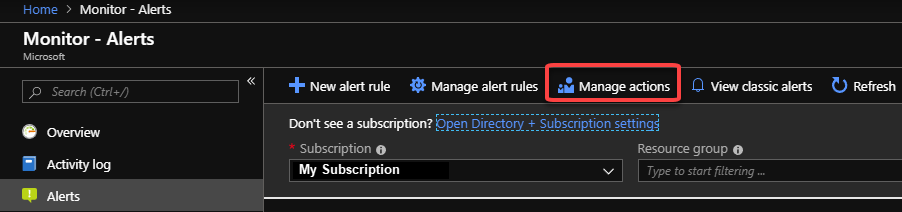
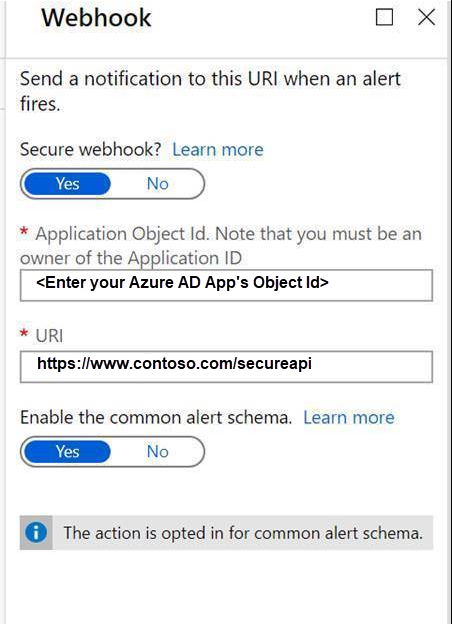

# Create and manage action groups in the Azure portal
An action group is a collection of notification preferences defined by the owner of an Azure subscription. Azure Monitor and Service Health alerts use action groups to notify users that an alert has been triggered. Various alerts may use the same action group or different action groups depending on the user's requirements. You may configure up to 2,000 action groups in a subscription.

You configure an action to notify a person by email or SMS, they receive a confirmation indicating they have been added to the action group.

This article shows you how to create and manage action groups in the Azure portal.

Each action is made up of the following properties:

* **Name**: A unique identifier within the action group.  
* **Action type**: The action performed. Examples include sending a voice call, SMS, email; or triggering various types of automated actions. See types later in this article.
* **Details**: The corresponding details that vary by *action type*.

For information on how to use Azure Resource Manager templates to configure action groups, see [Action group Resource Manager templates](../../azure-monitor/platform/action-groups-create-resource-manager-template.md).

## Create an action group by using the Azure portal

1. In the [Azure portal](https://portal.azure.com), search for and select **Monitor**. The **Monitor** pane consolidates all your monitoring settings and data in one view.

1. Select **Alerts** then select **Manage actions**.

    
    
1. Select **Add action group**, and fill in the fields.

    
    
1. Enter a name in the **Action group name** box, and enter a name in the **Short name** box. The short name is used in place of a full action group name when notifications are sent using this group.

      

1. The **Subscription** box autofills with your current subscription. This subscription is the one in which the action group is saved.

1. Select the **Resource group** in which the action group is saved.

1. Define a list of actions. Provide the following for each action:

    1. **Name**: Enter a unique identifier for this action.

    1. **Action Type**: Select Automation Runbook, Azure Function, Email Azure Resource Manager Role, Email/SMS/Push/Voice, ITSM, Logic App, Secure Webhook, Webhook.

    1. **Details**: Based on the action type, enter a phone number, email address, webhook URI, Azure app, ITSM connection, or Automation runbook. For ITSM Action, additionally specify **Work Item** and other fields your ITSM tool requires.
    
    1. **Common alert schema**: You can choose to enable the [common alert schema](https://aka.ms/commonAlertSchemaDocs), which provides the advantage of having a single extensible and unified alert payload across all the alert services in Azure Monitor.

1. Select **OK** to create the action group.

## Manage your action groups

After you create an action group, you can view **Action groups** by selecting **Manage actions** from the **Alerts** landing page in **Monitor** pane. Select the action group you want to manage to:

* Add, edit, or remove actions.
* Delete the action group.

## Action specific information

> [!NOTE]
> See [Subscription Service Limits for Monitoring](https://docs.microsoft.com/azure/azure-resource-manager/management/azure-subscription-service-limits#azure-monitor-limits) for numeric limits on each of the items below.  

### Automation Runbook
Refer to the [Azure subscription service limits](../../azure-resource-manager/management/azure-subscription-service-limits.md) for limits on Runbook payloads.

You may have a limited number of Runbook actions in an Action Group. 

### Azure app Push Notifications
You may have a limited number of Azure app actions in an Action Group.

### Email
Emails will be sent from the following email addresses. Ensure that your email filtering is configured appropriately
- azure-noreply@microsoft.com
- azureemail-noreply@microsoft.com
- alerts-noreply@mail.windowsazure.com

You may have a limited number of email actions in an Action Group. See the [rate limiting information](./../../azure-monitor/platform/alerts-rate-limiting.md) article.

### Email Azure Resource Manager Role
Send email to the members of the subscription's role. Email will only be sent to **Azure AD user** members of the role. Email will not be sent to Azure AD groups or service principals.

You may have a limited number of email actions in an Action Group. See the [rate limiting information](./../../azure-monitor/platform/alerts-rate-limiting.md) article.

### Function
Calls an existing HTTP trigger endpoint in [Azure Functions](../../azure-functions/functions-create-first-azure-function.md#create-a-function-app).

You may have a limited number of Function actions in an Action Group.

### ITSM
ITSM Action requires an ITSM Connection. Learn how to create an [ITSM Connection](../../azure-monitor/platform/itsmc-overview.md).

You may have a limited number of ITSM actions in an Action Group. 

### Logic App
You may have a limited number of Logic App actions in an Action Group.

### Secure Webhook
The Action Groups Webhook action enables you to take advantage of Azure Active Directory to secure the connection between your action group and your protected web API (webhook endpoint). The overall workflow for taking advantage of this functionality is described below. For an overview of Azure AD Applications and service principals, see [Microsoft identity platform (v2.0) overview](https://docs.microsoft.com/azure/active-directory/develop/v2-overview).

1. Create an Azure AD Application for your protected web API. See https://docs.microsoft.com/azure/active-directory/develop/scenario-protected-web-api-overview.
    - Configure your protected API to be called by a daemon app.
    
1. Enable Action Groups to use your Azure AD Application.

    > [!NOTE]
    > You must be a member of the [Azure AD Application Administrator role](https://docs.microsoft.com/azure/active-directory/users-groups-roles/directory-assign-admin-roles#available-roles) to execute this script.
    
    - Modify the PowerShell script's Connect-AzureAD call to use your Azure AD Tenant ID.
    - Modify the PowerShell script's variable $myAzureADApplicationObjectId to use the Object ID of your Azure AD Application.
    - Run the modified script.
    
1. Configure the Action Group Secure Webhook action.
    - Copy the value $myApp.ObjectId from the script and enter it in the Application Object ID field in the Webhook action definition.
    
    

#### Secure Webhook PowerShell Script

```PowerShell
Connect-AzureAD -TenantId "<provide your Azure AD tenant ID here>"
    
# This is your Azure AD Application's ObjectId. 
$myAzureADApplicationObjectId = "<the Object Id of your Azure AD Application>"
    
# This is the Action Groups Azure AD AppId
$actionGroupsAppId = "461e8683-5575-4561-ac7f-899cc907d62a"
    
# This is the name of the new role we will add to your Azure AD Application
$actionGroupRoleName = "ActionGroupsSecureWebhook"
    
# Create an application role of given name and description
Function CreateAppRole([string] $Name, [string] $Description)
{
    $appRole = New-Object Microsoft.Open.AzureAD.Model.AppRole
    $appRole.AllowedMemberTypes = New-Object System.Collections.Generic.List[string]
    $appRole.AllowedMemberTypes.Add("Application");
    $appRole.DisplayName = $Name
    $appRole.Id = New-Guid
    $appRole.IsEnabled = $true
    $appRole.Description = $Description
    $appRole.Value = $Name;
    return $appRole
}
    
# Get my Azure AD Application, it's roles and service principal
$myApp = Get-AzureADApplication -ObjectId $myAzureADApplicationObjectId
$myAppRoles = $myApp.AppRoles
$actionGroupsSP = Get-AzureADServicePrincipal -Filter ("appId eq '" + $actionGroupsAppId + "'")

Write-Host "App Roles before addition of new role.."
Write-Host $myAppRoles
    
# Create the role if it doesn't exist
if ($myAppRoles -match "ActionGroupsSecureWebhook")
{
    Write-Host "The Action Groups role is already defined.`n"
}
else
{
    $myServicePrincipal = Get-AzureADServicePrincipal -Filter ("appId eq '" + $myApp.AppId + "'")
    
    # Add our new role to the Azure AD Application
    $newRole = CreateAppRole -Name $actionGroupRoleName -Description "This is a role for Action Groups to join"
    $myAppRoles.Add($newRole)
    Set-AzureADApplication -ObjectId $myApp.ObjectId -AppRoles $myAppRoles
}
    
# Create the service principal if it doesn't exist
if ($actionGroupsSP -match "AzNS AAD Webhook")
{
    Write-Host "The Service principal is already defined.`n"
}
else
{
    # Create a service principal for the Action Groups Azure AD Application and add it to the role
    $actionGroupsSP = New-AzureADServicePrincipal -AppId $actionGroupsAppId
}
    
New-AzureADServiceAppRoleAssignment -Id $myApp.AppRoles[0].Id -ResourceId $myServicePrincipal.ObjectId -ObjectId $actionGroupsSP.ObjectId -PrincipalId $actionGroupsSP.ObjectId
    
Write-Host "My Azure AD Application ($myApp.ObjectId): " + $myApp.ObjectId
Write-Host "My Azure AD Application's Roles"
Write-Host $myApp.AppRoles
```

### SMS
See the [rate limiting information](./../../azure-monitor/platform/alerts-rate-limiting.md) and [SMS alert behavior](../../azure-monitor/platform/alerts-sms-behavior.md) for additional important information. 

You may have a limited number of SMS actions in an Action Group.

> [!NOTE]
> If the Azure portal action group user interface does not let you select your country/region code, then SMS is not supported for your country/region.  If your country/region code is not available, you can vote to have your country/region added at [user voice](https://feedback.azure.com/forums/913690-azure-monitor/suggestions/36663181-add-more-country-codes-for-sms-alerting-and-voice). In the meantime, a work around is to have your action group call a webhook to a third-party SMS provider with support in your country/region.  

Pricing for supported countries/regions is listed in the [Azure Monitor pricing page](https://azure.microsoft.com/pricing/details/monitor/).
  

### Voice
See the [rate limiting information](./../../azure-monitor/platform/alerts-rate-limiting.md) article for additional important behavior.

You may have a limited number of Voice actions in an Action Group.

> [!NOTE]
> If the Azure portal action group user interface does not let you select your country/region code, then voice calls are not supported for your country/region. If your country/region code is not available, you can vote to have your country/region added at [user voice](https://feedback.azure.com/forums/913690-azure-monitor/suggestions/36663181-add-more-country-codes-for-sms-alerting-and-voice).  In the meantime, a work around is to have your action group call a webhook to a third-party voice call provider with support in your country/region.  

Pricing for supported countries/regions is listed in the [Azure Monitor pricing page](https://azure.microsoft.com/pricing/details/monitor/).

### Webhook
Webhooks are processed using the following rules
- A webhook call is attempted a maximum of 3 times.
- The call will be retried if a response is not received within the timeout period or one of the following HTTP status codes is returned: 408, 429, 503 or 504.
- The first call will wait 10 seconds for a response.
- The second and third attempts will wait 30 seconds for a response.
- After the 3 attempts to call the webhook have failed no action group will call the endpoint for 15 minutes.

Source IP address ranges
 - 13.72.19.232
 - 13.106.57.181
 - 13.106.54.3
 - 13.106.54.19
 - 13.106.38.142
 - 13.106.38.148
 - 13.106.57.196
 - 13.106.57.197
 - 52.244.68.117
 - 52.244.65.137
 - 52.183.31.0
 - 52.184.145.166
 - 51.4.138.199
 - 51.5.148.86
 - 51.5.149.19

To receive updates about changes to these IP addresses, we recommend you configure a Service Health alert, which monitors for Informational notifications about the Action Groups service.

You may have a limited number of Webhook actions in an Action Group.


## Next steps
* Learn more about [SMS alert behavior](../../azure-monitor/platform/alerts-sms-behavior.md).  
* Gain an [understanding of the activity log alert webhook schema](../../azure-monitor/platform/activity-log-alerts-webhook.md).  
* Learn more about [ITSM Connector](../../azure-monitor/platform/itsmc-overview.md).
* Learn more about [rate limiting](../../azure-monitor/platform/alerts-rate-limiting.md) on alerts.
* Get an [overview of activity log alerts](../../azure-monitor/platform/alerts-overview.md), and learn how to receive alerts.  
* Learn how to [configure alerts whenever a service health notification is posted](../../azure-monitor/platform/alerts-activity-log-service-notifications.md).
