# Collect Azure Activity logs into Azure Monitor across Azure Active Directory tenants (legacy)

> [!NOTE]
> This article describes the legacy method for configuring the Azure Activity log across Azure tenants to be collected in a Log Analytics workspace.  You can now collect the Activity log into a Log Analytics workspace using a diagnostic setting similar to how you collect resource logs. See [Collect and analyze Azure activity logs in Log Analytics workspace in Azure Monitor](activity-log-collect.md).


This article steps through a method to collect Azure Activity Logs into a Log Analytics workspace in Azure Monitor using the Azure Log Analytics Data Collector connector for Logic Apps. Use the process in this article when you need to send logs to a workspace in a different Azure Active Directory tenant. For example, if you are a managed service provider, you may want to collect activity logs from a customer's subscription and store them in a Log Analytics workspace in your own subscription.

If the Log Analytics workspace is in the same Azure subscription, or in a different subscription but in the same Azure Active Directory, use the steps in the [Collect and analyze Azure activity logs in Log Analytics workspace in Azure Monitor](activity-log-collect.md) to collect Azure Activity logs.

## Overview

The strategy used in this scenario is to have Azure Activity Log send events to an [Event Hub](../../event-hubs/event-hubs-about.md) where a [Logic App](../../logic-apps/logic-apps-overview.md) sends them to your Log Analytics workspace. 

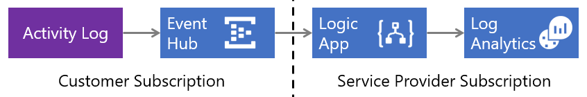

Advantages of this approach include:
- Low latency since the Azure Activity Log is streamed into the Event Hub.  The Logic App is then triggered and posts the data to the workspace. 
- Minimal code is required, and there is no server infrastructure to deploy.

This article steps you through how to:
1. Create an Event Hub. 
2. Export activity logs to an Event Hub using Azure Activity Log export profile.
3. Create a Logic App to read from the Event Hub and send events to Log Analytics workspace.

## Requirements
Following are the requirements for the Azure resources used in this scenario.

- The Event Hub namespace does not have to be in the same subscription as the subscription emitting logs. The user who configures the setting must have appropriate access permissions to both subscriptions. If you have multiple subscriptions in the same Azure Active directory, you can send the activity logs for all subscriptions to a single event hub.
- The Logic App can be in a different subscription from the event hub and does not need to be in the same Azure Active Directory. The Logic App reads from the Event Hub using the Event Hub's shared access key.
- The Log Analytics workspace can be in a different subscription and Azure Active Directory from the Logic App, but for simplicity we recommend that they are in the same subscription. The Logic App sends to the workspace using the Log Analytics workspace ID and key.


## Step 1 - Create an Event Hub

<!-- Follow the steps in [how to create an Event Hubs namespace and Event Hub](../../event-hubs/event-hubs-create.md) to create your event hub. -->

1. In the Azure portal, select **Create a resource** > **Internet of Things** > **Event Hubs**.

   

3. Under **Create namespace**, either enter a new namespace or selecting an existing one. The system immediately checks to see if the name is available.

   

4. Choose the pricing tier (Basic or Standard), an Azure subscription, resource group, and location for the new resource.  Click **Create** to create the namespace. You may have to wait a few minutes for the system to fully provision the resources.
6. Click the namespace you just created from the list.
7. Select **Shared access policies**, and then click **RootManageSharedAccessKey**.

   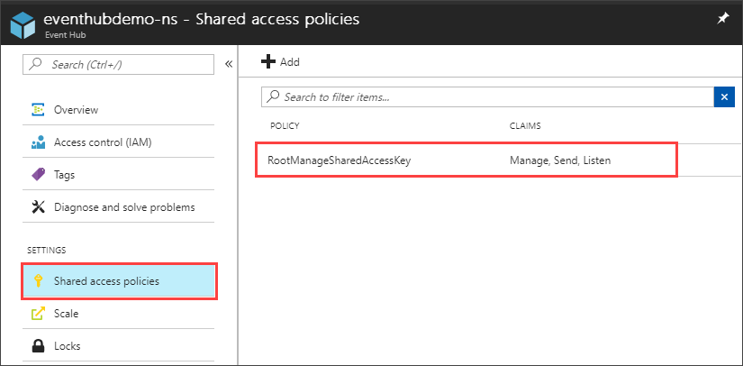
   
8. Click the copy button to copy the **RootManageSharedAccessKey** connection string to the clipboard. 

   

9. In a temporary location, such as Notepad, keep a copy the Event Hub name and either the primary or secondary Event Hub connection string. The Logic App requires these values.  For the Event Hub connection string, you can use the **RootManageSharedAccessKey** connection string or create a separate one.  The connection string  you use must start with `Endpoint=sb://` and be for a policy that has the **Manage** access policy.


## Step 2 - Export Activity Logs to Event Hub

To enable streaming of the Activity Log, you pick an Event Hub Namespace and a shared access policy for that namespace. An Event Hub is created in that namespace when the first new Activity Log event occurs. 

You can use an event hub namespace that is not in the same subscription as the subscription emitting logs, however the subscriptions must be in the same Azure Active Directory. The user who configures the setting must have the appropriate RBAC to access both subscriptions. 

1. In the Azure portal, select **Monitor** > **Activity Log**.
3. Click the **Export** button at the top of the page.

   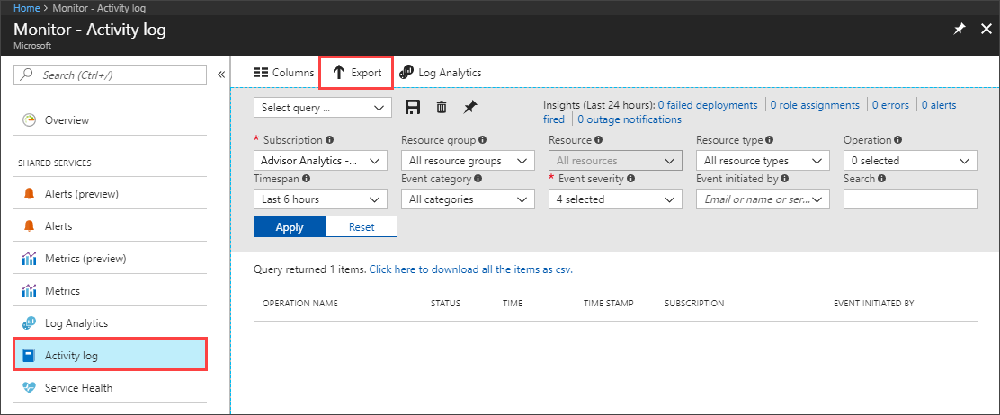

4. Select the **Subscription** to export from, and then click **Select all** in the **Regions** drop-down to select events for resources in all regions. Click the **Export to an event hub** check box.
7. Click **Service bus namespace**, and then select the **Subscription** with the event hub, the **event hub namespace**, and an **event hub policy name**.

    

11. Click **OK** and then **Save** to save these settings. The settings are immediately be applied to your subscription.

<!-- Follow the steps in [stream the Azure Activity Log to Event Hubs](../../azure-monitor/platform/activity-logs-stream-event-hubs.md) to configure a log profile that writes activity logs to an event hub. -->

## Step 3 - Create Logic App

Once the activity logs are writing to the event hub, you create a Logic App to collect the logs from the event hub and write them to the Log Analytics workspace.

The Logic App includes the following:
- An [Event Hub connector](https://docs.microsoft.com/connectors/eventhubs/) trigger to read from the Event Hub.
- A [Parse JSON action](../../logic-apps/logic-apps-content-type.md) to extract the JSON events.
- A [Compose action](../../logic-apps/logic-apps-workflow-actions-triggers.md#compose-action) to convert the JSON to an object.
- A [Log Analytics send data connector](https://docs.microsoft.com/connectors/azureloganalyticsdatacollector/) to post the data to the Log Analytics workspace.

   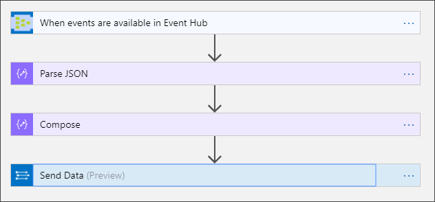

### Logic App Requirements
Before creating your Logic App, make sure you have the following information from previous steps:
- Event Hub name
- Event Hub connection string (either the primary or secondary) for the Event Hub namespace.
- Log Analytics workspace ID
- Log Analytics shared key

To get the event Hub name and connection string, follow the steps in [Check Event Hubs namespace permissions and find the connection string](../../connectors/connectors-create-api-azure-event-hubs.md#permissions-connection-string).


### Create a new blank Logic App

1. In the Azure portal, choose **Create a resource** > **Enterprise Integration** > **Logic App**.

    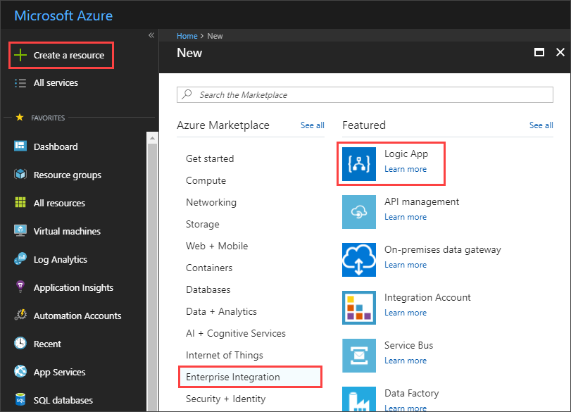

2. Enter the settings in the table below.

    

   |Setting | Description  |
   |:---|:---|
   | Name           | Unique name for the logic app. |
   | Subscription   | Select the Azure subscription that will contain the logic app. |
   | Resource Group | Select an existing Azure resource group or create a new one for the logic app. |
   | Location       | Select the datacenter region for deploying your logic app. |
   | Log Analytics  | Select if you want to log the status of each run of your logic app in a Log Analytics workspace.  |

    
3. Select **Create**. When **Deployment Succeeded** notification displays, click on **Go to resource** to open your Logic App.

4. Under **Templates**, choose **Blank Logic App**. 

The Logic Apps Designer now shows you available connectors and their triggers, which you use for starting your logic app workflow.

<!-- Learn [how to create a logic app](../../logic-apps/quickstart-create-first-logic-app-workflow.md). -->

### Add Event Hub trigger

1. In the search box for the Logic App Designer, type *event hubs* for your filter. Select the trigger **Event Hubs - When events are available in Event Hub**.

   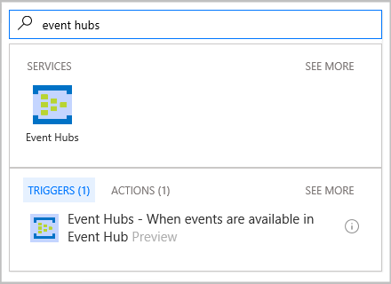

2. When you're prompted for credentials, connect to your Event Hubs namespace. Enter a name for your connection and then the connection string that you copied.  Select **Create**.

   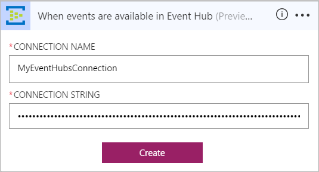

3. After you create the connection, edit the settings for the trigger. Start by selecting **insights-operational-logs** from the **Event Hub name** drop-down.

   

5. Expand **Show advanced options** and change **Content type** to *application/json*

   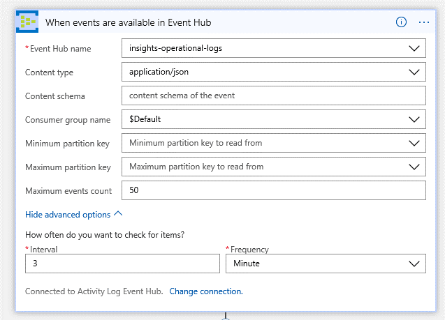

### Add Parse JSON action

The output from the Event Hub contains a JSON payload with an array of records. The [Parse JSON](../../logic-apps/logic-apps-content-type.md) action is used to extract just the array of records for sending to Log Analytics workspace.

1. Click **New step** > **Add an action**
2. In the search box, type *parse json* for your filter. Select the action **Data Operations - Parse JSON**.

   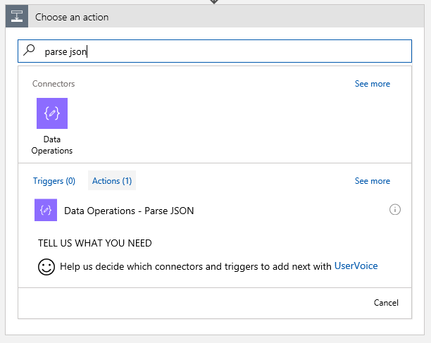

3. Click in the **Content** field and then select *Body*.

4. Copy and paste the following schema into the **Schema** field.  This schema matches the output from the Event Hub action.  

   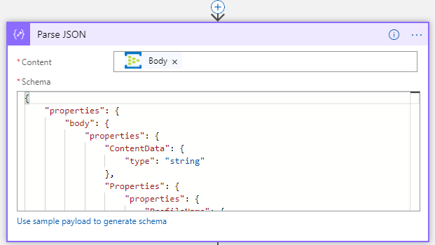

``` json-schema
{
    "properties": {
        "body": {
            "properties": {
                "ContentData": {
                    "type": "string"
                },
                "Properties": {
                    "properties": {
                        "ProfileName": {
                            "type": "string"
                        },
                        "x-opt-enqueued-time": {
                            "type": "string"
                        },
                        "x-opt-offset": {
                            "type": "string"
                        },
                        "x-opt-sequence-number": {
                            "type": "number"
                        }
                    },
                    "type": "object"
                },
                "SystemProperties": {
                    "properties": {
                        "EnqueuedTimeUtc": {
                            "type": "string"
                        },
                        "Offset": {
                            "type": "string"
                        },
                        "PartitionKey": {},
                        "SequenceNumber": {
                            "type": "number"
                        }
                    },
                    "type": "object"
                }
            },
            "type": "object"
        },
        "headers": {
            "properties": {
                "Cache-Control": {
                    "type": "string"
                },
                "Content-Length": {
                    "type": "string"
                },
                "Content-Type": {
                    "type": "string"
                },
                "Date": {
                    "type": "string"
                },
                "Expires": {
                    "type": "string"
                },
                "Location": {
                    "type": "string"
                },
                "Pragma": {
                    "type": "string"
                },
                "Retry-After": {
                    "type": "string"
                },
                "Timing-Allow-Origin": {
                    "type": "string"
                },
                "Transfer-Encoding": {
                    "type": "string"
                },
                "Vary": {
                    "type": "string"
                },
                "X-AspNet-Version": {
                    "type": "string"
                },
                "X-Powered-By": {
                    "type": "string"
                },
                "x-ms-request-id": {
                    "type": "string"
                }
            },
            "type": "object"
        }
    },
    "type": "object"
}
```

>[!TIP]
> You can get a sample payload by clicking **Run** and looking at the **Raw Output** from the Event Hub.  You can then use this output with **Use sample payload to generate schema** in the **Parse JSON** activity to generate the schema.

### Add Compose action
The [Compose](../../logic-apps/logic-apps-workflow-actions-triggers.md#compose-action) action takes the JSON output and creates an object that can be used by the Log Analytics action.

1. Click **New step** > **Add an action**
2. Type *compose* for your filter and then select the action **Data Operations - Compose**.

    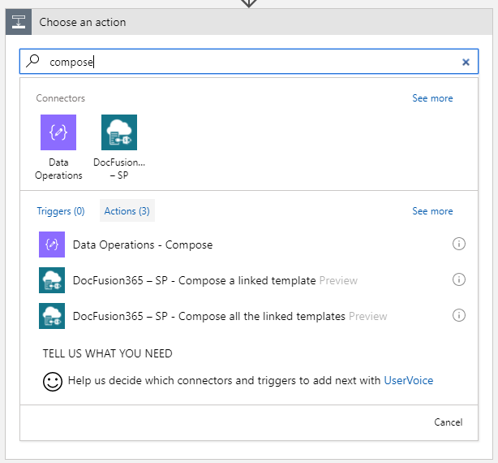

3. Click the **Inputs** field and select **Body** under the **Parse JSON** activity.


### Add Log Analytics Send Data action
The [Azure Log Analytics Data Collector](https://docs.microsoft.com/connectors/azureloganalyticsdatacollector/) action takes the object from the Compose action and sends it to a Log Analytics workspace.

1. Click **New step** > **Add an action**
2. Type *log analytics* for your filter and then select the action **Azure Log Analytics Data Collector - Send Data**.

   

3. Enter a name for your connection and paste in the **Workspace ID** and **Workspace Key** for your Log Analytics workspace.  Click **Create**.

   

4. After you create the connection, edit the settings in the table below. 

    

   |Setting        | Value           | Description  |
   |---------------|---------------------------|--------------|
   |JSON Request body  | **Output** from the **Compose** action | Retrieves the records from the body of the Compose action. |
   | Custom Log Name | AzureActivity | Name of the custom log table to create in Log Analytics workspace to hold the imported data. |
   | Time-generated-field | time | Don't select the JSON field for **time** - just type the word time. If you select the JSON field the designer puts the **Send Data** action into a *For Each* loop, which is not what you want. |


10. Click **Save** to save the changes you've made to your Logic App.

## Step 4 - Test and troubleshoot the Logic App
With the workflow complete, you can test in the designer to verify that it's working without error.

In the Logic App Designer, click **Run** to test the Logic App. Each step in the Logic App shows a status icon, with a white check mark in a green circle indicating success.

   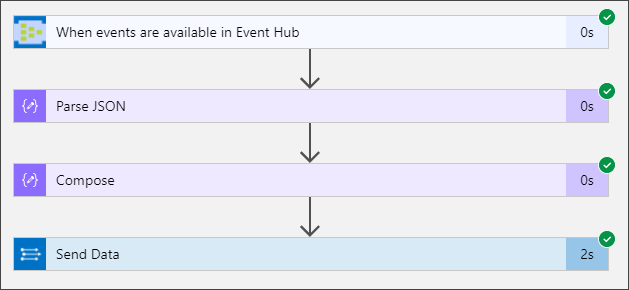

To see detailed information on each step, click on the step name to expand it. Click on **Show raw inputs** and **Show raw outputs** to see more information on the data received and sent at each step.

## Step 5 - View Azure Activity Log in Log Analytics
The final step is to check the Log Analytics workspace to make sure that data is being collected as expected.

1. In the Azure portal, click **All services** found in the upper left-hand corner. In the list of resources, type **Log Analytics**. As you begin typing, the list filters based on your input. Select **Log Analytics**.
2. In your list of Log Analytics workspaces, select your workspace.
3.  Click the **Log Search** tile and on the Log Search pane, in the query field type `AzureActivity_CL` and then hit enter or click the search button to the right of the query field. If you didn't name your custom log *AzureActivity*, type the name you chose and append `_CL`.

>[!NOTE]
> The first time a new custom log is sent to the Log Analytics workspace it may take up to an hour for the custom log to be searchable.

>[!NOTE]
> The activity logs are written to a custom table and do not appear in the [Activity Log solution](./activity-log-collect.md).


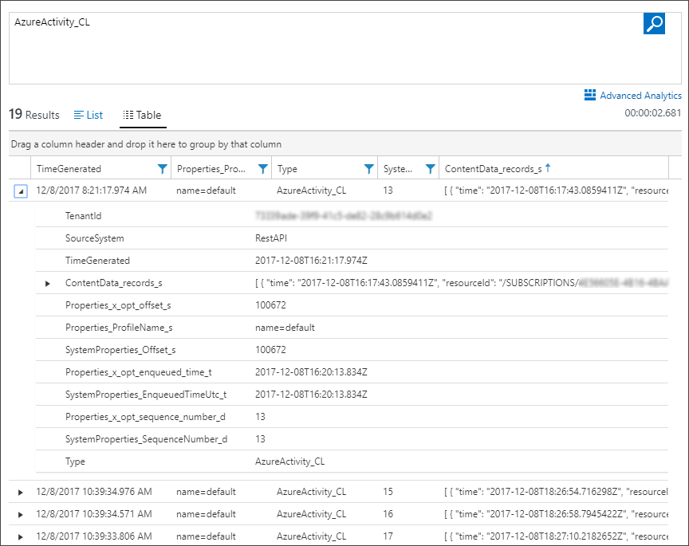

## Next steps

In this article, you’ve created a logic app to read Azure Activity Logs from an Event Hub and send them to the Log Analytics workspace for analysis. To learn more about visualizing data in a workspace, including creating dashboards, review the tutorial for Visualize data.

> [!div class="nextstepaction"]
> [Visualize Log Search data tutorial](./../../azure-monitor/learn/tutorial-logs-dashboards.md)
