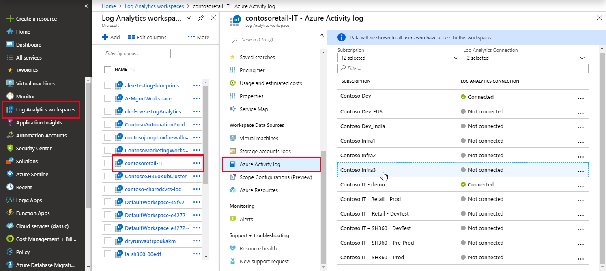

# Collect and analyze Azure activity logs in Log Analytics workspace in Azure Monitor
The [Azure Activity Log](activity-logs-overview.md) provides insight into subscription-level events that have occurred in your Azure subscription. This article describes how to collect the Activity Log into a Log Analytics workspace and how to use the Activity Log Analytics [monitoring solution](../insights/solutions.md), which provides log queries and views for analyzing this data. 

Connecting the Activity Log to a Log Analytics workspace provides the following benefits:

- Consolidate the Activity Log from multiple Azure subscriptions into one location for analysis.
- Store Activity Log entries for longer than 90 days.
- Correlate Activity Log data with other monitoring data collected by Azure Monitor.
- Use [log queries](../log-query/log-query-overview.md) to perform complex analysis and gain deep insights on Activity Log entries.

## Connect to Log Analytics workspace
An Activity Log can be connected to only one workspace, but a single workspace can be connected to the Activity Log for multiple subscriptions in the same Azure tenant. For collection across multiple tenants, see [Collect Azure Activity Logs into a Log Analytics workspace across subscriptions in different Azure Active Directory tenants](activity-log-collect-tenants.md).

Use the following procedure to connect the Activity Log to your Log Analytics workspace:

1. From the **Log Analytics workspaces** menu in the Azure portal, select the workspace to collect the Activity Log.
1. In the **Workspace Data Sources** section of the workspace's menu, select **Azure Activity log**.
1. Click the subscription you want to connect.

    

1. Click **Connect** to connect the Activity log in the subscription to the selected workspace. If the subscription is already connected to another workspace, click **Disconnect** first to disconnect it.

    

## Analyze in Log Analytics workspace
When you connect an Activity Log to a Log Analytics workspace, entries will be written to the workspace into a table called **AzureActivity** that you can retrieve with a [log query](../log-query/log-query-overview.md). The structure of this table varies depending on the [category of log entry](activity-logs-overview.md#categories-in-the-activity-log). See [Azure Activity Log event schema](activity-log-schema.md) for a description of each category.

## Activity Logs Analytics monitoring solution
The Azure Log Analytics monitoring solution includes multiple log queries and views for analyzing the Activity Log records in your Log Analytics workspace.

### Install the solution
Use the procedure in [Install a monitoring solution](../insights/solutions.md#install-a-monitoring-solution) to install the **Activity Log Analytics** solution. There is no additional configuration required.

### Use the solution
Monitoring solutions are accessed from the **Monitor** menu in the Azure portal. Select **More** in the **Insights** section to open the **Overview** page with the solution tiles. The **Azure Activity Logs** tile displays a count of the number of **AzureActivity** records in your workspace.

Click the **Azure Activity Logs** tile to open the **Azure Activity Logs** view. The view includes the visualization parts in the following table. Each part lists up to 10 items matching that parts's criteria for the specified time range. You can run a log query that returns all  matching records by clicking **See all** at the bottom of the part.

| Visualization part | Description |
| --- | --- |
| Azure Activity Log Entries | Shows a bar chart of the top Azure Activity Log entry record totals for the date range that you have selected and shows a list of the top 10 activity callers. Click the bar chart to run a log search for `AzureActivity`. Click a caller item to run a log search returning all Activity Log entries for that item. |
| Activity Logs by Status | Shows a doughnut chart for Azure Activity Log status for the selected date range and a list of the top ten status records. Click the chart to run a log query for `AzureActivity | summarize AggregatedValue = count() by ActivityStatus`. Click a status item to run a log search returning all Activity Log entries for that status record. |
| Activity Logs by Resource | Shows the total number of resources with Activity Logs and lists the top ten resources with record counts for each resource. Click the total area to run a log search for `AzureActivity | summarize AggregatedValue = count() by Resource`, which shows all Azure resources available to the solution. Click a resource to run a log query returning all activity records for that resource. |
| Activity Logs by Resource Provider | Shows the total number of resource providers that produce Activity Logs and lists the top ten. Click the total area to run a log query for `AzureActivity | summarize AggregatedValue = count() by ResourceProvider`, which shows all Azure resource providers. Click a resource provider to run a log query returning all activity records for the provider. |

## Next steps

- Learn more about the [Activity Log](activity-logs-overview.md).
- Learn more about the [Azure Monitor data platform](data-platform.md).
- Use [log queries](../log-query/log-query-overview.md) to view detailed information from your Activity Log.
