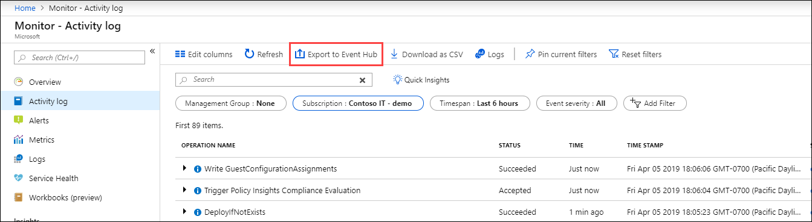

# Export Azure Activity log to storage or Azure Event Hubs
The [Azure Activity Log](activity-logs-overview.md) provides insight into subscription-level events that have occurred in your Azure subscription. In addition to viewing the Activity log in the Azure portal or copying it to a Log Analytics workspace where it can be analyzed with other data collected by Azure Monitor, you can create a log profile to archive the Activity log to an Azure storage account or stream it to an Event Hub.

## Archive Activity Log
Archiving the Activity Log to a storage account is useful if you would like to retain your log data longer than 90 days (with full control over the retention policy) for audit, static analysis, or backup. If you only need to retain your events for 90 days or less you do not need to set up archival to a storage account, since Activity Log events are retained in the Azure platform for 90 days.

## Stream Activity Log to Event Hub
[Azure Event Hubs](/azure/event-hubs/) is a data streaming platform and event ingestion service that can receive and process millions of events per second. Data sent to an event hub can be transformed and stored by using any real-time analytics provider or batching/storage adapters. Two ways you might use the streaming capability for the Activity Log are:
* **Stream to third-party logging and telemetry systems**: Over time, Azure Event Hubs streaming will become the mechanism to pipe your Activity Log into third-party SIEMs and log analytics solutions.
* **Build a custom telemetry and logging platform**: If you already have a custom-built telemetry platform or are thinking about building one, the highly scalable publish-subscribe nature of Event Hubs enables you to flexibly ingest the activity log. 

## Prerequisites

### Storage account
If you're archiving your Activity Log, you need to [create a storage account](../../storage/common/storage-quickstart-create-account.md) if you don't already have one. You should not use an existing storage account that has other, non-monitoring data stored in it so that you can better control access to monitoring data. If you are also archiving Diagnostic Logs and metrics to a storage account though, you may choose to use that same storage account to keep all monitoring data in a central location.

The storage account does not have to be in the same subscription as the subscription emitting logs as long as the user who configures the setting has appropriate RBAC access to both subscriptions.
> [!NOTE]
>  You cannot currently archive data to a storage account that is behind a secured virtual network.

### Event Hubs
If you're sending your Activity Log to an event hub, then you need to [create an event hub](../../event-hubs/event-hubs-create.md) if you don't already have one. If you previously streamed Activity Log events to this Event Hubs namespace, then that event hub will be reused.

The shared access policy defines the permissions that the streaming mechanism has. Streaming to Event Hubs requires Manage, Send, and Listen permissions. You can create or modify shared access policies for the Event Hubs namespace in the Azure portal under the Configure tab for your Event Hubs namespace.

To update the Activity Log log profile to include streaming, you must have the ListKey permission on that Event Hubs authorization rule. The Event Hubs namespace does not have to be in the same subscription as the subscription that's emitting logs, as long as the user who configures the setting has appropriate RBAC access to both subscriptions and both subscriptions are in the same AAD tenant.

Stream the Activity Log to an Event Hub by [creating a Log Profile](#create-a-log-profile).

## Create a log profile
You define how your Azure Activity log is exported using a **log profile**. Each Azure subscription can only have one log profile. These settings can be configured via the **Export** option in the Activity Log blade in the portal. They can also be configured programmatically [using the Azure Monitor REST API](https://msdn.microsoft.com/library/azure/dn931927.aspx), PowerShell cmdlets, or CLI.

The log profile defines the following.

**Where the Activity Log should be sent.** Currently, the available options are Storage Account or Event Hubs.

**Which event categories  should be sent.** The meaning of *category* in Log Profiles and Activity Log events is different. In the Log Profile, *Category* represents the operation type (Write, Delete, Action). In an Activity Log event, the *category*"* property represents the source or type of event (for example, Administration, ServiceHealth, and Alert).

**Which regions (locations) should be exported.** You should include all locations since many events in the Activity Log are global events.

**How long the Activity Log should be retained in a Storage Account.** A retention of zero days means logs are kept forever. Otherwise, the value can be any number of days between 1 and 2147483647.

If retention policies are set, but storing logs in a storage account is disabled, then retention policies have no effect. Retention policies are applied per-day, so at the end of a day (UTC), logs from the day that is now beyond the retention policy are deleted. For example, if you had a retention policy of one day, at the beginning of the day today the logs from the day before yesterday would be deleted. The delete process begins at midnight UTC, but note that it can take up to 24 hours for the logs to be deleted from your storage account.


> [!WARNING]
> The format of the log data in the storage account changed to JSON Lines on Nov. 1st, 2018. [See this article for a description of the impact and how to update your tooling to handle the new format.](diagnostic-logs-append-blobs.md)
>
>

### Create log profile using the Azure portal

Create or edit a log profile with the **Export to Event Hub** option in the Azure portal.

1. From the **Monitor** menu in the Azure portal, select  **Export to Event Hub**.

    

3. In the blade that appears, specify the following:
   * Regions with the events to export. You should select all regions to ensure that you don't miss key events since the Activity Log is a global (non-regional) log and so most events do not have a region associated with them. 
   * If you want to write to storage account:
       * The Storage Account to which you would like to save events.
       * The number of days you want to retain these events in storage. A setting of 0 days retains the logs forever.
   * If you want to write to event hub:
       * The Service Bus Namespace in which you would like an Event Hub to be created for streaming these events.

     


4. Click **Save** to save these settings. The settings are immediately be applied to your subscription.


### Configure log profile using PowerShell

[!INCLUDE [updated-for-az](../../../includes/updated-for-az.md)]

If a log profile already exists, you first need to remove the existing log profile and then create a new one.

1. Use `Get-AzLogProfile` to identify if a log profile exists.  If a log profile does exist, note the *name* property.

1. Use `Remove-AzLogProfile` to remove the log profile using the value from the *name* property.

    ```powershell
    # For example, if the log profile name is 'default'
    Remove-AzLogProfile -Name "default"
    ```

3. Use `Add-AzLogProfile` to create a new log profile:

    ```powershell
    Add-AzLogProfile -Name my_log_profile -StorageAccountId /subscriptions/s1/resourceGroups/myrg1/providers/Microsoft.Storage/storageAccounts/my_storage -serviceBusRuleId /subscriptions/s1/resourceGroups/Default-ServiceBus-EastUS/providers/Microsoft.ServiceBus/namespaces/mytestSB/authorizationrules/RootManageSharedAccessKey -Location global,westus,eastus -RetentionInDays 90 -Category Write,Delete,Action
    ```

    | Property | Required | Description |
    | --- | --- | --- |
    | Name |Yes |Name of your log profile. |
    | StorageAccountId |No |Resource ID of the Storage Account where the Activity Log should be saved. |
    | serviceBusRuleId |No |Service Bus Rule ID for the Service Bus namespace you would like to have event hubs created in. This is a string with the format: `{service bus resource ID}/authorizationrules/{key name}`. |
    | Location |Yes |Comma-separated list of regions for which you would like to collect Activity Log events. |
    | RetentionInDays |Yes |Number of days for which events should be retained in the storage account, between 1 and 2147483647. A value of zero stores the logs indefinitely. |
    | Category |No |Comma-separated list of event categories that should be collected. Possible values are _Write_, _Delete_, and _Action_. |

### Example script
Following is a sample PowerShell script to create a log profile that writes the Activity Log to both a storage account and event hub.

   ```powershell
   # Settings needed for the new log profile
   $logProfileName = "default"
   $locations = (Get-AzLocation).Location
   $locations += "global"
   $subscriptionId = "<your Azure subscription Id>"
   $resourceGroupName = "<resource group name your event hub belongs to>"
   $eventHubNamespace = "<event hub namespace>"

   # Build the service bus rule Id from the settings above
   $serviceBusRuleId = "/subscriptions/$subscriptionId/resourceGroups/$resourceGroupName/providers/Microsoft.EventHub/namespaces/$eventHubNamespace/authorizationrules/RootManageSharedAccessKey"

   # Build the storage account Id from the settings above
   $storageAccountId = "/subscriptions/$subscriptionId/resourceGroups/$resourceGroupName/providers/Microsoft.Storage/storageAccounts/$storageAccountName"

   Add-AzLogProfile -Name $logProfileName -Location $locations -ServiceBusRuleId $serviceBusRuleId
   ```


### Configure log profile using Azure CLI

If a log profile already exists, you first need to remove the existing log profile and then create a new log profile.

1. Use `az monitor log-profiles list` to identify if a log profile exists.
2. Use `az monitor log-profiles delete --name "<log profile name>` to remove the log profile using the value from the *name* property.
3. Use `az monitor log-profiles create` to create a new log profile:

   ```azurecli-interactive
   az monitor log-profiles create --name "default" --location null --locations "global" "eastus" "westus" --categories "Delete" "Write" "Action"  --enabled false --days 0 --service-bus-rule-id "/subscriptions/<YOUR SUBSCRIPTION ID>/resourceGroups/<RESOURCE GROUP NAME>/providers/Microsoft.EventHub/namespaces/<EVENT HUB NAME SPACE>/authorizationrules/RootManageSharedAccessKey"
   ```

    | Property | Required | Description |
    | --- | --- | --- |
    | name |Yes |Name of your log profile. |
    | storage-account-id |Yes |Resource ID of the Storage Account to which Activity Logs should be saved. |
    | locations |Yes |Space-separated list of regions for which you would like to collect Activity Log events. You can view a list of all regions for your subscription using `az account list-locations --query [].name`. |
    | days |Yes |Number of days for which events should be retained, between 1 and 365. A value of zero will store the logs indefinitely (forever).  If zero, then the enabled parameter should be set to true. |
    |enabled | Yes |True or False.  Used to enable or disable the retention policy.  If True, then the days parameter must be a value greater than 0.
    | categories |Yes |Space-separated list of event categories that should be collected. Possible values are Write, Delete, and Action. |


## Activity log schema
Whether sent to Azure storage or Event Hub, the Activity log data will be written to JSON with the following format.

``` JSON
{
    "records": [
        {
            "time": "2015-01-21T22:14:26.9792776Z",
            "resourceId": "/subscriptions/s1/resourceGroups/MSSupportGroup/providers/microsoft.support/supporttickets/115012112305841",
            "operationName": "microsoft.support/supporttickets/write",
            "category": "Write",
            "resultType": "Success",
            "resultSignature": "Succeeded.Created",
            "durationMs": 2826,
            "callerIpAddress": "111.111.111.11",
            "correlationId": "c776f9f4-36e5-4e0e-809b-c9b3c3fb62a8",
            "identity": {
                "authorization": {
                    "scope": "/subscriptions/s1/resourceGroups/MSSupportGroup/providers/microsoft.support/supporttickets/115012112305841",
                    "action": "microsoft.support/supporttickets/write",
                    "evidence": {
                        "role": "Subscription Admin"
                    }
                },
                "claims": {
                    "aud": "https://management.core.windows.net/",
                    "iss": "https://sts.windows.net/72f988bf-86f1-41af-91ab-2d7cd011db47/",
                    "iat": "1421876371",
                    "nbf": "1421876371",
                    "exp": "1421880271",
                    "ver": "1.0",
                    "http://schemas.microsoft.com/identity/claims/tenantid": "1e8d8218-c5e7-4578-9acc-9abbd5d23315 ",
                    "http://schemas.microsoft.com/claims/authnmethodsreferences": "pwd",
                    "http://schemas.microsoft.com/identity/claims/objectidentifier": "2468adf0-8211-44e3-95xq-85137af64708",
                    "http://schemas.xmlsoap.org/ws/2005/05/identity/claims/upn": "admin@contoso.com",
                    "puid": "20030000801A118C",
                    "http://schemas.xmlsoap.org/ws/2005/05/identity/claims/nameidentifier": "9vckmEGF7zDKk1YzIY8k0t1_EAPaXoeHyPRn6f413zM",
                    "http://schemas.xmlsoap.org/ws/2005/05/identity/claims/givenname": "John",
                    "http://schemas.xmlsoap.org/ws/2005/05/identity/claims/surname": "Smith",
                    "name": "John Smith",
                    "groups": "cacfe77c-e058-4712-83qw-f9b08849fd60,7f71d11d-4c41-4b23-99d2-d32ce7aa621c,31522864-0578-4ea0-9gdc-e66cc564d18c",
                    "http://schemas.xmlsoap.org/ws/2005/05/identity/claims/name": " admin@contoso.com",
                    "appid": "c44b4083-3bq0-49c1-b47d-974e53cbdf3c",
                    "appidacr": "2",
                    "http://schemas.microsoft.com/identity/claims/scope": "user_impersonation",
                    "http://schemas.microsoft.com/claims/authnclassreference": "1"
                }
            },
            "level": "Information",
            "location": "global",
            "properties": {
                "statusCode": "Created",
                "serviceRequestId": "50d5cddb-8ca0-47ad-9b80-6cde2207f97c"
            }
        }
    ]
}
```
The elements in this JSON are described in the following table.

| Element name | Description |
| --- | --- |
| time |Timestamp when the event was generated by the Azure service processing the request corresponding the event. |
| resourceId |Resource ID of the impacted resource. |
| operationName |Name of the operation. |
| category |Category of the action, eg. Write, Read, Action. |
| resultType |The type of the result, eg. Success, Failure, Start |
| resultSignature |Depends on the resource type. |
| durationMs |Duration of the operation in milliseconds |
| callerIpAddress |IP address of the user who has performed the operation, UPN claim, or SPN claim based on availability. |
| correlationId |Usually a GUID in the string format. Events that share a correlationId belong to the same uber action. |
| identity |JSON blob describing the authorization and claims. |
| authorization |Blob of RBAC properties of the event. Usually includes the “action”, “role” and “scope” properties. |
| level |Level of the event. One of the following values: _Critical_, _Error_, _Warning_, _Informational_, and _Verbose_ |
| location |Region in which the location occurred (or global). |
| properties |Set of `<Key, Value>` pairs (i.e. Dictionary) describing the details of the event. |

> [!NOTE]
> The properties and usage of these properties can vary depending on the resource.


## Next steps

* [Learn more about the Activity Log](../../azure-resource-manager/resource-group-audit.md)
* [Collect Activity Log into Azure Monitor Logs](activity-log-collect.md)
