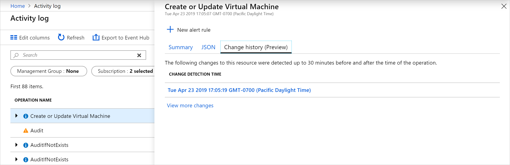

# View and retrieve Azure Activity log events

The [Azure Activity Log](platform-logs-overview.md) provides insight into subscription-level events that have occurred in Azure. This article provides details on different methods for viewing and retrieving Activity Log events.

## Azure portal
View the Activity Log for all resources from the **Monitor** menu in the Azure portal. View the Activity Log for a particular resource from the **Activity Log** option in that resource's menu.


You can filter Activity Log events by the following fields:

* **Timespan**: The start and end time for events.
* **Category**: The event category as described in [Categories in the Activity Log](activity-log-view.md#categories-in-the-activity-log).
* **Subscription**: One or more Azure subscription names.
* **Resource group**: One or more resource groups within the selected subscriptions.
* **Resource (name)**: - The name of a specific resource.
* **Resource type**: The type of resource, for example _Microsoft.Compute/virtualmachines_.
* **Operation name** - The name of an Azure Resource Manager operation, for example _Microsoft.SQL/servers/Write_.
* **Severity**: The severity level of the event. Available values are _Informational_, _Warning_, _Error_, _Critical_.
* **Event initiated by**: The user who performed the operation.
* **Open search**: Open text search box that searches for that string across all fields in all events.

## Categories in the Activity log
Each event in the Activity Log has a particular category that are described in the following table. For full details on the schemata of these categories, see [Azure Activity Log event schema](activity-log-schema.md). 

| Category | Description |
|:---|:---|
| Administrative | Contains the record of all create, update, delete, and action operations performed through Resource Manager. Examples of Administrative events include _create virtual machine_ and _delete network security group_.<br><br>Every action taken by a user or application using Resource Manager is modeled as an operation on a particular resource type. If the operation type is _Write_, _Delete_, or _Action_, the records of both the start and success or fail of that operation are recorded in the Administrative category. Administrative events also include any changes to role-based access control in a subscription. |
| Service Health | Contains the record of any service health incidents that have occurred in Azure. An example of a Service Health event _SQL Azure in East US is experiencing downtime_. <br><br>Service Health events come in Six varieties: _Action Required_, _Assisted Recovery_, _Incident_, _Maintenance_, _Information_, or _Security_. These events are only created if you have a resource in the subscription that would be impacted by the event.
| Resource Health | Contains the record of any resource health events that have occurred to your Azure resources. An example of a Resource Health event is _Virtual Machine health status changed to unavailable_.<br><br>Resource Health events can represent one of four health statuses: _Available_, _Unavailable_, _Degraded_, and _Unknown_. Additionally, Resource Health events can be categorized as being _Platform Initiated_ or _User Initiated_. |
| Alert | Contains the record of activations for Azure alerts. An example of an Alert event is _CPU % on myVM has been over 80 for the past 5 minutes_.|
| Autoscale | Contains the record of any events related to the operation of the autoscale engine based on any autoscale settings you have defined in your subscription. An example of an Autoscale event is _Autoscale scale up action failed_. |
| Recommendation | Contains recommendation events from Azure Advisor. |
| Security | Contains the record of any alerts generated by Azure Security Center. An example of a Security event is _Suspicious double extension file executed_. |
| Policy | Contains records of all effect action operations performed by Azure Policy. Examples of Policy events include _Audit_ and _Deny_. Every action taken by Policy is modeled as an operation on a resource. |

## View change history

When reviewing the Activity Log, it can help to see what changes happened during that event time. You can view this information with **Change history**. Select an event from the Activity Log you want to look deeper into. Select the **Change history (Preview)** tab to view any associated changes with that event.



If there are any associated changes with the event, you'll see a list of changes that you can select. This opens up the **Change history (Preview)** page. On this page you see the changes to the resource. As you can see from the following example, we are able to see not only that the VM changed sizes, but what the previous VM size was before the change and what it was changed to.


To learn more about Change history, see [Get resource changes](../../governance/resource-graph/how-to/get-resource-changes.md).


## PowerShell
Use the [Get-AzLog](https://docs.microsoft.com/powershell/module/az.monitor/get-azlog) cmdlet to retrieve the Activity Log from PowerShell. Following are some common examples.

> [!NOTE]
> `Get-AzLog` only provides 15 days of history. Use the **-MaxRecord** parameter to query the last N events beyond 15 days. To access events older than 15 days, use the REST API or SDK. If you do not include **StartTime**, then the default value is **EndTime** minus one hour. If you do not include **EndTime**, then the default value is current time. All times are in UTC.


Get log entries created after a particular date time:

```powershell
Get-AzLog -StartTime 2016-03-01T10:30
```

Get log entries between a date time range:

```powershell
Get-AzLog -StartTime 2015-01-01T10:30 -EndTime 2015-01-01T11:30
```

Get log entries from a specific resource group:

```powershell
Get-AzLog -ResourceGroup 'myrg1'
```

Get log entries from a specific resource provider between a date time range:

```powershell
Get-AzLog -ResourceProvider 'Microsoft.Web' -StartTime 2015-01-01T10:30 -EndTime 2015-01-01T11:30
```

Get log entries with a specific caller:

```powershell
Get-AzLog -Caller 'myname@company.com'
```

Get the last 1000 events:

```powershell
Get-AzLog -MaxRecord 1000
```


## CLI
Use [az monitor activity-log](../samples/cli-samples.md#view-activity-log-for-a-subscription) to retrieve the Activity Log from CLI. Following are some common examples.


View all available options.

```azurecli
az monitor activity-log list -h
```

Get log entries from a specific resource group:

```azurecli
az monitor activity-log list --resource-group <group name>
```

Get log entries with a specific caller:

```azurecli
az monitor activity-log list --caller myname@company.com
```

Get logs by caller on a resource type, within a date range:

```azurecli
az monitor activity-log list --resource-provider Microsoft.Web \
    --caller myname@company.com \
    --start-time 2016-03-08T00:00:00Z \
    --end-time 2016-03-16T00:00:00Z
```

## REST API
Use the [Azure Monitor REST API](https://docs.microsoft.com/rest/api/monitor/) to retrieve the Activity Log from a REST client. Following are some common examples.

Get Activity Logs with filter:

``` HTTP
GET https://management.azure.com/subscriptions/089bd33f-d4ec-47fe-8ba5-0753aa5c5b33/providers/microsoft.insights/eventtypes/management/values?api-version=2015-04-01&$filter=eventTimestamp ge '2018-01-21T20:00:00Z' and eventTimestamp le '2018-01-23T20:00:00Z' and resourceGroupName eq 'MSSupportGroup'
```

Get Activity Logs with filter and select:

```HTTP
GET https://management.azure.com/subscriptions/089bd33f-d4ec-47fe-8ba5-0753aa5c5b33/providers/microsoft.insights/eventtypes/management/values?api-version=2015-04-01&$filter=eventTimestamp ge '2015-01-21T20:00:00Z' and eventTimestamp le '2015-01-23T20:00:00Z' and resourceGroupName eq 'MSSupportGroup'&$select=eventName,id,resourceGroupName,resourceProviderName,operationName,status,eventTimestamp,correlationId,submissionTimestamp,level
```

Get Activity Logs with select:

```HTTP
GET https://management.azure.com/subscriptions/089bd33f-d4ec-47fe-8ba5-0753aa5c5b33/providers/microsoft.insights/eventtypes/management/values?api-version=2015-04-01&$select=eventName,id,resourceGroupName,resourceProviderName,operationName,status,eventTimestamp,correlationId,submissionTimestamp,level
```

Get Activity Logs without filter or select:

```HTTP
GET https://management.azure.com/subscriptions/089bd33f-d4ec-47fe-8ba5-0753aa5c5b33/providers/microsoft.insights/eventtypes/management/values?api-version=2015-04-01
```


## Next steps

* [Read an overview of platform logs](platform-logs-overview.md)
* [Create diagnostic setting to send Activity logs to other destinations](diagnostic-settings.md)
