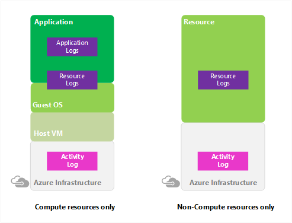
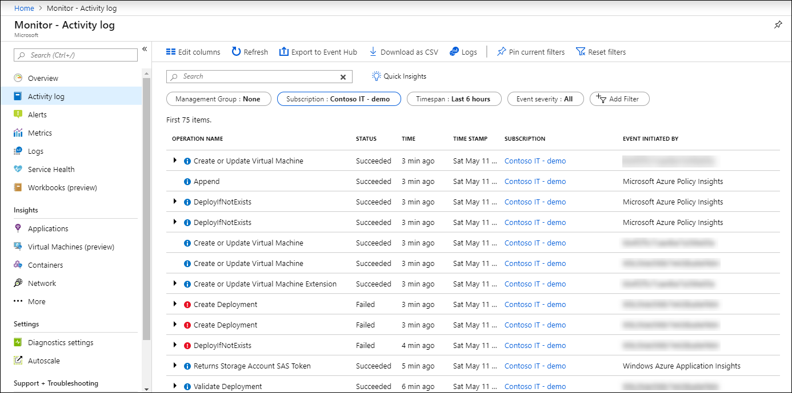
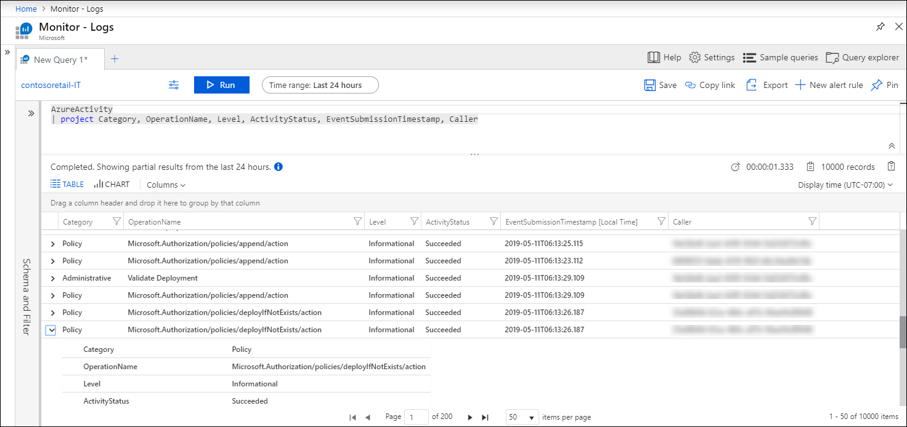

# Overview of Azure Activity log

The **Azure Activity Log** provides insight into subscription-level events that have occurred in Azure. This includes a range of data, from Azure Resource Manager operational data to updates on Service Health events. The Activity Log was previously known as _Audit Logs_ or _Operational Logs_, since the Administrative category reports control-plane events for your subscriptions. 

Use the Activity Log, to determine the _what_, _who_, and _when_ for any write operations (PUT, POST, DELETE) taken on the resources in your subscription. You can also understand the status of the operation and other relevant properties. 

The Activity Log does not include read (GET) operations or operations for resources that use the Classic/RDFE model.

## Comparison to Diagnostic Logs
There is a single Activity Log for each Azure subscription. It provides data about the operations on a resource from the outside (the "control plane"). [Diagnostic Logs](diagnostic-logs-overview.md) are emitted by a resource and provide information about the operation of that resource (the "data plane"). You must enable diagnostic settings for each resource.

> [!NOTE]
> The Azure Activity Log is primarily for activities that occur in Azure Resource Manager. It does not track resources using the Classic/RDFE model. Some Classic resource types have a proxy resource provider in Azure Resource Manager (for example, Microsoft.ClassicCompute). If you interact with a Classic resource type through Azure Resource Manager using these proxy resource providers, the operations appear in the Activity Log. If you interact with a Classic resource type outside of the Azure Resource Manager proxies, your actions are only recorded in the Operation Log. The Operation Log can be browsed in a separate section of the portal.

## Activity Log retention
Once created, Activity Log entries are not modified or deleted by the system. Also, you can't change them in the interface or programmatically. Activity Log events are stored for 90 days. To store this data for longer periods, [collect it in Azure Monitor](activity-log-collect.md) or [export it to storage or Event Hubs](activity-log-export.md).

## View the Activity Log
View the Activity Log for all resources from the **Monitor** menu in the Azure portal. View the Activity Log for a particular resource from the **Activity Log** option in that resource's menu. You can also retrieve Activity Log records with PowerShell, CLI, or REST API.  See [View and retrieve Azure Activity log events](activity-log-view.md).

## Collect Activity Log in Azure Monitor
Collect the Activity Log into a Log Analytics workspace in Azure Monitor to analyze it with other monitoring data and to retain the data for longer than 90 days. See [Collect and analyze Azure activity logs in Log Analytics workspace in Azure Monitor](activity-log-collect.md).

## Export Activity Log
Export the Activity Log to Azure Storage for archiving or stream it to an Event Hub for ingestion by a third-party service or custom analytics solution. See [Export the Azure Activity Log](activity-log-export.md). You can also analyze Activity Log events in Power BI using the [**Power BI content pack**](https://powerbi.microsoft.com/documentation/powerbi-content-pack-azure-audit-logs/).

## Alert on Activity Log
You can create an alert when particular events are created in the Activity Log with an [Activity Log alert](activity-log-alerts.md). You can also create an alert using a [log query](alerts-log-query.md) when your Activity Log is connected to a Log Analytics workspace, but there is a cost to log query alerts. There is no cost for Activity Log alerts.

## Categories in the Activity Log
Each event in the Activity Log has a particular category that are described in the following table. For full details on the schemata of these categories, see [Azure Activity Log event schema](activity-log-schema.md). 

| Category | Description |
|:---|:---|
| Administrative | Contains the record of all create, update, delete, and action operations performed through Resource Manager. Examples of Administrative events include _create virtual machine_ and _delete network security group_.  Every action taken by a user or application using Resource Manager is modeled as an operation on a particular resource type. If the operation type is _Write_, _Delete_, or _Action_, the records of both the start and success or fail of that operation are recorded in the Administrative category. Administrative events also include any changes to role-based access control in a subscription. |
| Service Health | Contains the record of any service health incidents that have occurred in Azure. An example of a Service Health event _SQL Azure in East US is experiencing downtime_.   Service Health events come in five varieties: _Action Required_, _Assisted Recovery_, _Incident_, _Maintenance_, _Information_, or _Security_. These events are only created if you have a resource in the subscription that would be impacted by the event.
| Resource Health | Contains the record of any resource health events that have occurred to your Azure resources. An example of a Resource Health event is _Virtual Machine health status changed to unavailable_.  Resource Health events can represent one of four health statuses: _Available_, _Unavailable_, _Degraded_, and _Unknown_. Additionally, Resource Health events can be categorized as being _Platform Initiated_ or _User Initiated_. |
| Alert | Contains the record of activations for Azure alerts. An example of an Alert event is _CPU % on myVM has been over 80 for the past 5 minutes_.|
| Autoscale | Contains the record of any events related to the operation of the autoscale engine based on any autoscale settings you have defined in your subscription. An example of an Autoscale event is _Autoscale scale up action failed_. |
| Recommendation | Contains recommendation events from Azure Advisor. |
| Security | Contains the record of any alerts generated by Azure Security Center. An example of a Security event is _Suspicious double extension file executed_. |
| Policy | Contains records of all effect action operations performed by Azure Policy. Examples of Policy events include _Audit_ and _Deny_. Every action taken by Policy is modeled as an operation on a resource. |

## Next Steps

* [Create a log profile to export the Azure Activity Log](activity-log-export.md)
* [Stream the Azure Activity Log to Event Hubs](activity-logs-stream-event-hubs.md)
* [Archive the Azure Activity Log to storage](archive-activity-log.md)

