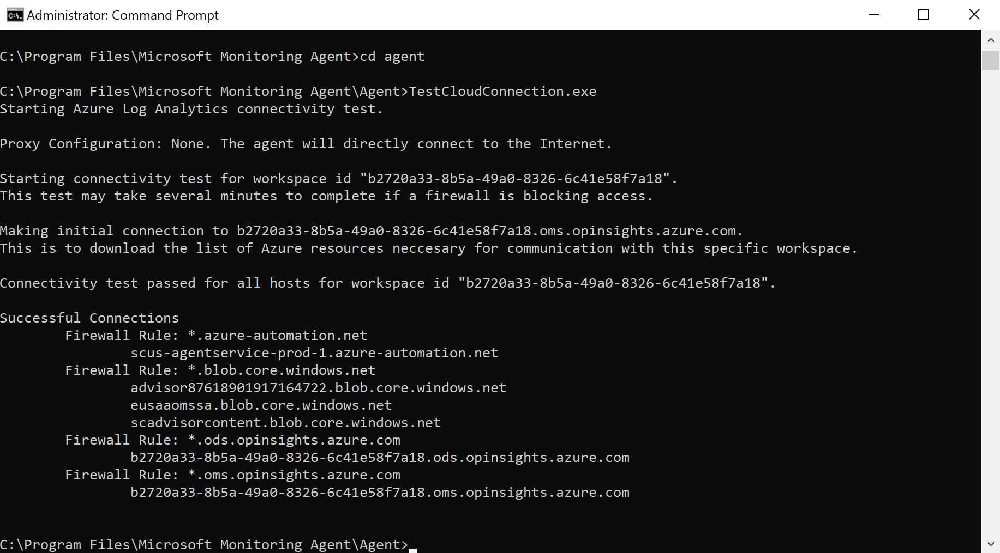
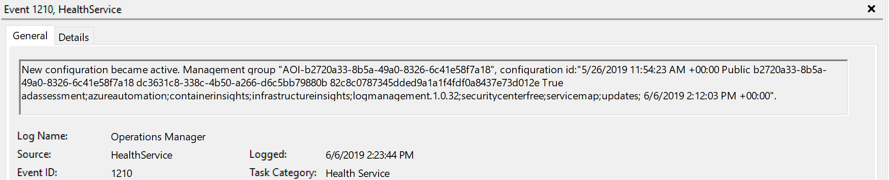

# How to troubleshoot issues with the Log Analytics agent for Windows 

This article provides help troubleshooting errors you might experience with the Log Analytics agent for Windows in Azure Monitor and suggests possible solutions to resolve them.

If none of these steps work for you, the following support channels are also available:

* Customers with Premier support benefits can open a support request with [Premier](https://premier.microsoft.com/).
* Customers with Azure support agreements can open a support request [in the Azure portal](https://manage.windowsazure.com/?getsupport=true).
* Visit the Log Analytics Feedback page to review submitted ideas and bugs [https://aka.ms/opinsightsfeedback](https://aka.ms/opinsightsfeedback) or file a new one. 

## Important troubleshooting sources

 To assist with troubleshooting issues related to Log Analytics agent for Windows, the agent logs events to the Windows Event Log, specifically under *Application and Services\Operations Manager*.  

## Connectivity issues

If the agent is communicating through a proxy server or firewall, there may be restrictions in place preventing communication from the source computer and the Azure Monitor service. If communication is blocked, misconfiguration, registration with a workspace may fail while attempting to install the agent, configure the agent post-setup to report to an additional workspace, or agent communication fails after successful registration. This section describes the methods to troubleshoot this type of issue with the Windows agent. 

Double check that the firewall or proxy is configured to allow the following ports and URLs described in the following table. Also confirm HTTP inspection is not enabled for web traffic, as it can prevent a secure TLS channel between the agent and Azure Monitor.  

|Agent Resource|Ports |Direction |Bypass HTTPS inspection|
|------|---------|--------|--------|   
|*.ods.opinsights.azure.com |Port 443 |Outbound|Yes |  
|*.oms.opinsights.azure.com |Port 443 |Outbound|Yes |  
|*.blob.core.windows.net |Port 443 |Outbound|Yes |  
|*.azure-automation.net |Port 443 |Outbound|Yes |  

For firewall information required for Azure Government, see [Azure Government management](../../azure-government/documentation-government-services-monitoringandmanagement.md#azure-monitor-logs). 

There are several ways you can verify if the agent is successfully communicating with Azure Monitor.

- Enable the [Azure Log Analytics Agent Health assessment](../insights/solution-agenthealth.md) in the workspace. From the Agent Health dashboard, view the **Count of unresponsive agents** column to quickly see if the agent is listed.  

- Run the following query to confirm the agent is sending a heartbeat to the workspace it is configured to report to. Replace <ComputerName> with the actual name of the machine.

    ```
    Heartbeat 
    | where Computer like "<ComputerName>"
    | summarize arg_max(TimeGenerated, * ) by Computer 
    ```

    If the computer is successfully communicating with the service, the query should return a result. If the query did not return a result, first verify the agent is configured to report to the correct workspace. If it is configured correctly, proceed to step 3 and search the Windows Event Log to identify if the agent is logging what issue might be preventing it from communicating with Azure Monitor.

- Another method to identify a connectivity issue is by running the **TestCloudConnectivity** tool. The tool is installed by default with the agent in the folder *%SystemRoot%\Program Files\Microsoft Monitoring Agent\Agent*. From an elevated command prompt, navigate to the folder and run the tool. The tool returns the results and highlights where the test failed (for example, if it was related to a particular port/URL that was blocked). 

    

- Filter the *Operations Manager* event log by **Event sources** - *Health Service Modules*, *HealthService*, and *Service Connector* and filter by **Event Level** *Warning* and *Error* to confirm if it has written events from the following table. If they are, review the resolution steps included for each possible event.

    |Event ID |Source |Description |Resolution |
    |---------|-------|------------|-----------|
    |2133 & 2129 |Health Service |Connection to the service from the agent failed |This error can occur when the agent cannot communicate directly or through a firewall/proxy server to the Azure Monitor service. Verify agent proxy settings or that the network firewall/proxy allows TCP traffic from the computer to the service.|
    |2138 |Health Service Modules |Proxy requires authentication |Configure the agent proxy settings and specify the username/password required to authenticate with the proxy server. |
    |2129 |Health Service Modules |Failed connection/Failed SSL negotiation |Check your network adapter TCP/IP settings and agent proxy settings.|
    |2127 |Health Service Modules |Failure sending data received error code |If it only happens periodically during the day, it could just be a random anomaly that can be ignored. Monitor to understand how often it happens. If it happens often throughout the day, first check your network configuration and proxy settings. If the description includes HTTP error code 404 and it's the first time that the agent tries to send data to the service, it will include a 500 error with an inner 404 error code. 404 means not found, which indicates that the storage area for the new workspace is still being provisioned. On next retry, data will successfully write to the workspace as expected. An HTTP error 403 might indicate a permission or credentials issue. There is more information included with the 403 error to help troubleshoot the issue.|
    |4000 |Service Connector |DNS name resolution failed |The machine could not resolve the Internet address used when sending data to the service. This might be DNS resolver settings on your machine, incorrect proxy settings, or maybe a temporary DNS issue with your provider. If it happens periodically, it could be caused by a transient network-related issue.|
    |4001 |Service Connector |Connection to the service failed. |This error can occur when the agent cannot communicate directly or through a firewall/proxy server to the Azure Monitor service. Verify agent proxy settings or that the network firewall/proxy allows TCP traffic from the computer to the service.|
    |4002 |Service Connector |The service returned HTTP status code 403 in response to a query. Check with the service administrator for the health of the service. The query will be retried later. |This error is written during the agent’s initial registration phase and you’ll see a URL similar to the following: *https://<workspaceID>.oms.opinsights.azure.com/AgentService.svc/AgentTopologyRequest*. An error code 403 means forbidden and can be caused by a mistyped Workspace ID or key, or the data and time is incorrect on the computer. If the time is +/- 15 minutes from current time, then onboarding fails. To correct this, update the date and/or timezone of your Windows computer.|

## Data collection issues

After the agent is installed and reports to its configured workspace or workspaces, it may stop receiving configuration, collecting or forwarding performance, logs, or other data to the service depending on what is enabled and targeting the computer. It is necessary to determine if:

- Is it a particular data type or all data that is not available in the workspace?
- Is the data type specified by a solution or specified as part of the workspace data collection configuration?
- How many computers are affected? Is it a single or multiple computers reporting to the workspace?
- Was it working and did it stop at a particular time of day, or has it never been collected? 
- Is the log search query you are using syntactically correct? 
- Has the agent ever received its configuration from Azure Monitor?

The first step in troubleshooting is to determine if the computer is sending a heartbeat event.

```
Heartbeat 
    | where Computer like "<ComputerName>"
    | summarize arg_max(TimeGenerated, * ) by Computer
```

If the query returns results, then you need to determine if a particular data type is not collected and forwarded to the service. This could be caused by the agent not receiving updated configuration from the service, or some other symptom preventing the agent from operating normally. Perform the following steps to further troubleshoot.

1. Open an elevated command prompt on the computer and restart the agent service by typing `net stop healthservice && net start healthservice`.
2. Open the *Operations Manager* event log and search for **event IDs** *7023, 7024, 7025, 7028* and *1210* from **Event source** *HealthService*.  These events indicate the agent is successfully receiving configuration from Azure Monitor and they are actively monitoring the computer. The event description for event ID 1210 will also specify on the last line all of the solutions and Insights that are included in the scope of monitoring on the agent.  

    

3. If after several minutes you do not see the expected data in the query results or visualization, depending on if you are viewing the data from a solution or Insight, from the *Operations Manager* event log, search for **Event sources** *HealthService* and *Health Service Modules* and filter by **Event Level** *Warning* and *Error* to confirm if it has written events from the following table.

    |Event ID |Source |Description |Resolution |
    |---------|-------|------------|
    |8000 |HealthService |This event will specify if a workflow related to  performance, event, or other data type collected is unable to forward to the service for ingestion to the workspace. | Event ID 2136 from source HealthService is written together with this event and can indicate the agent is unable to communicate with the service, possibly due to misconfiguration of the proxy and authentication settings, network outage, or the network firewall/proxy does not allow TCP traffic from the computer to the service.| 
    |10102 and 10103 |Health Service Modules |Workflow could not resolve data source. |This can occur if the specified performance counter or instance does not exist on the computer or is incorrectly defined in the workspace data settings. If this is a user-specified [performance counter](data-sources-performance-counters.md#configuring-performance-counters), verify the information specified is following the correct format and exists on the target computers. |
    |26002 |Health Service Modules |Workflow could not resolve data source. |This can occur if the specified Windows event log does not exist on the computer. This error can be safely ignored if the computer is not expected to have this event log registered, otherwise if this is a user-specified [event log](data-sources-windows-events.md#configuring-windows-event-logs), verify the information specified is correct. |

