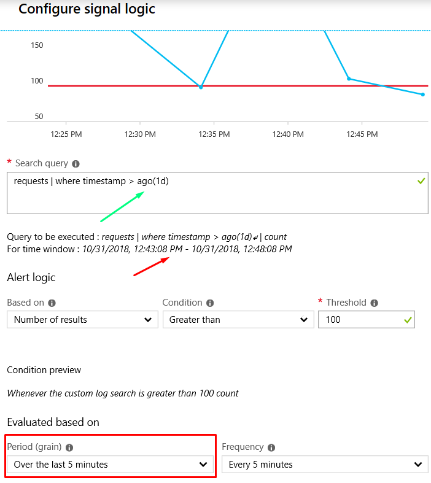
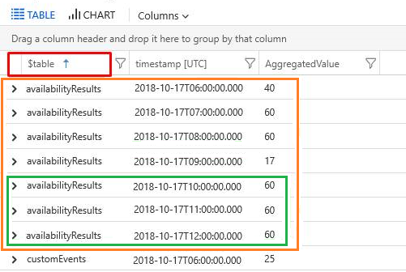
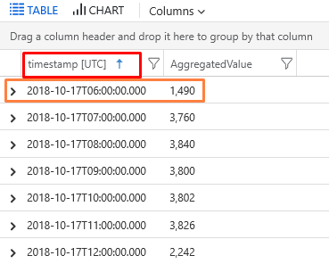
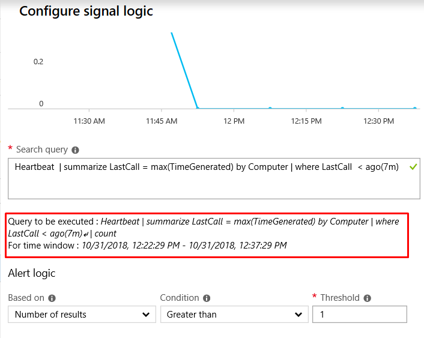

# Troubleshoot log alerts in Azure Monitor  

This article shows you how to resolve common issues that might happen when you're setting up log alerts in Azure Monitor. It also provides solutions to common problems with functionality or configuration of log alerts.

The term *log alerts* describe rules that fire based on a log query in an [Azure Log Analytics workspace](../learn/tutorial-viewdata.md) or in [Azure Application Insights](../../azure-monitor/app/analytics.md). Learn more about functionality, terminology, and types in [Log alerts in Azure Monitor](../platform/alerts-unified-log.md).

> [!NOTE]
> This article doesn't consider cases where the Azure portal shows an alert rule triggered and a notification is not performed by an associated action group. For such cases, see the details in [Create and manage action groups in the Azure portal](../platform/action-groups.md).

## Log alert didn't fire

Here are some common reasons why the state for a configured [log alert rule in Azure Monitor](../platform/alerts-log.md) doesn't show [as *fired* when expected](../platform/alerts-managing-alert-states.md).

### Data ingestion time for logs

A log alert periodically runs your query based on [Log Analytics](../learn/tutorial-viewdata.md) or [Application Insights](../../azure-monitor/app/analytics.md). Because Azure Monitor processes many terabytes of data from thousands of customers from varied sources across the world, the service is susceptible to varying time delays. For more information, see [Data ingestion time in Azure Monitor logs](../platform/data-ingestion-time.md).

To mitigate delays, the system waits and retries the alert query multiple times if it finds the needed data is not yet ingested. The system has an exponentially increasing wait time set. The log alert is triggered only after the data is available, so the delay might be due to slow ingestion of log data.

### Incorrect time period configured

As described in the article on [terminology for log alerts](../platform/alerts-unified-log.md#log-search-alert-rule---definition-and-types), the time period stated in the configuration specifies the time range for the query. The query returns only records that were created within this range.

The time period restricts the data fetched for a log query to prevent abuse, and it circumvents any time command (like **ago**) used in a log query. For example, If the time period is set to 60 minutes, and the query is run at 1:15 PM, only records created between 12:15 PM and 1:15 PM are used for the log query. If the log query uses a time command like **ago (1d)**, the query still only uses data between 12:15 PM and 1:15 PM because the time period is set to that interval.

Check that the time period in the configuration matches your query. For the example shown earlier, if the log query uses **ago (1d)** with the green marker, the time period should be set to 24 hours or 1,440 minutes (indicated in red). This setting ensures that the query runs as intended.



### Suppress Alerts option is set

As described in step 8 of the article on [creating a log alert rule in the Azure portal](../platform/alerts-log.md#managing-log-alerts-from-the-azure-portal), log alerts provide a **Suppress Alerts** option to suppress triggering and notification actions for a configured amount of time. As a result, you might think that an alert didn't fire. In fact, it did fire but was suppressed.  


### Metric measurement alert rule is incorrect

*Metric measurement log alerts* are a subtype of log alerts that have special capabilities and a restricted alert query syntax. A rule for a metric measurement log alert requires the query output to be a metric time series. That is, the output is a table with distinct, equally sized time periods along with corresponding aggregated values.

You can choose to have additional variables in the table alongside **AggregatedValue**. These variables can be used to sort the table.

For example, suppose a rule for a metric measurement log alert was configured as:

- Query of `search *| summarize AggregatedValue = count() by $table, bin(timestamp, 1h)`  
- Time period of 6 hours
- Threshold of 50
- Alert logic of three consecutive breaches
- **Aggregate Upon** chosen as **$table**

Because the command includes **summarize ... by** and provides two variables (**timestamp** and **$table**), the system chooses **$table** for **Aggregate Upon**. The system sorts the result table by the **$table** field, as shown in the following screenshot. Then it looks at the multiple **AggregatedValue** instances for each table type (like **availabilityResults**) to see if there were three or more consecutive breaches.



Because **Aggregate Upon** is defined on **$table**, the data is sorted on a **$table** column (indicated in red). Then we group and look for types of the **Aggregate Upon** field.

For example, for **$table**, values for **availabilityResults** will be considered as one plot/entity (indicated in orange). In this value plot/entity, the alert service checks for three consecutive breaches (indicated in green). The breaches trigger an alert for the table value **availabilityResults**.

Similarly, if three consecutive breaches happen for any other value of **$table**, another alert notification is triggered for the same thing. The alert service automatically sorts the values in one plot/entity (indicated in orange) by time.

Now suppose that the rule for the metric measurement log alert was modified and the query was `search *| summarize AggregatedValue = count() by bin(timestamp, 1h)`. The rest of the configuration remained the same as before, including the alert logic for three consecutive breaches. The **Aggregate Upon** option in this case is **timestamp** by default. Only one value is provided in the query for
**summarize ... by** (that is, **timestamp**). Like the earlier example, the output at end of execution would be as illustrated as follows.

   

Because **Aggregate Upon** is defined on **timestamp**, the data is sorted on the **timestamp** column (indicated in red). Then we group by **timestamp**. For example, values for `2018-10-17T06:00:00Z` will be considered as one plot/entity (indicated in orange). In this value plot/entity, the alert service will find no consecutive breaches (because each **timestamp** value has only one entry). So the alert is never triggered. In such a case, the user must either:

- Add a dummy variable or an existing variable (like **$table**) to correctly sort by using the **Aggregate Upon** field.
- Reconfigure the alert rule to use alert logic based on **total breach** instead.

## Log alert fired unnecessarily

A configured [log alert rule in Azure Monitor](../platform/alerts-log.md) might be triggered unexpectedly when you view it in [Azure Alerts](../platform/alerts-managing-alert-states.md). The following sections describe some common reasons.

### Alert triggered by partial data

Log Analytics and Application Insights are subject to ingestion delays and processing. When you run a log alert query, you might find that no data is available or only some data is available. For more information, see [Log data ingestion time in Azure Monitor](../platform/data-ingestion-time.md).

Depending on how you configured the alert rule, misfiring might happen if there's no data or partial data in logs at the time of alert execution. In such cases, we advise you to change the alert query or configuration.

For example, if you configure the log alert rule to be triggered when the number of results from an analytics query is less than 5, the alert is triggered when there's no data (zero record) or partial results (one record). But after the data ingestion delay, the same query with full data might provide a result of 10 records.

### Alert query output is misunderstood

You provide the logic for log alerts in an analytics query. The analytics query can use various big data and mathematical functions. The alert service runs your query at intervals specified with data for a specified time period. The alert service makes subtle changes to the query based on the alert type. You can view this change in the **Query to be executed** section on the **Configure signal logic** screen:



The **Query to be executed** box is what the log alert service runs. If you want to understand what the alert query output might be before you create the alert, you can run the stated query and the timespan via the [Analytics portal](../log-query/portals.md) or the [Analytics API](https://docs.microsoft.com/rest/api/loganalytics/).

## Log alert was disabled

The following sections list some reasons why Azure Monitor might disable the [log alert rule](../platform/alerts-log.md).

### Resource where the alert was created no longer exists

Log alert rules created in Azure Monitor target a specific resource like an Azure Log Analytics workspace, an Azure Application Insights app, and an Azure resource. The log alert service will then run an analytics query provided in the rule for the specified target. But after rule creation, users often go on to delete from Azure--or move inside Azure--the target of the log alert rule. Because the target of the alert rule is no longer valid, execution of the rule fails.

In such cases, Azure Monitor disables the log alert and ensures that you're not billed unnecessarily when the rule can't run continually for sizable period (like a week). You can find out the exact time when Azure Monitor disabled the log alert via [Azure Activity Log](../../azure-resource-manager/management/view-activity-logs.md). In Azure Activity Log, an event is added when Azure Monitor disables the log alert rule.

The following sample event in Azure Activity Log is for an alert rule that has been disabled because of a continual failure.

```json
{
    "caller": "Microsoft.Insights/ScheduledQueryRules",
    "channels": "Operation",
    "claims": {
        "http://schemas.xmlsoap.org/ws/2005/05/identity/claims/spn": "Microsoft.Insights/ScheduledQueryRules"
    },
    "correlationId": "abcdefg-4d12-1234-4256-21233554aff",
    "description": "Alert: test-bad-alerts is disabled by the System due to : Alert has been failing consistently with the same exception for the past week",
    "eventDataId": "f123e07-bf45-1234-4565-123a123455b",
    "eventName": {
        "value": "",
        "localizedValue": ""
    },
    "category": {
        "value": "Administrative",
        "localizedValue": "Administrative"
    },
    "eventTimestamp": "2019-03-22T04:18:22.8569543Z",
    "id": "/SUBSCRIPTIONS/<subscriptionId>/RESOURCEGROUPS/<ResourceGroup>/PROVIDERS/MICROSOFT.INSIGHTS/SCHEDULEDQUERYRULES/TEST-BAD-ALERTS",
    "level": "Informational",
    "operationId": "",
    "operationName": {
        "value": "Microsoft.Insights/ScheduledQueryRules/disable/action",
        "localizedValue": "Microsoft.Insights/ScheduledQueryRules/disable/action"
    },
    "resourceGroupName": "<Resource Group>",
    "resourceProviderName": {
        "value": "MICROSOFT.INSIGHTS",
        "localizedValue": "Microsoft Insights"
    },
    "resourceType": {
        "value": "MICROSOFT.INSIGHTS/scheduledqueryrules",
        "localizedValue": "MICROSOFT.INSIGHTS/scheduledqueryrules"
    },
    "resourceId": "/SUBSCRIPTIONS/<subscriptionId>/RESOURCEGROUPS/<ResourceGroup>/PROVIDERS/MICROSOFT.INSIGHTS/SCHEDULEDQUERYRULES/TEST-BAD-ALERTS",
    "status": {
        "value": "Succeeded",
        "localizedValue": "Succeeded"
    },
    "subStatus": {
        "value": "",
        "localizedValue": ""
    },
    "submissionTimestamp": "2019-03-22T04:18:22.8569543Z",
    "subscriptionId": "<SubscriptionId>",
    "properties": {
        "resourceId": "/SUBSCRIPTIONS/<subscriptionId>/RESOURCEGROUPS/<ResourceGroup>/PROVIDERS/MICROSOFT.INSIGHTS/SCHEDULEDQUERYRULES/TEST-BAD-ALERTS",
        "subscriptionId": "<SubscriptionId>",
        "resourceGroup": "<ResourceGroup>",
        "eventDataId": "12e12345-12dd-1234-8e3e-12345b7a1234",
        "eventTimeStamp": "03/22/2019 04:18:22",
        "issueStartTime": "03/22/2019 04:18:22",
        "operationName": "Microsoft.Insights/ScheduledQueryRules/disable/action",
        "status": "Succeeded",
        "reason": "Alert has been failing consistently with the same exception for the past week"
    },
    "relatedEvents": []
}
```

### Query used in a log alert is not valid

Each log alert rule created in Azure Monitor as part of its configuration must specify an analytics query that the alert service will run periodically. The analytics query might have correct syntax at the time of rule creation or update. But sometimes, over a period of time, the query provided in the log alert rule can develop syntax issues and cause the rule execution to fail. Some common reasons why an analytics query provided in a log alert rule can develop errors are:

- The query is written to [run across multiple resources](../log-query/cross-workspace-query.md). And one or more of the specified resources no longer exist.
- [Metric measurement type log alert](../../azure-monitor/platform/alerts-unified-log.md#metric-measurement-alert-rules) configured has an alert query doesn't comply with the syntax norms
- There has been no data flow to the analytics platform. The [query execution gives an error](https://dev.loganalytics.io/documentation/Using-the-API/Errors) because there's no data for the provided query.
- Changes in [query language](https://docs.microsoft.com/azure/kusto/query/) include a revised format for commands and functions. So the query provided earlier in an alert rule is no longer valid.

[Azure Advisor](../../advisor/advisor-overview.md) warns you about this behavior. A recommendation is added for the specific log alert rule on Azure Advisor, under the category of High Availability with medium impact and a description of "Repair your log alert rule to ensure monitoring." If an alert query in the log alert rule isn't rectified after Azure Advisor has provided a recommendation for seven days, Azure Monitor will disable the log alert and ensure that you're not billed unnecessarily when the rule can't run continually for a sizable period (like a week).

You can find the exact time when Azure Monitor disabled the log alert rule by looking for an event in [Azure Activity Log](../../azure-resource-manager/management/view-activity-logs.md).

## Next steps

- Learn about [log alerts in Azure](../platform/alerts-unified-log.md).
- Learn more about [Application Insights](../../azure-monitor/app/analytics.md).
- Learn more about [log queries](../log-query/log-query-overview.md).
