# Action rules (preview)

Action rules help you define or suppress actions at any Azure Resource Manager scope (Azure subscription, resource group, or target resource). They have various filters that help you narrow down the specific subset of alert instances that you want to act on.

## Why and when should you use action rules?

### Suppression of alerts

There are many scenarios where it's useful to suppress the notifications that alerts generate. These scenarios range from suppression during a planned maintenance window to suppression during nonbusiness hours. For example, the team responsible for  **ContosoVM** wants to suppress alert notifications for the upcoming weekend, because **ContosoVM** is undergoing planned maintenance. 

Although the team can disable each alert rule that's configured on **ContosoVM** manually (and enable it again after maintenance), it's not a simple process. Action rules help you define alert suppression at scale with the ability to flexibly configure the period of suppression. In the previous example, the team can define one action rule on **ContosoVM** that suppresses all alert notifications for the weekend.

### Actions at scale

Although alert rules help you define the action group that triggers when the alert is generated, customers often have a common action group across their scope of operations. For example, a team responsible for the resource group **ContosoRG** will probably define the same action group for all alert rules defined within **ContosoRG**. 

Action rules help you simplify this process. By defining actions at scale, an action group can be triggered for any alert that's generated on the configured scope. In the previous example, the team can define one action rule on **ContosoRG** that will trigger the same action group for all alerts generated within it.

> [!NOTE]
> Action rules currently don't apply to Azure Service Health alerts.

## Configuring an action rule

You can access the feature by selecting **Manage actions** from the **Alerts** landing page in Azure Monitor. Then, select **Action rules (preview)**. You can access the rules by selecting **Action rules (preview)** from the dashboard of the landing page for alerts.

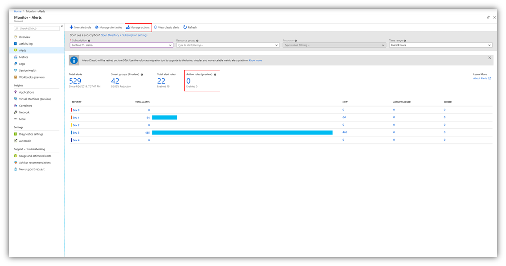

Select **+ New Action Rule**. 

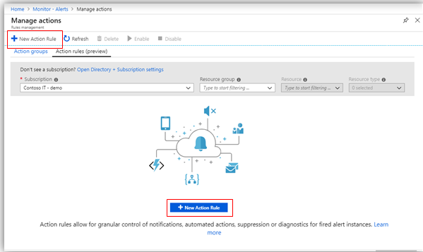

Alternatively, you can create an action rule while you're configuring an alert rule.

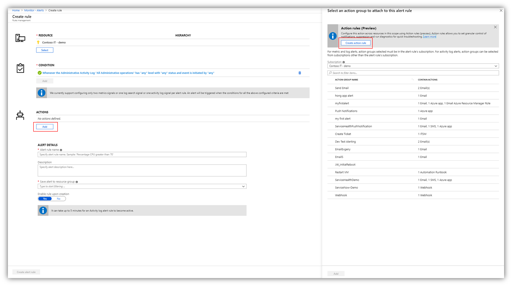

You should now see the flow page for creating action rules. Configure the following elements: 

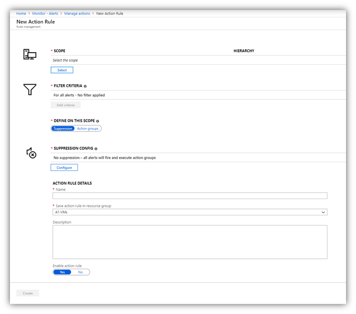

### Scope

First choose the scope (Azure subscription, resource group, or target resource). You can also multiple-select a combination of scopes within a single subscription.

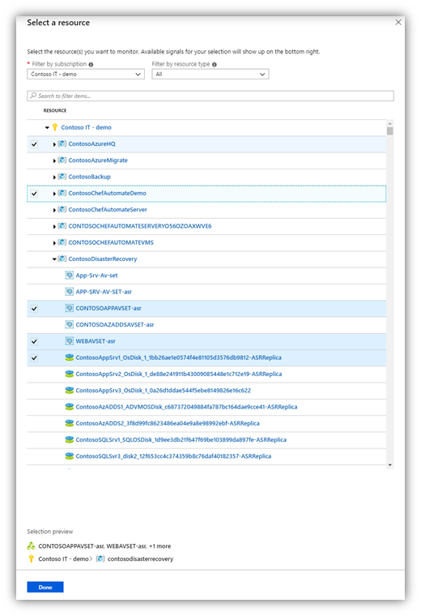

### Filter criteria

You can additionally define filters to narrow them down to a specific subset of the alerts. 

The available filters are: 

* **Severity**: The option to select one or more alert severities. **Severity = Sev1** means that the action rule is applicable for all alerts set to Sev1.
* **Monitor Service**: A filter based on the originating monitoring service. This filter is also multiple-select. For example, **Monitor Service = “Application Insights”** means that the action rule is applicable for all Application Insights-based alerts.
* **Resource Type**:  A filter based on a specific resource type. This filter is also multiple-select. For example, **Resource Type = “Virtual Machines”** means that the action rule is applicable for all virtual machines.
* **Alert Rule ID**: An option to filter for specific alert rules by using the Resource Manager ID of the alert rule.
* **Monitor Condition**:  A filter for alert instances with either **Fired** or **Resolved** as the monitor condition.
* **Description**: A regex (regular expression) match that defines a string match against the description, defined as part of the alert rule. For example, **Description contains 'prod'** will match all alerts that contain the string "prod" in their descriptions.
* **Alert Context (payload)**: A regex match that defines a string match against the alert context fields of an alert's payload. For example, **Alert context (payload) contains 'Computer-01'** will match all alerts whose payloads contain the string "Computer-01."

These filters are applied in conjunction with one another. For example, if you set **Resource type' = Virtual Machines** and **Severity' = Sev0**, then you've filtered for all **Sev0** alerts on only your VMs. 

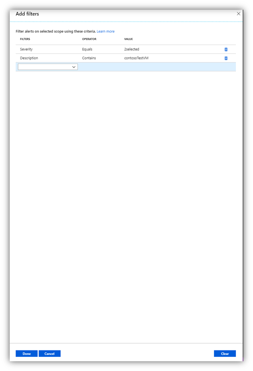

### Suppression or action group configuration

Next, configure the action rule for either alert suppression or action group support. You can't choose both. The configuration acts on all alert instances that match the previously defined scope and filters.

#### Suppression

If you select **suppression**, configure the duration for the suppression of actions and notifications. Choose one of the following options:
* **From now (Always)**: Suppresses all notifications indefinitely.
* **At a scheduled time**: Suppresses notifications within a bounded duration.
* **With a recurrence**: Suppresses notifications on a recurring daily, weekly, or monthly schedule.

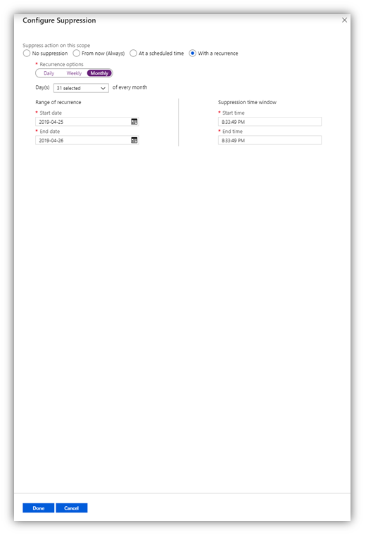

#### Action group

If you select **Action group** in the toggle, either add an existing action group or create a new one. 

> [!NOTE]
> You can associate only one action group with an action rule.

### Action rule details

Last, configure the following details for the action rule:
* Name
* Resource group in which it's saved
* Description 

## Example scenarios

### Scenario 1: Suppression of alerts based on severity

Contoso wants to suppress notifications for all Sev4 alerts on all VMs within the subscription **ContosoSub** every weekend.

**Solution:** Create an action rule with:
* Scope = **ContosoSub**
* Filters
    * Severity = **Sev4**
    * Resource Type = **Virtual Machines**
* Suppression with recurrence set to weekly, and **Saturday** and **Sunday** checked

### Scenario 2: Suppression of alerts based on alert context (payload)

Contoso wants to suppress notifications for all log alerts generated for **Computer-01** in **ContosoSub** indefinitely as it's going through maintenance.

**Solution:** Create an action rule with:
* Scope = **ContosoSub**
* Filters
    * Monitor Service = **Log Analytics**
    * Alert Context (payload) contains **Computer-01**
* Suppression set to **From now (Always)**

### Scenario 3: Action group defined at a resource group

Contoso has defined [a metric alert at a subscription level](https://docs.microsoft.com/azure/azure-monitor/platform/alerts-metric-overview#monitoring-at-scale-using-metric-alerts-in-azure-monitor). But it wants to define the actions that trigger specifically for alerts generated from the resource group **ContosoRG**.

**Solution:** Create an action rule with:
* Scope = **ContosoRG**
* No filters
* Action group set to **ContosoActionGroup**

> [!NOTE]
> *Action groups defined within action rules and alert rules operate independently, with no deduplication.* In the scenario described earlier, if an action group is defined for the alert rule, it triggers in conjunction with the action group defined in the action rule. 

## Managing your action rules

You can view and manage your action rules from the list view:

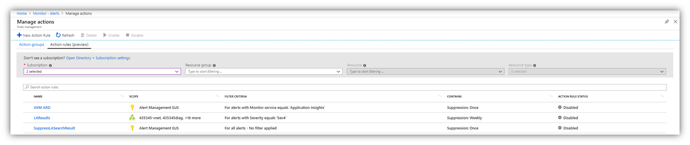

From here, you can enable, disable, or delete action rules at scale by selecting the check box next to them. When you select an action rule, its configuration page opens. The page helps you update the action rule's definition and enable or disable it.

## Best practices

Log alerts that you create with the [number of results](alerts-unified-log.md) option generate a single alert instance by using the whole search result (which might span across multiple computers). In this scenario, if an action rule uses the **Alert Context (payload)** filter, it acts on the alert instance as long as there's a match. In Scenario 2, described previously, if the search results for the generated log alert contain both **Computer-01** and **Computer-02**, the entire notification is suppressed. There's no notification generated for **Computer-02** at all.

To best use log alerts with action rules, create log alerts with the [metric measurement](alerts-unified-log.md) option. Separate alert instances are generated by this option, based on its defined group field. Then, in Scenario 2, separate alert instances are generated for **Computer-01** and **Computer-02**. Due to the action rule described in the scenario, only the notification for **Computer-01** is suppressed. The notification for **Computer-02** continues to fire as normal.

## FAQ

### While I'm configuring an action rule, I'd like to see all the possible overlapping action rules, so that I avoid duplicate notifications. Is it possible to do that?

After you define a scope as you configure an action rule, you can see a list of action rules that overlap on the same scope (if any). This overlap can be one of the following options:

* An exact match: For example, the action rule you're defining and the overlapping action rule are on the same subscription.
* A subset: For example, the action rule you're defining is on a subscription, and the overlapping action rule is on a resource group within the subscription.
* A superset: For example, the action rule you're defining is on a resource group, and the overlapping action rule is on the subscription that contains the resource group.
* An intersection: For example, the action rule you're defining is on **VM1** and **VM2**, and the overlapping action rule is on **VM2** and **VM3**.

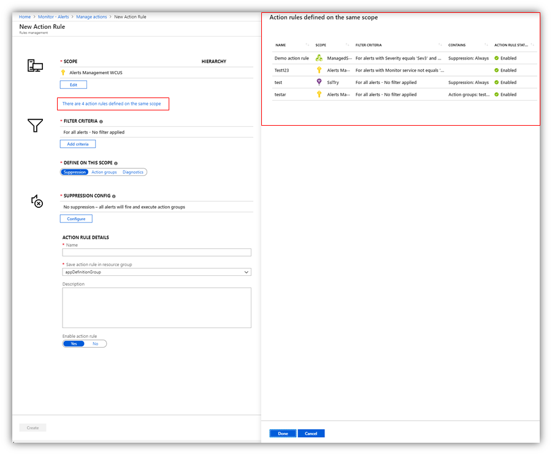

### While I'm configuring an alert rule, is it possible to know if there are already action rules defined that might act on the alert rule I'm defining?

After you define the target resource for your alert rule, you can see the list of action rules that act on the same scope (if any) by selecting **View configured actions** under the **Actions** section. This list is populated based on the following scenarios for the scope:

* An exact match: For example, the alert rule you're defining and the action rule are on the same subscription.
* A subset: For example, the alert rule you're defining is on a subscription, and the action rule is on a resource group within the subscription.
* A superset: For example, the alert rule you're defining is on a resource group, and the action rule is on the subscription that contains the resource group.
* An intersection: For example, the alert rule you're defining is on **VM1** and **VM2**, and the action rule is on **VM2** and **VM3**.
    
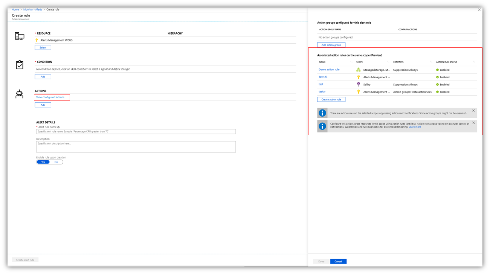

### Can I see the alerts that have been suppressed by an action rule?

In the [alerts list page](https://docs.microsoft.com/azure/azure-monitor/platform/alerts-managing-alert-instances), you can choose an additional column called **Suppression Status**. If the notification for an alert instance was suppressed, it would show that status in the list.

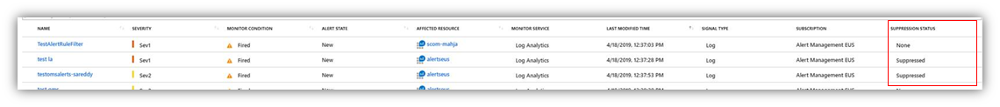

### If there's an action rule with an action group and another with suppression active on the same scope, what happens?

Suppression always takes precedence on the same scope.

### What happens if I have a resource that's monitored in two separate action rules? Do I get one or two notifications? For example, **VM2** in the following scenario:

      "action rule AR1 defined for VM1 and VM2 with action group AG1
      action rule AR2 defined for VM2 and VM3 with action group AG1"

For every alert on VM1 and VM3, action group AG1 would be triggered once. For every alert on **VM2**, action group AG1 would be triggered twice, because action rules don't deduplicate actions. 

### What happens if I have a resource monitored in two separate action rules and one calls for action while another for suppression? For example, **VM2** in the following scenario:

      "action rule AR1 defined for VM1 and VM2 with action group AG1 
      action rule AR2 defined for VM2 and VM3 with suppression"

For every alert on VM1, action group AG1 would be triggered once. Actions and notifications for every alert on VM2 and VM3 will be suppressed. 

### What happens if I have an alert rule and an action rule defined for the same resource calling different action groups? For example, **VM1** in the following scenario:

      "alert rule rule1 on VM1 with action group AG2
      action rule AR1 defined for VM1 with action group AG1" 
 
For every alert on VM1, action group AG1 would be triggered once. Whenever alert rule "rule1" is triggered, it will also trigger AG2 additionally. Action groups defined within action rules and alert rules operate independently, with no deduplication. 

## Next steps

- [Learn more about alerts in Azure](https://docs.microsoft.com/azure/azure-monitor/platform/alerts-overview)
