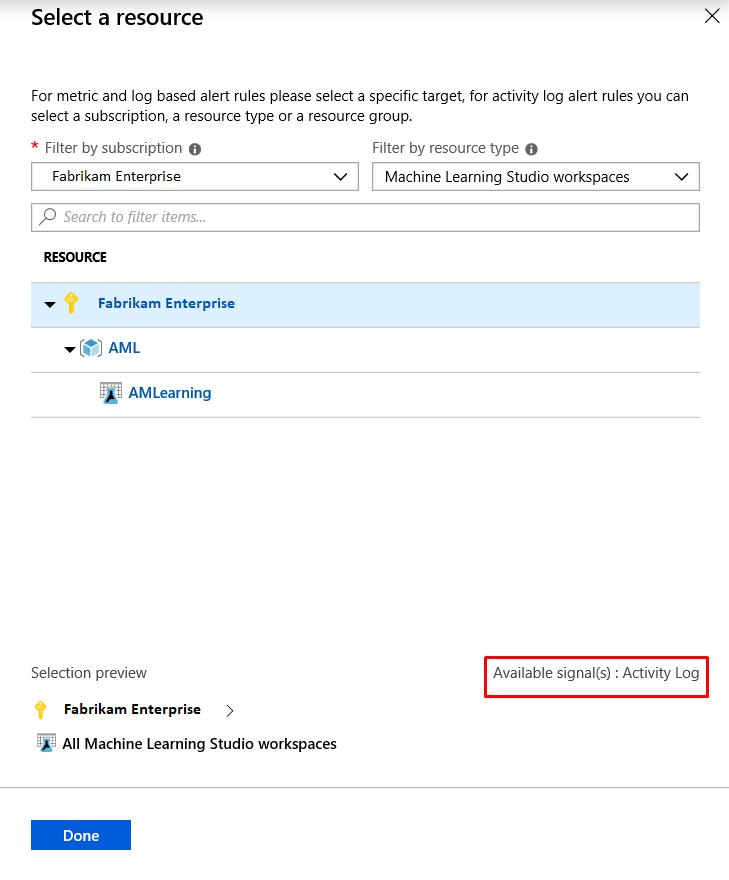
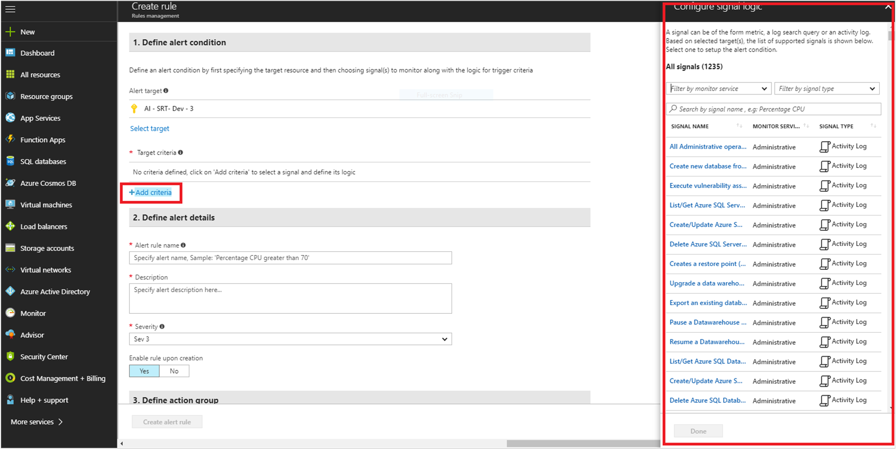
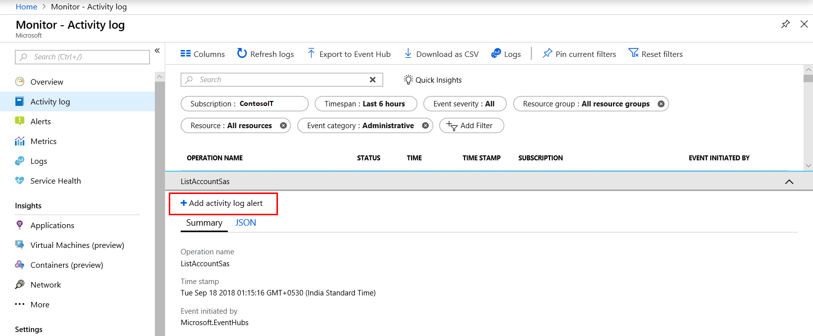

# Create, view, and manage activity log alerts by using Azure Monitor  

## Overview
Activity log alerts are the alerts that get activated when a new activity log event occurs that matches the conditions specified in the alert.

These alerts are for Azure resources and can be created by using an Azure Resource Manager template. They also can be created, updated, or deleted in the Azure portal. Typically, you create activity log alerts to receive notifications when specific changes occur to resources in your Azure subscription. Alerts are often scoped to particular resource groups or resources. For example, you might want to be notified when any virtual machine in the sample resource group **myProductionResourceGroup** is deleted. Or, you might want to get notified if any new roles are assigned to a user in your subscription.

> [!IMPORTANT]
> Alerts on service health notification can't be created via the interface for activity log alert creation. To learn more about how to create and use service health notifications, see [Receive activity log alerts on service health notifications](alerts-activity-log-service-notifications.md).

When you create alert rules, ensure the following:

- The subscription in the scope isn't different from the subscription where the alert is created.
- The criteria must be the level, status, caller, resource group, resource ID, or resource type event category on which the alert is configured.
- There's no "anyOf" condition or nested conditions in the alert configuration JSON. Basically, only one "allOf" condition is allowed with no further "allOf" or "anyOf" conditions.
- When the category is "administrative," you must specify at least one of the preceding criteria in your alert. You may not create an alert that activates every time an event is created in the activity logs.


## Azure portal

You can use the Azure portal to create and modify activity log alert rules. The experience is integrated with an Azure activity log to ensure seamless alert creation for specific events of interest.

### Create with the Azure portal

Use the following procedure.

1. In the Azure portal, select **Monitor** > **Alerts**.
2. Select **New alert rule** in the upper-left corner of the **Alerts** window.

     

     The **Create rule** window appears.

      

3. Under **Define alert condition**, provide the following information, and select **Done**:

   - **Alert target:** To view and select the target for the new alert, use **Filter by subscription** / **Filter by resource type**. Select the resource or resource group from the list displayed.

     > [!NOTE]
     > 
     > You can select only [Azure Resource Manager](../../azure-resource-manager/management/overview.md) tracked resource, resource group, or an entire subscription for an activity log signal. 

     **Alert target sample view**

     

   - Under **Target criteria**, select **Add criteria**. All available signals for the target are displayed, which includes those from various categories of **Activity Log**. The category name is appended to the **Monitor Service** name.

   - Select the signal from the list displayed of various operations possible for the type **Activity Log**.

     You can select the log history timeline and the corresponding alert logic for this target signal:

     **Add criteria screen**

     

     - **History time**: Events available for the selected operation can be plotted over the last 6, 12, or 24 hours or over the last week.

     - **Alert logic**:

       - **Event level**: The severity level of the event: _Verbose_, _Informational_, _Warning_, _Error_, or _Critical_.
       - **Status**: The status of the event: _Started_, _Failed_, or _Succeeded_.
       - **Event initiated by**: Also known as the caller. The email address or Azure Active Directory identifier of the user who performed the operation.

       This sample signal graph has the alert logic applied:

       

4. Under **Define alert details**, provide the following details:

    - **Alert rule name**: The name for the new alert rule.
    - **Description**: The description for the new alert rule.
    - **Save alert to resource group**: Select the resource group where you want to save this new rule.

5. Under **Action group**, from the drop-down menu, specify the action group that you want to assign to this new alert rule. Or, [create a new action group](../../azure-monitor/platform/action-groups.md) and assign it to the new rule. To create a new group, select **+ New group**.

6. To enable the rules after you create them, select **Yes** for the **Enable rule upon creation** option.
7. Select **Create alert rule**.

    The new alert rule for the activity log is created, and a confirmation message appears in the upper-right corner of the window.

    You can enable, disable, edit, or delete a rule. Learn more about how to manage activity log rules.


A simple analogy for understanding conditions on which alert rules can be created in an activity log is to explore or filter events via the [activity log in the Azure portal](activity-log-view.md#azure-portal). In the **Azure Monitor - Activity log** screen, you can filter or find the necessary event and then create an alert by using the **Add activity log alert** button. Then follow steps 4 through 7 as previously shown.
    
 
    

### View and manage in the Azure portal

1. In the Azure portal, select **Monitor** > **Alerts**. Select **Manage alert rules** in the upper-left corner of the window.

    

    The list of available rules appears.

2. Search for the activity log rule to modify.

    

    You can use the available filters, _Subscription_, _Resource group_,  _Resource_, _Signal type_, or _Status_, to find the activity rule that you want to edit.

   > [!NOTE]
   > 
   > You can edit only **Description**, **Target criteria**, and **Action groups**.

3. Select the rule, and double-click to edit the rule options. Make the required changes, and then select **Save**.

   

4. You can enable, disable, or delete a rule. Select the appropriate option at the top of the window after you select the rule as described in step 2.


## Azure Resource Manager template
To create an activity log alert by using an Azure Resource Manager template, you create a resource of the type `microsoft.insights/activityLogAlerts`. Then you fill in all related properties. Here's a template that creates an activity log alert:

```json
{
  "$schema": "https://schema.management.azure.com/schemas/2015-01-01/deploymentTemplate.json#",
  "contentVersion": "1.0.0.0",
  "parameters": {
    "activityLogAlertName": {
      "type": "string",
      "metadata": {
        "description": "Unique name (within the Resource Group) for the Activity log alert."
      }
    },
    "activityLogAlertEnabled": {
      "type": "bool",
      "defaultValue": true,
      "metadata": {
        "description": "Indicates whether or not the alert is enabled."
      }
    },
    "actionGroupResourceId": {
      "type": "string",
      "metadata": {
        "description": "Resource Id for the Action group."
      }
    }
  },
  "resources": [   
    {
      "type": "Microsoft.Insights/activityLogAlerts",
      "apiVersion": "2017-04-01",
      "name": "[parameters('activityLogAlertName')]",      
      "location": "Global",
      "properties": {
        "enabled": "[parameters('activityLogAlertEnabled')]",
        "scopes": [
            "[subscription().id]"
        ],        
        "condition": {
          "allOf": [
            {
              "field": "category",
              "equals": "Administrative"
            },
            {
              "field": "operationName",
              "equals": "Microsoft.Resources/deployments/write"
            },
            {
              "field": "resourceType",
              "equals": "Microsoft.Resources/deployments"
            }
          ]
        },
        "actions": {
          "actionGroups":
          [
            {
              "actionGroupId": "[parameters('actionGroupResourceId')]"
            }
          ]
        }
      }
    }
  ]
}
```
The previous sample JSON can be saved as, for example, sampleActivityLogAlert.json for the purpose of this walk-through and can be deployed by using [Azure Resource Manager in the Azure portal](../../azure-resource-manager/templates/deploy-portal.md).

> [!NOTE]
> It might take up to 5 minutes for the new activity log alert rule to become active.

## REST API 
The [Azure Monitor Activity Log Alerts API](https://docs.microsoft.com/rest/api/monitor/activitylogalerts) is a REST API. It's fully compatible with the Azure Resource Manager REST API. It can be used via PowerShell by using the Resource Manager cmdlet or the Azure CLI.

## PowerShell

[!INCLUDE [updated-for-az](../../../includes/updated-for-az.md)]

### Deploy the Resource Manager template with PowerShell
To use PowerShell to deploy the sample Resource Manager template shown in the previous [Azure Resource Manager template](#azure-resource-manager-template) section, use the following command:

```powershell
New-AzResourceGroupDeployment -ResourceGroupName "myRG" -TemplateFile sampleActivityLogAlert.json -TemplateParameterFile sampleActivityLogAlert.parameters.json
```

where the sampleActivityLogAlert.parameters.json contains the values provided for the parameters needed for alert rule creation.

### Use activity log PowerShell cmdlets

Activity log alerts have dedicated PowerShell cmdlets available:

- [Set-AzActivityLogAlert](https://docs.microsoft.com/powershell/module/az.monitor/Set-AzActivityLogAlert): Creates a new activity log alert or updates an existing activity log alert.
- [Get-AzActivityLogAlert](https://docs.microsoft.com/powershell/module/az.monitor/Get-AzActivityLogAlert): Gets one or more activity log alert resources.
- [Enable-AzActivityLogAlert](https://docs.microsoft.com/powershell/module/az.monitor/Enable-AzActivityLogAlert): Enables an existing activity log alert and sets its tags.
- [Disable-AzActivityLogAlert](https://docs.microsoft.com/powershell/module/az.monitor/Disable-AzActivityLogAlert): Disables an existing activity log alert and sets its tags.
- [Remove-AzActivityLogAlert](https://docs.microsoft.com/powershell/module/az.monitor/Remove-AzActivityLogAlert): Removes an activity log alert.

## Azure CLI

Dedicated Azure CLI commands under the set [az monitor activity-log alert](https://docs.microsoft.com/cli/azure/monitor/activity-log/alert) are available for managing activity log alert rules.

To create a new activity log alert rule, use the following commands in this order:

1. [az monitor activity-log alert create](https://docs.microsoft.com/cli/azure/monitor/activity-log/alert#az-monitor-activity-log-alert-create): Create a new activity log alert rule resource.
1. [az monitor activity-log alert scope](https://docs.microsoft.com/cli/azure/monitor/activity-log/alert/scope): Add scope for the created activity log alert rule.
1. [az monitor activity-log alert action-group](https://docs.microsoft.com/cli/azure/monitor/activity-log/alert/action-group): Add an action group to the activity log alert rule.

To retrieve one activity log alert rule resource, use the Azure CLI command [az monitor activity-log alert show](https://docs.microsoft.com/cli/azure/monitor/activity-log/alert#az-monitor-activity-log-alert-show
). To view all activity log alert rule resources in a resource group, use [az monitor activity-log alert list](https://docs.microsoft.com/cli/azure/monitor/activity-log/alert#az-monitor-activity-log-alert-list).
Activity log alert rule resources can be removed by using the Azure CLI command [az monitor activity-log alert delete](https://docs.microsoft.com/cli/azure/monitor/activity-log/alert#az-monitor-activity-log-alert-delete).

## Next steps

- Learn about [webhook schema for activity logs](../../azure-monitor/platform/activity-log-alerts-webhook.md).
- Read an [overview of activity logs](../../azure-monitor/platform/activity-log-alerts.md).
- Learn more about [action groups](../../azure-monitor/platform/action-groups.md).  
- Learn about [service health notifications](../../azure-monitor/platform/service-notifications.md).
