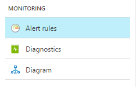

# Create, view, and manage classic metric alerts using Azure Monitor

Classic metric alerts in Azure Monitor provide a way to get notified when one of your metrics cross a threshold. Classic metric alerts is an older functionality that allows for alerting only on non-dimensional metrics. There is an existing newer functionality called Metric alerts which has improved functionality over classic metric alerts. You can learn more about the new metric alerts functionality in [metric alerts overview](../../azure-monitor/platform/alerts-metric-overview.md). In this article, we will describe how to create, view and manage classic metric alert rules through Azure portal, Azure CLI and Powershell.

## With Azure portal

1. In the [portal](https://portal.azure.com/), locate the resource that you want to monitor, and then select it.

2. In the **MONITORING** section, select **Alerts (Classic)**. The text and icon might vary slightly for different resources. If you don't find **Alerts (Classic)** here, you might find it in **Alerts** or **Alert Rules**.

    

3. Select the **Add metric alert (classic)** command, and then fill in the fields.

    

4. **Name** your alert rule. Then choose a **Description**, which also appears in notification emails.

5. Select the **Metric** that you want to monitor. Then choose a **Condition** and **Threshold** value for the metric. Also choose the **Period** of time that the metric rule must be satisfied before the alert triggers. For example, if you use the period "Over the last 5 minutes" and your alert looks for a CPU above 80%, the alert triggers when the CPU has been consistently above 80% for 5 minutes. After the first trigger occurs, it triggers again when the CPU stays below 80% for 5 minutes. The CPU metric measurement happens every minute.

6. Select **Email owners...** if you want administrators and co-administrators to receive email notifications when the alert fires.

7. If you want to send notifications to additional email addresses when the alert fires, add them in the **Additional Administrator email(s)** field. Separate multiple emails with semicolons, in the following format: *email\@contoso.com;email2\@contoso.com*

8. Put in a valid URI in the **Webhook** field if you want it to be called when the alert fires.

9. If you use Azure Automation, you can select a runbook to be run when the alert fires.

10. Select **OK** to create the alert.

Within a few minutes, the alert is active and triggers as previously described.

After you create an alert, you can select it and do one of the following tasks:

* View a graph that shows the metric threshold and the actual values from the previous day.
* Edit or delete it.
* **Disable** or **Enable** it if you want to temporarily stop or resume receiving notifications for that alert.

## With Azure CLI

The previous sections described how to create, view and manage metric alert rules using Azure portal. This section will describe how to do the same using cross-platform [Azure CLI](https://docs.microsoft.com/cli/azure/get-started-with-azure-cli?view=azure-cli-latest). Quickest way to start using Azure CLI is through [Azure Cloud Shell](https://docs.microsoft.com/azure/cloud-shell/overview?view=azure-cli-latest).

### Get all classic metric alert rules in a resource group

```azurecli
az monitor alert list --resource-group <group name>
```

### See details of a particular classic metric alert rule

```azurecli
az monitor alert show --resource-group <group name> --name <alert name>
```

### Create a classic metric alert rule

```azurecli
az monitor alert create --name <alert name> --resource-group <group name> \
    --action email <email1 email2 ...> \
    --action webhook <URI> \
    --target <target object ID> \
    --condition "<METRIC> {>,>=,<,<=} <THRESHOLD> {avg,min,max,total,last} ##h##m##s"
```

### Delete a classic metric alert rule

```azurecli
az monitor alert delete --name <alert name> --resource-group <group name>
```

## With PowerShell

[!INCLUDE [updated-for-az](../../../includes/updated-for-az.md)]

This sections shows how to use PowerShell commands create, view and manage classic metric alerts.The examples in the article illustrate how you can use Azure Monitor cmdlets for classic metric alerts.

1. If you haven't already, set up PowerShell to run on your computer. For more information, see [How to Install and Configure PowerShell](/powershell/azure/overview). You can also review the entire list of Azure Monitor PowerShell cmdlets at [Azure Monitor (Insights) Cmdlets](https://docs.microsoft.com/powershell/module/az.applicationinsights).

2. First, log in to your Azure subscription.

    ```powershell
    Connect-AzAccount
    ```

3. You'll see a sign in screen. Once you sign in your Account, TenantID, and default Subscription ID are displayed. All the Azure cmdlets work in the context of your default subscription. To view the list of subscriptions you have access to, use the following command:

    ```powershell
    Get-AzSubscription
    ```

4. To change your working context to a different subscription, use the following command:

    ```powershell
    Set-AzContext -SubscriptionId <subscriptionid>
    ```

5. You can retrieve all classic metric alert rules on a resource group:

    ```powershell
    Get-AzAlertRule -ResourceGroup montest
    ```

6. You can view details of a classic metric alert rule

    ```powershell
    Get-AzAlertRule -Name simpletestCPU -ResourceGroup montest -DetailedOutput
    ```

7. You can retrieve all alert rules set for a target resource. For example, all alert rules set on a VM.

    ```powershell
    Get-AzAlertRule -ResourceGroup montest -TargetResourceId /subscriptions/s1/resourceGroups/montest/providers/Microsoft.Compute/virtualMachines/testconfig
    ```

8. Classic alert rules can no longer be created via PowerShell. To create an alert rule you need to use the new ['Add-AzMetricAlertRule'](/powershell/module/az.monitor/add-azmetricalertrule) command.

## Next steps

- [Create a classic metric alert with a Resource Manager template](../../azure-monitor/platform/alerts-enable-template.md).
- [Have a classic metric alert notify a non-Azure system using a webhook](../../azure-monitor/platform/alerts-webhooks.md).
