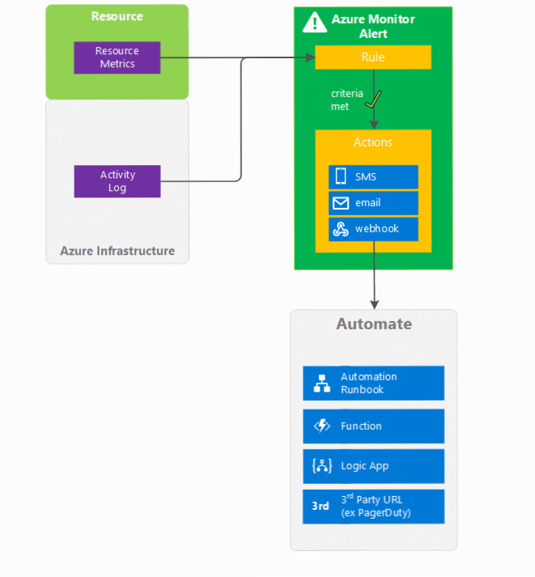

# What are classic alerts in Microsoft Azure?

> [!NOTE]
> This article describes how to create older classic metric alerts. Azure Monitor now supports [newer near-real time metric alerts and a new alerts experience](../../azure-monitor/platform/alerts-overview.md). Classic alerts are [scheduled to be retired](https://docs.microsoft.com/azure/azure-monitor/platform/monitoring-classic-retirement).  
>

Alerts allow you to configure conditions over data and become notified when the conditions match the latest monitoring data.

## Old and New alerting capabilities

In the past Azure Monitor, Application Insights, Log Analytics, and Service Health had separate alerting capabilities. Overtime, Azure improved and combined both the user interface and different methods of alerting. The consolidation is still in process.

You can view classic alerts only in the classic alerts user screen in the Azure Portal. You get this screen from the **View classic alerts** button on the alerts screen. 

 

The new alerts user experience has the following benefits over the classic alerts experience:
-	**Better notification system** - All newer alerts use action groups, which are named groups of notifications and actions that can be reused in multiple alerts. Classic metric alerts and older Log Analytics alerts do not use action groups.
-	**A unified authoring experience** - All alert creation for metrics, logs and activity log across Azure Monitor, Log Analytics, and Application Insights is in one place.
-	**View fired Log Analytics alerts in Azure portal** - You can now also see fired Log Analytics alerts in your subscription. Previously these were in a separate portal.
-	**Separation of fired alerts and alert rules** - Alert rules (the definition of condition that triggers an alert), and Fired Alerts (an instance of the alert rule firing) are differentiated, so the operational and configuration views are separated.
-	**Better workflow** - The new alerts authoring experience guides the user along the process of configuring an alert rule, which makes it simpler to discover the right things to get alerted on.
-   **Smart Alerts consolidation** and **setting alert state**  -  Newer alerts include auto grouping functionality showing similar alerts together to reduce overload in the user interface. 

The newer metric alerts have the following benefits over the classic metric alerts:
-	**Improved latency**: Newer metric alerts can run as frequently as every one minute. Older metric alerts always run at a frequency of 5 minutes. Newer alerts have increasing smaller delay from issue occurrence to notification or action (3 to 5 minutes). Older alerts are 5 to 15 minutes depending on the type.  Log alerts typically have 10 to 15-minute delay due to the time it takes to ingest the logs, but newer processing methods are reducing that time. 
-	**Support for multi-dimensional metrics**: You can alert on dimensional metrics allowing you to monitor an interesting segment of the metric.
-	**More control over metric conditions**: You can define richer alert rules. The newer alerts support monitoring the maximum, minimum, average, and total values of metrics.
-	**Combined monitoring of multiple metrics**: You can monitor multiple metrics (currently, up to two metrics) with a single rule. An alert is triggered if both metrics breach their respective thresholds for the specified time-period.
-	**Better notification system**: All newer alerts use [action groups](../../azure-monitor/platform/action-groups.md), which are named groups of notifications and actions that can be reused in multiple alerts.  Classic metric alerts and older Log Analytics alerts do not use action groups. 
-	**Metrics from Logs** (public preview): Log data going into Log Analytics can now be extracted and converted into Azure Monitor metrics and then alerted on just like other metrics. 
See [Alerts (classic)](alerts-classic.overview.md) for the terminology specific to classic alerts. 

## Classic alerts on Azure Monitor data
There are two types of classic alerts available -  metric alerts and activity log alerts.

* **Classic metric alerts** - This alert triggers when the value of a specified metric crosses a threshold that you assign. The alert generates a notification when that threshold is crossed and the alert condition is met. At that point, the alert is considered "Activated". It generates another notification when it is "Resolved" - that is, when the threshold is crossed again and the condition is no longer met.

* **Classic activity log alerts** - A streaming log alert that triggers on an Activity Log event entry that matches your filter criteria. These alerts have only one state, "Activated". The alert engine simply applies the filter criteria to any new event. It does not search to find older entries. These alerts can notify you when a new Service Health incident occurs or when a user or application performs an operation in your subscription, for example, "Delete virtual machine."

For Diagnostic Log data available through Azure Monitor, route the data into Log Analytics (formerly OMS) and use a Log Analytics query alert. Log Analytics now uses the [new alerting method](../../azure-monitor/platform/alerts-overview.md) 

The following diagram summarizes sources of data in Azure Monitor and, conceptually, how you can alert off of that data.

## Taxonomy of alerts (classic)
Azure uses the following terms to describe classic alerts and their functions:
* **Alert** - a definition of criteria (one or more rules or conditions) that becomes activated when met.
* **Active** - the state when the criteria defined by a classic alert is met.
* **Resolved** - the state when the criteria defined by a classic alert is no longer met after previously having been met.
* **Notification** - the action taken based off of a classic alert becoming active.
* **Action** - a specific call sent to a receiver of a notification (for example, emailing an address or posting to a webhook URL). Notifications can usually trigger multiple actions.

## How do I receive a notification from an Azure Monitor classic alert?
Historically, Azure alerts from different services used their own built-in notification methods. 

Azure Monitor created a reusable notification grouping called *action groups*. Action groups specify a set of receivers for a notification. Any time an alert is activated that references the Action Group, all receivers receive that notification. Action groups allow you to reuse a grouping of receivers (for example, your on-call engineer list) across many alert objects. Action groups support notification by posting to a webhook URL in addition to email addresses, SMS numbers, and a number of other actions.  For more information, see [action groups](../../azure-monitor/platform/action-groups.md). 

Older classic Activity Log alerts use action groups.

However, the older metric alerts do not use action groups. Instead, you can configure the following actions: 
- Send email notifications to the service administrator, to coadministrators, or to additional email addresses that you specify.
- Call a webhook, which enables you to launch additional automation actions.

Webhooks enables automation and remediation, for example, using:
- Azure Automation Runbook
- Azure Function
- Azure Logic App
- a third-party service

## Next steps
Get information about alert rules and configuring them by using:

* Learn more about [Metrics](data-platform.md)
* Configure [classic Metric Alerts via Azure portal](alerts-classic-portal.md)
* Configure [classic Metric Alerts PowerShell](alerts-classic-portal.md)
* Configure [classic Metric Alerts Command-line interface (CLI)](alerts-classic-portal.md)
* Configure [classic Metric Alerts Azure Monitor REST API](https://msdn.microsoft.com/library/azure/dn931945.aspx)
* Learn more about [Activity Log](activity-logs-overview.md)
* Configure [Activity Log Alerts via Azure portal](activity-log-alerts.md)
* Configure [Activity Log Alerts via Resource Manager](alerts-activity-log.md)
* Review the [activity log alert webhook schema](activity-log-alerts-webhook.md)
* Learn more about [Action groups](action-groups.md)
* Configure [newer Alerts](alerts-metric.md)
