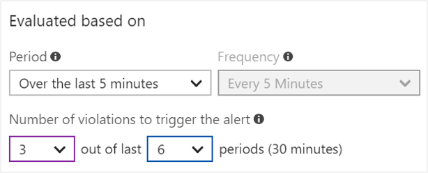

# Metric Alerts with Dynamic Thresholds in Azure Monitor

Metric Alert with Dynamic Thresholds detection leverages advanced machine learning (ML) to learn metrics' historical behavior, identify patterns and anomalies that indicate possible service issues. It provides support of both a simple UI and operations at scale by allowing users to configure alert rules through the Azure Resource Manager API, in a fully automated manner.

Once an alert rule is created, it will fire only when the monitored metric doesn’t behave as expected, based on its tailored thresholds.

We would love to hear your feedback, keep it coming at <azurealertsfeedback@microsoft.com>.

## Why and when is using dynamic condition type recommended?

1. **Scalable Alerting** – Dynamic Thresholds alerts rules can create tailored thresholds for hundreds of metric series at a time. Yet providing the same ease of defining an alert rule on a single metric. Using either the UI or the Azure Resource Manager API results in fewer alert rules to manage. The scalable approach is especially useful when dealing with metric dimensions or when applying to multiple resources, like all subscription resources. Which translates to a significant time saving on management and creation of alerts rules. [Learn more about how to configure Metric Alerts with Dynamic Thresholds using templates](alerts-metric-create-templates.md).

1. **Smart Metric Pattern Recognition** – Using our unique ML technology, we’re able to automatically detect metric patterns and adapt to metric changes over time, which may often include seasonality (Hourly / Daily / Weekly). Adapting to the metrics’ behavior over time and alerting based on deviations from its pattern relieves the burden of knowing the “right” threshold for each metric. The ML algorithm used in Dynamic Thresholds is designed to prevent noisy (low precision) or wide (low recall) thresholds that don’t have an expected pattern.

1. **Intuitive Configuration** – Dynamic Thresholds allow setting up metric alerts using high-level concepts, alleviating the need to have extensive domain knowledge about the metric.

## How to configure alerts rules with Dynamic Thresholds?

Alerts with Dynamic Thresholds can be configured through Metric Alerts in Azure Monitor. [Learn more about how to configure Metric Alerts](alerts-metric.md).

## How are the thresholds calculated?

Dynamic Thresholds continuously learns the data of the metric series and tries to model it using a set of algorithms and methods. It detects patterns in the data such as seasonality (Hourly / Daily / Weekly), and is able to handle noisy metrics (such as machine CPU or memory) as well as metrics with low dispersion (such as availability and error rate).

The thresholds are selected in such a way that a deviation from these thresholds indicates an anomaly in the metric behavior.

> [!NOTE]
> Seasonal pattern detection is set to a hour, day, or week interval. This means other patterns like bihourly pattern or semiweekly might not be detected.

## What does 'Sensitivity' setting in Dynamic Thresholds mean?

Alert threshold sensitivity is a high-level concept that controls the amount of deviation from metric behavior required to trigger an alert.
This option doesn't require domain knowledge about the metric like static threshold. The options available are:

- High – The thresholds will be tight and close to the metric series pattern. An alert rule will be triggered on the smallest deviation, resulting in more alerts.
- Medium – Less tight and more balanced thresholds, fewer alerts than with high sensitivity (default).
- Low – The thresholds will be loose with more distance from metric series pattern. An alert rule will only trigger on large deviations, resulting in fewer alerts.

## What are the 'Operator' setting options in Dynamic Thresholds?

Dynamic Thresholds alerts rule can create tailored thresholds based on metric behavior for both upper and lower bounds using the same alert rule.
You can choose the alert to be triggered on one of the following three conditions:

- Greater than the upper threshold or lower than the lower threshold (default)
- Greater than the upper threshold
- Lower than the lower threshold.

## What do the advanced settings in Dynamic Thresholds mean?

**Failing Periods** - Dynamic Thresholds also allows you to configure “Number violations to trigger the alert”, a minimum number of deviations required within a certain time window for the system to raise an alert (the default time window is four deviations in 20 minutes). The user can configure failing periods and choose what to be alerted on by changing the failing periods and time window. This ability reduces alert noise generated by transient spikes. For example:

To trigger an alert when the issue is continuous for 20 minutes, 4 consecutive times in a given period grouping of 5 minutes, use the following settings:

To trigger an alert when there was a violation from a Dynamic Thresholds in 20 minutes out of the last 30 minutes with period of 5 minutes, use the following settings:

**Ignore data before** - Users may also optionally define a start date from which the system should begin calculating the thresholds from. A typical use case may occur when a resource was a running in a testing mode and is now promoted to serve a production workload, and therefore the behavior of any metric during the testing phase should be disregarded.

## How do you find out why a Dynamic Thresholds alert was triggered?

You can explore triggered alert instances in the alerts view either by clicking on the link in the email or text message, or browser to see the alerts view in the Azure portal. [Learn more about the alerts view](alerts-overview.md#alerts-experience).

The alert view displays:

- All the metric details at the moment the Dynamic Thresholds alert fired.
- A chart of the period in which the alert was triggered that includes the Dynamic Thresholds used at that point in time.
- Ability to provide feedback on Dynamic Thresholds alert and the alerts view experience, which could improve future detections.

## Will slow behavior change in the metric trigger an alert?

Probably not. Dynamic Thresholds are good for detecting significant deviations rather than slowly evolving issues.

## How much data is used to preview and then calculate thresholds?

The thresholds appearing in the chart, before an alert rule is created on the metric, are calculated based on enough historical data to calculate hour or daily seasonal patterns (10 days). Once an alert rule is created, the Dynamic Thresholds will use all needed historical data that is available and will continuously learn and adapt based on new data to make the thresholds more accurate. This means that after this calculation, the chart will also display weekly patterns.

## How much data is needed to trigger an alert?

If you have a new resource or missing metric data, Dynamic Thresholds won't trigger alerts before three days of data are available to ensure accurate thresholds.

## Dynamic Thresholds best practices

Dynamic Thresholds can be applied to any platform or custom metric in Azure Monitor and it was also tuned for the common application and infrastructure metrics.
The following items are best practices on how to configure alerts on some of these metrics using Dynamic Thresholds.

### Dynamic Thresholds on virtual machine CPU percentage metrics

1. In [Azure portal](https://portal.azure.com), click on **Monitor**. The Monitor view consolidates all your monitoring settings and data in one view.

2. Click **Alerts** then click **+ New alert rule**.

    > [!TIP]
    > Most resource blades also have **Alerts** in their resource menu under **Monitoring**, you could create alerts from there as well.

3. Click **Select target**, in the context pane that loads, select a target resource that you want to alert on. Use **Subscription** and **'Virtual Machines' Resource type** drop-downs to find the resource you want to monitor. You can also use the search bar to find your resource.

4. Once you have selected a target resource, click on **Add condition**.

5. Select the **'CPU Percentage'**.

6. Optionally, refine the metric by adjusting **Period** and **Aggregation**. It is discouraged to use 'Maximum' aggregation type for this metric type as it is less representative of behavior. For 'Maximum' aggregation type static threshold maybe more appropriate.

7. You will see a chart for the metric for the last 6 hours. Define the alert parameters:
    1. **Condition Type** - Choose 'Dynamic' option.
    1. **Sensitivity** - Choose Medium/Low sensitivity to reduce alert noise.
    1. **Operator** - Choose 'Greater Than' unless behavior represents the application usage.
    1. **Frequency** - Consider lowering based on business impact of the alert.
    1. **Failing Periods** (Advanced Option) - The look back window should be at least 15 minutes. For example, if the period is set to five minutes, then failing periods should be at least three or more.

8. The metric chart will display the calculated thresholds based on recent data.

9. Click **Done**.

10. Fill in **Alert details** like **Alert Rule Name**, **Description**, and **Severity**.

11. Add an action group to the alert either by selecting an existing action group or creating a new action group.

12. Click **Done** to save the metric alert rule.

> [!NOTE]
> Metric alert rules created through portal are created in the same resource group as the target resource.

### Dynamic Thresholds on Application Insights HTTP request execution time

1. In [Azure portal](https://portal.azure.com), click on **Monitor**. The Monitor view consolidates all your monitoring settings and data in one view.

2. Click **Alerts** then click **+ New alert rule**.

    > [!TIP]
    > Most resource blades also have **Alerts** in their resource menu under **Monitoring**, you could create alerts from there as well.

3. Click **Select target**, in the context pane that loads, select a target resource that you want to alert on. Use **Subscription** and **'Application Insights' Resource type** drop-downs to find the resource you want to monitor. You can also use the search bar to find your resource.

4. Once you have selected a target resource, click on **Add condition**.

5. Select the **'HTTP request execution time'**.

6. Optionally, refine the metric by adjusting **Period** and **Aggregation**. It is discouraged to use 'Maximum' aggregation type for this metric type as it is less representative of behavior. For 'Maximum' aggregation type static threshold maybe more appropriate.

7. You will see a chart for the metric for the last 6 hours. Define the alert parameters:
    1. **Condition Type** - Choose 'Dynamic' option.
    1. **Operator** - Choose 'Greater Than' to reduce alerts fired on improvement in duration.
    1. **Frequency** - Consider lowering based on business impact of the alert.

8. The metric chart will display the calculated thresholds based on recent data.

9. Click **Done**.

10. Fill in **Alert details** like **Alert Rule Name**, **Description**, and **Severity**.

11. Add an action group to the alert either by selecting an existing action group or creating a new action group.

12. Click **Done** to save the metric alert rule.

> [!NOTE]
> Metric alert rules created through portal are created in the same resource group as the target resource.
