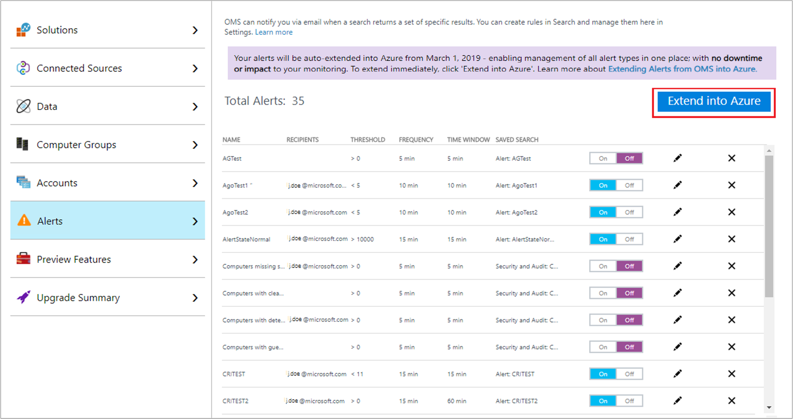
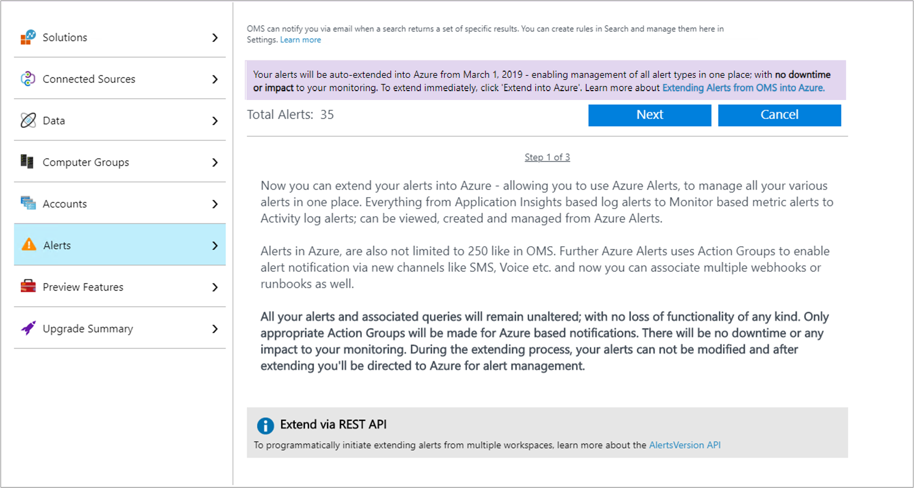
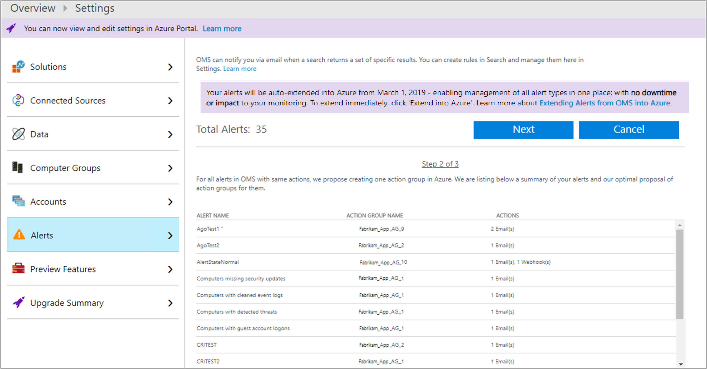
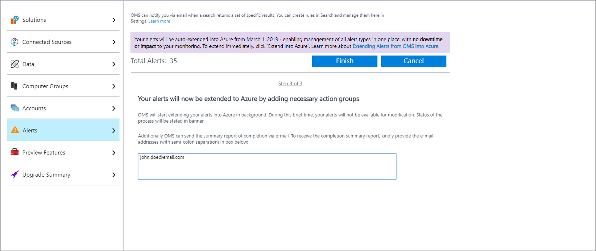
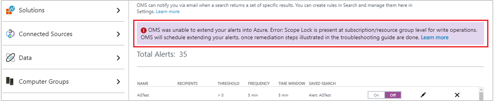

# Extend alerts from Log Analytics into Azure Alerts
The alerts feature in OMS portal is being replaced by Azure Alerts in Azure Government cloud. As part of this transition, alerts that you originally configured in Log Analytics will be extended into Azure. If you don't want to wait for them to be automatically moved into Azure, you can initiate the process:

- Manually from the Operations Management Suite portal. 
- Programmatically by using the AlertsVersion API.  

> [!NOTE]
> Microsoft will automatically extend alerts created in Azure Government OMS portal instances of Log Analytics to Azure Alerts, starting on Mar 1, 2019, in a systematic manner. If you have any problems creating [action groups](../../azure-monitor/platform/action-groups.md), use [these remediation steps](alerts-extend-tool.md#troubleshooting) to get action groups created automatically. You can use these steps until March 15, 2019 in Azure Government OMS portal.

## Option 1: Initiate from the Operations Management Suite portal
The following steps describe how to extend alerts for the workspace from the Operations Management Suite portal for Azure Government cloud.  

1. In the Azure portal, select **All services**. In the list of resources, type **Log Analytics**. As you begin typing, the list filters based on your input. Select **Log Analytics**.
2. In the Log Analytics subscriptions pane, select a workspace, and then select the **OMS Portal** tile.
 
3. After you are redirected to the Operations Management Suite portal, select the **Settings** icon.
 
4. From the **Settings** page, select **Alerts**.  
5. Select **Extend into Azure**.

6. A three-step wizard appears in the **Alerts** pane. Read the overview, and select **Next**.
  
7. In the second step, you see a summary of proposed changes, listing appropriate [action groups](../../azure-monitor/platform/action-groups.md) for the alerts. If similar actions are seen across more than one alert, the wizard proposes to associate a single action group with all of them.  The naming convention is as follows: *WorkspaceName_AG_#Number*. To proceed, select **Next**.
  
8. In the last step of wizard, select **Finish**, and confirm when prompted to initiate the process. Optionally, you can provide an email address, so that you are notified when the process completes and all alerts have been successfully moved to Azure Alerts.


When the wizard is finished, on the **Alert Settings** page, the option to extend alerts to Azure is removed. In the background, your alerts are moved into Azure, and this can take some time. During the operation, you can't make changes to alerts from the Operations Management Suite portal. You can see the current status from the banner at the top of the portal. If you provided an email address earlier, you receive an email when the process has successfully completed.  


Alerts continue to be listed in Operations Management Suite portal, even after they are successfully moved into Azure.


## Option 2: Use the AlertsVersion API
You can use the Log Analytics AlertsVersion API to extend alerts from Log Analytics into Azure Alerts from any client that can call a REST API. You can access the API from PowerShell by using [ARMClient](https://github.com/projectkudu/ARMClient), an open-source command-line tool. You can output the results in JSON.  

To use the API, you first create a GET request. This evaluates and returns a summary of the proposed changes, before you attempt to actually extend into Azure by using a POST request. The results list your alerts and a proposed list of [action groups](../../azure-monitor/platform/action-groups.md), in JSON format. If similar actions are seen across more than one alert, the service proposes to associate all of them with a single action group. The naming convention is as follows: *WorkspaceName_AG_#Number*.

```
armclient GET  /subscriptions/<subscriptionId>/resourceGroups/<resourceGroupName>/providers/Microsoft.OperationalInsights/workspaces/<workspaceName>/alertsversion?api-version=2017-04-26-preview
```

If the GET request is successful, an HTTP status code 200 is returned, along with a list of alerts and proposed action groups in the JSON data. The following is an example response:

```json
{
    "version": 1,
    "migrationSummary": {
        "alertsCount": 2,
        "actionGroupsCount": 2,
        "alerts": [
            {
                "alertName": "DemoAlert_1",
                "alertId": " /subscriptions/<subscriptionId>/resourceGroups/<resourceGroupName>/providers/Microsoft.OperationalInsights/workspaces/<workspaceName>/savedSearches/<savedSearchId>/schedules/<scheduleId>/actions/<actionId>",
                "actionGroupName": "<workspaceName>_AG_1"
            },
            {
                "alertName": "DemoAlert_2",
                "alertId": " /subscriptions/<subscriptionId>/resourceGroups/<resourceGroupName>/providers/Microsoft.OperationalInsights/workspaces/<workspaceName>/savedSearches/<savedSearchId>/schedules/<scheduleId>/actions/<actionId>",
                "actionGroupName": "<workspaceName>_AG_2"
            }
        ],
        "actionGroups": [
            {
                "actionGroupName": "<workspaceName>_AG_1",
                "actionGroupResourceId": "/subscriptions/<subscriptionid>/resourceGroups/<resourceGroupName>/providers/microsoft.insights/actionGroups/<workspaceName>_AG_1",
                "actions": {
                    "emailIds": [
                        "JohnDoe@mail.com"
                    ],
                    "webhookActions": [
                        {
                            "name": "Webhook_1",
                            "serviceUri": "https://test.com"
                        }
                    ],
                    "itsmAction": {}
                }
            },
            {
                "actionGroupName": "<workspaceName>_AG_1",
                "actionGroupResourceId": "/subscriptions/<subscriptionid>/resourceGroups/<resourceGroupName>/providers/microsoft.insights/actionGroups/<workspaceName>_AG_1",
                 "actions": {
                    "emailIds": [
                        "test1@mail.com",
                          "test2@mail.com"
                    ],
                    "webhookActions": [],
                    "itsmAction": {
                        "connectionId": "<Guid>",
                        "templateInfo":"{\"PayloadRevision\":0,\"WorkItemType\":\"Incident\",\"UseTemplate\":false,\"WorkItemData\":\"{\\\"contact_type\\\":\\\"email\\\",\\\"impact\\\":\\\"3\\\",\\\"urgency\\\":\\\"2\\\",\\\"category\\\":\\\"request\\\",\\\"subcategory\\\":\\\"password\\\"}\",\"CreateOneWIPerCI\":false}"
                    }
                }
            }
        ]
    }
}

```
If the specified workspace does not have any alert rules defined, the JSON data returns the following:

```json
{
    "version": 1,
    "Message": "No Alerts found in the workspace for migration."
}
```

If all alert rules in the specified workspace have already been extended to Azure, the response to the GET request is:

```json
{
    "version": 2
}
```

To initiate migrating the alerts to Azure, initiate a POST response. The POST response confirms your intent, as well as acceptance, to have alerts extended from Log Analytics to Azure Alerts. The activity is scheduled and the alerts are processed as indicated, based on the results when you performed the GET response earlier. Optionally, you can provide a list of email addresses to which Log Analytics sends a report when the scheduled background process of migrating the alerts completes successfully. You can use the following request example:

```
$emailJSON = “{‘Recipients’: [‘a@b.com’, ‘b@a.com’]}”
armclient POST  /subscriptions/<subscriptionId>/resourceGroups/<resourceGroupName>/providers/Microsoft.OperationalInsights/workspaces/<workspaceName>/alertsversion?api-version=2017-04-26-preview $emailJSON
```

> [!NOTE]
> The result of migrating alerts into Azure Alerts might vary based on the summary provided by GET response. When scheduled, alerts in Log Analytics are temporarily unavailable for modification in the Operations Management Suite portal. However, you can create new alerts. 

If the POST request is successful, it returns an HTTP 200 OK status, along with the following response:

```json
{
    "version": 2
}
```

This response indicates the alerts have been successfully extended into Azure Alerts. The  version property is only for checking if alerts have been extended to Azure, and have no relation to the [Log Analytics Search API](../../azure-monitor/platform/api-alerts.md). When the alerts are extended to Azure successfully, any email addresses provided with the POST request are sent a report. If all the alerts in the specified workspace are already scheduled to be extended, the response to your POST request is that the attempt was forbidden (a 403 status code). To view any error message or understand if the process is stuck, you can submit a GET request. If there is an error message, it is returned, along with the summary information.

```json
{
    "version": 1,
    "message": "OMS was unable to extend your alerts into Azure, Error: The subscription is not registered to use the namespace 'microsoft.insights'. OMS will schedule extending your alerts, once remediation steps illustrated in the troubleshooting guide are done.",
    "recipients": [
       "john.doe@email.com",
       "jane.doe@email.com"
     ],
    "migrationSummary": {
        "alertsCount": 2,
        "actionGroupsCount": 2,
        "alerts": [
            {
                "alertName": "DemoAlert_1",
                "alertId": " /subscriptions/<subscriptionId>/resourceGroups/<resourceGroupName>/providers/Microsoft.OperationalInsights/workspaces/<workspaceName>/savedSearches/<savedSearchId>/schedules/<scheduleId>/actions/<actionId>",
                "actionGroupName": "<workspaceName>_AG_1"
            },
            {
                "alertName": "DemoAlert_2",
                "alertId": " /subscriptions/<subscriptionId>/resourceGroups/<resourceGroupName>/providers/Microsoft.OperationalInsights/workspaces/<workspaceName>/savedSearches/<savedSearchId>/schedules/<scheduleId>/actions/<actionId>",
                "actionGroupName": "<workspaceName>_AG_2"
            }
        ],
        "actionGroups": [
            {
                "actionGroupName": "<workspaceName>_AG_1",
                "actionGroupResourceId": "/subscriptions/<subscriptionid>/resourceGroups/<resourceGroupName>/providers/microsoft.insights/actionGroups/<workspaceName>_AG_1",
                "actions": {
                    "emailIds": [
                        "JohnDoe@mail.com"
                    ],
                    "webhookActions": [
                        {
                            "name": "Webhook_1",
                            "serviceUri": "https://test.com"
                        }
                    ],
                    "itsmAction": {}
                }
            },
            {
                "actionGroupName": "<workspaceName>_AG_1",
                "actionGroupResourceId": "/subscriptions/<subscriptionid>/resourceGroups/<resourceGroupName>/providers/microsoft.insights/actionGroups/<workspaceName>_AG_1",
                 "actions": {
                    "emailIds": [
                        "test1@mail.com",
                          "test2@mail.com"
                    ],
                    "webhookActions": [],
                    "itsmAction": {
                        "connectionId": "<Guid>",
                        "templateInfo":"{\"PayloadRevision\":0,\"WorkItemType\":\"Incident\",\"UseTemplate\":false,\"WorkItemData\":\"{\\\"contact_type\\\":\\\"email\\\",\\\"impact\\\":\\\"3\\\",\\\"urgency\\\":\\\"2\\\",\\\"category\\\":\\\"request\\\",\\\"subcategory\\\":\\\"password\\\"}\",\"CreateOneWIPerCI\":false}"
                    }
                }
            }
        ]
    }
}              

```

## Troubleshooting 
During the process of extending alerts, problems can prevent the system from creating the necessary [action groups](../../azure-monitor/platform/action-groups.md). In such cases, you see an error message in a banner in the **Alert** section of the Operations Management Suite portal, or in the GET call done to the API.

> [!IMPORTANT]
> If Azure Government cloud based OMS portal users don't take the following remediation steps before Mar 15, 2019, alerts will run in Azure but will not fire any action or notification. To get notifications for alerts, you must manually edit their alert rules in Azure and add [action groups](../../azure-monitor/platform/action-groups.md)

Here are the remediation steps for each error:
- **Error: Scope Lock is present at subscription/resource group level for write operations**:
    

    When Scope Lock is enabled, the feature restricts any new change in the subscription or resource group that contains the Log Analytics (Operations Management Suite) workspace. The system is unable to extend alerts into Azure and create necessary action groups.
    
    To resolve, delete the *ReadOnly* lock on your subscription or resource group that contains the workspace. You can do this by using the Azure portal, PowerShell, Azure CLI, or the API. To learn more, see [resource lock usage](../../azure-resource-manager/resource-group-lock-resources.md). 
    
    When you resolve the error by using the steps illustrated in the article, Operations Management Suite extends your alerts into Azure within the next day's scheduled run. You don't need to take any further action or initiate anything.

- **Error: Policy is present at subscription/resource group level**: 
    

    When [Azure Policy](../../governance/policy/overview.md) is applied, it restricts any new resource in a subscription or resource group that contains the Log Analytics (Operations Management Suite) workspace. The system is unable to extend alerts into Azure and create necessary action groups.
    
    To resolve, edit the policy that's causing the *[RequestDisallowedByPolicy](../../azure-resource-manager/resource-manager-policy-requestdisallowedbypolicy-error.md)* error, which prevents creation of new resources on your subscription or resource group that contains the workspace. You can do this by using the Azure portal, PowerShell, Azure CLI, or the API. You can audit actions to find the appropriate policy that's causing failure. To learn more, see [viewing activity logs to audit actions](../../azure-resource-manager/resource-group-audit.md). 
    
    When you resolve the error by using the steps illustrated in the article, Operations Management Suite extends your alerts into Azure within the next day's scheduled run. You don't need to take any further action or initiate anything.


## Next steps

* Learn more about the new [Azure Alerts experience](../../azure-monitor/platform/alerts-overview.md).
* Learn about [log alerts in Azure Alerts](alerts-unified-log.md).

