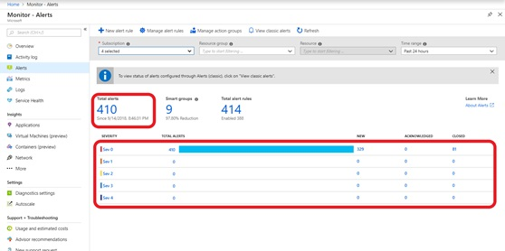
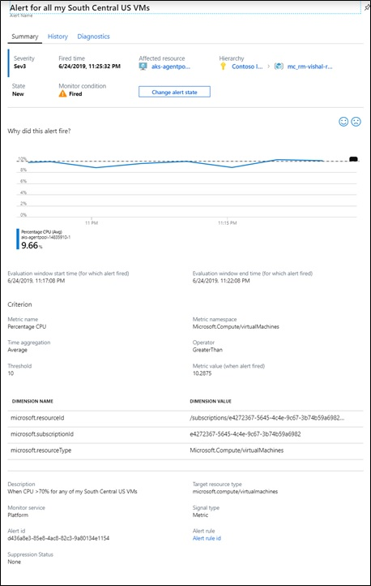

# Manage alert instances
With the [unified alerts experience](https://aka.ms/azure-alerts-overview) in Azure Monitor, you can now see all your different types of alerts across Azure, spanning multiple subscriptions, in one single pane of glass. This article walks you through how you can view your alert instances, and how to deep-dive on the portal to find specific alert instances for troubleshooting.

1. There are three ways to land on the Alerts page

   + In the [portal](https://portal.azure.com/), select **Monitor** and under the Monitor section - choose **Alerts**.  
     
  
   + You can navigate to Alerts from within the context of a specific **resource**. Once a resource is opened, navigate through its table of contents to the Monitoring section, and choose **Alerts**, with the landing page being pre-filtered for alerts on that specific resource.
   
     
    
   + You can navigate to Alerts from within the context of a specific **resource group**. Once a resource group is opened, navigate through its table of contents to the Monitoring section, and choose **Alerts**, with the landing page being pre-filtered for alerts on that specific resource group.    
   
     

1. You will land on the **Alerts Summary** page, which gives you an overview of all your alert instances across Azure. You can modify the summary view by selecting **multiple subscriptions** (a maximum of 5) or by filtering across **resource groups**, specific **resources**, or **time ranges**. Click on either Total Alerts or any of the severity bands to go to the list view for your alerts.     
   
 
1. You will land on the **All Alerts** page, where you will see all the alert instances across Azure listed out. If you’re coming to the portal from an alert notification, you can use the filters available to narrow in on that specific alert instance. (**Note**: if you came to the page by clicking on any of the severity bands, the list will be pre-filtered for that severity when you land). Apart from the filters available on the previous page, you can now also filter on the basis of monitor service (for example, Platform for metrics), monitor condition (fired or resolved), severity, alert state (new/acknowledged/closed), or the smart group ID.

   

   > [!NOTE]
   >  If you came to the page by clicking on any of the severity bands, the list will be pre-filtered for that severity when you land on this page.
 
1. Clicking on any alert instance opens up the **Alert Details** page, allowing you to deep-dive into information about that specific alert instance.   
     

