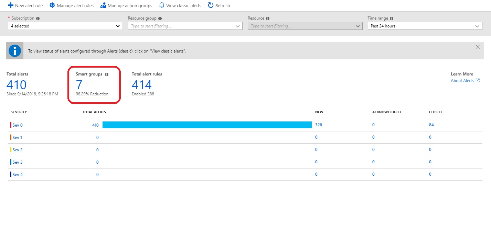
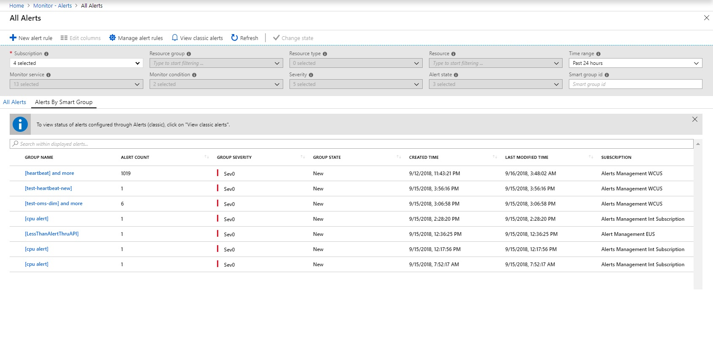

# Manage smart groups
[Smart groups](https://aka.ms/smart-groups) use machine learning algorithms to group together alerts on the basis of co-occurrence or similarity, so that the user can now manage smart groups instead of having to manage each alert individually. This article will walk you through how to access and use smart groups in Azure Monitor.
1.	To see the Smart Groups created for your alert instances you can either
     1.	Click on **Smart Groups** from the **Alerts Summary** page    
    
     2.	Click on Alerts by Smart Groups from the All Alerts page   
     
2.	This takes you to the list view for all Smart Groups created over your alert instances. Instead of sifting through multiple alerts, you can now deal with the smart groups instead.   

3.	Clicking on any Smart Group opens up the details page, where you can see the grouping reason, along with the member alerts. This aggregation allows you to deal with a singular smart group, instead of sifting through multiple alerts.   

