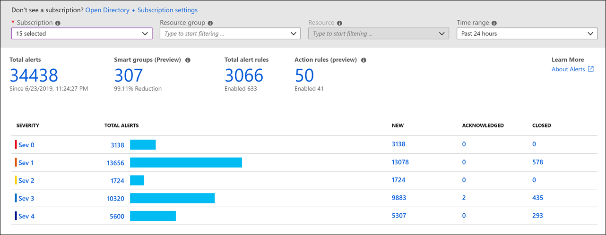
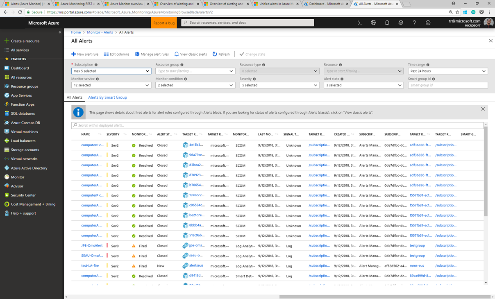
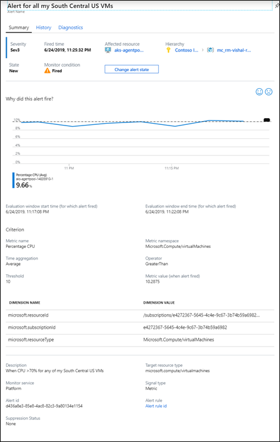

# Overview of alerts in Microsoft Azure 

This article describes what alerts are, their benefits, and how to get started using them.  

## What are alerts in Microsoft Azure?
Alerts proactively notify you when important conditions are found in your monitoring data. They allow you to identify and address issues before the users of your system notice them. 

This article discusses the unified alert experience in Azure Monitor, which includes alerts that were previously managed by Log Analytics and Application Insights. The [previous alert experience](alerts-classic.overview.md) and alert types are called *classic alerts*. You can view this older experience and older alert type by selecting **View classic alerts** at the top of the alert page. 

## Overview

The diagram below represents the flow of alerts. 


Alert rules are separated from alerts and the actions taken when an alert fires. The alert rule captures the target and criteria for alerting. The alert rule can be in an enabled or a disabled state. Alerts only fire when enabled. 

The following are key attributes of an alert rule:

**Target Resource**: Defines the scope and signals available for alerting. A target can be any Azure resource. Example targets: a virtual machine, a storage account, a virtual machine scale set, a Log Analytics workspace, or an Application Insights resource. For certain resources (like virtual machines), you can specify multiple resources as the target of the alert rule.

**Signal**: Emitted by the target resource. Signals can be of the following types: metric, activity log, Application Insights, and log.

**Criteria**: A combination of signal and logic applied on a target resource. Examples: 

- Percentage CPU > 70%
- Server Response Time > 4 ms 
- Result count of a log query > 100

**Alert Name**: A specific name for the alert rule configured by the user.

**Alert Description**: A description for the alert rule configured by the user.

**Severity**: The severity of the alert after the criteria specified in the alert rule is met. Severity can range from 0 to 4.

- Sev 0 = Critical
- Sev 1 = Error
- Sev 2 = Warning
- Sev 3 = Informational
- Sev 4 = Verbose 

**Action**: A specific action taken when the alert is fired. For more information, see [Action Groups](../../azure-monitor/platform/action-groups.md).

## What you can alert on

You can alert on metrics and logs, as described in [monitoring data sources](../../azure-monitor/platform/data-sources.md). These include but are not limited to:

- Metric values
- Log search queries
- Activity log events
- Health of the underlying Azure platform
- Tests for website availability

Previously, Azure Monitor metrics, Application Insights, Log Analytics, and Service Health had separate alerting capabilities. Over time, Azure improved and combined both the user interface and different methods of alerting. This consolidation is still in process. As a result, there are still some alerting capabilities not yet in the new alerts system.  

| **Monitor source** | **Signal type**  | **Description** |
|-------------|----------------|-------------|
| Service health | Activity log  | Not supported. See [Create activity log alerts on service notifications](../../azure-monitor/platform/alerts-activity-log-service-notifications.md).  |
| Application Insights | Web availability tests | Not supported. See [Web test alerts](../../azure-monitor/app/monitor-web-app-availability.md). Available to any website that's instrumented to send data to Application Insights. Receive a notification when availability or responsiveness of a website is below expectations. |

## Manage alerts
You can set the state of an alert to specify where it is in the resolution process. When the criteria specified in the alert rule is met, an alert is created or fired, and it has a status of *New*. You can change the status when you acknowledge an alert and when you close it. All state changes are stored in the history of the alert.

The following alert states are supported.

| State | Description |
|:---|:---|
| New | The issue has just been detected and hasn't yet been reviewed. |
| Acknowledged | An administrator has reviewed the alert and started working on it. |
| Closed | The issue has been resolved. After an alert has been closed, you can reopen it by changing it to another state. |

*Alert state* is different and independent of the *monitor condition*. Alert state is set by the user. Monitor condition is set by the system. When an alert fires, the alert's monitor condition is set to *fired*. When the underlying condition that caused the alert to fire clears, the monitor condition is set to *resolved*. The alert state isn't changed until the user changes it. Learn [how to change the state of your alerts and smart groups](https://aka.ms/managing-alert-smart-group-states).

## Smart groups 

Smart groups are aggregations of alerts based on machine learning algorithms, which can help reduce alert noise and aid in troubleshooting. [Learn more about Smart Groups](https://aka.ms/smart-groups) and [how to manage your smart groups](https://aka.ms/managing-smart-groups).


## Alerts experience 
The default Alerts page provides a summary of alerts that are created within a particular time range. It displays the total alerts for each severity, with columns that identify the total number of alerts in each state for each severity. Select any of the severities to open the [All Alerts](#all-alerts-page) page filtered by that severity.

Alternatively, you can [programmatically enumerate the alert instances generated on your subscriptions by using REST APIs](#manage-your-alert-instances-programmatically).

> [!NOTE]
   >  You can only access alerts generated in the last 30 days.

It doesn't show or track classic alerts. You can change the subscriptions or filter parameters to update the page. 



You can filter this view by selecting values in the drop-down menus at the top of the page.

| Column | Description |
|:---|:---|
| Subscription | Select the Azure subscriptions for which you want to view the alerts. You can optionally choose to select all your subscriptions. Only alerts that you have access to in the selected subscriptions  are included in the view. |
| Resource group | Select a single resource group. Only alerts with targets in the selected resource group are included in the view. |
| Time range | Only alerts fired within the selected time range are included in the view. Supported values are the past hour, the past 24 hours, the past 7 days, and the past 30 days. |

Select the following values at the top of the Alerts page to open another page:

| Value | Description |
|:---|:---|
| Total alerts | The total number of alerts that match the selected criteria. Select this value to open the All Alerts view with no filter. |
| Smart groups | The total number of smart groups that were created from the alerts that match the selected criteria. Select this value to open the smart groups list in the All Alerts view.
| Total alert rules | The total number of alert rules in the selected subscription and resource group. Select this value to open the Rules view filtered on the selected subscription and resource group.


## Manage alert rules
To show the **Rules** page, select **Manage alert rules**. The Rules page is a single place for managing all alert rules across your Azure subscriptions. It lists all alert rules and can be sorted based on target resources, resource groups, rule name, or status. You can also edit, enable, or disable alert rules from this page.  

 


## Create an alert rule
You can author alert rules in a consistent manner, regardless of the monitoring service or signal type.

> [!VIDEO https://www.microsoft.com/en-us/videoplayer/embed/RE4tflw]

 
Here's how to create a new alert rule:
1. Pick the _target_ for the alert.
1. Select the _signal_ from the available signals for the target.
1. Specify the _logic_ to be applied to data from the signal.
 
This simplified authoring process no longer requires you to know the monitoring source or signals that are supported before selecting an Azure resource. The list of available signals is automatically filtered based on the target resource that you select. Also based on that target, you are guided through defining the logic of the alert rule automatically.  

You can learn more about how to create alert rules in [Create, view, and manage alerts using Azure Monitor](../../azure-monitor/platform/alerts-metric.md).

Alerts are available across several Azure monitoring services. For information about how and when to use each of these services, see [Monitoring Azure applications and resources](../../azure-monitor/overview.md). 


## All Alerts page 
To see the **All Alerts** page, select **Total Alerts**. Here you can view a list of alerts created within the selected time. You can view either a list of the individual alerts or a list of the smart groups that contain the alerts. Select the banner at the top of the page to toggle between views.



You can filter the view by selecting the following values in the drop-down menus at the top of the page:

| Column | Description |
|:---|:---|
| Subscription | Select the Azure subscriptions for which you want to view the alerts. You can optionally choose to select all your subscriptions. Only alerts that you have access to in the selected subscriptions  are included in the view. |
| Resource group | Select a single resource group. Only alerts with targets in the selected resource group are included in the view. |
| Resource type | Select one or more resource types. Only alerts with targets of the selected type are included in the view. This column is only available after a resource group has been specified. |
| Resource | Select a resource. Only alerts with that resource as a target are included in the view. This column is only available after a resource type has been specified. |
| Severity | Select an alert severity, or select **All** to include alerts of all severities. |
| Monitor condition | Select a monitor condition, or select **All** to include alerts of all conditions. |
| Alert state | Select an alert state, or select **All** to include alerts of all states. |
| Monitor service | Select a service, or select **All** to include all services. Only alerts created by rules that use service as a target are included. |
| Time range | Only alerts fired within the selected time range are included in the view. Supported values are the past hour, the past 24 hours, the past 7 days, and the past 30 days. |

Select **Columns** at the top of the page to select which columns to show. 

## Alert details page
When you select an alert, this page provides details of the alert and enables you to change its state.



The Alert details page includes the following sections:

| Section | Description |
|:---|:---|
| Summary | Displays the properties and other significant information about the alert. |
| History | Lists each action taken by the alert and any changes made to the alert. Currently limited to state changes. |
| Diagnostics | Information about the smart group in which the alert is included. The *alert count* refers to the number of alerts that are included in the smart group. Includes other alerts in the same smart group that were created in the past 30 days, regardless of the time filter in the alerts list page. Select an alert to view its detail. |

## Role-based access control (RBAC) for your alert instances

The consumption and management of alert instances requires the user to have the built-in RBAC roles of either [monitoring contributor](https://docs.microsoft.com/azure/role-based-access-control/built-in-roles#monitoring-contributor) or [monitoring reader](https://docs.microsoft.com/azure/role-based-access-control/built-in-roles#monitoring-reader). These roles are supported at any Azure Resource Manager scope, from the subscription level to granular assignments at a resource level. For example, if a user only has monitoring contributor access for virtual machine `ContosoVM1`, that user can consume and manage only alerts generated on `ContosoVM1`.

## Manage your alert instances programmatically

You might want to query programmatically for alerts generated against your subscription. This might be to create custom views outside of the Azure portal, or to analyze your alerts to identify patterns and trends.

You can query for alerts generated against your subscriptions either by using the [Alert Management REST API](https://aka.ms/alert-management-api) or by using the [Azure Resource Graph](../../governance/resource-graph/overview.md) and the [REST API for Resources](/rest/api/azureresourcegraph/resourcegraph(2019-04-01)/resources/resources).

The Resource Graph REST API for Resources allows you to query for alert instances at scale. This is recommended when you have to manage alerts generated across many subscriptions. 

The following sample request to the Resource Graph REST API returns the count of alerts within one subscription:

```json
{
  "subscriptions": [
    <subscriptionId>
  ],
  "query": "AlertsManagementResources | where type =~ 'Microsoft.AlertsManagement/alerts' | summarize count()"
}
```

You can also see the result of this Resource Graph query in the portal with Azure Resource Graph Explorer: [portal.azure.com](https://portal.azure.com/?feature.customportal=false#blade/HubsExtension/ArgQueryBlade/query/AlertsManagementResources%20%7C%20where%20type%20%3D~%20%27Microsoft.AlertsManagement%2Falerts%27%20%7C%20summarize%20count())

You can query the alerts for their [essential](alerts-common-schema-definitions.md#essentials) fields.

Use the [Alert Management REST API](https://aka.ms/alert-management-api) to get more information about specific alerts, including their [alert context](alerts-common-schema-definitions.md#alert-context) fields.

## Next steps

- [Learn more about Smart Groups](https://aka.ms/smart-groups)
- [Learn about action groups](../../azure-monitor/platform/action-groups.md)
- [Managing your alert instances in Azure](https://aka.ms/managing-alert-instances)
- [Managing Smart Groups](https://aka.ms/managing-smart-groups)
- [Learn more about Azure alerts pricing](https://azure.microsoft.com/pricing/details/monitor/)


