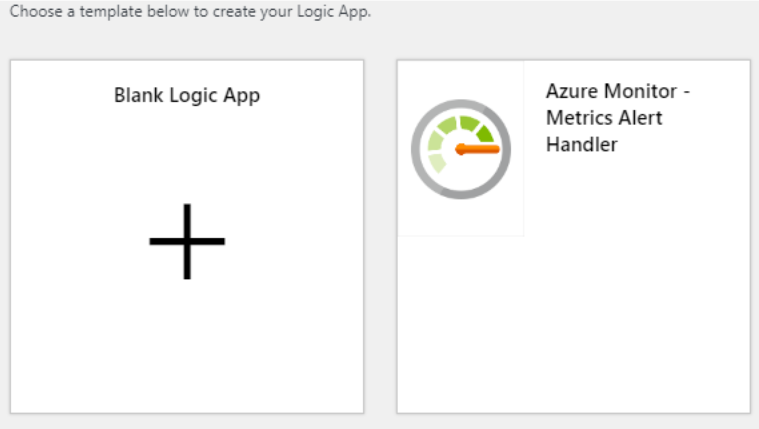

# Prepare your logic apps and run books for classic alert rules migration

As [previously announced](monitoring-classic-retirement.md), classic alerts in Azure Monitor are being retired in July 2019. The migration tool to trigger migration voluntarily is available in Azure portal and is rolling out to customers who use classic alert rules.

If you choose to voluntarily migrate your classic alert rules to new alert rules, there are some differences between the two systems that you should be aware of. This article will walk you through the differences between the two systems and how you can prepare for the change.

## API changes

The APIs used to create/manage classic alert rules (`microsoft.insights/alertrules`) are different from the APIs used to create/manage new metric alerts (`microsoft.insights/metricalerts`). If you programmatically create/manage classic alert rules today, update your deployment scripts to work with new APIs.

The following table provides you a reference to programmatic interfaces for both classic and new alerts.

|         |Classic alerts  |New metric alerts |
|---------|---------|---------|
|REST API     | [microsoft.insights/alertrules](https://docs.microsoft.com/rest/api/monitor/alertrules)         | [microsoft.insights/metricalerts](https://docs.microsoft.com/rest/api/monitor/metricalerts)       |
|Azure CLI     | [az monitor alert](https://docs.microsoft.com/cli/azure/monitor/alert?view=azure-cli-latest)        | [az monitor metrics alert](https://docs.microsoft.com/cli/azure/monitor/metrics/alert?view=azure-cli-latest)        |
|PowerShell      | [Reference](https://docs.microsoft.com/powershell/module/az.monitor/add-azmetricalertrule)       |      |
| Azure Resource Manager template | [For classic alerts](https://docs.microsoft.com/azure/azure-monitor/platform/alerts-enable-template)|[For new metric alerts](https://docs.microsoft.com/azure/azure-monitor/platform/alerts-metric-create-templates)|

## Notification payload changes

The notification payload format is slightly different between [classic alert rules](alerts-webhooks.md) and [new metric alerts](alerts-metric-near-real-time.md#payload-schema). If you have any webhook, logic app or runbook actions being triggered by classic alert rules, you will need to update those notification endpoints to accept the payload format of new metric alerts.

You can use the following table to map the fields between classic alert rule webhook payload and the new metric alert webhook payload.

|  |Classic alerts  |New metric alerts |
|---------|---------|---------|
|Was the alert activated or resolved     | status       | data.status |
|Contextual information about the alert     | context        | data.context        |
|Timestamp at which the alert was activated or resolved      | context.timestamp       | data.context.timestamp        |
| Alert Rule ID | context.id | data.context.id |
| Alert Rule Name | context.name | data.context.name |
| Description of the alert rule | context.description | data.context.description |
| Alert rule condition | context.condition | data.context.condition|
| Metric name | context.condition.metricName| data.context.condition.allOf[0].metricName|
| Time Aggregation (how the metric is aggregated over the evaluation window)|data.context.condition.timeAggregation|data.context.condition.timeAggregation|
| Evaluation period | context.condition.windowSize | data.context.condition.windowSize|
| Operator (how the aggregated metric value is compared against the threshold) | context.condition.operator | data.context.condition.operator|
| Threshold | context.condition.threshold| data.context.condition.allOf[0].threshold|
| Metric value | context.condition.metricValue | data.context.condition.allOf[0].metricValue|
| Subscription ID | context.subscriptionId | data.context.subscriptionId|
| Resource group of the affected resource | context.resourceGroup | data.context.resourceGroup|
| Name of the affected resource | context.resourceName | data.context.resourceName |
| Type of the affected resource | context.resourceType | data.context.resourceType |
|  Resource ID of the affected resource | context.resourceId | data.context.resourceId |
| A direct link to the portal resource summary page | context.portalLink | data.context.portalLink|
| Custom payload fields to be passed to webhook or logic app | properties |data.properties |

As you can see, both the payloads are similar. Following section has details on sample logic apps and a sample runbook to parse the notification payload for new alerts.

## Using a logic app that receives a metric alert notification

If you are using logic apps with classic alerts, you will need to modify your logic app to parse the new metric alerts payload.

1. Create a new logic app.

2. Use the template "Azure Monitor - Metrics Alert Handler". This template has an **HTTP request** trigger with the appropriate schema defined

    

3. Add an action to host your processing logic.

## Using an automation runbook that receives a metric alert notification

The following sample provides PowerShell code that can be used in your runbook that can parse the payloads for both classic metric alert rules and new metric alert rules.

```PS
## Sample PowerShell code to be used in a runbook to handle parsing of both classic and new metric alerts

[OutputType("PSAzureOperationResponse")]

param
(
    [Parameter (Mandatory=$false)]
    [object] $WebhookData
)

$ErrorActionPreference = "stop"

if ($WebhookData)
{
    # Get the data object from WebhookData.
    $WebhookBody = (ConvertFrom-Json -InputObject $WebhookData.RequestBody)

    # Identify if the alert triggering the runbook is a classic metric alert or a new metric alert (depends on the payload schema).
    $schemaId = $WebhookBody.schemaId
    Write-Verbose "schemaId: $schemaId" -Verbose
    if ($schemaId -eq "AzureMonitorMetricAlert") {

        # This is the new Metric Alert schema
        $AlertContext = [object] ($WebhookBody.data).context
        $status = ($WebhookBody.data).status

        # Parse fields related to alert rule condition
        $metricName = $AlertContext.condition.allOf[0].metricName
        $metricValue = $AlertContext.condition.allOf[0].metricValue
        $threshold = $AlertContext.condition.allOf[0].threshold
        $timeAggregation = $AlertContext.condition.allOf[0].timeAggregation
    }
    elseif ($schemaId -eq $null) {
        # This is the classic Metric Alert schema
        $AlertContext = [object] $WebhookBody.context
        $status = $WebhookBody.status

        # Parse fields related to alert rule condition
        $metricName = $AlertContext.condition.metricName
        $metricValue = $AlertContext.condition.metricValue
        $threshold = $AlertContext.condition.threshold
        $timeAggregation = $AlertContext.condition.timeAggregation
    }
    else {
        # The schema is not either a classic metric alert or a new metric alert
        Write-Error "The alert data schema - $schemaId - is not supported."
    }

    #parse fields related to resource affected
    $ResourceName = $AlertContext.resourceName
    $ResourceType = $AlertContext.resourceType
    $ResourceGroupName = $AlertContext.resourceGroupName
    $ResourceId = $AlertContext.resourceId
    $SubId = $AlertContext.subscriptionId

    ## Your logic to handle the alert here.
}
else {
    # Error
    Write-Error "This runbook is meant to be started from an Azure alert webhook only."
}

```

See a full example of a runbook that stops a VM when an alert is triggered in [Azure Automation documentation](https://docs.microsoft.com/azure/automation/automation-create-alert-triggered-runbook).

## Partner integration via webhooks

Most of [our partners that integrate with classic alerts](https://docs.microsoft.com/azure/azure-monitor/platform/partners) already support newer metric alerts through their integrations. Known integrations that already work with new metric alerts are listed below.

- [PagerDuty](https://www.pagerduty.com/docs/guides/azure-integration-guide/)
- [OpsGenie](https://docs.opsgenie.com/docs/microsoft-azure-integration)
- [Signl4](https://www.signl4.com/blog/mobile-alert-notifications-azure-monitor/)

If you are using a partner integration that is not listed here, confirm with the integration provider that the integration works with new metric alerts.

## Next steps

- [How to use the migration tool](alerts-using-migration-tool.md)
- [Understand how the migration tool works](alerts-understand-migration.md)
