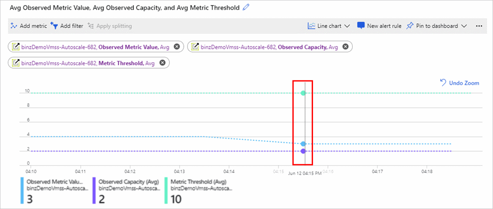
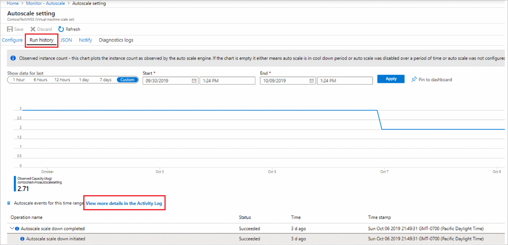

# Troubleshooting Azure autoscale
 
Azure Monitor autoscale helps you to have the right amount of resources running to handle the load on your application. It enables you to add resources to handle increases in load and also save money by removing resources that are sitting idle. You can scale based on a schedule,  fixed date-time, or resource metric you choose. For more information, see [Autoscale Overview](autoscale-overview.md).

The autoscale service provides you metrics and logs to understand what scale actions have occurred and the evaluation of the conditions that led to those actions. You can find answers to questions such as:

- Why did my service scale-out or in?
- Why did my service not scale?
- Why did an autoscale action fail?
- Why is an autoscale action taking time to scale?
  
## Autoscale metrics

Autoscale provides you with [four metrics](metrics-supported.md#microsoftinsightsautoscalesettings) to understand its operation. 

- **Observed Metric Value** - The value of the metric you chose to take the scale action on, as seen or computed by the autoscale engine. Because a single autoscale setting can have multiple rules and therefore multiple metric sources, you can filter using "metric source" as a dimension.
- **Metric Threshold** - The threshold you set to take the scale action. Because a single autoscale setting can have multiple rules and therefore multiple metric sources, you can filter using "metric rule" as a dimension.
- **Observed Capacity** - The active number of instances of the target resource as seen by Autoscale engine.
- **Scale Actions Initiated** - The number of scale-out and scale-in actions initiated by the autoscale engine. You can filter by scale-out vs. scale in actions.

You can use the [Metrics Explorer](metrics-getting-started.md) to chart the above metrics all in one place. The chart should show:

  - the actual metric
  - the metric as seen/computed by autoscale engine
  - the threshold for a scale action
  - the change in capacity 

## Example 1 - Analyzing a simple autoscale rule 

We have a simple autoscale setting for a virtual machine scale set that:

- scales out when the average CPU percentage of a set is greater than 70% for 10 minutes 
- scales in when the CPU percentage of the set is less than 5% for more than 10 minutes. 

Let’s review the metrics from the autoscale service.
 


***Figure 1a - Percentage CPU metric for virtual machine scale set and the Observed Metric Value metric for autoscale setting***


***Figure 1b - Metric Threshold and Observed Capacity***

In figure 1b, the **Metric Threshold** (light blue line) for the scale-out rule is 70.  The **Observed Capacity** (dark blue line) shows the number of active instances, which is currently 3. 

> [!NOTE]
> You will need to filter the **Metric Threshold** by the metric trigger rule dimension scale out (increase) rule to see the scale-out threshold and by the scale in rule (decrease). 

## Example 2 - Advanced autoscaling for a virtual machine scale set

We have an autoscale setting that allows a virtual machine scale set resource to scale out based on its own metric **Outbound Flows**. Notice that the **divide metric by instance count** option for the metric threshold is checked. 

The scale action rule is: 

If the value of **Outbound Flow per instance** is greater than 10, then autoscale service should scale out by 1 instance. 

In this case, the autoscale engine’s observed metric value is calculated as the actual metric value divided by the number of instances. If the observed metric value is less than the threshold, no scale-out action is initiated. 
 




***Figure 2 - Virtual machine scale set autoscale metrics charts example***

In figure 2, you can see two metric charts. 

The chart on top shows the actual value of the **Outbound Flows** metric. The actual value is 6. 

The chart on the bottom shows a few values. 
 - The **Observed Metric value** (light blue) is 3 because there are 2 active instances and 6 divided by 2 is 3. 
 - The **Observed Capacity** (purple) shows the instance count seen by autoscale engine. 
 - The **Metric Threshold** (light green) is set to 10. 

If there are multiple scale action rules, you can use splitting or the **add filter** option in the Metrics explorer chart to look at metric by a specific source or rule. For more information on splitting a metric chart, see [Advanced features of metric charts - splitting](metrics-charts.md#apply-splitting-to-a-chart)

## Example 3 - Understanding autoscale events

In the autoscale setting screen, go to the **Run history** tab to see the most recent scale actions. The tab also shows the change in **Observed Capacity** over time. To find more details about all autoscale actions including operations such as update/delete autoscale settings, view the activity log and filter by autoscale operations.



## Autoscale Resource Logs

Same as any other Azure resource, the autoscale service provides [resource logs](platform-logs-overview.md). There are two categories of logs.

- **Autoscale Evaluations** - The autoscale engine records log entries for every single condition evaluation every time it does a check.  The entry includes details on the observed values of the metrics, the rules evaluated, and if the evaluation resulted in a scale action or not.

- **Autoscale Scale Actions** - The engine records scale action events initiated by autoscale service and the results of those scales actions (success, failure, and how much scaling occurred as seen by the autoscale service).

As with any Azure Monitor supported service, you can use [Diagnostic Settings](diagnostic-settings.md) to route these logs:

- to your Log Analytics workspace for detailed analytics
- to Event Hubs and then to non-Azure tools
- to your Azure storage account for archival  


The previous picture shows the Azure portal autoscale diagnostic settings. There you can select the Diagnostic/Resource Logs tab and enable log collection and routing. You can also perform the same action using REST API, CLI, PowerShell, Resource Manager templates for Diagnostic Settings by choosing the resource type as *Microsoft.Insights/AutoscaleSettings*. 

## Troubleshooting using autoscale logs 

For best troubleshooting experience, we recommend routing your logs to Azure Monitor Logs (Log Analytics) through a workspace when you create the autoscale setting. This process is shown in the picture in the previous section. You can validate the evaluations and scale actions better using Log Analytics.

Once you have configured your autoscale logs to be sent to the Log Analytics workspace, you can execute the following queries to check the logs. 

To get started, try this query to view the most recent autoscale evaluation logs:

```Kusto
AutoscaleEvaluationsLog
| limit 50
```

Or try the following query to view the most recent scale action logs:

```Kusto
AutoscaleScaleActionsLog
| limit 50
```

Use the following sections to  these questions. 

## A scale action occurred that I didn’t expect

First execute the query for scale action to find the scale action you are interested in. If it is the latest scale action, use the following query:

```Kusto
AutoscaleScaleActionsLog
| take 1
```

Select the CorrelationId field from the scale actions log. Use the CorrelationId to find the right Evaluation log. Executing the below query will display all the rules and conditions evaluated leading to that scale action.

```Kusto
AutoscaleEvaluationsLog
| where CorrelationId = "<correliationId>"
```

## What profile caused a scale action?

A scaled action occurred, but you have overlapping rules and profiles and need to track down which caused the action. 

Find the correlationId of the scale action (as explained in example 1) and then execute the query on evaluation logs to learn more about the profile.

```Kusto
AutoscaleEvaluationsLog
| where CorrelationId = "<correliationId_Guid>"
| where ProfileSelected == true
| project ProfileEvaluationTime, Profile, ProfileSelected, EvaluationResult
```

The whole profile evaluation can also be understood better using the following query

```Kusto
AutoscaleEvaluationsLog
| where TimeGenerated > ago(2h)
| where OperationName contains == "profileEvaluation"
| project OperationName, Profile, ProfileEvaluationTime, ProfileSelected, EvaluationResult
```

## A scale action did not occur

I expected a scale action and it did not occur. There may be no scale action events or logs.

Review the autoscale metrics if you are using a metric-based scale rule. It's possible that the **Observed metric value** or **Observed Capacity** are not what you expected them to be and therefore the scale rule did not fire. You would still see evaluations, but not a scale-out rule. It's also possible that the cool-down time kept a scale action from occurring. 

 Review the autoscale evaluation logs during the time period you expected the scale action to occur. Review all the evaluations it did and why it decided to not trigger a scale action.


```Kusto
AutoscaleEvaluationsLog
| where TimeGenerated > ago(2h)
| where OperationName == "MetricEvaluation" or OperationName == "ScaleRuleEvaluation"
| project OperationName, MetricData, ObservedValue, Threshold, EstimateScaleResult
```

## Scale action failed

There may be a case where autoscale service took the scale action but the system decided not to scale or failed to complete the scale action. Use this query to find the failed scale actions.

```Kusto
AutoscaleScaleActionsLog
| where ResultType == "Failed"
| project ResultDescription
```

Create alert rules to get notified of autoscale actions or failures. You can also create alert rules to get notified on autoscale events.

## Schema of autoscale resource logs

For more information, see [autoscale resource logs](autoscale-resource-log-schema.md)

## Next steps
Read information on [autoscale best practices](autoscale-best-practices.md). 
