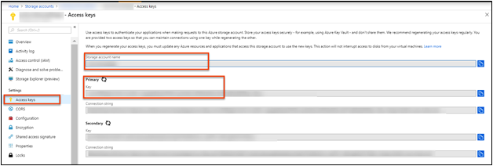

# Send Guest OS metrics to the Azure Monitor metric store classic Cloud Services 

[!INCLUDE [updated-for-az](../../../includes/updated-for-az.md)]

With the Azure Monitor [Diagnostics extension](diagnostics-extension-overview.md), you can collect metrics and logs from the guest operating system (Guest OS) running as part of a virtual machine, cloud service, or Service Fabric cluster. The extension can send telemetry to [many different locations.](https://docs.microsoft.com/azure/monitoring/monitoring-data-collection?toc=/azure/azure-monitor/toc.json)

This article describes the process for sending Guest OS performance metrics for Azure classic Cloud Services to the Azure Monitor metric store. Starting with Diagnostics version 1.11, you can write metrics directly to the Azure Monitor metrics store, where standard platform metrics are already collected. 

Storing them in this location allows you to access the same actions that you can for platform metrics. Actions include near-real time alerting, charting, routing, access from a REST API, and more.  In the past, the Diagnostics extension wrote to Azure Storage, but not to the Azure Monitor data store.  

The process that's outlined in this article works only for performance counters in Azure Cloud Services. It doesn't work for other custom metrics. 

## Prerequisites

- You must be a [service administrator or co-administrator](~/articles/billing/billing-add-change-azure-subscription-administrator.md) on your Azure subscription. 

- Your subscription must be registered with [Microsoft.Insights](https://docs.microsoft.com/azure/azure-resource-manager/resource-manager-supported-services). 

- You need to have either [Azure PowerShell](/powershell/azure) or [Azure Cloud Shell](https://docs.microsoft.com/azure/cloud-shell/overview) installed.

## Provision a cloud service and storage account 

1. Create and deploy a classic cloud service. A sample classic Cloud Services application and deployment can be found at [Get started with Azure Cloud Services and ASP.NET](../../cloud-services/cloud-services-dotnet-get-started.md). 

2. You can use an existing storage account or deploy a new storage account. It's best if the storage account is in the same region as the classic cloud service that you created. In the Azure portal, go to the **Storage accounts** resource blade, and then select **Keys**. Take note of the storage account name and the storage account key. You'll need this information in later steps.

   

## Create a service principal 

Create a service principle in your Azure Active Directory tenant by using the instructions at [Use portal to create an Azure Active Directory application and service principal that can access resources](https://docs.microsoft.com/azure/azure-resource-manager/resource-group-create-service-principal-portal). Note the following while you're going through this process: 

- You can put in any URL for the sign-in URL.  
- Create new client secret for this app.  
- Save the key and the client ID for use in later steps.  

Give the app created in the previous step *Monitoring Metrics Publisher* permissions to the resource you want to emit metrics against. If you plan to use the app to emit custom metrics against many resources, you can grant these permissions at the resource group or subscription level.  

> [!NOTE]
> The Diagnostics extension uses the service principal to authenticate against Azure Monitor and emit metrics for your cloud service.

## Author Diagnostics extension configuration 

Prepare your Diagnostics extension configuration file. This file dictates which logs and performance counters the Diagnostics extension should collect for your cloud service. Following is a sample Diagnostics configuration file:  

```XML
<?xml version="1.0" encoding="utf-8"?> 
<DiagnosticsConfiguration xmlns="http://schemas.microsoft.com/ServiceHosting/2010/10/DiagnosticsConfiguration"> 
  <PublicConfig xmlns="http://schemas.microsoft.com/ServiceHosting/2010/10/DiagnosticsConfiguration"> 
    <WadCfg> 
      <DiagnosticMonitorConfiguration overallQuotaInMB="4096"> 
        <DiagnosticInfrastructureLogs scheduledTransferLogLevelFilter="Error" /> 
        <Directories scheduledTransferPeriod="PT1M"> 
          <IISLogs containerName="wad-iis-logfiles" /> 
          <FailedRequestLogs containerName="wad-failedrequestlogs" /> 
        </Directories> 
        <PerformanceCounters scheduledTransferPeriod="PT1M"> 
          <PerformanceCounterConfiguration counterSpecifier="\Processor(_Total)\% Processor Time" sampleRate="PT15S" /> 
          <PerformanceCounterConfiguration counterSpecifier="\Memory\Available MBytes" sampleRate="PT15S" /> 
          <PerformanceCounterConfiguration counterSpecifier="\Memory\Committed Bytes" sampleRate="PT15S" /> 
          <PerformanceCounterConfiguration counterSpecifier="\Memory\Page Faults/sec" sampleRate="PT15S" /> 
        </PerformanceCounters> 
        <WindowsEventLog scheduledTransferPeriod="PT1M"> 
          <DataSource name="Application!*[System[(Level=1 or Level=2 or Level=3)]]" /> 
          <DataSource name="Windows Azure!*[System[(Level=1 or Level=2 or Level=3 or Level=4)]]" /> 
        </WindowsEventLog> 
        <CrashDumps> 
          <CrashDumpConfiguration processName="WaIISHost.exe" /> 
          <CrashDumpConfiguration processName="WaWorkerHost.exe" /> 
          <CrashDumpConfiguration processName="w3wp.exe" /> 
        </CrashDumps> 
        <Logs scheduledTransferPeriod="PT1M" scheduledTransferLogLevelFilter="Error" /> 
      </DiagnosticMonitorConfiguration> 
      <SinksConfig> 
      </SinksConfig> 
    </WadCfg> 
    <StorageAccount /> 
  </PublicConfig> 
  <PrivateConfig xmlns="http://schemas.microsoft.com/ServiceHosting/2010/10/DiagnosticsConfiguration"> 
    <StorageAccount name="" endpoint="" /> 
</PrivateConfig> 
  <IsEnabled>true</IsEnabled> 
</DiagnosticsConfiguration> 
```

In the "SinksConfig" section of your diagnostics file, define a new Azure Monitor sink: 

```XML
  <SinksConfig> 
    <Sink name="AzMonSink"> 
    <AzureMonitor> 
      <ResourceId>-Provide ClassicCloudService’s Resource ID-</ResourceId> 
      <Region>-Azure Region your Cloud Service is deployed in-</Region> 
    </AzureMonitor> 
    </Sink> 
  </SinksConfig> 
```

In the section of your configuration file where you list the performance counters to collect, add the Azure Monitor sink. This entry ensures that all the performance counters that you specified are routed to Azure Monitor as metrics. You can add or remove performance counters according to your needs. 

```xml
    <PerformanceCounters scheduledTransferPeriod="PT1M" sinks="AzMonSink">
        <PerformanceCounterConfiguration counterSpecifier="\Processor(_Total)\% Processor Time" sampleRate="PT15S" />
    ...
    </PerformanceCounters>
```

Finally, in the private configuration, add an *Azure Monitor Account* section. Enter the service principal client ID and secret that you created earlier. 

```XML
<PrivateConfig xmlns="http://schemas.microsoft.com/ServiceHosting/2010/10/DiagnosticsConfiguration"> 
  <StorageAccount name="" endpoint="" /> 
    <AzureMonitorAccount> 
      <ServicePrincipalMeta> 
        <PrincipalId>clientId from step 3</PrincipalId> 
        <Secret>client secret from step 3</Secret> 
      </ServicePrincipalMeta> 
    </AzureMonitorAccount> 
</PrivateConfig> 
```

Save this diagnostics file locally.  

## Deploy the Diagnostics extension to your cloud service 

Launch PowerShell and log in to Azure. 

```powershell
Login-AzAccount 
```

Use the following commands to store the details of the storage account that you created earlier. 

```powershell
$storage_account = <name of your storage account from step 3> 
$storage_keys = <storage account key from step 3> 
```

Similarly, set the diagnostics file path to a variable by using the following command:

```powershell
$diagconfig = “<path of the Diagnostics configuration file with the Azure Monitor sink configured>” 
```

Deploy the Diagnostics extension to your cloud service with the diagnostics file with the Azure Monitor sink configured using the following command:  

```powershell
Set-AzureServiceDiagnosticsExtension -ServiceName <classicCloudServiceName> -StorageAccountName $storage_account -StorageAccountKey $storage_keys -DiagnosticsConfigurationPath $diagconfig 
```

> [!NOTE] 
> It's still mandatory to provide a storage account as part of the installation of the Diagnostics extension. Any logs or performance counters that are specified in the diagnostics config file are written to the specified storage account.  

## Plot metrics in the Azure portal 

1. Go to the Azure portal. 

   

2. On the left menu, select **Monitor.**

3. On the **Monitor** blade, select the **Metrics Preview** tab.

4. In the resources drop-down menu, select your classic cloud service.

5. In the namespaces drop-down menu, select **azure.vm.windows.guest**. 

6. In the metrics drop-down menu, select **Memory\Committed Bytes in Use**. 

You use the dimension filtering and splitting capabilities to view the total memory that's used by a specific role or role instance. 

 

## Next steps

- Learn more about [custom metrics](metrics-custom-overview.md).

