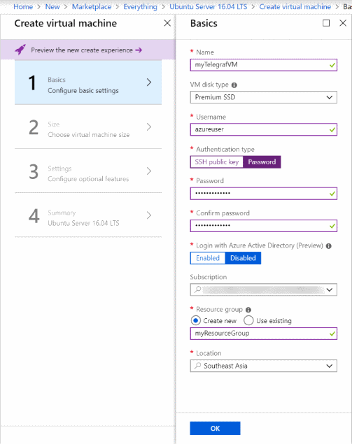
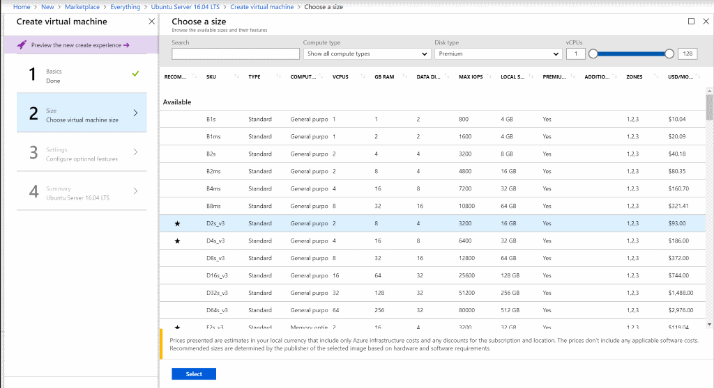
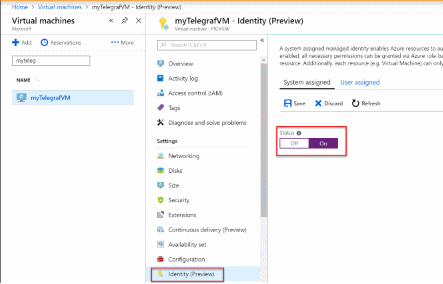
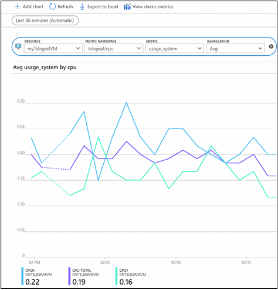

# Collect custom metrics for a Linux VM with the InfluxData Telegraf agent

By using Azure Monitor, you can collect custom metrics via your application telemetry, an agent running on your Azure resources, or even outside-in monitoring systems. Then you can submit them directly to Azure Monitor. This article provides instructions on how to deploy the [InfluxData](https://www.influxdata.com/) Telegraf agent on a Linux VM in Azure and configure the agent to publish metrics to Azure Monitor. 

## InfluxData Telegraf agent 

[Telegraf](https://docs.influxdata.com/telegraf/v1.7/) is a plug-in-driven agent that enables the collection of metrics from over 150 different sources. Depending on what workloads run on your VM, you can configure the agent to leverage specialized input plug-ins to collect metrics. Examples are MySQL, NGINX, and Apache. By using output plug-ins, the agent can then write to destinations that you choose. The Telegraf agent has integrated directly with the Azure Monitor custom metrics REST API. It supports an Azure Monitor output plug-in. By using this plug-in, the agent can collect workload-specific metrics on your Linux VM and submit them as custom metrics to Azure Monitor. 

 

## Send custom metrics 

For this tutorial, we deploy a Linux VM that runs the Ubuntu 16.04 LTS operating system. The Telegraf agent is supported for most Linux operating systems. Both Debian and RPM packages are available along with unpackaged Linux binaries on the [InfluxData download portal](https://portal.influxdata.com/downloads). See this [Telegraf installation guide](https://docs.influxdata.com/telegraf/v1.8/introduction/installation/) for additional installation instructions and options. 

Sign in to the [Azure portal](https://portal.azure.com).

Create a new Linux VM: 

1. Select the **Create a resource** option from the left-hand navigation pane. 
1. Search for **Virtual Machine**.  
1. Select **Ubuntu 16.04 LTS** and select **Create**. 
1. Provide a VM name like **MyTelegrafVM**.  
1. Leave the disk type as **SSD**. Then provide a **username**, such as **azureuser**. 
1. For **Authentication type**, select **Password**. Then enter a password you'll use later to SSH into this VM. 
1. Choose to **Create new resource group**. Then provide a name, such as **myResourceGroup**. Choose your **Location**. Then select **OK**. 

    

1. Select a size for the VM. You can filter by **Compute type** or **Disk type**, for example. 

    

1. On the **Settings** page in **Network** > **Network Security Group** > **Select public inbound ports**, select **HTTP** and **SSH (22)**. Leave the rest of the defaults and select **OK**. 

1. On the summary page, select **Create** to start the VM deployment. 

1. The VM is pinned to the Azure portal dashboard. After the deployment finishes, the VM summary automatically opens. 

1. In the VM pane, navigate to the **Identity** tab. Ensure that your VM has a system-assigned identity set to **On**. 
 
    
 
## Connect to the VM 

Create an SSH connection with the VM. Select the **Connect** button on the overview page for your VM. 


In the **Connect to virtual machine** page, keep the default options to connect by DNS name over port 22. In **Login using VM local account**, a connection command is shown. Select the button to copy the command. The following example shows what the SSH connection command looks like: 

```cmd
ssh azureuser@XXXX.XX.XXX 
```

Paste the SSH connection command into a shell, such as Azure Cloud Shell or Bash on Ubuntu on Windows, or use an SSH client of your choice to create the connection. 

## Install and configure Telegraf 

To install the Telegraf Debian package onto the VM, run the following commands from your SSH session: 

```cmd
# download the package to the VM 
wget https://dl.influxdata.com/telegraf/releases/telegraf_1.8.0~rc1-1_amd64.deb 
# install the package 
sudo dpkg -i telegraf_1.8.0~rc1-1_amd64.deb
```
Telegraf’s configuration file defines Telegraf’s operations. By default, an example configuration file is installed at the path **/etc/telegraf/telegraf.conf**. The example configuration file lists all possible input and output plug-ins. However, we'll create a custom configuration file and have the agent use it by running the following commands: 

```cmd
# generate the new Telegraf config file in the current directory 
telegraf --input-filter cpu:mem --output-filter azure_monitor config > azm-telegraf.conf 

# replace the example config with the new generated config 
sudo cp azm-telegraf.conf /etc/telegraf/telegraf.conf 
```

> [!NOTE]  
> The preceding code enables only two input plug-ins: **cpu** and **mem**. You can add more input plug-ins, depending on the workload that runs on your machine. Examples are Docker, MySQL, and NGINX. For a full list of input plug-ins, see the **Additional configuration** section. 

Finally, to have the agent start using the new configuration, we force the agent to stop and start by running the following commands: 

```cmd
# stop the telegraf agent on the VM 
sudo systemctl stop telegraf 
# start the telegraf agent on the VM to ensure it picks up the latest configuration 
sudo systemctl start telegraf 
```
Now the agent will collect metrics from each of the input plug-ins specified and emit them to Azure Monitor. 

## Plot your Telegraf metrics in the Azure portal 

1. Open the [Azure portal](https://portal.azure.com). 

1. Navigate to the new **Monitor** tab. Then select **Metrics**.  

     

1. Select your VM in the resource selector.

     

1. Select the **Telegraf/CPU** namespace, and select the **usage_system** metric. You can choose to filter by the dimensions on this metric or split on them.  

     

## Additional configuration 

The preceding walkthrough provides information on how to configure the Telegraf agent to collect metrics from a few basic input plug-ins. The Telegraf agent has support for over 150 input plug-ins, with some supporting additional configuration options. InfluxData has published a [list of supported plugins](https://docs.influxdata.com/telegraf/v1.7/plugins/inputs/) and instructions on [how to configure them](https://docs.influxdata.com/telegraf/v1.7/administration/configuration/).  

Additionally, in this walkthrough, you used the Telegraf agent to emit metrics about the VM the agent is deployed on. The Telegraf agent can also be used as a collector and forwarder of metrics for other resources. To learn how to configure the agent to emit metrics for other Azure resources, see [Azure Monitor Custom Metric Output for Telegraf](https://github.com/influxdata/telegraf/blob/fb704500386214655e2adb53b6eb6b15f7a6c694/plugins/outputs/azure_monitor/README.md).  

## Clean up resources 

When they're no longer needed, you can delete the resource group, virtual machine, and all related resources. To do so, select the resource group for the virtual machine and select **Delete**. Then confirm the name of the resource group to delete. 

## Next steps
- Learn more about [custom metrics](metrics-custom-overview.md).


