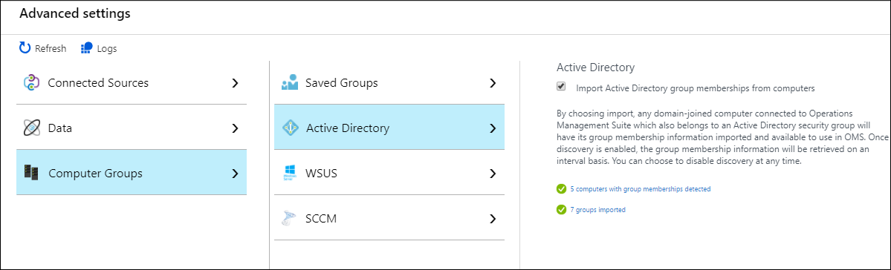
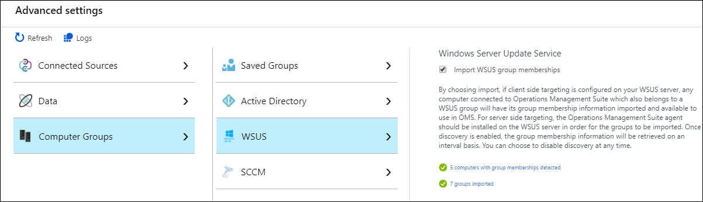
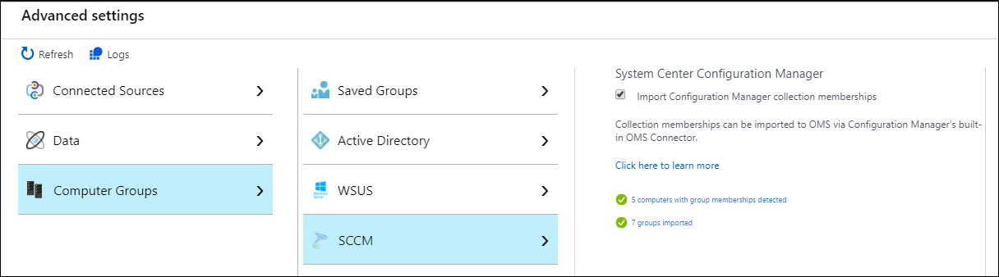

# Computer groups in Azure Monitor log queries
Computer groups in Azure Monitor allow you to scope [log queries](../log-query/log-query-overview.md) to a particular set of computers.  Each group is populated with computers either using a query that you define or by importing groups from different sources.  When the group is included in a log query, the results are limited to records that match the computers in the group.

[!INCLUDE [azure-monitor-log-analytics-rebrand](../../../includes/azure-monitor-log-analytics-rebrand.md)]

## Creating a computer group
You can create a computer group in Azure Monitor using any of the methods in the following table.  Details on each method are provided in the sections below. 

| Method | Description |
|:--- |:--- |
| Log query |Create a log query that returns a list of computers. |
| Log Search API |Use the Log Search API to programmatically create a computer group based on the results of a log query. |
| Active Directory |Automatically scan the group membership of any agent computers that are members of an Active Directory domain and create a group in Azure Monitor for each security group. (Windows machines only)|
| Configuration Manager | Import collections from Microsoft Endpoint Configuration Manager and create a group in Azure Monitor for each. |
| Windows Server Update Services |Automatically scan WSUS servers or clients for targeting groups and create a group in Azure Monitor for each. |

### Log query
Computer groups created from a log query contain all of the computers returned by a query that you define.  This query is run every time the computer group is used so that any changes since the group was created is reflected.  

You can use any query for a computer group, but it must return a distinct set of computers by using `distinct Computer`.  Following is a typical example query that you could use for as a computer group.

    Heartbeat | where Computer contains "srv" | distinct Computer

Use the following procedure to create a computer group from a log search in the Azure portal.

1. Click **Logs** in the **Azure Monitor** menu in the Azure portal.
1. Create and run a query that returns the computers that you want in the group.
1. Click **Save** at the top of the screen.
1. Change **Save as** to **Function** and select **Save this query as a computer group**.
1. Provide values for each property for the computer group described in the table and click **Save**.

The following table describes the properties that define a computer group.

| Property | Description |
|:---|:---|
| Name   | Name of the query  to display in the portal. |
| Function alias | A unique alias used to identify the computer group in a query. |
| Category       | Category to organize the queries in the portal. |


### Active Directory
When you configure Azure Monitor to import Active Directory group memberships, it analyzes the group membership of any Windows domain joined computers with the Log Analytics agent.  A computer group is created in Azure Monitor for each security group in Active Directory, and each Windows computer is added to the computer groups corresponding to the security groups they are members of.  This membership is continuously updated every 4 hours.  

> [!NOTE]
> Imported Active Directory groups only contain Windows machines.

You configure Azure Monitor to import Active Directory security groups from **Advanced settings** in your Log Analytics workspace in the Azure portal.  Select **Computer Groups**, **Active Directory**, and then **Import Active Directory group memberships from computers**.  There is no further configuration required.



When groups have been imported, the menu lists the number of computers with group membership detected and the number of groups imported.  You can click on either of these links to return the **ComputerGroup** records with this information.

### Windows Server Update Service
When you configure Azure Monitor to import WSUS group memberships, it analyzes the targeting group membership of any computers with the Log Analytics agent.  If you are using client-side targeting, any computer that is connected to Azure Monitor and is part of any WSUS targeting groups has its group membership imported to Azure Monitor. If you are using server-side targeting, the Log Analytics agent should be installed on the WSUS server in order for the group membership information to be imported to Azure Monitor.  This membership is continuously updated every 4 hours. 

You configure Azure Monitor to import WSUS groups from **Advanced settings** in your Log Analytics workspace in the Azure portal.  Select **Computer Groups**, **WSUS**, and then **Import WSUS group memberships**.  There is no further configuration required.



When groups have been imported, the menu lists the number of computers with group membership detected and the number of groups imported.  You can click on either of these links to return the **ComputerGroup** records with this information.

### Configuration Manager
When you configure Azure Monitor to import Configuration Manager collection memberships, it creates a computer group for each collection.  The collection membership information is retrieved every 3 hours to keep the  computer groups current. 

Before you can import Configuration Manager collections, you must [connect Configuration Manager to Azure Monitor](collect-sccm.md).  



When collections have been imported, the menu lists the number of computers with group membership detected and the number of groups imported.  You can click on either of these links to return the **ComputerGroup** records with this information.

## Managing computer groups
You can view computer groups that were created from a log query or the Log Search API from **Advanced settings** in your Log Analytics workspace in the Azure portal.  Select **Computer Groups** and then **Saved Groups**.  

Click the **x** in the **Remove** column to delete the computer group.  Click the **View members** icon for a group to run the group's log search that returns its members.  You can't modify a computer group but instead must delete and then recreate it with the modified settings.


## Using a computer group in a log query
You use a Computer group created from a log query in a query by treating its alias as a function, typically with the following syntax:

  `Table | where Computer in (ComputerGroup)`

For example, you could use the following to return UpdateSummary records for only computers in a computer group called mycomputergroup.
 
  `UpdateSummary | where Computer in (mycomputergroup)`


Imported computer groups and their included computers are stored in the **ComputerGroup** table.  For example, the following query would return a list of computers in the Domain Computers group from Active Directory. 

  `ComputerGroup | where GroupSource == "ActiveDirectory" and Group == "Domain Computers" | distinct Computer`

The following query would return UpdateSummary records for only computers in Domain Computers.

  ```
  let ADComputers = ComputerGroup | where GroupSource == "ActiveDirectory" and Group == "Domain Computers" | distinct Computer;
  UpdateSummary | where Computer in (ADComputers)
  ```


## Computer group records
A record is created in the Log Analytics workspace for each computer group membership created from Active Directory or WSUS.  These records have a type of **ComputerGroup** and have the properties in the following table.  Records are not created for computer groups based on log queries.

| Property | Description |
|:--- |:--- |
| `Type` |*ComputerGroup* |
| `SourceSystem` |*SourceSystem* |
| `Computer` |Name of the member computer. |
| `Group` |Name of the group. |
| `GroupFullName` |Full path to the group including the source and source name. |
| `GroupSource` |Source that group was collected from. <br><br>ActiveDirectory<br>WSUS<br>WSUSClientTargeting |
| `GroupSourceName` |Name of the source that the group was collected from.  For Active Directory, this is the domain name. |
| `ManagementGroupName` |Name of the management group for SCOM agents.  For other agents, this is AOI-\<workspace ID\> |
| `TimeGenerated` |Date and time the computer group was created or updated. |

## Next steps
* Learn about [log queries](../log-query/log-query-overview.md) to analyze the data collected from data sources and solutions.  

