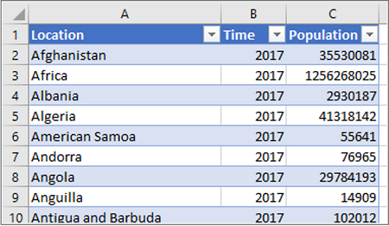
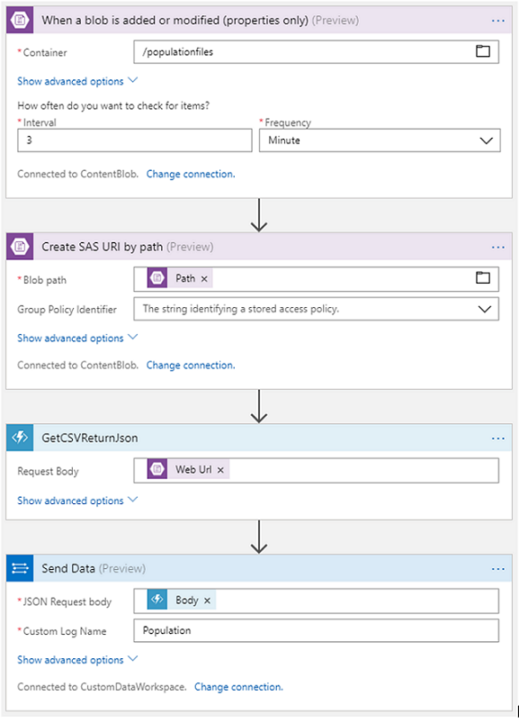

# Create a data pipeline with the Data Collector API

The [Azure Monitor Data Collector API](data-collector-api.md) allows you to import any custom log data into a Log Analytics workspace in Azure Monitor. The only requirements are that the data be JSON-formatted and split into 30 MB or less segments. This is a completely flexible mechanism that can be plugged into in many ways: from data being sent directly from your application, to one-off adhoc uploads. This article will outline some starting points for a common scenario: the need to upload data stored in files on a regular, automated basis. While the pipeline presented here will not be the most performant or otherwise optimized, it is intended to serve as a starting point towards building a production pipeline of your own.

[!INCLUDE [azure-monitor-log-analytics-rebrand](../../../includes/azure-monitor-log-analytics-rebrand.md)]

## Example problem
For the remainder of this article, we will examine page view data in Application Insights. In our hypothetical scenario, we want to correlate geographical information collected by default by the Application Insights SDK to custom data containing the population of every country/region in the world, with the goal of identifying where we should be spending the most marketing dollars. 

We use a public data source such as the [UN World Population Prospects](https://esa.un.org/unpd/wpp/) for this purpose. The data will have the following simple schema:



In our example, we assume that we will upload a new file with the latest year’s data as soon as it becomes available.

## General design
We are using a classic ETL-type logic to design our pipeline. The architecture will look as follows:


This article will not cover how to create data or [upload it to an Azure Blob Storage account](../../storage/blobs/storage-upload-process-images.md). Rather, we pick the flow up as soon as a new file is uploaded to the blob. From here:

1. A process will detect that new data has been uploaded.  Our example uses an [Azure Logic App](../../logic-apps/logic-apps-overview.md), which has available a trigger to detect new data being uploaded to a blob.

2. A processor reads this new data and converts it to JSON, the format required by Azure Monitor  In this example, we use an [Azure Function](../../azure-functions/functions-overview.md) as a lightweight, cost-efficient way of executing our processing code. The function is kicked off by the same Logic App that we used to detect a the new data.

3. Finally, once the JSON object is available, it is sent to Azure Monitor. The same Logic App sends the data to Azure Monitor using the built in Log Analytics Data Collector activity.

While the detailed setup of the blob storage, Logic App, or Azure Function is not outlined in this article, detailed instructions are available on the specific products’ pages.

To monitor this pipeline, we use Application Insights to monitor our Azure Function [details here](../../azure-functions/functions-monitoring.md), and Azure Monitor to monitor our Logic App [details here](../../logic-apps/logic-apps-monitor-your-logic-apps-oms.md). 

## Setting up the pipeline
To set the pipeline, first make sure you have your blob container created and configured. Likewise, make sure that the Log Analytics workspace where you’d like to send the data to is created.

## Ingesting JSON data
Ingesting JSON data is trivial with Logic Apps, and since no transformation needs to take place, we can encase the entire pipeline in a single Logic App. Once both the blob container and the Log Analytics workspace have been configured, create a new Logic App and configure it as follows:


Save your Logic App and proceed to test it.

## Ingesting XML, CSV, or other formats of data
Logic Apps today does not have built-in capabilities to easily transform XML, CSV, or other types into JSON format. Therefore, we need to use another means to complete this transformation. For this article, we use the serverless compute capabilities of Azure Functions as a very lightweight and cost-friendly way of doing so. 

In this example, we parse a CSV file, but any other file type can be similarly processed. Simply modify the deserializing portion of the Azure Function to reflect the correct logic for your specific data type.

1.  Create a new Azure Function, using the Function runtime v1 and consumption-based when prompted.  Select the **HTTP trigger** template targeted at C# as a starting point that configures your bindings as we require. 
2.  From the **View Files** tab on the right pane, create a new file called **project.json** and paste the following code from NuGet packages that we are using:

    
    
    ``` JSON
    {
      "frameworks": {
        "net46":{
          "dependencies": {
            "CsvHelper": "7.1.1",
            "Newtonsoft.Json": "11.0.2"
          }  
        }  
       }  
     }  
    ```

3. Switch to **run.csx** from the right pane, and replace the default code with the following. 

    >[!NOTE]
    >For your project, you have to replace the record model (the “PopulationRecord” class) with your own data schema.
    >

    ```   
    using System.Net;
    using Newtonsoft.Json;
    using CsvHelper;
    
    class PopulationRecord
    {
        public String Location { get; set; }
        public int Time { get; set; }
        public long Population { get; set; }
    }

    public static async Task<HttpResponseMessage> Run(HttpRequestMessage req, TraceWriter log)
    {
        string filePath = await req.Content.ReadAsStringAsync(); //get the CSV URI being passed from Logic App
        string response = "";

        //get a stream from blob
        WebClient wc = new WebClient();
        Stream s = wc.OpenRead(filePath);         

        //read the stream
        using (var sr = new StreamReader(s))
        {
            var csvReader = new CsvReader(sr);
    
            var records = csvReader.GetRecords<PopulationRecord>(); //deserialize the CSV stream as an IEnumerable
    
            response = JsonConvert.SerializeObject(records); //serialize the IEnumerable back into JSON
        }    

        return response == null
            ? req.CreateResponse(HttpStatusCode.BadRequest, "There was an issue getting data")
            : req.CreateResponse(HttpStatusCode.OK, response);
     }  
    ```

4. Save your function.
5. Test the function to make sure the code is working correctly. Switch to the **Test** tab in the right pane, configuring the test as follows. Place a link to a blob with sample data into the **Request body** textbox. After clicking **Run**, you should see JSON output in the **Output** box:

    

Now we need to go back and modify the Logic App we started building earlier to include the data ingested and converted to JSON format.  Using View Designer, configure as follows and then save your Logic App:



## Testing the pipeline
Now you can upload a new file to the blob configured earlier and have it monitored by your  Logic App. Soon, you should see a new instance of the Logic App kick off, call out to your Azure Function, and then successfully send the data to Azure Monitor. 

>[!NOTE]
>It can take up to 30 minutes for the data to appear in Azure Monitor the first time you send a new data type.


## Correlating with other data in Log Analytics and Application Insights
To complete our goal of correlating Application Insights page view data with the population data we ingested from our custom data source, run the following query from either your Application Insights Analytics window or Log Analytics workspace:

``` KQL
app("fabrikamprod").pageViews
| summarize numUsers = count() by client_CountryOrRegion
| join kind=leftouter (
   workspace("customdatademo").Population_CL
) on $left.client_CountryOrRegion == $right.Location_s
| project client_CountryOrRegion, numUsers, Population_d
```

The output should show the two data sources now joined.  


## Suggested improvements for a production pipeline
This article presented a working prototype, the logic behind which can be applied towards a true production-quality solution. For such a production-quality solution, the following improvements are recommended:

* Add error handling and retry logic in your Logic App and Function.
* Add logic to ensure that the 30MB/single Log Analytics Ingestion API call limit is not exceeded. Split the data into smaller segments if needed.
* Set up a clean-up policy on your blob storage. Once successfully sent to the Log Analytics workspace, unless you’d like to keep the raw data available for archival purposes, there is no reason to continue storing it. 
* Verify monitoring is enabled across the full pipeline, adding trace points and alerts as appropriate.
* Leverage source control to manage the code for your function and Logic App.
* Ensure that a proper change management policy is followed, such that if the schema changes, the function and Logic Apps are modified accordingly.
* If you are uploading multiple different data types, segregate them into individual folders within your blob container, and create logic to fan the logic out based on the data type. 


## Next steps
Learn more about the  [Data Collector API](data-collector-api.md) to write data to Log Analytics workspace from any REST API client.
