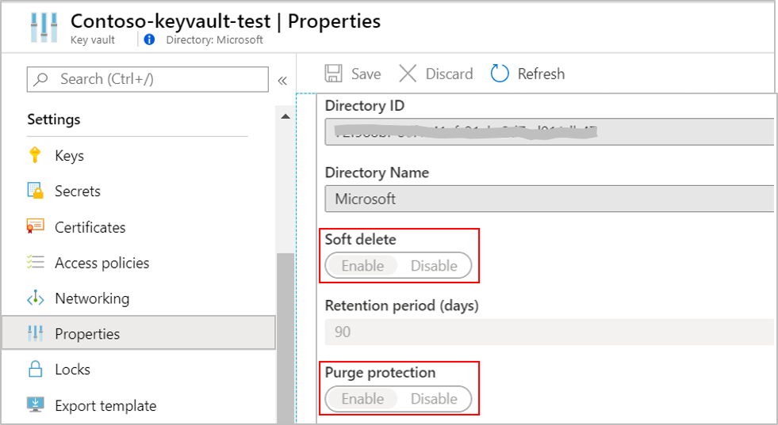
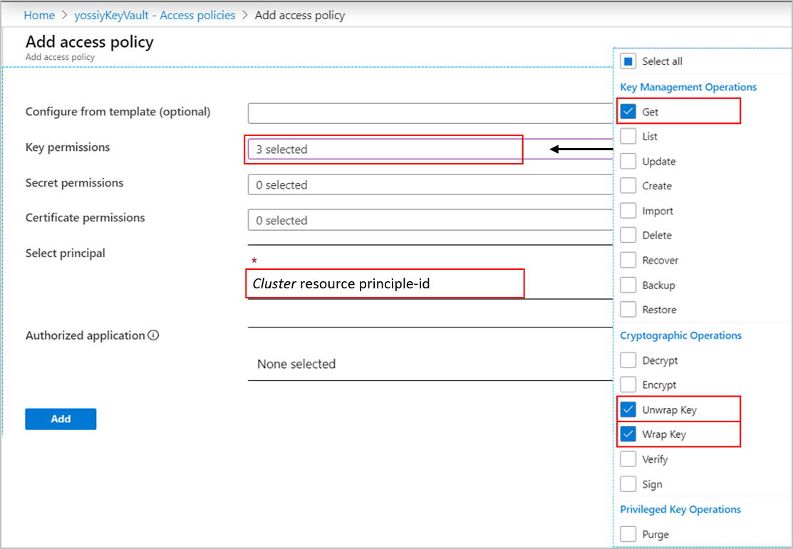

# Azure Monitor customer-managed key 

This article provides background information and steps to configure customer-Managed Keys (CMK) for your Log Analytics workspaces. Once configured, any data sent to your workspaces is encrypted with your Azure Key Vault key.

We recommend you review [Limitations and constraints](#limitationsandconstraints) below before configuration.

## Customer-managed key (CMK) overview

[Encryption at Rest](https://docs.microsoft.com/azure/security/fundamentals/encryption-atrest) is a common privacy and security requirement in organizations. You can let Azure completely manage Encryption at Rest, while you have various options to closely manage encryption or encryption keys.

Azure Monitor ensures that all data is encrypted at rest using Azure-managed keys. Azure Monitor also provides an option for data encryption using your own key that is stored in your [Azure Key Vault](https://docs.microsoft.com/azure/key-vault/key-vault-overview) and accessed by storage using system-assigned [managed identity](https://docs.microsoft.com/azure/active-directory/managed-identities-azure-resources/overview) authentication. This key can be either [software or hardware-HSM protected](https://docs.microsoft.com/azure/key-vault/key-vault-overview).

Azure Monitor use of encryption is identical to the way [Azure Storage encryption](https://docs.microsoft.com/azure/storage/common/storage-service-encryption#about-azure-storage-encryption) operates.

CMK lets you control the access to your data and revoke it at any time. Azure Monitor storage always respects changes in key permissions within an hour. Data ingested in the last 14 days is also kept in hot-cache (SSD-backed) for efficient query engine operation. This data remains encrypted with Microsoft keys regardless CMK configuration, but your control over SSD data adheres to [key revocation](#cmk-kek-revocation). We are working to have SSD data encrypted with CMK in the second half of 2020.

The CMK capability is delivered on dedicated Log Analytics clusters. To verify that we have the required capacity in your region, we require that your subscription is allowed beforehand. Use your Microsoft contact to get your subscription allowed before you start configuring CMK.

The [Log Analytics clusters pricing model](https://docs.microsoft.com/azure/azure-monitor/platform/manage-cost-storage#log-analytics-dedicated-clusters) uses Capacity Reservations starting at a 1000 GB/day level.

## How CMK works in Azure Monitor

Azure Monitor leverages system-assigned managed identity to grant access to your Azure Key Vault. 
System-assigned managed identity can only be associated with a single Azure resource while the identity of the Log Analytics cluster is supported at the cluster level -- This dictates that the CMK capability is delivered on a dedicated Log Analytics cluster. To support CMK on multiple workspaces, a new Log Analytics *Cluster* resource performs as an intermediate identity connection between your Key Vault and your Log Analytics workspaces. The Log Analytics cluster storage uses the managed identity that\'s associated with the *Cluster* resource to authenticate to your Azure Key Vault via Azure Active Directory. 

After CMK configuration, any data ingested to workspaces associated to your *Cluster* resource gets encrypted with your key in Key Vault. You can disassociate workspaces from the *Cluster* resource at any time. New data gets ingested to Log Analytics storage and encrypted with Microsoft key, while you can query your new and old data seamlessly.


1. Key Vault
2. Log Analytics *Cluster* resource having managed identity with permissions to Key Vault -- The identity is propagated to the underlay dedicated Log Analytics cluster storage
3. Dedicated Log Analytics cluster
4. Workspaces associated to *Cluster* resource for CMK encryption

## Encryption keys operation

There are 3 types of keys involved in Storage data encryption:

- **KEK** - Key Encryption Key (CMK)
- **AEK** - Account Encryption Key
- **DEK** - Data Encryption Key

The following rules apply:

- The Log Analytics cluster storage accounts generate unique encryption key for every Storage account, which is known as the AEK.

- The AEK is used to derive DEKs, which are the keys that are used to
    encrypt each block of data written to disk.

- When you configure your key in Key Vault and reference it in the *Cluster* resource, the Azure Storage sends requests to your Azure Key Vault to wrap and unwrap the AEK to perform data encryption and decryption operations.

- Your KEK never leaves your Key Vault and in the case of an HSM key,
    it never leaves the hardware.

- Azure Storage uses the managed identity that's associated with the
    *Cluster* resource to authenticate and access to Azure Key Vault via
    Azure Active Directory.

## CMK provisioning procedure

1. Allowing subscription -- The CMK capability is delivered on dedicated Log Analytics clusters. To verify that we have the required capacity in your region, we require that your subscription is allowed beforehand. Use your Microsoft contact to get your subscription allowed.
2. Creating Azure Key Vault and storing key
3. Creating a *Cluster* resource
4. Granting permissions to your Key Vault
5. Associating Log Analytics workspaces

The procedure is not supported in Azure portal and provisioning is performed via PowerShell or REST requests.

> [!IMPORTANT]
> Any REST request must include a Bearer authorization token in the request header.

For example:

```rst
GET https://management.azure.com/subscriptions/<subscription-id>/resourcegroups/<resource-group-name>/providers/Microsoft.OperationalInsights/workspaces/<workspace-name>?api-version=2020-03-01-preview
Authorization: Bearer eyJ0eXAiO....
```

Where *eyJ0eXAiO....* represents the full Authorization token. 

You can acquire the token using one of these methods:

1. Use [App registrations](https://docs.microsoft.com/graph/auth/auth-concepts#access-tokens) method.
2. In the Azure portal
    1. Navigate to Azure portal while in "developer tool" (F12)
    1. Look for authorization string under "Request Headers" in one of the "batch?api-version" instances. It looks like: "authorization: Bearer eyJ0eXAiO....". 
    1. Copy and add it to your API call per the examples below.
3. Navigate to Azure REST documentation site. Press "Try it" on any API and copy the Bearer token.

### Asynchronous operations and status check

Some of the operations in this configuration procedure run asynchronously because they can't be completed quickly. When using REST requests in configuration, the response initially returns an HTTP status code 200 (OK) and header with *Azure-AsyncOperation* property when accepted:
```json
"Azure-AsyncOperation": "https://management.azure.com/subscriptions/subscription-id/providers/Microsoft.OperationalInsights/locations/region-name/operationStatuses/operation-id?api-version=2020-03-01-preview"
```

Then you can check the status of the asynchronous operation by sending a GET request to the *Azure-AsyncOperation* header value:
```rst
GET https://management.azure.com/subscriptions/subscription-id/providers/microsoft.operationalInsights/locations/region-name/operationstatuses/operation-id?api-version=2020-03-01-preview
Authorization: Bearer <token>
```

The response contains information about the operation and its *Status*. It can be one of the followings:

Operation is in progress
```json
{
    "id": "Azure-AsyncOperation URL value from the GET operation",
    "name": "operation-id", 
    "status" : "InProgress", 
    "startTime": "2017-01-06T20:56:36.002812+00:00",
}
```

Key identifier update operation is in progress
```json
{
    "id": "Azure-AsyncOperation URL value from the GET operation",
    "name": "operation-id", 
    "status" : "Updating", 
    "startTime": "2017-01-06T20:56:36.002812+00:00",
    "endTime": "2017-01-06T20:56:56.002812+00:00",
}
```

*Cluster* resource delete is in progress -- When you delete a *Cluster* resource that has workspaces associated workspaces, a disassociation operation is performed for each of the workspaces in asynchronous operations that can take a while.
This isn’t relevant when you delete a *Cluster* with no associated workspace -- In this case the *Cluster* resource is deleted immediately.
```json
{
    "id": "Azure-AsyncOperation URL value from the GET operation",
    "name": "operation-id", 
    "status" : "Deleting", 
    "startTime": "2017-01-06T20:56:36.002812+00:00",
    "endTime": "2017-01-06T20:56:56.002812+00:00",
}
```

Operation is completed
```json
{
    "id": "Azure-AsyncOperation URL value from the GET operation",
    "name": "operation-id", 
    "status" : "Succeeded", 
    "startTime": "2017-01-06T20:56:36.002812+00:00",
    "endTime": "2017-01-06T20:56:56.002812+00:00",
}
```

Operation failed
```json
{
    "id": "Azure-AsyncOperation URL value from the GET operation",
    "name": "operation-id", 
    "status" : "Failed", 
    "startTime": "2017-01-06T20:56:36.002812+00:00",
    "endTime": "2017-01-06T20:56:56.002812+00:00",
    "error" : { 
        "code": "error-code",  
        "message": "error-message" 
    }
}
```

### Allowing subscription for CMK deployment

The CMK capability is delivered on dedicated Log Analytics clusters. To verify that we have the required capacity in your region, we require that your subscription is allowed beforehand. Use your contacts into Microsoft to provide your Subscriptions IDs.

> [!IMPORTANT]
> CMK capability is regional. Your Azure Key Vault, *Cluster* resource and associated Log Analytics workspaces must be in the same region, but they can be in different subscriptions.

### Storing encryption key (KEK)

Create or use an Azure Key Vault that you already have to generate, or import a key to be used for data encryption. The Azure Key Vault must be configured as recoverable to protect your key and the access to your data in Azure Monitor. You can verify this configuration under properties in your Key Vault, both *Soft delete* and *Purge protection* should be enabled.



These settings are available via CLI and PowerShell:
- [Soft Delete](https://docs.microsoft.com/azure/key-vault/key-vault-ovw-soft-delete)
- [Purge protection](https://docs.microsoft.com/azure/key-vault/key-vault-ovw-soft-delete#purge-protection) guards against force deletion of the secret / vault even after soft delete

### Create *Cluster* resource

This resource is used as an intermediate identity connection between your Key Vault and your Log Analytics workspaces. After you receive confirmation that your subscriptions were allowed, create a Log Analytics *Cluster* resource at the region where your workspaces are located.

You must specify the *capacity reservation* level (sku) when creating a *Cluster* resource. The *capacity reservation* level can be in the range of 1,000 to 2,000 GB per day and you can update it in steps of 100 later. If you need capacity reservation level higher than 2,000 GB per day, contact us at LAIngestionRate@microsoft.com. [Learn more](https://docs.microsoft.com/azure/azure-monitor/platform/manage-cost-storage#log-analytics-clusters)

The *billingType* property determines the billing attribution for the *Cluster* resource and its data:
- *Cluster* (default) -- The Capacity Reservation costs for your Cluster are attributed to the *Cluster* resource.
- *Workspaces* -- The Capacity Reservation costs for your Cluster are attributed proportionately to the workspaces in the Cluster, with the *Cluster* resource being billed some of the usage if the total ingested data for the day is under the Capacity Reservation. See [Log Analytics Dedicated Clusters](manage-cost-storage.md#log-analytics-dedicated-clusters) to learn more about the Cluster pricing model. 

> [!NOTE]
> * After you create your *Cluster* resource, you can update it with *sku*, *keyVaultProperties* or *billingType* using PATCH REST request.
> * You can update *billingType* using REST request currently, this isn't supported in PowerShell

This operation is asynchronous and can a while to complete.

> [!IMPORTANT]
> Copy and save the response since you will need the details in next steps.
> 
**PowerShell**

```powershell
New-AzOperationalInsightsCluster -ResourceGroupName {resource-group-name} -ClusterName {cluster-name} -Location {region-name} -SkuCapacity {daily-ingestion-gigabyte} 
```

**REST**

```rst
PUT https://management.azure.com/subscriptions/<subscription-id>/resourceGroups/<resource-group-name>/providers/Microsoft.OperationalInsights/clusters/<cluster-name>?api-version=2020-03-01-preview
Authorization: Bearer <token>
Content-type: application/json

{
  "identity": {
    "type": "systemAssigned"
    },
  "sku": {
    "name": "capacityReservation",
    "Capacity": 1000
    },
  "properties": {
    "billingType": "cluster",
    },
  "location": "<region-name>",
}
```

The identity is assigned to the *Cluster* resource at creation time.

**Response**

200 OK and header.

While it takes the provisioning of the Log Analytics cluster a while to complete, you can check the provisioning state in two ways:

1. Copy the Azure-AsyncOperation URL value from the response and follow the [asynchronous operations status check](#asynchronous-operations-and-status-check).
2. Send a GET request on the *Cluster* resource and look at the *provisioningState* value. It is *ProvisioningAccount* while provisioning and *Succeeded* when completed.

```rst
GET https://management.azure.com/subscriptions/<subscription-id>/resourceGroups/<resource-group-name>/providers/Microsoft.OperationalInsights/clusters/<cluster-name>?api-version=2020-03-01-preview
Authorization: Bearer <token>
```

**Response**

```json
{
  "identity": {
    "type": "SystemAssigned",
    "tenantId": "tenant-id",
    "principalId": "principal-id"
    },
  "sku": {
    "name": "capacityReservation",
    "capacity": 1000,
    "lastSkuUpdate": "Sun, 22 Mar 2020 15:39:29 GMT"
    },
  "properties": {
    "provisioningState": "ProvisioningAccount",
    "billingType": "cluster",
    "clusterId": "cluster-id"
    },
  "id": "/subscriptions/subscription-id/resourceGroups/resource-group-name/providers/Microsoft.OperationalInsights/clusters/cluster-name",
  "name": "cluster-name",
  "type": "Microsoft.OperationalInsights/clusters",
  "location": "region-name"
}
```

The "principalId" GUID is generated by the managed identity service for the *Cluster* resource.

### Grant Key Vault permissions

Update your Key Vault with a new access policy to grants permissions to your *Cluster* resource. These permissions are used by the underlay Azure Monitor Storage for data encryption. Open your Key Vault in Azure portal and click "Access Policies" then "+ Add Access Policy" to create a policy with these settings:

- Key permissions: select 'Get', 'Wrap Key' and 'Unwrap Key' permissions.
- Select principal: enter the *Cluster* resource name or principal-id value that returned in the response in the previous step.



The *Get* permission is required to verify that your Key Vault is configured as recoverable to protect your key and the access to your Azure Monitor data.

### Update Cluster resource with Key identifier details

This step is performed during initial and in future key version updates in your Key Vault. It informs Azure Monitor Storage about the key version to be used for data encryption. When updated, your new key is being used to wrap and unwrap to Storage key (AEK).

To update the *Cluster* resource with your Key Vault *Key identifier* details, select the current version of your key in Azure Key Vault to get the Key identifier details.


Update the *Cluster* resource KeyVaultProperties with Key Identifier
details.

This operation is asynchronous when updating Key identifier details and can take a while to complete. It is synchronous when updating Capacity value.

**PowerShell**

```powershell
Update-AzOperationalInsightsCluster -ResourceGroupName {resource-group-name} -ClusterName {cluster-name} -KeyVaultUri {key-uri} -KeyName {key-name} -KeyVersion {key-version}
```

**REST**

> [!NOTE]
> You can update the *Cluster* resource *sku*, *keyVaultProperties* or *billingType* using PATCH.

```rst
PATCH https://management.azure.com/subscriptions/<subscription-id>/resourceGroups/<resource-group-name>/providers/Microsoft.OperationalInsights/clusters/<cluster-name>?api-version=2020-03-01-preview
Authorization: Bearer <token>
Content-type: application/json

{
   "identity": { 
     "type": "systemAssigned" 
     },
   "sku": {
     "name": "capacityReservation",
     "capacity": 1000
     },
   "properties": {
    "billingType": "cluster",
     "KeyVaultProperties": {
       "KeyVaultUri": "https://<key-vault-name>.vault.azure.net",
       "KeyName": "<key-name>",
       "KeyVersion": "<current-version>"
       }
   },
   "location":"<region-name>"
}
```

"KeyVaultProperties" contains the Key Vault key identifier details.

**Response**

200 OK and header.
It takes the propagation of the Key identifier a few minutes to complete. You can check the update state in two ways:
1. Copy the Azure-AsyncOperation URL value from the response and follow the [asynchronous operations status check](#asynchronous-operations-and-status-check).
2. Send a GET request on the *Cluster* resource and look at the *KeyVaultProperties* properties. Your recently updated Key identifier details should return in the response.

A response to GET request on the *Cluster* resource should look like this when Key identifier update is complete:

```json
{
  "identity": {
    "type": "SystemAssigned",
    "tenantId": "tenant-id",
    "principalId": "principle-id"
    },
  "sku": {
    "name": "capacityReservation",
    "capacity": 1000,
    "lastSkuUpdate": "Sun, 22 Mar 2020 15:39:29 GMT"
    },
  "properties": {
    "keyVaultProperties": {
      "keyVaultUri": "https://key-vault-name.vault.azure.net",
      "kyName": "key-name",
      "keyVersion": "current-version"
      },
    "provisioningState": "Succeeded",
    "billingType": "cluster",
    "clusterId": "cluster-id"
  },
  "id": "/subscriptions/subscription-id/resourceGroups/resource-group-name/providers/Microsoft.OperationalInsights/clusters/cluster-name",
  "name": "cluster-name",
  "type": "Microsoft.OperationalInsights/clusters",
  "location": "region-name"
}
```

### Workspace association to *Cluster* resource

You need to have 'write' permissions to both your workspace and *Cluster* resource to perform this operation, which include these actions:

- In workspace: Microsoft.OperationalInsights/workspaces/write
- In *Cluster* resource: Microsoft.OperationalInsights/clusters/write

> [!IMPORTANT]
> This step should be performed only after the completion of the Log Analytics cluster provisioning. If you associate workspaces and ingest data prior to the provisioning, ingested data will be dropped and won't be recoverable.

This operation is is asynchronous and can a while to complete.

**PowerShell**

```powershell
$clusterResourceId = (Get-AzOperationalInsightsCluster -ResourceGroupName {resource-group-name} -ClusterName {cluster-name}).id
Set-AzOperationalInsightsLinkedService -ResourceGroupName {resource-group-name} -WorkspaceName {workspace-name} -LinkedServiceName cluster -WriteAccessResourceId $clusterResourceId
```

**REST**

```rst
PUT https://management.azure.com/subscriptions/<subscription-id>/resourcegroups/<resource-group-name>/providers/microsoft.operationalinsights/workspaces/<workspace-name>/linkedservices/cluster?api-version=2020-03-01-preview 
Authorization: Bearer <token>
Content-type: application/json

{
  "properties": {
    "WriteAccessResourceId": "/subscriptions/<subscription-id>/resourcegroups/<resource-group-name>/providers/microsoft.operationalinsights/clusters/<cluster-name>"
    }
}
```

**Response**

200 OK and header.

Ingested data is stored encrypted with your managed key after association operation, which can take up to 90 minutes to complete. You can check the workspace association state in two ways:

1. Copy the Azure-AsyncOperation URL value from the response and follow the [asynchronous operations status check](#asynchronous-operations-and-status-check).
2. Send a [Workspaces – Get](https://docs.microsoft.com/rest/api/loganalytics/workspaces/get) request and observe the response, associated workspace will have a clusterResourceId under "features".

```rest
GET https://management.azure.com/subscriptions/<subscription-id>/resourcegroups/<resource-group-name>/providers/microsoft.operationalInsights/workspaces/<workspace-name>?api-version=2020-03-01-preview
Authorization: Bearer <token>
```

**Response**

```json
{
  "properties": {
    "source": "Azure",
    "customerId": "workspace-name",
    "provisioningState": "Succeeded",
    "sku": {
      "name": "pricing-tier-name",
      "lastSkuUpdate": "Tue, 28 Jan 2020 12:26:30 GMT"
    },
    "retentionInDays": 31,
    "features": {
      "legacy": 0,
      "searchVersion": 1,
      "enableLogAccessUsingOnlyResourcePermissions": true,
      "clusterResourceId": "/subscriptions/subscription-id/resourceGroups/resource-group-name/providers/Microsoft.OperationalInsights/clusters/cluster-name"
    },
    "workspaceCapping": {
      "dailyQuotaGb": -1.0,
      "quotaNextResetTime": "Tue, 28 Jan 2020 14:00:00 GMT",
      "dataIngestionStatus": "RespectQuota"
    }
  },
  "id": "/subscriptions/subscription-id/resourcegroups/resource-group-name/providers/microsoft.operationalinsights/workspaces/workspace-name",
  "name": "workspace-name",
  "type": "Microsoft.OperationalInsights/workspaces",
  "location": "region-name"
}
```

## CMK (KEK) revocation

You can revoke access to data by disabling your key, or deleting the *Cluster* resource access policy in your Key Vault. The Log Analytics cluster storage will always respect changes in key permissions within an hour or sooner and Storage will become unavailable. Any new data ingested to workspaces associated with your *Cluster* resource gets dropped and won't be recoverable, data is inaccessible and queries to these workspaces fail. Previously ingested data remains in storage as long as your *Cluster* resource and your workspaces aren't deleted. Inaccessible data is governed by the data-retention policy and will be purged when retention is reached. 

Ingested data in last 14 days is also kept in hot-cache (SSD-backed) for efficient query engine operation. This gets deleted on key revocation operation and becomes inaccessible as well.

Storage periodically polls your Key Vault to attempt to unwrap the encryption key and once accessed, data ingestion and query resume within 30 minutes.

## CMK (KEK) rotation

Rotation of CMK requires explicit update to the *Cluster* resource with the new key version in Azure Key Vault. Follow the instructions in "Update *Cluster* resource with Key identifier details" step. If you don't update the new key identifier details in the *Cluster* resource, the Log Analytics cluster storage will keep using your previous key for encryption. If you disable or delete your old key before updating the new key in the *Cluster* resource, you will get into [key revocation](#cmk-kek-revocation) state.

All your data remains accessible after the key rotation operation, since data always encrypted with Account Encryption Key (AEK) while AEK is now being encrypted with your new Key Encryption Key (KEK) version in Key Vault.

## CMK manage

- **Get all *Cluster* resources for a resource group**
  
  **PowerShell**

  ```powershell
  Get-AzOperationalInsightsCluster -ResourceGroupName {resource-group-name}
  ```

  **REST**

  ```rst
  GET https://management.azure.com/subscriptions/<subscription-id>/resourcegroups/<resource-group-name>/providers/Microsoft.OperationalInsights/clusters?api-version=2020-03-01-preview
  Authorization: Bearer <token>
  ```

  **Response**
  
  ```json
  {
    "value": [
      {
        "identity": {
          "type": "SystemAssigned",
          "tenantId": "tenant-id",
          "principalId": "principal-Id"
        },
        "sku": {
          "name": "capacityReservation",
          "capacity": 1000,
          "lastSkuUpdate": "Sun, 22 Mar 2020 15:39:29 GMT"
          },
        "properties": {
           "keyVaultProperties": {
              "keyVaultUri": "https://key-vault-name.vault.azure.net",
              "keyName": "key-name",
              "keyVersion": "current-version"
              },
          "provisioningState": "Succeeded",
          "billingType": "cluster",
          "clusterId": "cluster-id"
        },
        "id": "/subscriptions/subscription-id/resourcegroups/resource-group-name/providers/microsoft.operationalinsights/workspaces/workspace-name",
        "name": "cluster-name",
        "type": "Microsoft.OperationalInsights/clusters",
        "location": "region-name"
      }
    ]
  }
  ```

- **Get all *Cluster* resources for a subscription**
  
  **PowerShell**

  ```powershell
  Get-AzOperationalInsightsCluster
  ```

  **REST**

  ```rst
  GET https://management.azure.com/subscriptions/<subscription-id>/providers/Microsoft.OperationalInsights/clusters?api-version=2020-03-01-preview
  Authorization: Bearer <token>
  ```
    
  **Response**
    
  The same response as for '*Cluster* resources for a resource group', but in subscription scope.

- **Update *capacity reservation* in *Cluster* resource**

  When the data volume to your associated workspaces change over time and you want to update the capacity reservation level appropriately. Follow the [update *Cluster* resource](#update-cluster-resource-with-key-identifier-details) and provide your new capacity value. It can be in the range of 1,000 to 2,000 GB per day and in steps of 100. For level higher than 2,000 GB per day, reach your Microsoft contact to enable it. Note that you don’t have to provide the full REST request body and should include the sku:

  **PowerShell**

  ```powershell
  Update-AzOperationalInsightsCluster -ResourceGroupName {resource-group-name} -ClusterName {cluster-name} -SkuCapacity {daily-ingestion-gigabyte}
  ```

  **REST**
   
  ```rst
  PATCH https://management.azure.com/subscriptions/<subscription-id>/resourceGroups/<resource-group-name>/providers/Microsoft.OperationalInsights/clusters/<cluster-name>?api-version=2020-03-01-preview
  Authorization: Bearer <token>
  Content-type: application/json

  {
    "sku": {
      "name": "capacityReservation",
      "Capacity": 1000
    }
  }
  ```

- **Update *billingType* in *Cluster* resource**

  The *billingType* property determines the billing attribution for the *Cluster* resource and its data:
  - *cluster* (default) -- The billing is attributed to the subscription hosting your Cluster resource
  - *workspaces* -- The billing is attributed to the subscriptions hosting your workspaces proportionally
  
  Follow the [update *Cluster* resource](#update-cluster-resource-with-key-identifier-details) and provide your new billingType value. Note that you don’t have to provide the full REST request body and should include the *billingType*:

  ```rst
  PATCH https://management.azure.com/subscriptions/<subscription-id>/resourceGroups/<resource-group-name>/providers/Microsoft.OperationalInsights/clusters/<cluster-name>?api-version=2020-03-01-preview
  Authorization: Bearer <token>
  Content-type: application/json

  {
    "properties": {
      "billingType": "cluster",
      }  
  }
  ``` 

- **Disassociate workspace**

  You need 'write' permissions on the workspace and *Cluster* resource to perform this operation. You can disassociate a workspace from your *Cluster* resource at any time. New ingested data after the de-association operation is stored in Log Analytics storage and encrypted with Microsoft key. You can query you data that was ingested to your workspace before and after the de-association seamlessly as long as the *Cluster* resource is provisioned and configured with valid Key Vault key.

  This operation is is asynchronous and can a while to complete.

  **PowerShell**

  ```powershell
  Remove-AzOperationalInsightsLinkedService -ResourceGroupName {resource-group-name} -Name {workspace-name} -LinkedServiceName cluster
  ```

  **REST**

  ```rest
  DELETE https://management.azure.com/subscriptions/<subscription-id>/resourcegroups/<resource-group-name>/providers/microsoft.operationalinsights/workspaces/<workspace-name>/linkedservices/cluster?api-version=2020-03-01-preview
  Authorization: Bearer <token>
  ```

  **Response**

  200 OK and header.

  Ingested data after the disassociation operation is stored in Log Analytics storage, this can take 90 minutes to complete. You can check the workspace de-association state in two ways:

  1. Copy the Azure-AsyncOperation URL value from the response and follow the [asynchronous operations status check](#asynchronous-operations-and-status-check).
  2. Send a [Workspaces – Get](https://docs.microsoft.com/rest/api/loganalytics/workspaces/get) request and observe the response, disassociated workspace won't have the *clusterResourceId* under *features*.

- **Check workspace association status**
  Perform Get operation on the workspace and verify if *clusterId* is present in response. Associated workspace will have the *clusterId* property.

  **PowerShell**

  ```powershell
  Get-AzOperationalInsightsWorkspace -ResourceGroupName {resource-group-name} -Name {workspace-name}
  ```

- **Delete your *Cluster* resource**

  You need 'write' permissions on the *Cluster* resource to perform this operation. A soft-delete operation is performed to allow the recovery of your *Cluster* resource including its data within 14 days, whether the deletion was accidental or intentional. The *Cluster* resource name remains reserved during the soft-delete period and you can't create a new cluster with that name. After the soft-delete period, the *Cluster* resource name is released, your *Cluster* resource and data are permanently deleted and are non-recoverable. Any associated workspace gets disassociated from the *Cluster* resource on delete operation. New ingested data is stored in Log Analytics storage and encrypted with Microsoft key. 
  
  The workspaces disassociated operation is asynchronous and can take up to 90 minutes to complete.

  **PowerShell**

  ```powershell
  Remove-AzOperationalInsightsCluster -ResourceGroupName {resource-group-name} -ClusterName {cluster-name}
  ```

  **REST**
  
  ```rst
  DELETE https://management.azure.com/subscriptions/<subscription-id>/resourceGroups/<resource-group-name>/providers/Microsoft.OperationalInsights/clusters/<cluster-name>?api-version=2020-03-01-preview
  Authorization: Bearer <token>
  ```

  **Response**

  200 OK

- **Recover your *Cluster* resource and your data** 
  
  A *Cluster* resource that was deleted in the last 14 days is in soft-delete state and can be recovered with its data. Since all workspaces got disassociated from the *Cluster* resource with *Cluster* resource deletion, you need to re-associate your workspaces after the recovery for CMK encryption. The recovery operation is performed manually by the product group currently. Use your Microsoft channel for recovery requests.

## Limitations and constraints

- The CMK is supported on dedicated Log Analytics cluster and suitable for customers sending 1TB per day or more.

- The max number of *Cluster* resources per region and subscription is 2

- You can associate a workspace to your *Cluster* resource and then disassociate it if CMK isn't required for the workspace. The number of workspace association on particular workspace in a period of 30 days is limited to 2

- Workspace association to *Cluster* resource should be carried ONLY after you have verified that the Log Analytics cluster provisioning was completed. Data sent to your workspace prior to the completion will be dropped and won't be recoverable.

- CMK encryption applies to newly ingested data after the CMK
    configuration. Data that was ingested prior to the CMK
    configuration, remains encrypted with Microsoft key. You can query
    data ingested before and after the CMK configuration seamlessly.

- The Azure Key Vault must be configured as recoverable. These properties aren't enabled by default and should be configured using CLI or PowerShell:

  - [Soft Delete](https://docs.microsoft.com/azure/key-vault/key-vault-ovw-soft-delete)
    must be turned on
  - [Purge protection](https://docs.microsoft.com/azure/key-vault/key-vault-ovw-soft-delete#purge-protection) should be turned on to guard against force deletion of the secret / vault even after soft delete.

- *Cluster* resource move to another resource group or subscription
    isn't supported currently.

- Your Azure Key Vault, *Cluster* resource and associated workspaces must be in the same region and in the same Azure Active Directory (Azure AD) tenant, but they can be in different subscriptions.

- Workspace association to *Cluster* resource will fail if it is
    associated to another *Cluster* resource

## Troubleshooting

- Behavior with Key Vault availability
  - In normal operation -- Storage caches AEK for short periods of time and goes back to Key Vault to unwrap periodically.
    
  - Transient connection errors -- Storage handles transient errors (timeouts, connection failures, DNS issues) by allowing keys to stay in cache for a short while longer and this overcomes any small blips in availability. The query and ingestion capabilities continue without interruption.
    
  - Live site -- unavailability of about 30 minutes will cause the Storage account to become unavailable. The query capability is unavailable and ingested data is cached for several hours using Microsoft key to avoid data loss. When access to Key Vault is restored, query becomes available and the temporary cached data is ingested to the data-store and encrypted with CMK.

  - Key Vault access rate -- The frequency that Azure Monitor Storage accesses Key Vault for wrap and unwrap operations is between 6 to 60 seconds.

- If you create a *Cluster* resource and specify the KeyVaultProperties immediately, the operation may fail since the
    access policy can't be defined until system identity is assigned to the *Cluster* resource.

- If you update existing *Cluster* resource with KeyVaultProperties and 'Get' key Access Policy is missing in Key Vault, the operation will fail.

- If you try to delete a *Cluster* resource that is associated to a workspace, the delete operation will fail.

- If you get conflict error when creating a *Cluster* resource – It may be that you have deleted your *Cluster* resource in the last 14 days and it’s in a soft-delete period. The *Cluster* resource name remains reserved during the soft-delete period and you can't create a new cluster with that name. The name is released after the soft-delete period when the *Cluster* resource is permanently deleted.

- If you update your *Cluster* resource while an operation is in progress, the operation will fail.

- If you fail to deploy your *Cluster* resource, verify that your Azure Key Vault, *Cluster* resource and associated Log Analytics workspaces are in the same region. The can be in different subscriptions.

- If you update your key version in Key Vault and don't update the new key identifier details in the *Cluster* resource, the Log Analytics cluster will keep using your previous key and your data will become inaccessible. Update new key identifier details in the *Cluster* resource to resume data ingestion and ability to query data.

- For support and help related to customer managed key, use your contacts into Microsoft.
