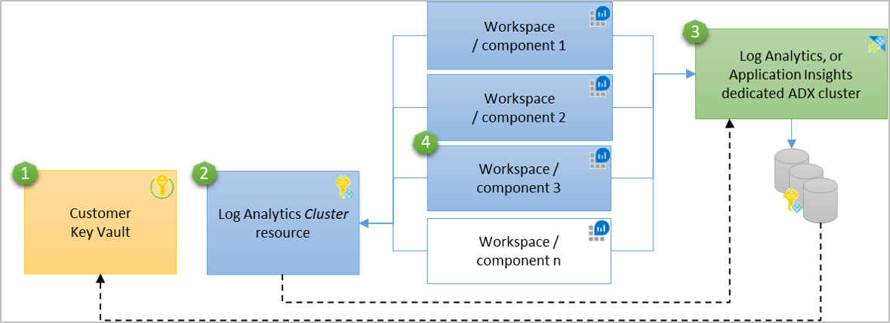
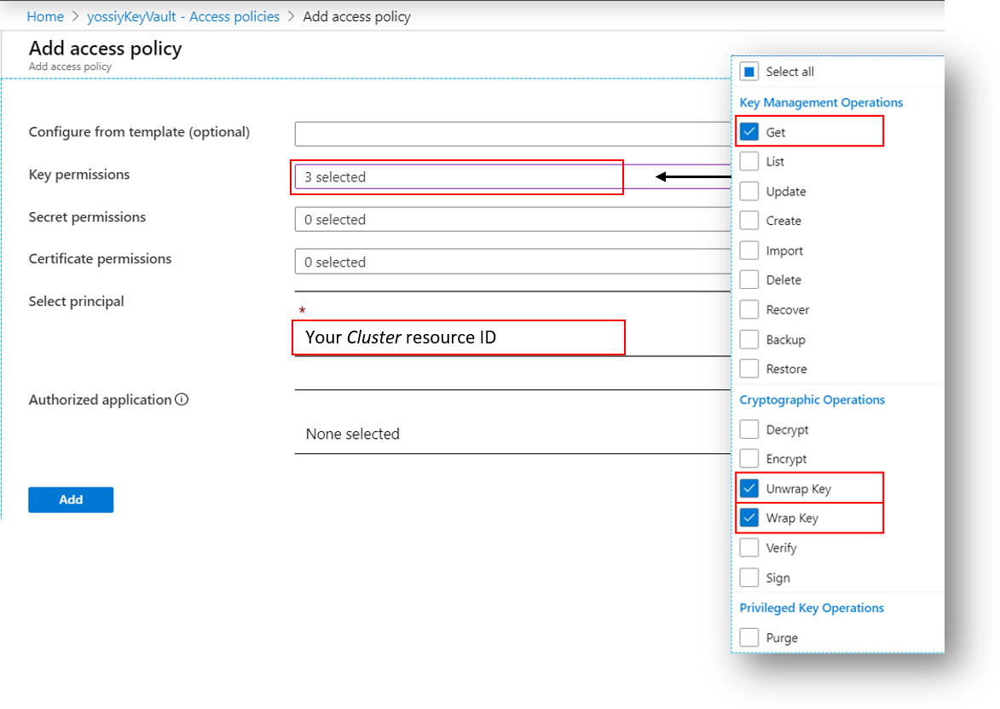

# Azure Monitor customer-managed key configuration 

This article provides background information and steps to configure Customer-Managed Keys (CMK) for your Log Analytics workspaces and Application Insights components. Once configured, any data sent to your workspaces or components is encrypted with your Azure Key Vault key.

We recommend you review [Limitations and constraints](#Limitations and constraints) below before configuration.

## Disclaimers

- Azure Monitor CMK is an early access feature and enabled for registered subscriptions.

- The CMK deployment described in this article is delivered in production quality and supported as such although it's an early access feature.

- The CMK capability is delivered on a dedicated data-store-cluster, which is an Azure Data Explorer (ADX) cluster and suitable for customers sending 1TB per day or more. 

- The CMK pricing model isn't available currently and it isn't covered in this article. A pricing model for dedicated ADX cluster is expected in the second quarter of calendar year (CY) 2020 and will apply to any existing CMK deployments.

- This article describes the CMK configuration for Log Analytics workspaces. CMK for Application Insights components is also supported using this article while differences are listed in the Appendix.

> [!NOTE]
> Log Analytics and Application Insights are using the same data-store platform and query engine.
> We are bringing these two stores together via integration of Application Insights into Log Analytics to create a single unified logs store under Azure Monitor. This change is planned for the second quarter of calendar year 2020. If you don’t have to deploy CMK for your Application Insight data by then, we recommend waiting for the completion of the consolidation since such deployments will be disrupted by the consolidation and you will have to re-configure CMK after the migration to Log Analytics workspace. The 1 TB per day minimum applies at the cluster level, and until the consolidation completes during second quarter Application Insights and Log Analytics require separate clusters.

## Customer-managed key (CMK) overview

[Encryption at Rest](https://docs.microsoft.com/azure/security/fundamentals/encryption-atrest)
is a common privacy and security requirement in organizations. You can
let Azure completely manage Encryption at Rest, while you have various
options to closely manage encryption or encryption keys.

The Azure Monitor data-store ensures that all data encrypted at
rest using Azure-managed keys while stored in Azure Storage. Azure Monitor also
provides an option for data encryption using your own key that is stored
in [Azure Key Vaults](https://docs.microsoft.com/azure/key-vault/key-vault-overview),
which is accessed using system-assigned [managed identity](https://docs.microsoft.com/azure/active-directory/managed-identities-azure-resources/overview) authentication. This key can be either [software or hardware-HSM
protected](https://docs.microsoft.com/azure/key-vault/key-vault-overview).
The Azure Monitor use of encryption is identical to the way 
[Azure Storage encryption](https://docs.microsoft.com/azure/storage/common/storage-service-encryption#about-azure-storage-encryption)
operates.

The frequency that Azure Monitor Storage accesses Key Vault for wrap and
unwrap operations is between 6 to 60 seconds. Azure Monitor Storage  
always respects changes in key permissions within an hour.

Ingested data in last 14 days is also kept in hot-cache (SSD-backed) for efficient query engine operation. This data remains encrypted with Microsoft keys regardless CMK configuration, but we are working to have the SSD encrypted with CMK early 2020.

## How CMK works in Azure Monitor

Azure Monitor leverages system-assigned managed identity to grant access
to your Azure Key Vault. System-assigned managed identity can only be
associated with a single Azure resource. The identity of Azure Monitor data-store
(ADX cluster) is supported at the cluster level and this
dictates that the CMK capability is delivered on a dedicated ADX
cluster. To support CMK on multiple workspaces, a new Log Analytics
resource (*Cluster*) performs as an intermediate identity connection
between your Key Vault and your Log Analytics workspaces. This concept
conforms with the System-assigned identity constraint and the identity
is maintained between the ADX cluster and the Log Analytics *Cluster*
resource*,* while the data of all associated workspaces is protected
with your Key Vault key. The underlay ADX cluster storage uses the
managed identity that\'s associated with the *Cluster* resource to
authenticate and access your Azure Key Vault via Azure Active Directory.


1.	Customer’s Key Vault.
2.	Customer’s Log Analytics Cluster resource having managed identity with permissions to Key Vault – The identity is supported at the data-store (ADX cluster) level.
3.	Azure Monitor dedicated ADX cluster.
4.	Customer’s workspaces associated to Cluster resource for CMK encryption.

## Encryption keys management

There are 3 types of keys involved in Storage data encryption:

- **KEK** - Key Encryption Key in Key Vault (CMK)
- **AEK** - Account Encryption Key
- **DEK** - Data Encryption Key

The following rules apply:

- The ADX storage account generates a unique encryption key for every storage account, which is known as the AEK.

- The AEK is used to derive DEKs, which are the keys that are used to
    encrypt each block of data written to disk.

- When you configure your key in Key Vault and reference it in the
    *Cluster* resource, Azure Storage wraps the AEK with your KEK in
    Azure Key Vault.

- Your KEK never leaves your Key Vault and in the case of an HSM key,
    it never leaves hardware.

- Azure Storage uses the managed identity that's associated with the
    *Cluster* resource to authenticate and access to Azure Key Vault via
    Azure Active Directory.

- For read/write operations, Azure Storage sends requests to Azure Key
    Vault to wrap and unwrap the AEK to perform encryption
    and decryption operations.

## CMK provisioning procedure

The provisioning process includes these steps:

1. Subscription whitelisting -- this is required for this early access
    feature
2. Creating Azure Key Vault and storing key
3. Create a *Cluster* resource
4. Grant permissions to your Key Vault
5. Azure Monitor data-store (ADX cluster) provisioning
6. Log Analytics workspaces association

The procedure is not supported in the UI currently and the provisioning process is performed via REST API.

> [!IMPORTANT]
> Any API request must include a Bearer authorization token in the request header.

For example:

```rst
GET
https://management.azure.com/subscriptions/<subscriptionId>/resourcegroups/<resourceGroupName>/providers/Microsoft.OperationalInsights/workspaces/<workspaceName>?api-version=2015-11-01-preview
Authorization: Bearer eyJ0eXAiO....
```

Where *eyJ0eXAiO....* represents the full Authorization token. 

You can acquire the token using one of these methods:

1. Use [App registrations](https://docs.microsoft.com/graph/auth/auth-concepts#access-tokens) method.

2. In the Azure portal
    1. Navigate to Azure portal in "developer tool (F12)
    1. Look for authorization string under "Request Headers" in one of the "batch?api-version" instances. It looks like: "authorization: Bearer \<token\>". 
    1. Copy and add it to your API call per the examples below.

3. Navigate to Azure REST documentation site. Press "Try it" on any API and copy the Bearer token.

### Subscription whitelisting

CMK capability is an early access feature. The subscriptions where you plan to create *Cluster* resources must be whitelisted beforehand by the Azure product group. Use your contacts into Microsoft to provide your Subscriptions IDs.

> [!WARNING]
> CMK capability is regional. Your Azure Key Vault, Storage Account, *Cluster* resource and associated Log Analytics workspaces must be in the same region, but they can be in different subscriptions.

### Storing encryption key (KEK)

Create an Azure Key Vault resource, then generate or import a key to be used for data encryption.

The Azure Key Vault must be configured as recoverable to protect your key and the access to your Azure Monitor data.

These settings are available via CLI and PowerSell:
- [Soft Delete](https://docs.microsoft.com/azure/key-vault/key-vault-ovw-soft-delete)
    must be turned on
- [Purge protection](https://docs.microsoft.com/azure/key-vault/key-vault-ovw-soft-delete#purge-protection) should be turned on to guard against force deletion of the secret / vault even after soft delete

### Create *Cluster* resource

This resource is used as intermediate identity connection between your Key Vault and your workspaces. Only after you receive confirmation that your subscriptions were whitelisted, create a Log Analytics *Cluster* resource at the region where your workspaces are located. Application Insights and Log Analytics require separate Cluster resources. The type of the Cluster resource is defined at creation time by setting the “clusterType” property to either ‘LogAnalytics’, or ‘ApplicationInsights’. The Cluster resource type can’t be altered.

**Create**

```rst
PUT https://management.azure.com/subscriptions/<subscription-id>/resourceGroups/<resource-group-name>/providers/Microsoft.OperationalInsights/clusters/<cluster-name>?api-version=2019-08-01-preview
Authorization: Bearer <token>
Content-type: application/json

{
  "location": "<region-name>",
   "properties": {
      "clusterType": "LogAnalytics"   //Should be "ApplicationInsights" for Application Insights CMK
    },
   "identity": {
      "type": "systemAssigned"
   }
}
```

**Response**

Identity is assigned to the *Cluster* resource at creation time.

```json
{
  "identity": {
    "type": "SystemAssigned",
    "tenantId": "tenant-id",
    "principalId": "principle-id"    //A GUID that was generated by the managed identity service
  },
  "properties": {
    "provisioningState": "Succeeded",
    "clusterType": "LogAnalytics", 
    "clusterId": "cluster-id"	 //A GUID that Log Analytics generates for the cluster
  },
  "id": "/subscriptions/subscription-id/resourceGroups/resource-group-name/providers/Microsoft.OperationalInsights/clusters/cluster-name",    //The cluster resource Id
  "name": "cluster-name",
  "type": "Microsoft.OperationalInsights/clusters",
  "location": "region-name"
}

```
> [!IMPORTANT]
> Copy and keep the "cluster-id" since you will need it in next steps.

If you what to delete the *Cluster* resource for any reason (for example, create it with a different name) use this API call:

```rst
DELETE
https://management.azure.com/subscriptions/<subscription-id>/resourceGroups/<resource-group-name>/providers/Microsoft.OperationalInsights/clusters/<cluster-name>?api-version=2019-08-01-preview
```

### Grant Key Vault permissions

Update your Key Vault and add access policy for the Cluster resource. Permissions to your Key Vault are then propagated to the underlaying Azure Monitor Storage to be used for data encryption.
Open your Key Vault in Azure portal and click “Access Policies” then “+ Add Access Policy” to create a new policy with these settings:

- Key permissions: select ‘Get’, ‘Wrap Key’ and ‘Unwrap Key’ permissions.

- Select principal: enter the cluster-id, which is the "clusterId" value in the response of the previous step.



The *Get* permission is required to verify that your Key Vault is
    configured as recoverable to protect your key and the access to your
    Azure Monitor data.

It takes a few minutes until the *Cluster* resource is propagated in
    Azure Resource Manager. When configuring this Access Policy
    immediately after the *Cluster* resource creation, a transient error
    may occur. In this case, try again after a few minutes.

### Update Cluster resource with Key Identifier details

This procedure also applies when you create a new version of a key.

Update the Cluster resource with Azure Key Vault Key identifier details, to allow Azure Monitor Storage to use the new key version. Select the current version of your key in Azure Key Vault to get the Key Identifier details:


Update the *Cluster* resource KeyVaultProperties with Key Identifier
details.

**Update**

```rst
PUT https://management.azure.com/subscriptions/<subscription-id>/resourceGroups/<resource-group-name>/providers/Microsoft.OperationalInsights/clusters/<cluster-name>?api-version=2019-08-01-preview
Authorization: Bearer <token>
Content-type: application/json

{
   "properties": {
       "KeyVaultProperties": {     //Key Vault key identifier details taken from Key identifier URI
            KeyVaultUri: "https://<key-vault-name>.vault.azure.net",
            KeyName: "<key-name>",
            KeyVersion: "<current-version>"
            },
   },
   "location":"<region-name>",
   "identity": { 
        "type": "systemAssigned" 
        }
}
```

**Response**

```json
{
  "identity": {
    "type": "SystemAssigned",
    "tenantId": "tenant-id",
    "principalId": "principle-id"    //A GUID that was generated by the managed identity service
  },
  "properties": {
       "KeyVaultProperties": {     // Key Vault key identifier
            KeyVaultUri: "https://key-vault-name.vault.azure.net",
            KeyName: "key-name",
            KeyVersion: "current-version"
            },
    "provisioningState": "Succeeded",
    "clusterType": "LogAnalytics", 
    "clusterId": "cluster-id"
  },
  "id": "/subscriptions/subscription-id/resourceGroups/resource-group-name/providers/Microsoft.OperationalInsights/clusters/cluster-name",    //The cluster resource Id
  "name": "cluster-name",
  "type": "Microsoft.OperationalInsights/clusters",
  "location": "region-name"    //Example: Switzerland North
}
```

### Azure Monitor data-store (ADX cluster) provisioning

During the early access period of the feature, the ADX cluster is
provisioned manually by the product team once the previous steps are
completed. Use the channel you have with Microsoft to provide the
following details:

1. Confirmation that the steps above where completed

2. The Cluster resource API response. it can be retrieved at any time by using a Get API call.

**Read the *Cluster* resource ID**

```rst
GET https://management.azure.com/subscriptions/<subscription-id>/resourceGroups/<resource-group-name>/providers/Microsoft.OperationalInsights/clusters/<cluster-name>?api-version=2019-08-01-preview
Authorization: Bearer <token>
```

**Response**
```json
{
  "identity": {
    "type": "SystemAssigned",
    "tenantId": "tenant-id",
    "principalId": "principal-Id"
  },
  "properties": {
       "KeyVaultProperties": {    // Key Vault key identifier
            KeyVaultUri: "https://key-vault-name.vault.azure.net",
            KeyName: "key-name",
            KeyVersion: "current-version"
            },
    "provisioningState": "Succeeded",
    "clusterType": "LogAnalytics", 
    "clusterId": "cluster-id"
  },
  "id": "/subscriptions/subscription-id/resourceGroups/resource-group-name/providers/Microsoft.OperationalInsights/clusters/cluster-name",
  "name": "cluster-name",
  "type": "Microsoft.OperationalInsights/clusters",
  "location": "region-name"
}
```

### Workspace association to *Cluster* resource

> [!NOTE]
> This step should be carried **ONLY** after you received confirmation
> from the product group through your Microsoft channel that the
> **Azure Monitor data-store (ADX cluster) provisioning** was
> fulfilled. If you associate workspaces and ingest data prior to this
> **provisioning**, the data will be dropped and won't be recoverable.

**Associate a workspace to a *Cluster* resource using [Workspaces - Create Or Update](https://docs.microsoft.com/rest/api/loganalytics/workspaces/createorupdate) API**

```rst
PUT https://management.azure.com/subscriptions/<subscription-id>/resourcegroups/<resource-group-name>/providers/microsoft.operationalinsights/workspaces/<workspace-name>?api-version=2015-11-01-preview 
Authorization: Bearer <token>
Content-type: application/json

{
  "properties": {
    "source": "Azure",
    "customerId": "<workspace-id>",    //Available in Azure portal under Log Analytics workspace Overview section
    "features": {
      "clusterDefinitionId": "<cluster-id>"    //It's the "clusterId" value provided in the respond from the previous step 
    }
  },
  "id": "/subscriptions/<subscription-id>/resourcegroups/<resource-group-name>/providers/microsoft.operationalinsights/workspaces/<workspace-name>",
  "name": "<workspace-name>",
  "type": "Microsoft.OperationalInsights/workspaces",
  "location": "<region-name>"
}
```

**Response**

```json
{
  "properties": {
    "source": "Azure",
    "customerId": "workspace-id",
    "retentionInDays": value,
    "features": {
      "legacy": value,
      "searchVersion": value,
      "clusterDefinitionId": "cluster-id" //The id of the Cluster resource
    },
    "workspaceCapping": {
      "dailyQuotaGb": value,
      "quotaNextResetTime": "timeStamp",
      "dataIngestionStatus": "RespectQuota"
    }
  },
  "id": "/subscriptions/subscription-id/resourcegroups/resource-group-name/providers/microsoft.operationalinsights/workspaces/workspace-name",
  "name": "workspace-name",
  "type": "Microsoft.OperationalInsights/workspaces",
  "location": "region-name"
}
```

After the association, data that is sent to your workspaces is stored
encrypted with your managed key.

## CMK (KEK) revocation

Azure Monitor Storage will always respect changes in key permissions
within an hour, normally sooner, and Storage will become unavailable --
Any data ingested to workspaces associated with your *Cluster* resource
is dropped and queries will fail. Previously ingested data remains
inaccessible in Azure Monitor Storage as long as your key is revoked,
and your workspaces aren't deleted. Inaccessible data is governed by the
data-retention policy and will be purged when retention is reached.

Storage will periodically poll your Key Vault to attempt to unwrap the
encryption key and once accessed, data ingestion and query resume within
30 minutes.

## CMK (KEK) rotation

Rotation of CMK requires explicit update of the Cluster resource with
the new Azure Key Vault Key version. To update Azure Monitor with your
new key version, follow the instructions in "Update *Cluster* resource
with Key Identifier details" step.

-   If you rotate your key in Key Vault and don't update the new version
    in Azure Monitor shortly after, the key won't be accessible by Azure
    Monitor Storage.

## Limitations and constraints

- The CMK feature is supported at ADX cluster level and requires a
    dedicated Azure Monitor ADX cluster

- The max number of *Cluster* resources per subscription is limited to 5

- *Cluster* resource association to workspace should be carried ONLY
    after you received a confirmation from the product group that the
    ADX cluster provisioning was fulfilled. Data that is sent prior to
    this provisioning will be dropped and won't be recoverable.

- CMK encryption applies to newly ingested data after the CMK
    configuration. Data that was ingested prior to the CMK
    configuration, remained encrypted with Microsoft key. You can query
    data before and after the configuration seamlessly.

- CMK capability is regional -- your Azure Key Vault, *Cluster*
    resource and associated workspaces must be in the same region but
    can be in different subscriptions.

- Once workspace is associated to a *Cluster* resource, it cannot be
    de-associated from the *Cluster* resource, since data is encrypted
    with your key and isn't accessible without your KEK in Azure Key
    Vault.

- The Azure Key Vault must be configured as recoverable. These
    properties aren't enabled by default:

  - [Soft Delete](https://docs.microsoft.com/azure/key-vault/key-vault-ovw-soft-delete)
        is turned on
  - 'Do Not Purge' is turned on to guard against force deletion of
        the secret / vault even after soft delete

- Application Insights and Log Analytics require separate *Cluster* resources. The type of the *Cluster* resource is defined at creation time by setting the “clusterType” property to either ‘LogAnalytics’, or ‘ApplicationInsights’. The *Cluster* resource type can’t be altered.

- *Cluster* resource move to another resource group or subscription
    isn't supported currently.

- Workspace association to *Cluster* resource will fail if the
    *Cluster* resource is in a different tenant.

-   Workspace association to *Cluster* resource will fail if it is
    associated to another *Cluster* resource

## Troubleshooting and management

- Key Vault availability
    - In normal operation, Storage caches AEK for short periods of
            time periodically goes back to Key Vault to unwrap.
    
    - Transient connection errors. Storage handles transient errors (timeouts, connection failures, DNS issues) by allowing keys to
            stay in cache for a short while longer and this overcomes any small blips in availability
            -   Query capability is available without interruption.
            -   Ingestion continues without interruption
    
    - Live site unavailability of about 30 minutes will cause the Storage account to be unavailable.
            -   **Query** capability is unavailable
            -   **Ingestion** -- data is cached for several hours using
                Microsoft key to avoid data loss. When access to Key Vault
                is restored, query becomes available and the temporary
                cached data is ingested to the data-store and encrypted with
                CMK.

- If you create a *Cluster* resource and specify the KeyVaultProperties immediately, the operation may fail since the
    access policy can't be defined until system identity is assigned to the *Cluster* resource.

- If you update existing *Cluster* resource with KeyVaultProperties and 'Get' key Access Policy is missing in Key Vault, the operation will fail.

- If you try to delete a *Cluster* resource that is associated to a workspace, the delete operation will fail.

- Get all *Cluster* resources for a resource group:

  ```rst
  GET https://management.azure.com/subscriptions/<subscription-id>/resourceGroups/<resource-group-name>/providers/Microsoft.OperationalInsights/clusters?api-version=2019-08-01-preview
  Authorization: Bearer <token>
  ```
    
**Response**

```json
{
  "value": [
    {
      "identity": {
        "type": "SystemAssigned",
        "tenantId": "tenant-id",
        "principalId": "principal-Id"
      },
      "properties": {
         "KeyVaultProperties": {    // Key Vault key identifier
            KeyVaultUri: "https://{key-vault-name}.vault.azure.net",
            KeyName: "key-name",
            KeyVersion: "current-version"
            },
        "provisioningState": "Succeeded",
        "clusterType": "LogAnalytics", 
        "clusterId": "cluster-id"
      },
      "id": "/subscriptions/subscription-id/resourcegroups/resource-group-name/providers/microsoft.operationalinsights/workspaces/workspace-name",
      "name": "cluster-name",
      "type": "Microsoft.OperationalInsights/clusters",
      "location": "region-name"
    }
  ]
}
```

- Get all *Cluster* resources for a subscription

  ```rst
  GET https://management.azure.com/subscriptions/<subscription-id>/providers/Microsoft.OperationalInsights/clusters?api-version=2019-08-01-preview
  Authorization: Bearer <token>
  ```
    
**Response**
    
The same response as for '*Cluster* resources for a resource group', but in subscription scope.
    
- Delete a *Cluster* resource -- You need to delete all the associated workspaces before you can delete
your *Cluster* resource:

  ```rst
  DELETE
  https://management.azure.com/subscriptions/<subscription-id>/resourceGroups/<resource-group-name>/providers/Microsoft.OperationalInsights/clusters/<cluster-name>?api-version=2019-08-01-preview
  Authorization: Bearer <token>
  ```

**Response**

200 OK


## Appendix

This article applies to Application Insights Customer Managed Key (CMK) as
well, though you should consider the upcoming change to help you plan
the deployment of CMK for your Application Insight components.

Log Analytics and Application Insights are using the same data-store
platform and query engine -- We are bringing these two stores together
via integration of Application Insights into Log Analytics to provide a
single unified logs store under Azure Monitor by the second quarter of
2020. This change will bring your Application Insight data into Log
Analytics workspaces and make queries, insights, and other improvements
possible while the configuration of CMK on your workspace, will also
apply to your Application Insights data.

> [!NOTE]
> If you don’t have to deploy CMK for your Application Insight data by then, we recommend waiting for the completion of the consolidation since such deployments will be disrupted by the consolidation and you will have to re-configure CMK after the migration to Log Analytics workspace. The 1 TB per day minimum applies at the cluster level, and until the consolidation completes during second quarter Application Insights and Log Analytics require separate clusters.

## Application Insights CMK configuration

The configuration of Application Insights CMK is identical to the process illustrated in this article, including constraints and troubleshooting except these steps:

- Create a *Cluster* resource

- Associate a component to a *Cluster* resource

When configuring CMK for Application Insights, use these steps instead
of the ones listed above.

### Create a *Cluster* resource

This resource is used as intermediate identity connection between your Key Vault and your components. AFTER you received a confirmation that your subscriptions were whitelisted, create a Log Analytics Cluster resource at the region where your components are located. The type of the Cluster resource is defined at creation time by setting the *clusterType* property to either *LogAnalytics*, or *ApplicationInsights*. It should be *ApplicationInsights* for Application Insights CMK. The *clusterType* setting can’t be altered after the configuration.

**Create**

```rst
PUT https://management.azure.com/subscriptions/<subscription-id>/resourceGroups/<resource-group-name>/providers/Microsoft.OperationalInsights/clusters/<cluster-name>?api-version=2019-08-01-preview
Authorization: Bearer <token>
Content-type: application/json

{
  "location": "<region-name>",
  "properties": {
      "clusterType":"ApplicationInsights"
  },
  "identity": {
      "type": "systemAssigned"
  }
}
```

**Response**

Identity is assigned to the *Cluster* resource at creation time.

```json

{
  "identity": {
    "type": "SystemAssigned",
    "tenantId": "tenant-id",
    "principalId": "principle-id"    //A GUID that was generated by the managed identity service
  },
  "properties": {
    "provisioningState": "Succeeded",
    "clusterType": "ApplicationInsights",    //The value is ‘ApplicationInsights’ for Application Insights CMK
    "clusterId": "cluster-id"	//A GUID that Log Analytics generates for the cluster - copy it since you need it for Key Vault and components association 
  },
  "id": "/subscriptions/subscription-id/resourceGroups/resource-group-name/providers/Microsoft.OperationalInsights/clusters/cluster-name", //The cluster resource Id
  "name": "cluster-name",
  "type": "Microsoft.OperationalInsights/clusters",
  "location": "region-name"
}
```

### Associate a component to a *Cluster* resource

```rst
PUT https://management.azure.com/subscriptions/{subscription-id}/resourceGroups/{resource-group-name}/providers/Microsoft.Insights/components/{component-name}?api-version=2015-05-01
Authorization: Bearer <token>
Content-type: application/json

{
  "properties": {
    "clusterDefinitionId": "cluster-id" //It's the "clusterId" value provided in the respond from the previous step
  },
  "location": "region-name",
  "kind": "component-type",
}
```

**Response**

```json
{
  "id": "/subscriptions/{subscription-id}/resourcegroups/{resource-group-name}/providers/microsoft.insights/components/{component-name}",
  "name": "component-name",
  "type": "Microsoft.Insights/components",
  "location": "region-name",
  "tags": "",
  "kind": "",
  "properties": {
    "clusterDefinitionId": "cluster-id" //The Cluster resource ID that is associated to this component
    "ApplicationId": "",
    "AppId": "",
    "Application_Type": "",
    "Flow_Type": "",
    "Request_Source": "",
    "InstrumentationKey": "",
    "CreationDate": "",
    "TenantId": "",
    "HockeyAppId": "",
    "HockeyAppToken": "",
    "provisioningState": "",
    "SamplingPercentage":,
    "RetentionInDays":,
    "ConnectionString": "",
    "DisableIpMasking":,
    "ImmediatePurgeDataOn30Days": 
  }
}
```

After the association, data that is sent to your components is stored encrypted with your managed key.
