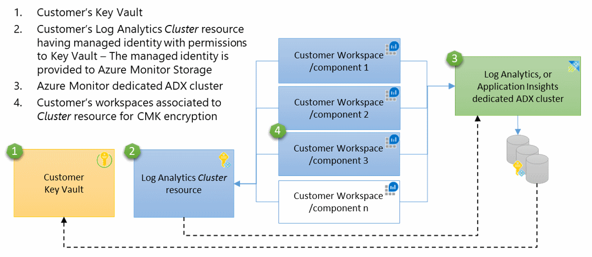

# Azure Monitor customer-managed key configuration 

This article provides background information and steps to configure Customer-Managed Keys (CMK) for your Log Analytics workspaces and Application Insights components. Once configured, any data sent to your workspaces or components is encrypted with your Azure Key Vault key.

We recommend you review [Limitations and constraints](#limitations-and-constraints) below before configuration.

## Disclaimers

- Azure Monitor CMK is an early access feature and enabled for registered subscriptions.

- The CMK deployment described in this article is delivered in production quality and supported as such although it's an early access feature.

- The CMK capability is delivered on a dedicated data-store-cluster, which is an Azure Data Explorer (ADX) cluster and suitable for customers sending 1TB per day or more. 

- The CMK pricing model isn't available currently and it isn't covered in this article. A pricing model for dedicated ADX cluster is expected in the second quarter of calendar year (CY) 2020 and will apply to any existing CMK deployments.

- This article describes the CMK configuration for Log Analytics workspaces. CMK for Application Insights components is also supported using this article while differences are listed in the Appendix.

> [!NOTE]
> Log Analytics and Application Insights are using the same data-store platform and query engine.
> We are bringing these two stores together via integration of Application Insights into Log Analytics to create a single unified logs store under Azure Monitor. This change is planned for the second quarter of calendar year 2020. If you don't have to deploy CMK for your Application Insights data by then, we recommend waiting for the completion of the consolidation since such deployments will be disrupted by the consolidation and you will have to re-configure CMK after the migration to Log Analytics workspace. The 1TB per day minimum applies at the cluster level and until the consolidation completes during second quarter, Application Insights and Log Analytics require separate clusters.

## Customer-managed key (CMK) overview

[Encryption at Rest](https://docs.microsoft.com/azure/security/fundamentals/encryption-atrest)
is a common privacy and security requirement in organizations. You can
let Azure completely manage Encryption at Rest, while you have various
options to closely manage encryption or encryption keys.

The Azure Monitor data-store ensures that all data encrypted at
rest using Azure-managed keys while stored in Azure Storage. Azure Monitor also
provides an option for data encryption using your own key that is stored
in your [Azure Key Vault](https://docs.microsoft.com/azure/key-vault/key-vault-overview),
which is accessed using system-assigned [managed identity](https://docs.microsoft.com/azure/active-directory/managed-identities-azure-resources/overview) authentication. This key can be either [software or hardware-HSM
protected](https://docs.microsoft.com/azure/key-vault/key-vault-overview).
The Azure Monitor use of encryption is identical to the way 
[Azure Storage encryption](https://docs.microsoft.com/azure/storage/common/storage-service-encryption#about-azure-storage-encryption)
operates.

The frequency that Azure Monitor Storage accesses Key Vault for wrap and
unwrap operations is between 6 to 60 seconds. Azure Monitor Storage always respects changes in key permissions within an hour.

Ingested data in last 14 days is also kept in hot-cache (SSD-backed) for efficient query engine operation. This data remains encrypted with Microsoft keys regardless CMK configuration, but we are working to have the SSD encrypted with CMK in the first half of 2020.

## How CMK works in Azure Monitor

Azure Monitor leverages system-assigned managed identity to grant access
to your Azure Key Vault. System-assigned managed identity can only be
associated with a single Azure resource. The identity of Azure Monitor data-store
(ADX cluster) is supported at the cluster level and this
dictates that the CMK capability is delivered on a dedicated ADX
cluster. To support CMK on multiple workspaces, a new Log Analytics
resource (*Cluster*) performs as an intermediate identity connection
between your Key Vault and your Log Analytics workspaces. This concept
conforms with the System-assigned identity constraint and the identity
is maintained between the ADX cluster and the Log Analytics *Cluster*
resource, while the data of all associated workspaces is protected
with your Key Vault key. The underlay ADX cluster storage uses the
managed identity that\'s associated with the *Cluster* resource to
authenticate and access your Azure Key Vault via Azure Active Directory.


1.    Customer's Key Vault.
2.    Customer's Log Analytics *Cluster* resource having managed identity with permissions to Key Vault – The identity is supported at the data-store (ADX cluster) level.
3.    Azure Monitor dedicated ADX cluster.
4.    Customer's workspaces associated to *Cluster* resource for CMK encryption.

## Encryption keys management

There are 3 types of keys involved in Storage data encryption:

- **KEK** - Key Encryption Key (CMK)
- **AEK** - Account Encryption Key
- **DEK** - Data Encryption Key

The following rules apply:

- The ADX storage accounts generate unique encryption key for every Storage account, which is known as the AEK.

- The AEK is used to derive DEKs, which are the keys that are used to
    encrypt each block of data written to disk.

- When you configure your key in Key Vault and reference it in the *Cluster* resource, the Azure Storage sends requests to your Azure Key Vault to wrap and unwrap the AEK to perform data encryption and decryption operations.

- Your KEK never leaves your Key Vault and in the case of an HSM key,
    it never leaves the hardware.

- Azure Storage uses the managed identity that's associated with the
    *Cluster* resource to authenticate and access to Azure Key Vault via
    Azure Active Directory.

## CMK provisioning procedure

For Application Insights CMK configuration, follow the Appendix content for steps 3 and 6.

1. Subscription whitelisting -- this is required for this early access
    feature
2. Creating Azure Key Vault and storing key
3. Creating a *Cluster* resource
4. Azure Monitor data-store (ADX cluster) provisioning
5. Granting permissions to your Key Vault
6. Associating Log Analytics workspaces

The procedure is not supported in the UI currently and the provisioning process is performed via REST API.

> [!IMPORTANT]
> Any API request must include a Bearer authorization token in the request header.

For example:

```rst
GET
https://management.azure.com/subscriptions/<subscriptionId>/resourcegroups/<resourceGroupName>/providers/Microsoft.OperationalInsights/workspaces/<workspaceName>?api-version=2015-11-01-preview
Authorization: Bearer eyJ0eXAiO....
```

Where *eyJ0eXAiO....* represents the full Authorization token. 

You can acquire the token using one of these methods:

1. Use [App registrations](https://docs.microsoft.com/graph/auth/auth-concepts#access-tokens) method.
2. In the Azure portal
    1. Navigate to Azure portal in "developer tool (F12)
    1. Look for authorization string under "Request Headers" in one of the "batch?api-version" instances. It looks like: "authorization: Bearer \<token\>". 
    1. Copy and add it to your API call per the examples below.
3. Navigate to Azure REST documentation site. Press "Try it" on any API and copy the Bearer token.

### Subscription whitelisting

CMK capability is an early access feature. The subscriptions where you plan to create *Cluster* resources must be whitelisted beforehand by the Azure product group. Use your contacts into Microsoft to provide your Subscriptions IDs.

> [!IMPORTANT]
> CMK capability is regional. Your Azure Key Vault, *Cluster* resource and associated Log Analytics workspaces must be in the same region, but they can be in different subscriptions.

### Storing encryption key (KEK)

Create or use an Azure Key Vault that you already have to generate, or import a key to be used for data encryption. The Azure Key Vault must be configured as recoverable to protect your key and the access to your data in Azure Monitor. You can verify this configuration under properties in your Key Vault, both *Soft delete* and *Purge protection* should be enabled.

These settings are available via CLI and PowerShell:
- [Soft Delete](https://docs.microsoft.com/azure/key-vault/key-vault-ovw-soft-delete)
- [Purge protection](https://docs.microsoft.com/azure/key-vault/key-vault-ovw-soft-delete#purge-protection) guards against force deletion of the secret / vault even after soft delete

### Create *Cluster* resource

This resource is used as an intermediate identity connection between your Key Vault and your Log Analytics workspaces. After you receive confirmation that your subscriptions were whitelisted, create a Log Analytics *Cluster* resource at the region where your workspaces are located. Application Insights and Log Analytics require separate *Cluster* resources types. The type of the *Cluster* resource is defined at creation time by setting the *clusterType* property to either *LogAnalytics*, or *ApplicationInsights*. The Cluster resource type can't be altered after.

For Application Insights CMK configuration, follow the Appendix content.

You must specify the capacity reservation level (sku) when creating a *Cluster* resource. The capacity reservation level can be in the range of 1,000 to 2,000 GB per day and you can update it in steps of 100 later. If you need capacity reservation level higher than 2,000 GB per day, reach your Microsoft contact to enable it. This property doesn't affect billing currently -- once pricing model for dedicated cluster is introduced, billing will apply to any existing CMK deployments.

**Create**

```rst
PUT https://management.azure.com/subscriptions/<subscription-id>/resourceGroups/<resource-group-name>/providers/Microsoft.OperationalInsights/clusters/<cluster-name>?api-version=2019-08-01-preview
Authorization: Bearer <token>
Content-type: application/json

{
  "identity": {
    "type": "systemAssigned"
    },
  "sku": {
    "name": "capacityReservation",
    "Capacity": 1000
    },
  "properties": {
    "clusterType": "LogAnalytics",
    },
  "location": "<region-name>",
}
```
The identity is assigned to the *Cluster* resource at creation time.

**Response**

202 Accepted. This is a standard Resource Manager response for asynchronous operations.

>[!Important]
> It takes the provisioning of the underly ADX cluster a while to complete. You can verify the provisioning state when performing GET REST API call on the *Cluster* resource and looking at the *provisioningState* value. It is *ProvisioningAccount* while provisioning and *Succeeded* when completed.

### Azure Monitor data-store (ADX cluster) provisioning

During the early access period of the feature, the ADX cluster is provisioned manually by the product team once the previous steps are completed. Use your Microsoft channel for this step and provide the *Cluster* resource response. 

```rst
GET https://management.azure.com/subscriptions/<subscription-id>/resourceGroups/<resource-group-name>/providers/Microsoft.OperationalInsights/clusters/<cluster-name>?api-version=2019-08-01-preview
Authorization: Bearer <token>
```

> [!IMPORTANT]
> Copy and save the response since you will need its details in later steps

**Response**
```json
{
  "identity": {
    "type": "SystemAssigned",
    "tenantId": "tenant-id",
    "principalId": "principal-id"
    },
  "sku": {
    "name": "capacityReservation",
    "capacity": 1000,
    "lastSkuUpdate": "Sun, 22 Mar 2020 15:39:29 GMT"
    },
  "properties": {
    "provisioningState": "ProvisioningAccount",
    "clusterType": "LogAnalytics", 
    "clusterId": "cluster-id"
    },
  "id": "/subscriptions/subscription-id/resourceGroups/resource-group-name/providers/Microsoft.OperationalInsights/clusters/cluster-name",
  "name": "cluster-name",
  "type": "Microsoft.OperationalInsights/clusters",
  "location": "region-name"
}
```

The "principalId" GUID is generated by the managed identity service for the *Cluster* resource.

### Grant Key Vault permissions

Update your Key Vault with a new access policy that grants permissions to your *Cluster* resource. These permissions are used by the underlay Azure Monitor Storage for data encryption. Open your Key Vault in Azure portal and click "Access Policies" then "+ Add Access Policy" to create a policy with these settings:

- Key permissions: select 'Get', 'Wrap Key' and 'Unwrap Key' permissions.
- Select principal: enter the principal-id value that returned in the response in the previous step.


The *Get* permission is required to verify that your Key Vault is configured as recoverable to protect your key and the access to your Azure Monitor data.

### Update Cluster resource with Key identifier details

This step applies per initial and future key version updates in your Key Vault. It informs Azure Monitor Storage about the key version to be used for data encryption. When updated, your new key is being used to wrap and unwrap to Storage key (AEK).

To update the *Cluster* resource with your Key Vault *Key identifier* details, select the current version of your key in Azure Key Vault to get the Key identifier details.


Update the *Cluster* resource KeyVaultProperties with Key Identifier
details.

**Update**

>[!Warning]
> You must provide a full body in *Cluster* resource update that includes *identity*, *sku*, *KeyVaultProperties* and *location*. Missing the *KeyVaultProperties* details will remove the key identifier from the *Cluster* resource and cause [key revocation](#cmk-kek-revocation).

```rst
PUT https://management.azure.com/subscriptions/<subscription-id>/resourceGroups/<resource-group-name>/providers/Microsoft.OperationalInsights/clusters/<cluster-name>?api-version=2019-08-01-preview
Authorization: Bearer <token>
Content-type: application/json

{
   "identity": { 
     "type": "systemAssigned" 
     },
   "sku": {
     "name": "capacityReservation",
     "capacity": 1000
     },
   "properties": {
     "KeyVaultProperties": {
       KeyVaultUri: "https://<key-vault-name>.vault.azure.net",
       KeyName: "<key-name>",
       KeyVersion: "<current-version>"
       },
   },
   "location":"<region-name>"
}
```
"KeyVaultProperties" contains the Key Vault key identifier details.

**Response**

```json
{
  "identity": {
    "type": "SystemAssigned",
    "tenantId": "tenant-id",
    "principalId": "principle-id"
    },
  "sku": {
    "name": "capacityReservation",
    "capacity": 1000,
    "lastSkuUpdate": "Sun, 22 Mar 2020 15:39:29 GMT"
    },
  "properties": {
    "KeyVaultProperties": {
      KeyVaultUri: "https://key-vault-name.vault.azure.net",
      KeyName: "key-name",
      KeyVersion: "current-version"
      },
    "provisioningState": "Succeeded",
    "clusterType": "LogAnalytics", 
    "clusterId": "cluster-id"
  },
  "id": "/subscriptions/subscription-id/resourceGroups/resource-group-name/providers/Microsoft.OperationalInsights/clusters/cluster-name",
  "name": "cluster-name",
  "type": "Microsoft.OperationalInsights/clusters",
  "location": "region-name"
}
```

### Workspace association to *Cluster* resource

For Application Insights CMK configuration, follow the Appendix content for this step.

> [!IMPORTANT]
> This step should be performed only after ADX cluster provisioning. If you associate workspaces and ingest data prior to the provisioning, ingested data will be dropped and won't be recoverable.
> To verify that the ADX cluster is provisioned, execute *Cluster* resource Get REST API and check that the *provisioningState* value is *Succeeded*.

You need to have 'write' permissions to both your workspace and *Cluster* resource to perform this operation, which include these actions:

- In workspace: Microsoft.OperationalInsights/workspaces/write
- In *Cluster* resource: Microsoft.OperationalInsights/clusters/write

**Associate a workspace**
```rst
PUT https://management.azure.com/subscriptions/<subscription-id>/resourcegroups/<resource-group-name>/providers/microsoft.operationalinsights/workspaces/<workspace-name>/linkedservices/cluster?api-version=2019-08-01-preview 
Authorization: Bearer <token>
Content-type: application/json

{
  "properties": {
    "WriteAccessResourceId": "/subscriptions/<subscription-id>/resourcegroups/<resource-group-name>/providers/microsoft.operationalinsights/clusters/<cluster-name>"
    }
}
```

**Response**

```json
{
  "properties": {
    "WriteAccessResourceId": "/subscriptions/<subscription-id>/resourcegroups/<resource-group-name>/providers/microsoft.operationalinsights/clusters/<cluster-name>"
    },
  "id": "/subscriptions/subscription-id/resourcegroups/resource-group-name/providers/microsoft.operationalinsights/workspaces/workspace-name/linkedservices/cluster",
  "name": "workspace-name/cluster",
  "type": "microsoft.operationalInsights/workspaces/linkedServices",
}
```

The workspace association is performed via Resource Manager asynchronous operations, which can take up to 90 minutes to complete. The next step shows you how workspace association state can be checked. After the workspaces association, data ingested to your workspaces is stored encrypted with your managed key.

### Workspace association verification
You can verify if a workspace is associated to a *Cluster* resource by looking at the [Workspaces – Get](https://docs.microsoft.com/rest/api/loganalytics/workspaces/get) response. Associated workspaces will have a 'clusterResourceId' property with a *Cluster* resource ID.

```rest
GET https://management.azure.com/subscriptions/<subscription-id>/resourcegroups/<resource-group-name>/providers/microsoft.operationalInsights/workspaces/<workspace-name>?api-version=2015-11-01-preview
```

**Response**

```json
{
  "properties": {
    "source": "Azure",
    "customerId": "workspace-name",
    "provisioningState": "Succeeded",
    "sku": {
      "name": "pricing-tier-name",
      "lastSkuUpdate": "Tue, 28 Jan 2020 12:26:30 GMT"
    },
    "retentionInDays": days,
    "features": {
      "legacy": 0,
      "searchVersion": 1,
      "enableLogAccessUsingOnlyResourcePermissions": true,
      "clusterResourceId": "/subscriptions/subscription-id/resourceGroups/resource-group-name/providers/Microsoft.OperationalInsights/clusters/cluster-name"
    },
    "workspaceCapping": {
      "dailyQuotaGb": -1.0,
      "quotaNextResetTime": "Tue, 28 Jan 2020 14:00:00 GMT",
      "dataIngestionStatus": "RespectQuota"
    }
  },
  "id": "/subscriptions/subscription-id/resourcegroups/resource-group-name/providers/microsoft.operationalinsights/workspaces/workspace-name",
  "name": "workspace-name",
  "type": "Microsoft.OperationalInsights/workspaces",
  "location": "region-name"
}
```

## CMK (KEK) revocation

You can revoke your access to your data by disabling your key or deleting the *Cluster* resource access policy in your Key Vault. Azure Monitor Storage will always respect changes in key permissions within an hour, normally sooner, and Storage will become unavailable. Any data ingested to workspaces associated with your *Cluster* resource is dropped and queries will fail. Previously ingested data remains inaccessible in Azure Monitor Storage as long as your your *Cluster* resource and your workspaces aren't deleted. Inaccessible data is governed by the data-retention policy and will be purged when retention is reached.

Storage will periodically poll your Key Vault to attempt to unwrap the
encryption key and once accessed, data ingestion and query resume within
30 minutes.

## CMK (KEK) rotation

Rotation of CMK requires explicit update of the *Cluster* resource with the new key version in Azure Key Vault. To update Azure Monitor with your new key version, follow the instructions in "Update *Cluster* resource with Key identifier details" step. If you update your key version in Key Vault and don't update the new Key identifier details in the *Cluster* resource, Azure Monitor Storage will keep using your previous key.
All your data is accessible after the key rotation operation including data ingested before the rotation and after it, since all data remains encrypted by the Account Encryption Key (AEK) while AEK is now being encrypted by your new Key Encryption Key (KEK) version.

## Limitations and constraints

- The CMK feature is supported at ADX cluster level and requires a
    dedicated Azure Monitor ADX cluster with requirement of sending 1TB per day or more.

- The max number of *Cluster* resources per subscription is limited to 2

- *Cluster* resource association to workspace should be carried ONLY after you have verified that the ADX cluster provisioning was fulfilled. Data that is sent prior to this provisioning will be dropped and won't be recoverable.

- CMK encryption applies to newly ingested data after the CMK
    configuration. Data that was ingested prior to the CMK
    configuration, remains encrypted with Microsoft key. You can query
    data ingested before and after the CMK configuration seamlessly.

- Once workspace is associated to a *Cluster* resource, it cannot be
    de-associated from the *Cluster* resource, since data is encrypted
    with your key and isn't accessible without your KEK in Azure Key
    Vault.

- The Azure Key Vault must be configured as recoverable. These
    properties aren't enabled by default and should be configured using CLI and PowerShell:

  - [Soft Delete](https://docs.microsoft.com/azure/key-vault/key-vault-ovw-soft-delete)
    must be turned on
  - [Purge protection](https://docs.microsoft.com/azure/key-vault/key-vault-ovw-soft-delete#purge-protection) should be turned on to guard against force deletion of the secret / vault even after soft delete

- Application Insights and Log Analytics require separate *Cluster* resources. The type of the *Cluster* resource is defined at creation time by setting the "clusterType" property to either 'LogAnalytics', or 'ApplicationInsights'. The *Cluster* resource type can't be altered.

- *Cluster* resource move to another resource group or subscription
    isn't supported currently.

- Your Azure Key Vault, *Cluster* resource and associated workspaces must be in the same region and in the same Azure Active Directory (Azure AD) tenant, but they can be in different subscriptions.

- Workspace association to *Cluster* resource will fail if it is
    associated to another *Cluster* resource

## Troubleshooting and management

- Key Vault availability
    - In normal operation -- Storage caches AEK for short periods of time and goes back to Key Vault to unwrap periodically.
    
    - Transient connection errors -- Storage handles transient errors (timeouts, connection failures, DNS issues) by allowing keys to stay in cache for a short while longer and this overcomes any small blips in availability. The query and ingestion capabilities continue without interruption.
    
    - Live site -- unavailability of about 30 minutes will cause the Storage account to become unavailable. The query capability is unavailable and ingested data is cached for several hours using Microsoft key to avoid data loss. When access to Key Vault is restored, query becomes available and the temporary cached data is ingested to the data-store and encrypted with CMK.

- If you create a *Cluster* resource and specify the KeyVaultProperties immediately, the operation may fail since the
    access policy can't be defined until system identity is assigned to the *Cluster* resource.

- If you update existing *Cluster* resource with KeyVaultProperties and 'Get' key Access Policy is missing in Key Vault, the operation will fail.

- If you try to delete a *Cluster* resource that is associated to a workspace, the delete operation will fail.

- Get all *Cluster* resources for a resource group:

  ```rst
  GET https://management.azure.com/subscriptions/<subscription-id>/resourceGroups/<resource-group-name>/providers/Microsoft.OperationalInsights/clusters?api-version=2019-08-01-preview
  Authorization: Bearer <token>
  ```
    
  **Response**
  
  ```json
  {
    "value": [
      {
        "identity": {
          "type": "SystemAssigned",
          "tenantId": "tenant-id",
          "principalId": "principal-Id"
        },
        "properties": {
           "KeyVaultProperties": {
              KeyVaultUri: "https://key-vault-name.vault.azure.net",
              KeyName: "key-name",
              KeyVersion: "current-version"
              },
          "provisioningState": "Succeeded",
          "clusterType": "LogAnalytics", 
          "clusterId": "cluster-id"
        },
        "id": "/subscriptions/subscription-id/resourcegroups/resource-group-name/providers/microsoft.operationalinsights/workspaces/workspace-name",
        "name": "cluster-name",
        "type": "Microsoft.OperationalInsights/clusters",
        "location": "region-name"
      }
    ]
  }
  ```

- Get all *Cluster* resources for a subscription:

  ```rst
  GET https://management.azure.com/subscriptions/<subscription-id>/providers/Microsoft.OperationalInsights/clusters?api-version=2019-08-01-preview
  Authorization: Bearer <token>
  ```
    
  **Response**
    
  The same response as for '*Cluster* resources for a resource group', but in subscription scope.
    
- Delete your *Cluster* resource -- a soft-delete operation is performed to allow the recovery of your Cluster resource, your data and associated workspaces within 14 days, whether the deletion was accidental or intentional. The *Cluster* resource name remains reserved during the soft-delete period and you can't create a new cluster with that name. 
After the soft-delete period, your *Cluster* resource and data are non-recoverable. Associated workspaces are de-associated from the *Cluster* resource and new data is ingested to shared Storage and encrypted with Microsoft key.

  ```rst
  DELETE
  https://management.azure.com/subscriptions/<subscription-id>/resourceGroups/<resource-group-name>/providers/Microsoft.OperationalInsights/clusters/<cluster-name>?api-version=2019-08-01-preview
  Authorization: Bearer <token>
  ```

  **Response**

  200 OK

- Recover your *Cluster* resource and your data -- during the soft-delete period, create a *Cluster* resource with the same name and in the same subscription, resource group and region. Follow the **Create *Cluster* resource** step to recover your *Cluster* resource.


## Appendix

Application Insights Customer Managed Key (CMK) is supported as well, though you should consider the following change to help you plan the deployment of CMK for your Application Insight components.

Log Analytics and Application Insights are using the same data-store
platform and query engine. We are bringing these two stores together
via integration of Application Insights into Log Analytics to provide a
single unified logs store under Azure Monitor by the second quarter of
2020. This change will bring your Application Insight data into Log
Analytics workspaces and make queries, insights, and other improvements
possible while the configuration of CMK on your workspace, will also
apply to your Application Insights data.

> [!NOTE]
> If you don't have to deploy CMK for your Application Insight data before the integration, we recommend waiting with Application Insights CMK since such deployments will be disrupted by the integration and you will have to re-configure CMK after the migration to Log Analytics workspace. The 1TB per day minimum applies at the cluster level and until the consolidation completes during second quarter, Application Insights and Log Analytics require separate clusters.

## Application Insights CMK configuration

The configuration of Application Insights CMK is identical to the process illustrated in this article, including constraints and troubleshooting except these steps:

- Create a *Cluster* resource
- Associate a component to a *Cluster* resource

When configuring CMK for Application Insights, use these steps instead
of the ones listed above.

### Create a *Cluster* resource

This resource is used as intermediate identity connection between your Key Vault and your components. AFTER you received a confirmation that your subscriptions were whitelisted, create a Log Analytics *Cluster* resource at the region where your components are located. The type of the *Cluster* resource is defined at creation time by setting the *clusterType* property to either *LogAnalytics*, or *ApplicationInsights*. It should be *ApplicationInsights* for Application Insights CMK. The *clusterType* setting can't be altered after the configuration.

**Create**

```rst
PUT https://management.azure.com/subscriptions/<subscription-id>/resourceGroups/<resource-group-name>/providers/Microsoft.OperationalInsights/clusters/<cluster-name>?api-version=2019-08-01-preview
Authorization: Bearer <token>
Content-type: application/json

{
  "identity": {
    "type": "systemAssigned"
    },
  "sku": {
    "name": "capacityReservation",
    "Capacity": 1000
    },
  "properties": {
    "clusterType":"ApplicationInsights"
    },
  "location": "<region-name>"
}
```

**Response**

202 Accepted. This is a standard Resource Manager response for asynchronous operations.

>[!Important]
> It takes the provisioning of the underly ADX cluster a few minutes to complete. You can verify the provisioning state when performing GET REST API call on the *Cluster* resource and looking at the *provisioningState* value. It is *ProvisioningAccount* while provisioning and "Succeeded" when completed.

### Associate a component to a *Cluster* resource using [Components - Create Or Update](https://docs.microsoft.com/rest/api/application-insights/components/createorupdate) API

You need to have 'write' permissions on both your component and *Cluster* resource to perform this operation, which include these actions:

- In component: Microsoft.Insights/component/write
- In *Cluster* resource: Microsoft.OperationalInsights/clusters/write

> [!IMPORTANT]
> This step should be performed only after ADX cluster provisioning. If you associate components and ingest data prior to the provisioning, ingested data will be dropped and won't be recoverable.
> To verify that the ADX cluster is provisioned, execute *Cluster* resource Get REST API and check that the *provisioningState* value is *Succeeded*.

```rst
GET https://management.azure.com/subscriptions/<subscription-id>/resourceGroups/<resource-group-name>/providers/Microsoft.OperationalInsights/clusters/<cluster-name>?api-version=2019-08-01-preview
Authorization: Bearer <token>
```

**Response**
```json
{
  "identity": {
    "type": "SystemAssigned",
    "tenantId": "tenant-id",
    "principalId": "principal-id"
    },
  "sku": {
    "name": "capacityReservation",
    "capacity": 1000,
    "lastSkuUpdate": "Sun, 22 Mar 2020 15:39:29 GMT"
    },
  "properties": {
    "KeyVaultProperties": {
      KeyVaultUri: "https://key-vault-name.vault.azure.net",
      KeyName: "key-name",
      KeyVersion: "current-version"
      },
    "provisioningState": "Succeeded",
    "clusterType": "ApplicationInsights", 
    "clusterId": "cluster-id"
    },
  "id": "/subscriptions/subscription-id/resourceGroups/resource-group-name/providers/Microsoft.OperationalInsights/clusters/cluster-name",
  "name": "cluster-name",
  "type": "Microsoft.OperationalInsights/clusters",
  "location": "region-name"
  }
```

> [!IMPORTANT]
> Copy and keep the "principle-id" value since you will need it in next steps.

**Associate a component**

```rst
PUT https://management.azure.com/subscriptions/<subscription-id>/resourceGroups/<resource-group-name>/providers/Microsoft.Insights/components/<component-name>?api-version=2015-05-01
Authorization: Bearer <token>
Content-type: application/json

{
  "properties": {
    "clusterDefinitionId": "cluster-id"
  },
  "location": "<region-name>",
  "kind": "<component-type>"
}
```
"clusterDefinitionId" is the "clusterId" value provided in the respond from the previous step.
"kind" example is "web".

**Response**

```json
{
  "id": "/subscriptions/subscription-id/resourcegroups/resource-group-name/providers/microsoft.insights/components/component-name",
  "name": "component-name",
  "type": "Microsoft.Insights/components",
  "location": "region-name",
  "tags": "",
  "kind": "",
  "properties": {
    "clusterDefinitionId": "cluster-id"
    "ApplicationId": "",
    "AppId": "",
    "Application_Type": "",
    "Flow_Type": "",
    "Request_Source": "",
    "InstrumentationKey": "",
    "CreationDate": "",
    "TenantId": "",
    "HockeyAppId": "",
    "HockeyAppToken": "",
    "provisioningState": "",
    "SamplingPercentage":,
    "RetentionInDays":,
    "ConnectionString": "",
    "DisableIpMasking":,
    "ImmediatePurgeDataOn30Days": 
  }
}
```
"clusterDefinitionId" is the *Cluster* resource ID that is associated to this component.

After the association, data that is sent to your components is stored encrypted with your managed key.
