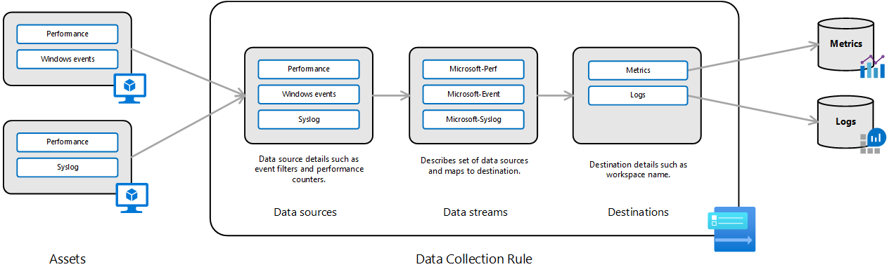

# Data collection rules in Azure Monitor (preview)
Data Collection Rules (DCR) define data coming into Azure Monitor and specify where that data should be sent or stored. This article provides an overview of data collection rules including their contents and structure and how you can create and work with them.

## Input sources
Data collection rules currently support the following input sources:

- Azure virtual machine with the Azure Monitor agent. See [Configure data collection for the Azure Monitor agent (preview)](data-collection-rule-azure-monitor-agent.md).


## Components of a data collection rule
A data collection rule includes the following components.

| Component | Description |
|:---|:---|
| Data sources | Unique source of monitoring data with its own format and method of exposing its data. Examples of a data source include Windows event log, performance counters, and syslog. Each data source matches a particular data source type as described below. |
| Streams | Unique handle that describes a set of data sources that will be transformed and schematized as one type. Each data source requires one or more streams, and one stream may be used by multiple data sources. All data sources in a stream share a common schema. Use multiple streams for example, when you want to send a particular data source to multiple tables in the same Log Analytics workspace. |
| Destinations | Set of destinations where the data should be sent. Examples include Log Analytics workspace, Azure Monitor Metrics, and Azure Event Hubs. | 
| Data flows | Definition of which streams should be sent to which destinations. | 

The following diagram shows the components of a data collection rule and their relationship

[](media/data-collection-rule/data-collection-rule-components.png#lightbox)

### Data source types
Each data source has a data source type. Each type defines a unique set of properties that must be specified for each data source. The data source types currently available are shown in the following table.

| Data source type | Description | 
|:---|:---|
| extension | VM extension-based data source |
| performanceCounters | Performance counters for both Windows and Linux |
| syslog | Syslog events on Linux |
| windowsEventLogs | Windows event log |


## Limits
The following table lists the limits that currently apply to each data collection rule.

| Limit | Value |
|:---|:---|
| Maximum number of data sources | 10 |
| Maximum number of counter specifiers in performance counter | 100 |
| Maximum number of facility names in Syslog | 20 |
| Maximum number of XPath queries in Event Log | 100 |
| Maximum number of data flows | 10 |
| Maximum number of data streams | 10 |
| Maximum number of extensions | 10 |
| Maximum size of extension settings | 32 Kb |
| Maximum number of Log Analytics workspaces | 10 |


## Create a DCR
There are currently two available methods to create a DCR:

- [Use the Azure portal](data-collection-rule-azure-monitor-agent.md) to create a data collection rule and have it associated with one or more virtual machines.
- Directly edit the data collection rule in JSON and [submit using the REST API](https://docs.microsoft.com/rest/api/monitor/datacollectionrules).

## Sample data collection rule
The sample data collection rule below is for virtual machines with Azure Management agent and has the following details:

- Performance data
  - Collects specific Processor, Memory, Logical Disk, and Physical Disk counters every 15 seconds and uploads every minute.
  - Collects specific Process counters every 30 seconds and uploads every 5 minutes.
- Windows events
  - Collects Windows security events and uploads every minute.
  - Collects Windows application and system events and uploads every 5 minutes.
- Syslog
  - Collects Debug, Critical, and Emergency events from cron facility.
  - Collects Alert, Critical, and Emergency events from syslog facility.
- Destinations
  - Sends all data to a Log Analytics workspace named centralWorkspace.

```json
{
    "location": "eastus",
    "properties": {
      "dataSources": {
        "performanceCounters": [
          {
            "name": "cloudTeamCoreCounters",
            "streams": [
              "Microsoft-Perf"
            ],
            "scheduledTransferPeriod": "PT1M",
            "samplingFrequencyInSeconds": 15,
            "counterSpecifiers": [
              "\\Processor(_Total)\\% Processor Time",
              "\\Memory\\Committed Bytes",
              "\\LogicalDisk(_Total)\\Free Megabytes",
              "\\PhysicalDisk(_Total)\\Avg. Disk Queue Length"
            ]
          },
          {
            "name": "appTeamExtraCounters",
            "streams": [
              "Microsoft-Perf"
            ],
            "scheduledTransferPeriod": "PT5M",
            "samplingFrequencyInSeconds": 30,
            "counterSpecifiers": [
              "\\Process(_Total)\\Thread Count"
            ]
          }
        ],
        "windowsEventLogs": [
          {
            "name": "cloudSecurityTeamEvents",
            "streams": [
              "Microsoft-WindowsEvent"
            ],
            "scheduledTransferPeriod": "PT1M",
            "xPathQueries": [
              "Security!*"
            ]
          },
          {
            "name": "appTeam1AppEvents",
            "streams": [
              "Microsoft-WindowsEvent"
            ],
            "scheduledTransferPeriod": "PT5M",
            "xPathQueries": [
              "System!*[System[(Level = 1 or Level = 2 or Level = 3)]]",
              "Application!*[System[(Level = 1 or Level = 2 or Level = 3)]]"
            ]
          }
        ],
        "syslog": [
          {
            "name": "cronSyslog",
            "streams": [
              "Microsoft-Syslog"
            ],
            "facilityNames": [
              "cron"
            ],
            "logLevels": [
              "Debug",
              "Critical",
              "Emergency"
            ]
          },
          {
            "name": "syslogBase",
            "streams": [
              "Microsoft-Syslog"
            ],
            "facilityNames": [
              "syslog"
            ],
            "logLevels": [
              "Alert",
              "Critical",
              "Emergency"
            ]
          }
        ]
      },
      "destinations": {
        "logAnalytics": [
          {
            "workspaceResourceId": "/subscriptions/xxxxxxxx-xxxx-xxxx-xxxx-xxxxxxxxxxxx/resourceGroups/my-resource-group/providers/Microsoft.OperationalInsights/workspaces/my-workspace",
            "name": "centralWorkspace"
          }
        ]
      },
      "dataFlows": [
        {
          "streams": [
            "Microsoft-Perf",
            "Microsoft-Syslog",
            "Microsoft-WindowsEvent"
          ],
          "destinations": [
            "centralWorkspace"
          ]
        }
      ]
    }
  }
```


## Next steps

- [Create a data collection rule](data-collection-rule-azure-monitor-agent.md) and an association to it from a virtual machine using the Azure Monitor agent.
