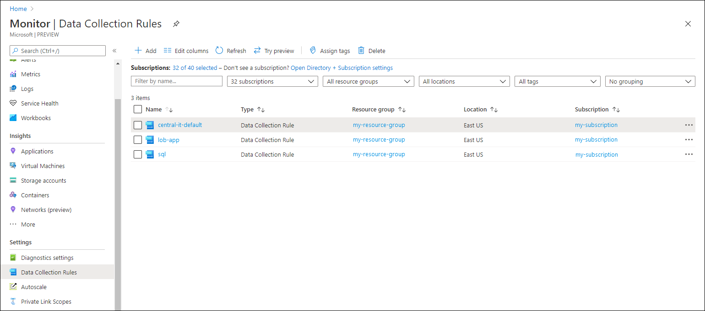
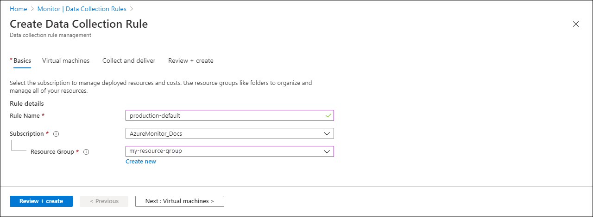
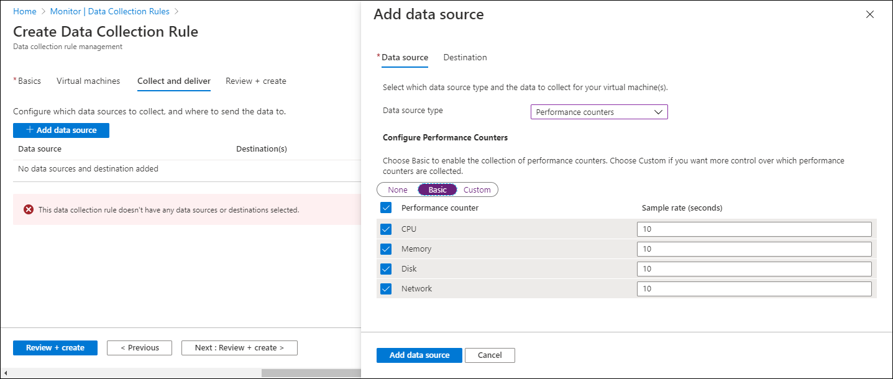
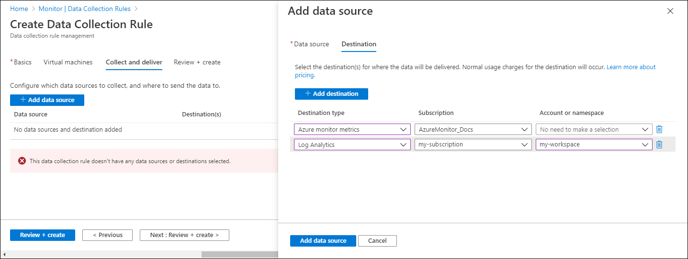

# Configure data collection for the Azure Monitor agent (preview)
Data Collection Rules (DCR) define data coming into Azure Monitor and specify where it should be sent. This article describes how to create a data collection rule to collect data from virtual machines using the Azure Monitor agent.

For a complete description of data collection rules, see [Data collection rules in Azure Monitor (preview)](data-collection-rule-overview.md).

## DCR associations
To apply a DCR to a virtual machine, you create an association between the two. A DCR may have an association with multiple virtual machines, and a virtual machine may have an association with multiple DCRs. This allows you to define a set of DCRs, each matching a particular requirement and apply them to only the virtual machines where they apply. 

The following diagram shows an example of how you might define a set of DCRs and apply them to different virtual machines in your environment.

<Diagram of DCR and VM associations>

## Create using the Azure portal
You can use the Azure portal to create a data collection rule and assign it to virtual machines in your subscription. The Azure Monitor agent will be automatically installed and a managed identify 

In the **Azure Monitor** menu in the Azure portal, select **Data Collection Rules** from the **Settings** section. Click **Add** to add a new Data Collection Rule and assignment.

Click **Add** to create a new rule and set of associations. Provide a **Rule name** and specify a **Subscription** and **Resource Group**.  

In the **Virtual machines** tab, add VMs that should have the Data Collection Rule applied. The Azure Monitor Agent will be installed on VMs that don't already have it installed.

On the **Collect and deliver** tab, click **Add data source** to add a data source and destination set. Select a **Data source type**, and the corresponding details to select will be displayed. For performance counters, you can select from a predefined set of objects and their sampling rate. For events, you can select from a set of logs or facilities and the severity level. 

To specify other logs and performance counters, select **Custom**. You can then specify an [XPath ](https://www.w3schools.com/xml/xpath_syntax.asp) for any specific values to collect. See [Sample DCR](data-collection-rule-overview.md#sample-dcr) for examples.

One the **Destination** tab, add one or more destinations for the data source. Windows event and Syslog data sources can only send to Log Analytics workspaces. Performance counters can send to both Azure Monitor Metrics and Log Analytics workspaces.

Click **Add Data Source** and then **Review + create** to review the details of the data collection rule and association with the set of VMs. Click **Create** to create it.

## Create using REST API
Follow the steps below to create a DCR and associations using the REST API. 

1. Manually create the DCR file using the JSON format shown in [Sample DCR](data-collection-rule-overview.md#sample-dcr).
2. Create the rule using the [REST API](https://review.docs.microsoft.com/en-us/rest/api/documentation-preview/datacollectionrules/datacollectionrules_create?view=azure-rest-preview&branch=openapiHub_production_ad39a35d2f16#definitions).
3. Create an association between the DCR and each virtual machine using the [REST API](https://review.docs.microsoft.com/en-us/rest/api/documentation-preview/datacollectionruleassociations/datacollectionruleassociations_create?view=azure-rest-preview&branch=openapiHub_production_ad39a35d2f16#examples).

## Next steps

