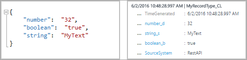
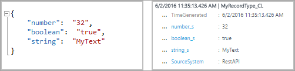

# Send log data to Azure Monitor with the HTTP Data Collector API (public preview)
This article shows you how to use the HTTP Data Collector API to send log data to Azure Monitor from a REST API client.  It describes how to format data collected by your script or application, include it in a request, and have that request authorized by Azure Monitor.  Examples are provided for PowerShell, C#, and Python.

[!INCLUDE [azure-monitor-log-analytics-rebrand](../../../includes/azure-monitor-log-analytics-rebrand.md)]

> [!NOTE]
> The Azure Monitor HTTP Data Collector API is in public preview.

## Concepts
You can use the HTTP Data Collector API to send log data to a Log Analytics workspace in Azure Monitor from any client that can call a REST API.  This might be a runbook in Azure Automation that collects management data from Azure or another cloud, or it might be an alternate management system that uses Azure Monitor to consolidate and analyze log data.

All data in the Log Analytics workspace is stored as a record with a particular record type.  You format your data to send to the HTTP Data Collector API as multiple records in JSON.  When you submit the data, an individual record is created in the repository for each record in the request payload.


## Create a request
To use the HTTP Data Collector API, you create a POST request that includes the data to send in JavaScript Object Notation (JSON).  The next three tables list the attributes that are required for each request. We describe each attribute in more detail later in the article.

### Request URI
| Attribute | Property |
|:--- |:--- |
| Method |POST |
| URI |https://\<CustomerId\>.ods.opinsights.azure.com/api/logs?api-version=2016-04-01 |
| Content type |application/json |

### Request URI parameters
| Parameter | Description |
|:--- |:--- |
| CustomerID |The unique identifier for the Log Analytics workspace. |
| Resource |The API resource name: /api/logs. |
| API Version |The version of the API to use with this request. Currently, it's 2016-04-01. |

### Request headers
| Header | Description |
|:--- |:--- |
| Authorization |The authorization signature. Later in the article, you can read about how to create an HMAC-SHA256 header. |
| Log-Type |Specify the record type of the data that is being submitted. The size limit for this parameter is 100 characters. |
| x-ms-date |The date that the request was processed, in RFC 1123 format. |
| x-ms-AzureResourceId | Resource ID of the Azure resource the data should be associated with. This populates the [_ResourceId](log-standard-properties.md#_resourceid) property and allows the data to be included in [resource-centric](manage-access.md#access-modes) queries. If this field isn't specified, the data will not be included in resource-centric queries. |
| time-generated-field | The name of a field in the data that contains the timestamp of the data item. If you specify a field then its contents are used for **TimeGenerated**. If this field isn’t specified, the default for **TimeGenerated** is the time that the message is ingested. The contents of the message field should follow the ISO 8601 format YYYY-MM-DDThh:mm:ssZ. |

## Authorization
Any request to the Azure Monitor HTTP Data Collector API must include an authorization header. To authenticate a request, you must sign the request with either the primary or the secondary key for the workspace that is making the request. Then, pass that signature as part of the request.   

Here's the format for the authorization header:

```
Authorization: SharedKey <WorkspaceID>:<Signature>
```

*WorkspaceID* is the unique identifier for the Log Analytics workspace. *Signature* is a [Hash-based Message Authentication Code (HMAC)](https://msdn.microsoft.com/library/system.security.cryptography.hmacsha256.aspx) that is constructed from the request and then computed by using the [SHA256 algorithm](https://msdn.microsoft.com/library/system.security.cryptography.sha256.aspx). Then, you encode it by using Base64 encoding.

Use this format to encode the **SharedKey** signature string:

```
StringToSign = VERB + "\n" +
                  Content-Length + "\n" +
               Content-Type + "\n" +
                  x-ms-date + "\n" +
                  "/api/logs";
```

Here's an example of a signature string:

```
POST\n1024\napplication/json\nx-ms-date:Mon, 04 Apr 2016 08:00:00 GMT\n/api/logs
```

When you have the signature string, encode it by using the HMAC-SHA256 algorithm on the UTF-8-encoded string, and then encode the result as Base64. Use this format:

```
Signature=Base64(HMAC-SHA256(UTF8(StringToSign)))
```

The samples in the next sections have sample code to help you create an authorization header.

## Request body
The body of the message must be in JSON. It must include one or more records with the property name and value pairs in this format:

```json
[
    {
        "property 1": "value1",
        "property 2": "value2",
        "property 3": "value3",
        "property 4": "value4"
    }
]
```

You can batch multiple records together in a single request by using the following format. All the records must be the same record type.

```json
[
    {
        "property 1": "value1",
        "property 2": "value2",
        "property 3": "value3",
        "property 4": "value4"
    },
    {
        "property 1": "value1",
        "property 2": "value2",
        "property 3": "value3",
        "property 4": "value4"
    }
]
```

## Record type and properties
You define a custom record type when you submit data through the Azure Monitor HTTP Data Collector API. Currently, you can't write data to existing record types that were created by other data types and solutions. Azure Monitor reads the incoming data and then creates properties that match the data types of the values that you enter.

Each request to the Data Collector API must include a **Log-Type** header with the name for the record type. The suffix **_CL** is automatically appended to the name you enter to distinguish it from other log types as a custom log. For example, if you enter the name **MyNewRecordType**, Azure Monitor creates a record with the type **MyNewRecordType_CL**. This helps ensure that there are no conflicts between user-created type names and those shipped in current or future Microsoft solutions.

To identify a property's data type, Azure Monitor adds a suffix to the property name. If a property contains a null value, the property is not included in that record. This table lists the property data type and corresponding suffix:

| Property data type | Suffix |
|:--- |:--- |
| String |_s |
| Boolean |_b |
| Double |_d |
| Date/time |_t |
| GUID |_g |

The data type that Azure Monitor uses for each property depends on whether the record type for the new record already exists.

* If the record type does not exist, Azure Monitor creates a new one using the JSON type inference to determine the data type for each property for the new record.
* If the record type does exist, Azure Monitor attempts to create a new record based on existing properties. If the data type for a property in the new record doesn’t match and can’t be converted to the existing type, or if the record includes a property that doesn’t exist, Azure Monitor creates a new property that has the relevant suffix.

For example, this submission entry would create a record with three properties, **number_d**, **boolean_b**, and **string_s**:


If you then submitted this next entry, with all values formatted as strings, the properties would not change. These values can be converted to existing data types:



But, if you then made this next submission, Azure Monitor would create the new properties **boolean_d** and **string_d**. These values can't be converted:


If you then submitted the following entry, before the record type was created, Azure Monitor would create a record with three properties, **number_s**, **boolean_s**, and **string_s**. In this entry, each of the initial values is formatted as a string:



## Reserved properties
The following properties are reserved and should not be used in a custom record type. You will receive an error if your payload includes any of these property names.

- tenant

## Data limits
There are some constraints around the data posted to the Azure Monitor Data collection API.

* Maximum of 30 MB per post to Azure Monitor Data Collector API. This is a size limit for a single post. If the data from a single post that exceeds 30 MB, you should split the data up to smaller sized chunks and send them concurrently.
* Maximum of 32 KB limit for field values. If the field value is greater than 32 KB, the data will be truncated.
* Recommended maximum number of fields for a given type is 50. This is a practical limit from a usability and search experience perspective.  
* A table in a Log Analytics workspace only supports up to 500 columns (referred to as a field in this article). 
* The maximum number of characters for the column name is 500.

## Return codes
The HTTP status code 200 means that the request has been received for processing. This indicates that the operation completed successfully.

This table lists the complete set of status codes that the service might return:

| Code | Status | Error code | Description |
|:--- |:--- |:--- |:--- |
| 200 |OK | |The request was successfully accepted. |
| 400 |Bad request |InactiveCustomer |The workspace has been closed. |
| 400 |Bad request |InvalidApiVersion |The API version that you specified was not recognized by the service. |
| 400 |Bad request |InvalidCustomerId |The workspace ID specified is invalid. |
| 400 |Bad request |InvalidDataFormat |Invalid JSON was submitted. The response body might contain more information about how to resolve the error. |
| 400 |Bad request |InvalidLogType |The log type specified contained special characters or numerics. |
| 400 |Bad request |MissingApiVersion |The API version wasn’t specified. |
| 400 |Bad request |MissingContentType |The content type wasn’t specified. |
| 400 |Bad request |MissingLogType |The required value log type wasn’t specified. |
| 400 |Bad request |UnsupportedContentType |The content type was not set to **application/json**. |
| 403 |Forbidden |InvalidAuthorization |The service failed to authenticate the request. Verify that the workspace ID and connection key are valid. |
| 404 |Not Found | | Either the URL provided is incorrect, or the request is too large. |
| 429 |Too Many Requests | | The service is experiencing a high volume of data from your account. Please retry the request later. |
| 500 |Internal Server Error |UnspecifiedError |The service encountered an internal error. Please retry the request. |
| 503 |Service Unavailable |ServiceUnavailable |The service currently is unavailable to receive requests. Please retry your request. |

## Query data
To query data submitted by the Azure Monitor HTTP Data Collector API, search for records with **Type** that is equal to the **LogType** value that you specified, appended with **_CL**. For example, if you used **MyCustomLog**, then you'd return all records with `MyCustomLog_CL`.

## Sample requests
In the next sections, you'll find samples of how to submit data to the Azure Monitor HTTP Data Collector API by using different programming languages.

For each sample, do these steps to set the variables for the authorization header:

1. In the Azure portal, locate your Log Analytics workspace.
2. Select **Advanced Settings** and then **Connected Sources**.
2. To the right of **Workspace ID**, select the copy icon, and then paste the ID as the value of the **Customer ID** variable.
3. To the right of **Primary Key**, select the copy icon, and then paste the ID as the value of the **Shared Key** variable.

Alternatively, you can change the variables for the log type and JSON data.

### PowerShell sample
```powershell
# Replace with your Workspace ID
$CustomerId = "xxxxxxxx-xxxx-xxxx-xxxx-xxxxxxxxxxxx"  

# Replace with your Primary Key
$SharedKey = "xxxxxxxxxxxxxxxxxxxxxxxxxxxxxx"

# Specify the name of the record type that you'll be creating
$LogType = "MyRecordType"

# You can use an optional field to specify the timestamp from the data. If the time field is not specified, Azure Monitor assumes the time is the message ingestion time
$TimeStampField = ""


# Create two records with the same set of properties to create
$json = @"
[{  "StringValue": "MyString1",
    "NumberValue": 42,
    "BooleanValue": true,
    "DateValue": "2016-05-12T20:00:00.625Z",
    "GUIDValue": "9909ED01-A74C-4874-8ABF-D2678E3AE23D"
},
{   "StringValue": "MyString2",
    "NumberValue": 43,
    "BooleanValue": false,
    "DateValue": "2016-05-12T20:00:00.625Z",
    "GUIDValue": "8809ED01-A74C-4874-8ABF-D2678E3AE23D"
}]
"@

# Create the function to create the authorization signature
Function Build-Signature ($customerId, $sharedKey, $date, $contentLength, $method, $contentType, $resource)
{
    $xHeaders = "x-ms-date:" + $date
    $stringToHash = $method + "`n" + $contentLength + "`n" + $contentType + "`n" + $xHeaders + "`n" + $resource

    $bytesToHash = [Text.Encoding]::UTF8.GetBytes($stringToHash)
    $keyBytes = [Convert]::FromBase64String($sharedKey)

    $sha256 = New-Object System.Security.Cryptography.HMACSHA256
    $sha256.Key = $keyBytes
    $calculatedHash = $sha256.ComputeHash($bytesToHash)
    $encodedHash = [Convert]::ToBase64String($calculatedHash)
    $authorization = 'SharedKey {0}:{1}' -f $customerId,$encodedHash
    return $authorization
}


# Create the function to create and post the request
Function Post-LogAnalyticsData($customerId, $sharedKey, $body, $logType)
{
    $method = "POST"
    $contentType = "application/json"
    $resource = "/api/logs"
    $rfc1123date = [DateTime]::UtcNow.ToString("r")
    $contentLength = $body.Length
    $signature = Build-Signature `
        -customerId $customerId `
        -sharedKey $sharedKey `
        -date $rfc1123date `
        -contentLength $contentLength `
        -method $method `
        -contentType $contentType `
        -resource $resource
    $uri = "https://" + $customerId + ".ods.opinsights.azure.com" + $resource + "?api-version=2016-04-01"

    $headers = @{
        "Authorization" = $signature;
        "Log-Type" = $logType;
        "x-ms-date" = $rfc1123date;
        "time-generated-field" = $TimeStampField;
    }

    $response = Invoke-WebRequest -Uri $uri -Method $method -ContentType $contentType -Headers $headers -Body $body -UseBasicParsing
    return $response.StatusCode

}

# Submit the data to the API endpoint
Post-LogAnalyticsData -customerId $customerId -sharedKey $sharedKey -body ([System.Text.Encoding]::UTF8.GetBytes($json)) -logType $logType  
```

### C# sample
```csharp
using System;
using System.Net;
using System.Net.Http;
using System.Net.Http.Headers;
using System.Security.Cryptography;
using System.Text;
using System.Threading.Tasks;

namespace OIAPIExample
{
	class ApiExample
	{
		// An example JSON object, with key/value pairs
		static string json = @"[{""DemoField1"":""DemoValue1"",""DemoField2"":""DemoValue2""},{""DemoField3"":""DemoValue3"",""DemoField4"":""DemoValue4""}]";

		// Update customerId to your Log Analytics workspace ID
		static string customerId = "xxxxxxxx-xxx-xxx-xxx-xxxxxxxxxxxx";

		// For sharedKey, use either the primary or the secondary Connected Sources client authentication key   
		static string sharedKey = "xxxxxxxxxxxxxxxxxxxxxxxxxxxxxx";

		// LogName is name of the event type that is being submitted to Azure Monitor
		static string LogName = "DemoExample";

		// You can use an optional field to specify the timestamp from the data. If the time field is not specified, Azure Monitor assumes the time is the message ingestion time
		static string TimeStampField = "";

		static void Main()
		{
			// Create a hash for the API signature
			var datestring = DateTime.UtcNow.ToString("r");
			var jsonBytes = Encoding.UTF8.GetBytes(json);
			string stringToHash = "POST\n" + jsonBytes.Length + "\napplication/json\n" + "x-ms-date:" + datestring + "\n/api/logs";
			string hashedString = BuildSignature(stringToHash, sharedKey);
			string signature = "SharedKey " + customerId + ":" + hashedString;

			PostData(signature, datestring, json);
		}

		// Build the API signature
		public static string BuildSignature(string message, string secret)
		{
			var encoding = new System.Text.ASCIIEncoding();
			byte[] keyByte = Convert.FromBase64String(secret);
			byte[] messageBytes = encoding.GetBytes(message);
			using (var hmacsha256 = new HMACSHA256(keyByte))
			{
				byte[] hash = hmacsha256.ComputeHash(messageBytes);
				return Convert.ToBase64String(hash);
			}
		}

		// Send a request to the POST API endpoint
		public static void PostData(string signature, string date, string json)
		{
			try
			{
				string url = "https://" + customerId + ".ods.opinsights.azure.com/api/logs?api-version=2016-04-01";

				System.Net.Http.HttpClient client = new System.Net.Http.HttpClient();
				client.DefaultRequestHeaders.Add("Accept", "application/json");
				client.DefaultRequestHeaders.Add("Log-Type", LogName);
				client.DefaultRequestHeaders.Add("Authorization", signature);
				client.DefaultRequestHeaders.Add("x-ms-date", date);
				client.DefaultRequestHeaders.Add("time-generated-field", TimeStampField);

				System.Net.Http.HttpContent httpContent = new StringContent(json, Encoding.UTF8);
				httpContent.Headers.ContentType = new MediaTypeHeaderValue("application/json");
				Task<System.Net.Http.HttpResponseMessage> response = client.PostAsync(new Uri(url), httpContent);

				System.Net.Http.HttpContent responseContent = response.Result.Content;
				string result = responseContent.ReadAsStringAsync().Result;
				Console.WriteLine("Return Result: " + result);
			}
			catch (Exception excep)
			{
				Console.WriteLine("API Post Exception: " + excep.Message);
			}
		}
	}
}

```

### Python 2 sample
```python
import json
import requests
import datetime
import hashlib
import hmac
import base64

# Update the customer ID to your Log Analytics workspace ID
customer_id = 'xxxxxxx-xxxx-xxxx-xxxx-xxxxxxxxxxxx'

# For the shared key, use either the primary or the secondary Connected Sources client authentication key   
shared_key = "xxxxxxxxxxxxxxxxxxxxxxxxxxxxxx"

# The log type is the name of the event that is being submitted
log_type = 'WebMonitorTest'

# An example JSON web monitor object
json_data = [{
   "slot_ID": 12345,
    "ID": "5cdad72f-c848-4df0-8aaa-ffe033e75d57",
    "availability_Value": 100,
    "performance_Value": 6.954,
    "measurement_Name": "last_one_hour",
    "duration": 3600,
    "warning_Threshold": 0,
    "critical_Threshold": 0,
    "IsActive": "true"
},
{   
    "slot_ID": 67890,
    "ID": "b6bee458-fb65-492e-996d-61c4d7fbb942",
    "availability_Value": 100,
    "performance_Value": 3.379,
    "measurement_Name": "last_one_hour",
    "duration": 3600,
    "warning_Threshold": 0,
    "critical_Threshold": 0,
    "IsActive": "false"
}]
body = json.dumps(json_data)

#####################
######Functions######  
#####################

# Build the API signature
def build_signature(customer_id, shared_key, date, content_length, method, content_type, resource):
    x_headers = 'x-ms-date:' + date
    string_to_hash = method + "\n" + str(content_length) + "\n" + content_type + "\n" + x_headers + "\n" + resource
    bytes_to_hash = bytes(string_to_hash).encode('utf-8')  
    decoded_key = base64.b64decode(shared_key)
    encoded_hash = base64.b64encode(hmac.new(decoded_key, bytes_to_hash, digestmod=hashlib.sha256).digest())
    authorization = "SharedKey {}:{}".format(customer_id,encoded_hash)
    return authorization

# Build and send a request to the POST API
def post_data(customer_id, shared_key, body, log_type):
    method = 'POST'
    content_type = 'application/json'
    resource = '/api/logs'
    rfc1123date = datetime.datetime.utcnow().strftime('%a, %d %b %Y %H:%M:%S GMT')
    content_length = len(body)
    signature = build_signature(customer_id, shared_key, rfc1123date, content_length, method, content_type, resource)
    uri = 'https://' + customer_id + '.ods.opinsights.azure.com' + resource + '?api-version=2016-04-01'

    headers = {
        'content-type': content_type,
        'Authorization': signature,
        'Log-Type': log_type,
        'x-ms-date': rfc1123date
    }

    response = requests.post(uri,data=body, headers=headers)
    if (response.status_code >= 200 and response.status_code <= 299):
        print 'Accepted'
    else:
        print "Response code: {}".format(response.status_code)

post_data(customer_id, shared_key, body, log_type)
```
## Alternatives and considerations
While the Data Collector API should cover most of your needs to collect free-form data into Azure Logs, there are instances where an alternative might be required to overcome some of the limitations of the API. All your options are as follows, major considerations included:

| Alternative | Description | Best suited for |
|---|---|---|
| [Custom events](https://docs.microsoft.com/azure/azure-monitor/app/api-custom-events-metrics?toc=%2Fazure%2Fazure-monitor%2Ftoc.json#properties): Native SDK-based ingestion in Application Insights | Application Insights, typically instrumented through an SDK within your application, offers the ability for you to send custom data through Custom Events. | <ul><li> Data that is generated within your application, but not picked up by SDK through one of the default data types (ie: requests, dependencies, exceptions, etc).</li><li> Data that is most often correlated to other application data in Application Insights </li></ul> |
| [Data Collector API](https://docs.microsoft.com/azure/log-analytics/log-analytics-data-collector-api) in Azure Monitor Logs | The Data Collector API in Azure Monitor Logs is a completely open-ended way to ingest data. Any data formatted in a JSON object can be sent here. Once sent, it will be processed, and available in Logs to be correlated with other data in Logs or against other Application Insights data. <br/><br/> It is fairly easy to upload the data as files to an Azure Blob blob, from where these files will be processed and uploaded to Log Analytics. Please see [this](https://docs.microsoft.com/azure/log-analytics/log-analytics-create-pipeline-datacollector-api) article for a sample implementation of such a pipeline. | <ul><li> Data that is not necessarily generated within an application instrumented within Application Insights.</li><li> Examples include lookup and fact tables, reference data, pre-aggregated statistics, etc. </li><li> Intended for data that will be cross-referenced against other Azure Monitor data (for example, Application Insights, other Logs data types, Security Center, Azure Monitor for Containers/VMs, etc). </li></ul> |
| [Azure Data Explorer](https://docs.microsoft.com/azure/data-explorer/ingest-data-overview) | Azure Data Explorer (ADX) is the data platform that powers Application Insights Analytics and Azure Monitor Logs. Now Generally Availabile ("GA"), using the data platform in its raw form provides you complete flexibility (but requiring the overhead of management) over the cluster (RBAC, retention rate, schema, etc). ADX provides many [ingestion options](https://docs.microsoft.com/azure/data-explorer/ingest-data-overview#ingestion-methods) including [CSV, TSV, and JSON](https://docs.microsoft.com/azure/kusto/management/mappings?branch=master) files. | <ul><li> Data that will not be correlated to any other data under Application Insights or Logs. </li><li> Data requiring advanced ingestion or processing capabilities not today available in Azure Monitor Logs. </li></ul> |


## Next steps
- Use the [Log Search API](../log-query/log-query-overview.md) to retrieve data from the Log Analytics workspace.

- Learn more about how [create a data pipeline with the Data Collector API](create-pipeline-datacollector-api.md) using Logic Apps workflow to Azure Monitor.
