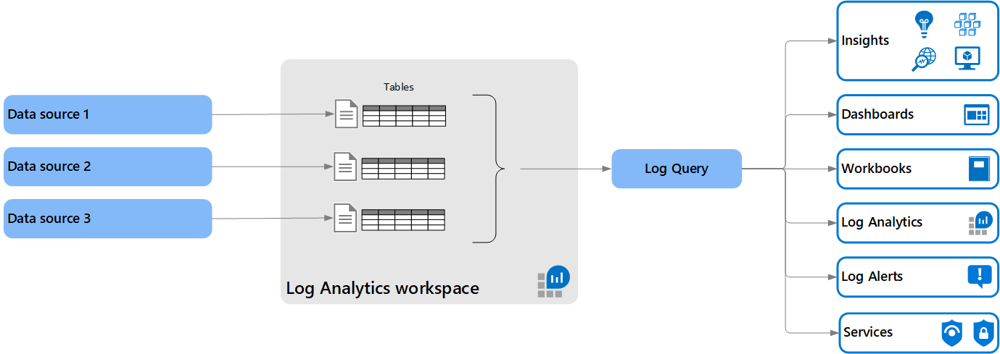

# Azure Monitor Logs overview
Azure Monitor Logs is a feature of Azure Monitor that collects and organizes log data from a variety of sources and makes it available for analysis using a sophisticated query language. Data from different sources can be consolidated into a single workspace and analyzed together to perform such tasks and trending analysis, alerting, and visualization.

## Relationship to Azure Monitor Metrics
Azure Monitor Metrics stores numeric data in a time-series database which makes this data more lightweight than Azure Monitor Logs and capable of supporting near real-time scenarios making them particularly useful for alerting and fast detection of issues. Metrics though can only store numeric data in a particular structure, while Logs can store a variety of different data types each with their own structure. You can also perform complex analysis on Logs data using log queries which cannot be used for analysis of Metrics data.

Numeric data is often sent from data sources to Logs in addition to Metrics. While there is an additional charge for collecting and retaining this data in Logs, it allows you to include metric data in log queries and analyze it with your other monitoring data.

## Relationship to Azure Data Explorer
Azure Monitor Logs is based on Azure Data Explorer. A Log Analytics workspace is roughly the equivalent of a database in Azure Data Explorer, tables are structured the same, and both use the same Kusto Query Language (KQL). The experience of using Log Analytics to work with Azure Monitor queries in the Azure portal is similar to the experience using the Azure Data Explorer Web UI. You can even [include data from a Log Analytics workspace in an Azure Data Explorer query](/azure/data-explorer/query-monitor-data). 

## Structure of data
Data collected by Azure Monitor Logs is stored in a [Log Analytics workspace](./design-logs-deployment.md) that contains multiple tables that each store data from a particular source. The workspace defines the geographic location of the data, access rights defining which users can access data, and configuration settings such as the pricing tier and data retention. You may use a single workspace for all of your monitoring data or create multiple workspaces depending on your requirements. See [Designing your Azure Monitor Logs deployment](design-logs-deployment.md) on considerations for creating multiple workspaces.

Each workspace contains multiple tables are that are organized into separate columns with multiple rows of data. Each table is defined by a unique set of columns that are shared by the rows of data provided by the data source. 

Log data from Application Insights is also stored in Azure Monitor Logs, but it's structured different depending on how your application is configured. For a workspace-based application (currently in preview), data is stored in a Log Analytics workspace just like other data in a standard set of tables to hold data such as application requests, exceptions, and page views. Multiple applications can use the same workspace. For a classic application, the data is not stored in a Log Analytics workspace. Its data is structured the same, uses the same query language, and you create and run queries using the same Log Analytics tool in the Azure portal. Data for monitored applications though is stored separately from each other in a similar set of standard tables.

## Log queries
Data is retrieved from a Log Analytics workspace using a log query which is a read-only request to process data and return results. Log queries are written in [Kusto Query Language (KQL)](/azure/data-explorer/kusto/query/) which is the query language used by Azure Data Explorer. Use Log Analytics which is a tool in the Azure portal to edit and run log queries and interactively analyze their results. You can then use the queries that you create to support other features in Azure Monitor such as log query alerts and workbooks.

## Sources of data for Azure Monitor Logs
Azure Monitor collects log data from a variety of sources including resources in Azure Monitor and agents running in virtual machines. See [What is monitored by Azure Monitor?](../monitor-reference.md) for a complete list of data sources that send data to a Log Analytics workspace.

## Next steps

- Learn more about the [Azure Monitor data platform](data-platform.md).
- Learn about [metrics in Azure Monitor](data-platform-metrics.md).
- Learn about the [monitoring data available](data-sources.md) for different resources in Azure.

