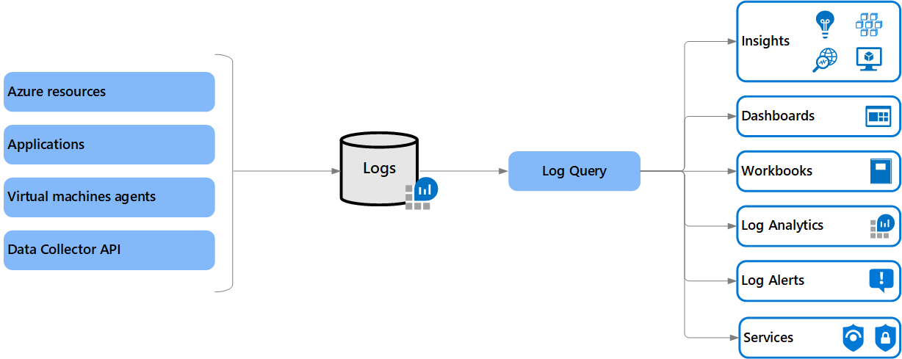

# Azure Monitor Logs overview
Azure Monitor Logs is a feature of Azure Monitor that collects and organizes log and performance data from a [variety of sources](../monitor-reference.md). Data from different sources such [platform logs](platform-logs-overview.md), log and performance data from [virtual machines agents](agents-overview.md), and usage and performance data from [applications](../app/app-insights-overview.md) can be consolidated into a single workspace so they can be analyzed together using a sophisticated query language that's capable of quickly analyzing millions of records and performing sophisticated data analysis. Work with log queries and their results interactively using Log Analytics or use their results in various Azure Monitor features such as alerts and workbooks.

> [!NOTE]
> Azure Monitor Logs is one part of the data platform supporting Azure Monitor. The other is [Azure Monitor Metrics](data-platform-metrics.md) stores numeric data in a time-series database, which makes this data more lightweight than Azure Monitor Logs and capable of supporting near real-time scenarios making them particularly useful for alerting and fast detection of issues. Metrics though can only store numeric data in a particular structure, while Logs can store a variety of different data types each with their own structure. You can also perform complex analysis on Logs data using log queries which cannot be used for analysis of Metrics data.

## What can you do with Azure Monitor Logs?
The following table lists some of the different ways that you can use Logs in Azure Monitor.

|  |  |
|:---|:---|
| Analyze | Use [Log Analytics](../log-query/get-started-portal.md) in the Azure portal to write [log queries](../log-query/log-query-overview.md) and interactively analyze log data using the powerful Data Explorer analysis engine |
| Alert | Configure a [log alert rule](alerts-log.md) that sends a notification or takes [automated action](action-groups.md) when the results of the query match a particular result. |
| Visualize | Pin query results rendered as tables or charts to an [Azure dashboard](../../azure-portal/azure-portal-dashboards.md). Create a [workbook](../app/usage-workbooks.md) to combine with multiple sets of data in an interactive report.  Export the results of a query to [Power BI](powerbi.md) to use different visualizations and share with users outside of Azure. Export the results of a query to [Grafana](grafana-plugin.md) to leverage its dashboarding and combine with other data sources.|
| Retrieve | Access log query results from a command line using [Azure CLI](/cli/azure/ext/log-analytics/monitor/log-analytics). Access log query results from a command line using [PowerShell cmdlets](https://docs.microsoft.com/powershell/module/az.operationalinsights). Access log query results from a custom application using [REST API](https://dev.loganalytics.io/). |
| Export | Configure [automated export of log data](logs-data-export.md) to Azure storage account or Azure Event Hubs. Build a workflow to retrieve log data and copy it to an external location using [Logic Apps](logicapp-flow-connector.md). |

## Log Analytics workspace
Data collected by Azure Monitor Logs is stored in one more [Log Analytics workspaces](./design-logs-deployment.md). The workspace defines the geographic location of the data, access rights defining which users can access data, and configuration settings such as the pricing tier and data retention.  

You must create at least one workspace to use Azure Monitor Logs. A single workspace may be sufficient for all of your monitoring data, or may choose to create multiple workspaces depending on your requirements. For example, you might have one workspace for your production data and another for testing. 

- See [Create a Log Analytics workspace in the Azure portal](../learn/quick-create-workspace.md) to create a new workspace.
- See [Designing your Azure Monitor Logs deployment](design-logs-deployment.md) on considerations for creating multiple workspaces.

## Log collection
Once you create a Log Analytics workspace, you must configure different sources to send their data. No data is collected automatically. This configuration will be different depending on the data source. For example, create diagnostic settings to send resource logs from Azure resources to the workspace. Configure data sources on the workspace to collect data from Log Analytics agents on virtual machines.

- See [What is monitored by Azure Monitor?](../monitor-reference.md) for a complete list of data sources that you can configure to send data to Azure Monitor Logs.

## Log queries
Data is retrieved from a Log Analytics workspace using a log query which is a read-only request to process data and return results. Log queries are written in Kusto Query Language (KQL), which is the query language used by Azure Data Explorer. You can write log queries in Log Analytics to interactively analyze their results, or use log

- See [Log queries in Azure Monitor](log-query/../../log-query/log-query-overview.md) for a list of where log queries are used and references to tutorials and other documentation to get you started.

## Log Analytics
Use Log Analytics, which is a tool in the Azure portal to edit and run log queries and interactively analyze their results. You can then use the queries that you create to support other features in Azure Monitor such as log query alerts and workbooks. 

- See [Overview of Log Analytics in Azure Monitor](/log-query/log-analytics-overview.md) for a description of Log Analytics. 
- See [Log Analytics tutorial](/log-query/log-analytics-tutorial.md) to walk through using Log Analytics features to create a simple log query and analyze its results.

## Relationship to Azure Data Explorer
Azure Monitor Logs is based on Azure Data Explorer. A Log Analytics workspace is roughly the equivalent of a database in Azure Data Explorer, tables are structured the same, and both use the same Kusto Query Language (KQL). The experience of using Log Analytics to work with Azure Monitor queries in the Azure portal is similar to the experience using the Azure Data Explorer Web UI. You can even [include data from a Log Analytics workspace in an Azure Data Explorer query](/azure/data-explorer/query-monitor-data). 

## Next steps

- Learn about [log queries](../log-query/log-query-overview.md) to retrieve and analyze data from a Log Analytics workspace.
- Learn about [metrics in Azure Monitor](data-platform-metrics.md).
- Learn about the [monitoring data available](data-sources.md) for different resources in Azure.
