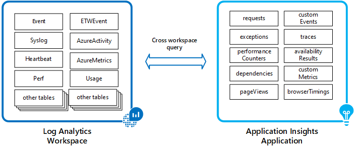
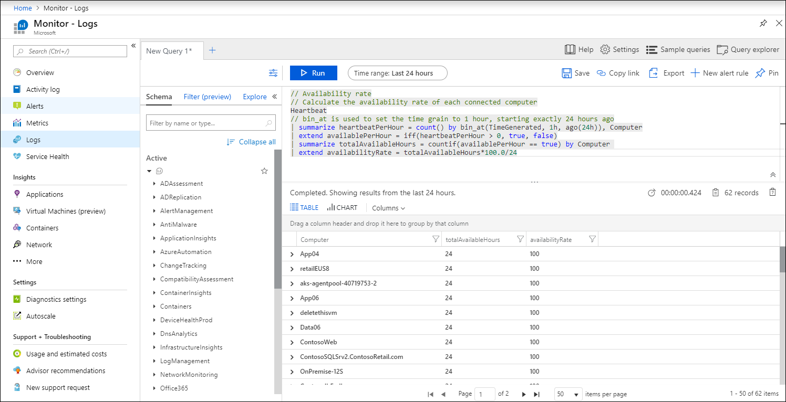
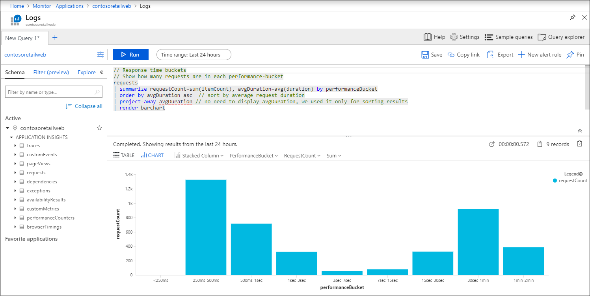

# Logs in Azure Monitor

> [!NOTE]
> All data collected by Azure Monitor fits into one of two fundamental types, Metrics and Logs. This article describes Logs. Refer to [Metrics in Azure Monitor](data-platform-metrics.md) for a detailed description of metrics and to [Monitoring data collected by Azure Monitor](data-platform.md) for a comparison of the two.

Logs in Azure Monitor are especially useful for performing complex analysis across data from a variety of sources. This article describes how Logs are structured in Azure Monitor, what you can do with the data, and identifies different data sources that store data in Logs.

> [!NOTE]
> It's important to distinguish between Azure Monitor Logs and sources of log data in Azure. For example, subscription level events in Azure are written to an [activity log](platform-logs-overview.md) that you can view from the Azure Monitor menu. Most resources will write operational information to a [resource log](platform-logs-overview.md) that you can forward to different locations. Azure Monitor Logs is a log data platform that collects activity logs and resource logs along with other monitoring data to provide deep analysis across your entire set of resources.

## What are Azure Monitor Logs?

Logs in Azure Monitor contain different kinds of data organized into records with different sets of properties for each type. Logs can contain numeric values like Azure Monitor Metrics but typically contain text data with detailed descriptions. They further differ from metric data in that they vary in their structure and are often not collected at regular intervals. Telemetry such as events and traces are stored Azure Monitor Logs in addition to performance data so that it can all be combined for analysis.

A common type of log entry is an event, which is collected sporadically. Events are created by an application or service and typically include enough information to provide complete context on their own. For example, an event can indicate that a particular resource was created or modified, a new host started in response to increased traffic, or an error was detected in an application.

 Because the format of the data can vary, applications can create custom logs by using the structure that they need. Metric data can even be stored in Logs to combine them with other monitoring data for trending and other data analysis.

## What can you do with Azure Monitor Logs?
The following table lists the different ways that you can use Logs in Azure Monitor.

|  |  |
|:---|:---|
| Analyze | Use [Log Analytics](../log-query/get-started-portal.md) in the Azure portal to write [log queries](../log-query/log-query-overview.md) and interactively analyze log data using the powerful Data Explorer analysis engine. Use the [Application Insights analytics console](../app/analytics.md) in the Azure portal to write log queries and interactively analyze log data from Application Insights. |
| Visualize | Pin query results rendered as tables or charts to an [Azure dashboard](../../azure-portal/azure-portal-dashboards.md). Create a [workbook](../platform/workbooks-overview.md) to combine with multiple sets of data in an interactive report.  Export the results of a query to [Power BI](powerbi.md) to use different visualizations and share with users outside of Azure. Export the results of a query to [Grafana](grafana-plugin.md) to leverage its dashboarding and combine with other data sources.|
| Alert | Configure a [log alert rule](alerts-log.md) that sends a notification or takes [automated action](action-groups.md) when the results of the query match a particular result. Configure a [metric alert rule](alerts-metric-logs.md) on certain log data logs extracted as metrics. |
| Retrieve | Access log query results from a command line using [Azure CLI](/cli/azure/ext/log-analytics/monitor/log-analytics). Access log query results from a command line using [PowerShell cmdlets](https://docs.microsoft.com/powershell/module/az.operationalinsights). Access log query results from a custom application using [REST API](https://dev.loganalytics.io/). |
| Export | Build a workflow to retrieve log data and copy it to an external location using [Logic Apps](~/articles/logic-apps/index.yml). |

## How is data in Azure Monitor Logs structured?
Data collected by Azure Monitor Logs is stored in a [Log Analytics workspace](../platform/design-logs-deployment.md). Each workspace contains multiple tables that each store data from a particular source. While all tables share [some common properties](log-standard-properties.md), each has a unique set of properties depending on the kind of data it stores. A new workspace will have standard set of tables, and more tables will be added by different monitoring solutions and other services that write to the workspace.

Log data from Application Insights uses the same Log Analytics engine as workspaces, but it's stored separately for each monitored application. Each application has a standard set of tables to hold data such as application requests, exceptions, and page views.

Log queries will either use data from a Log Analytics workspace or an Application Insights application. You can use a [cross-resource query](../log-query/cross-workspace-query.md) to analyze application data together with other log data or to create queries including multiple workspaces or applications.

## Log queries
Data in Azure Monitor Logs is retrieved using a [log query](../log-query/log-query-overview.md) written with the [Kusto query language](../log-query/get-started-queries.md), which allows you to quickly retrieve, consolidate, and analyze collected data. Use [Log Analytics](../log-query/portals.md) to write and test log queries in the Azure portal. It allows you to work with results interactively or pin them to a dashboard to view them with other visualizations.

Open [Log Analytics from Application Insights](../app/analytics.md) to analyze Application Insights data.

You can also retrieve log data by using the [Log Analytics API](https://dev.loganalytics.io/documentation/overview) and the [Application Insights REST API](https://dev.applicationinsights.io/documentation/overview).

## Sources of Azure Monitor Logs
Azure Monitor can collect log data from a variety of sources both within Azure and from on-premises resources. The following tables list the different data sources available from different resources that write data to Azure Monitor Logs. Each has a link to details on any required configuration.

### Azure tenant and subscription

| Data | Description |
|:---|:---|
| Azure Active Directory audit logs | Configured through Diagnostic settings for each directory. See [Integrate Azure AD logs with Azure Monitor logs](../../active-directory/reports-monitoring/howto-integrate-activity-logs-with-log-analytics.md).  |
| Activity logs | Stored separately by default and can be used for near real time alerts. Install Activity log Analytics solution to write to Log Analytics workspace. See [Collect and analyze Azure activity logs in Log Analytics](activity-log-collect.md). |

### Azure resources

| Data | Description |
|:---|:---|
| Resource diagnostics | Configure Diagnostic settings to write to diagnostic data, including metrics to a Log Analytics workspace. See [Stream Azure resource logs to Log Analytics](resource-logs-collect-workspace.md). |
| Monitoring solutions | Monitoring solutions write data they collect to their Log Analytics workspace. See [Data collection details for management solutions in Azure](../insights/solutions-inventory.md) for a list of solutions. See [Monitoring solutions in Azure Monitor](../insights/solutions.md) for details on installing and using solutions. |
| Metrics | Send platform metrics for Azure Monitor resources to a Log Analytics workspace to retain log data for longer periods and to perform complex analysis with other data types using the [Kusto query language](/azure/kusto/query/). See [Stream Azure resource logs to Log Analytics](resource-logs-collect-storage.md). |
| Azure table storage | Collect data from Azure storage where some Azure resources write monitoring data. See  [Use Azure blob storage for IIS and Azure table storage for events with Log Analytics](diagnostics-extension-logs.md). |

### Virtual Machines

| Data | Description |
|:---|:---|
|  Agent data sources | Data sources collected from [Windows](agent-windows.md) and [Linux](../learn/quick-collect-linux-computer.md) agents include events, performance data, and custom logs. See [Agent data sources in Azure Monitor](data-sources.md) for a list of data sources and details on configuration. |
| Monitoring solutions | Monitoring solutions write data they collect from agents to their Log Analytics workspace. See [Data collection details for management solutions in Azure](../insights/solutions-inventory.md) for a list of solutions. See [Monitoring solutions in Azure Monitor](../insights/solutions.md) for details on installing and using solutions. |
| System Center Operations Manager | Connect Operations Manager management group to Azure Monitor to collect event and performance data from on-premises agents into logs. See [Connect Operations Manager to Log Analytics](om-agents.md) for details on this configuration. |

### Applications

| Data | Description |
|:---|:---|
| Requests and exceptions | Detailed data about application requests and exceptions are in the  _requests_, _pageViews_, and _exceptions_ tables. Calls to [external components](../app/asp-net-dependencies.md) are in the _dependencies_ table. |
| Usage and performance | Performance for the application is available in the _requests_, _browserTimings_ and _performanceCounters_ tables. Data for [custom metrics](../app/api-custom-events-metrics.md#trackevent) is in the _customMetrics_ table.|
| Trace data | Results from [distributed tracing](../app/distributed-tracing.md) are stored in the _traces_ table. |
| Availability tests | Summary data from [availability tests](../app/monitor-web-app-availability.md) is stored in the _availabilityResults_ table. Detailed data from these tests are in separate storage and accessed from  Application Insights in the Azure portal. |

### Insights

| Data | Description |
|:---|:---|
| Azure Monitor for containers | Inventory and performance data collected by [Azure Monitor for containers](../insights/container-insights-overview.md). See [Container data-collection details](../insights/container-insights-log-search.md#container-records) for a list of the tables. |
| Azure Monitor for VMs | Map and performance data collected by [Azure Monitor for VMs](../insights/vminsights-overview.md). See [How to query logs from Azure Monitor for VMs](../insights/vminsights-log-search.md) for details on querying this data. |

### Custom 

| Data | Description |
|:---|:---|
| REST API | Write data to a Log Analytics workspace from any REST client. See [Send log data to Azure Monitor with the HTTP Data Collector API](data-collector-api.md) for details.
| Logic App | Write any data to a Log Analytics workspace from a Logic App workflow with the **Azure Log Analytics Data Collector** action. |

### Security

| Data | Description |
|:---|:---|
| Azure Security Center | [Azure Security Center](/azure/security-center/) stores data that it collects in a Log Analytics workspace where it can be analyzed with other log data. See [Data collection in Azure Security Center](../../security-center/security-center-enable-data-collection.md) for details on workspace configuration. |
| Azure Sentinel | [Azure Sentinel](/azure/sentinel/) stores data from data sources into a Log Analytics workspace. See [Connect data sources](/azure/sentinel/connect-data-sources).  |

## Next steps

- Learn more about the [Azure Monitor data platform](data-platform.md).
- Learn about [metrics in Azure Monitor](data-platform-metrics.md).
- Learn about the [monitoring data available](data-sources.md) for different resources in Azure.
