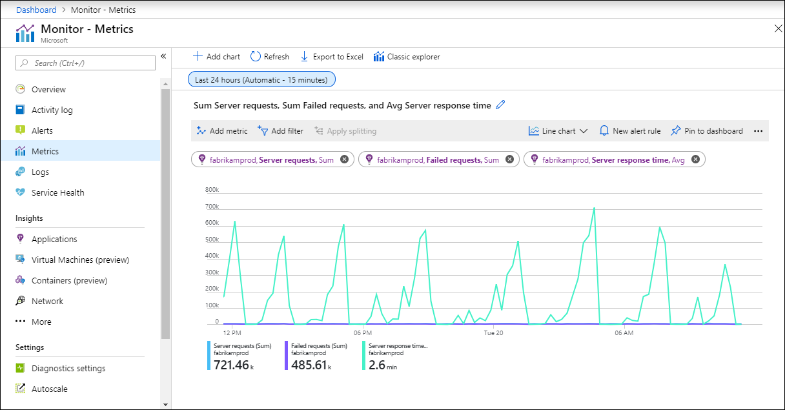

# Metrics in Azure Monitor

> [!NOTE]
> The Azure Monitor data platform  is based on two fundamental data types: Metrics and Logs. This article describes Metrics. Refer to [Logs in Azure Monitor](data-platform-logs.md) for a detailed description of logs and to [Azure Monitor data platform](data-platform.md) for a comparison of the two.

Metrics in Azure Monitor are lightweight and capable of supporting near real-time scenarios making them particularly useful for alerting and fast detection of issues. This article describes how metrics are structured, what you can do with them, and identifies different data sources that store data in metrics.

## What are metrics?
Metrics are numerical values that describe some aspect of a system at a particular time. Metrics are collected at regular intervals and are useful for alerting because they can be sampled frequently, and an alert can be fired quickly with relatively simple logic.

## What can you do with Azure Monitor Metrics?
The following table lists the different ways that you can use metric data in Azure Monitor.

|  |  |
|:---|:---|
| Analyze | Use [metrics explorer](metrics-charts.md) to analyze collected metrics on a chart and compare metrics from different resources. |
| Visualize | Pin a chart from metrics explorer to an [Azure dashboard](../learn/tutorial-app-dashboards.md). Create a [workbook](../platform/workbooks-overview.md) to combine with multiple sets of data in an interactive report.Export the results of a query to [Grafana](grafana-plugin.md) to leverage its dashboarding and combine with other data sources. |
| Alert | Configure a [metric alert rule](alerts-metric.md) that sends a notification or takes [automated action](action-groups.md) when the metric value crosses a threshold. |
| Automate |  Use [Autoscale](autoscale-overview.md) to increase or decrease resources based on a metric value crossing a threshold. |
| Export | [Route Metrics to Logs](resource-logs-collect-storage.md) to analyze data in Azure Monitor Metrics together with data in Azure Monitor Logs and to store metric values for longer than 93 days. Stream Metrics to an [Event Hub](stream-monitoring-data-event-hubs.md) to route them to external systems. |
| Retrieve | Access metric values from a command line using  [PowerShell cmdlets](https://docs.microsoft.com/powershell/module/az.applicationinsights) Access metric values from custom application using [REST API](rest-api-walkthrough.md). Access metric values from a command line using  [CLI](/cli/azure/monitor/metrics). |
| Archive | [Archive](..//learn/tutorial-archive-data.md) the performance or health history of your resource for compliance, auditing, or offline reporting purposes. |

## How is data in Azure Monitor Metrics structured?
Data collected by Azure Monitor Metrics is stored in a time-series database which is optimized for analyzing time-stamped data. Each set of metric values is a time series with the following properties:

* The time the value was collected
* The resource the value is associated with
* A namespace that acts like a category for the metric
* A metric name
* The value itself
* Some metrics may have multiple dimensions as described in [Multi-dimensional metrics](#multi-dimensional-metrics). Custom metrics can have up to 10 dimensions.

## Multi-dimensional metrics
One of the challenges to metric data is that it often has limited information to provide context for collected values. Azure Monitor addresses this challenge with multi-dimensional metrics. Dimensions of a metric are name-value pairs that carry additional data to describe the metric value. For example, a metric _Available disk space_ could have a dimension called _Drive_ with values _C:_, _D:_, which would allow viewing either available disk space across all drives or for each drive individually.

The example below illustrates two datasets for a hypothetical metric called _Network Throughput_. The first dataset has no dimensions. The second dataset shows the values with two dimensions, _IP Address_ and _Direction_:

### Network Throughput

| Timestamp     | Metric Value |
| ------------- |:-------------|
| 8/9/2017 8:14 | 1,331.8 Kbps |
| 8/9/2017 8:15 | 1,141.4 Kbps |
| 8/9/2017 8:16 | 1,110.2 Kbps |

This non-dimensional metric can only answer a basic question like "what was my network throughput at a given time?”

### Network Throughput + two dimensions ("IP" and "Direction")

| Timestamp     | Dimension "IP"   | Dimension "Direction" | Metric Value|
| ------------- |:-----------------|:------------------- |:-----------|
| 8/9/2017 8:14 | IP="192.168.5.2" | Direction="Send"    | 646.5 Kbps |
| 8/9/2017 8:14 | IP="192.168.5.2" | Direction="Receive" | 420.1 Kbps |
| 8/9/2017 8:14 | IP="10.24.2.15"  | Direction="Send"    | 150.0 Kbps |
| 8/9/2017 8:14 | IP="10.24.2.15"  | Direction="Receive" | 115.2 Kbps |
| 8/9/2017 8:15 | IP="192.168.5.2" | Direction="Send"    | 515.2 Kbps |
| 8/9/2017 8:15 | IP="192.168.5.2" | Direction="Receive" | 371.1 Kbps |
| 8/9/2017 8:15 | IP="10.24.2.15"  | Direction="Send"    | 155.0 Kbps |
| 8/9/2017 8:15 | IP="10.24.2.15"  | Direction="Receive" | 100.1 Kbps |

This metric can answer questions such as "what was the network throughput for each IP address?", and "how much data was sent versus received?" Multi-dimensional metrics carry additional analytical and diagnostic value compared to non-dimensional metrics.

## Interacting with Azure Monitor Metrics
Use [Metrics Explorer](metrics-charts.md) to interactively analyze the data in your metric database and chart the values of multiple metrics over time. You can pin the charts to a dashboard to view them with other visualizations. You can also retrieve metrics by using the [Azure monitoring REST API](rest-api-walkthrough.md).

## Sources of Azure Monitor Metrics
There are three fundamental sources of metrics collected by Azure Monitor. Once these metrics are collected in the Azure Monitor metric database, they can be evaluated together regardless of their source.

**Platform metrics** are created by Azure resources and give you visibility into their health and performance. Each type of resource creates a [distinct set of metrics](metrics-supported.md) without any configuration required. Platform metrics are collected from Azure resources at one-minute frequency unless specified otherwise in the metric's definition. 

**Guest OS metrics** are collected from the guest operating system of a virtual machine. Enable guest OS metrics for Windows virtual machines with [Windows Diagnostic Extension (WAD)](../platform/diagnostics-extension-overview.md) and for Linux virtual machines with [InfluxData Telegraf Agent](https://www.influxdata.com/time-series-platform/telegraf/).

**Application metrics** are created by Application Insights for your monitored applications and help you detect performance issues and track trends in how your application is being used. This includes such values as _Server response time_ and _Browser exceptions_.

**Custom metrics** are metrics that you define in addition to the standard metrics that are automatically available. You can [define custom metrics in your application](../app/api-custom-events-metrics.md) that's monitored by Application Insights or create custom metrics for an Azure service using the [custom metrics API](metrics-store-custom-rest-api.md).

## Retention of Metrics
For most resources in Azure, metrics are stored for 93 days. There are some exceptions:

**Guest OS metrics**
-	**Classic guest OS metrics**. These are performance counters collected by the [Windows Diagnostic Extension (WAD)](../platform/diagnostics-extension-overview.md) or the [Linux Diagnostic Extension (LAD)](../../virtual-machines/extensions/diagnostics-linux.md) and routed to an Azure storage account. Retention for these metrics is 14 days.
-	**Guest OS metrics sent to Azure Monitor Metrics**. These are performance counters collected by the [Windows Diagnostic Extension (WAD)](diagnostics-extension-overview.md) and sent to the [Azure Monitor data sink](diagnostics-extension-overview.md#data-destinations), or via the [InfluxData Telegraf Agent](https://www.influxdata.com/time-series-platform/telegraf/) on Linux machines. Retention for these metrics is 93 days.
-	**Guest OS metrics collected by Log Analytics agent**. These are performance counters collected by the Log Analytics agent and sent to a Log Analytics workspace. Retention for these metrics is 31 days, and can be extended up to 2 years.

**Application Insights log-based metrics**. 
- Behind the scene, [log-based metrics](../app/pre-aggregated-metrics-log-metrics.md) translate into log queries. Their retention matches the retention of events in underlying logs. For Application Insights resources, logs are stored for 90 days.

> [!NOTE]
> You can [send platform metrics for Azure Monitor resources to a Log Analytics workspace](resource-logs-collect-storage.md) for long term trending.

## Next steps

- Learn more about the [Azure Monitor data platform](data-platform.md).
- Learn about [log data in Azure Monitor](data-platform-logs.md).
- Learn about the [monitoring data available](data-sources.md) for different resources in Azure.
