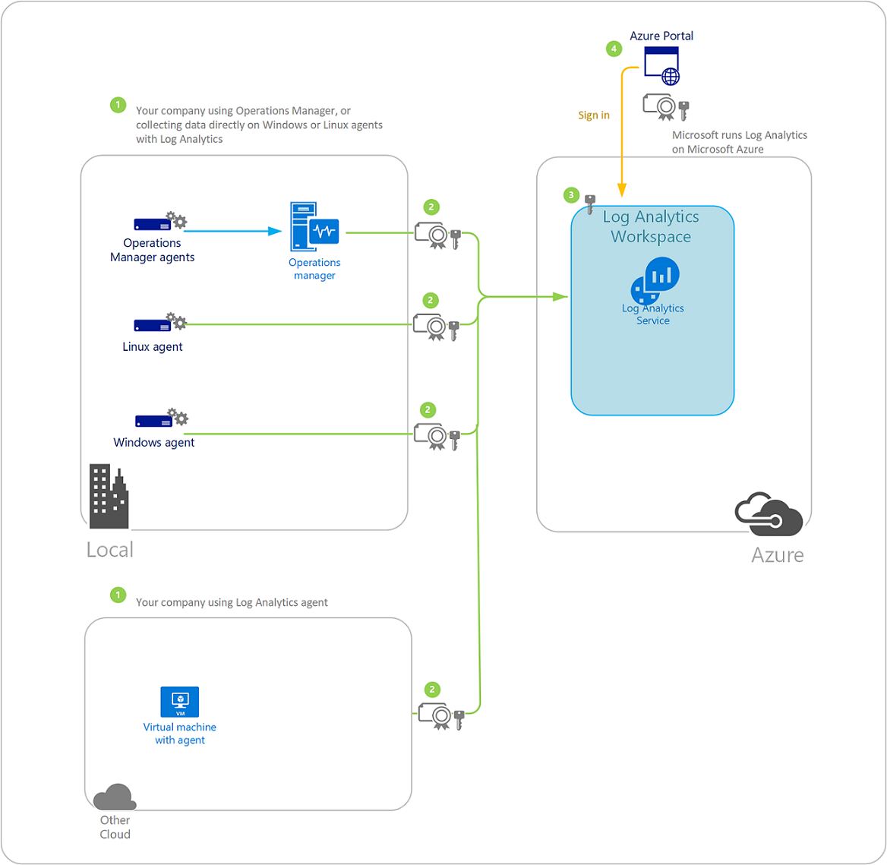

# Log Analytics data security
This document is intended to provide information specific to Log Analytics, which is a feature of Azure Monitor, to supplement the information on [Azure Trust Center](../../security/fundamentals/trust-center.md).  

This article explains how data is collected, processed, and secured by Log Analytics. You can use agents to connect to the web service, use System Center Operations Manager to collect operational data, or retrieve data from Azure diagnostics for use by Log Analytics. 

The Log Analytics service manages your cloud-based data securely by using the following methods:

* Data segregation
* Data retention
* Physical security
* Incident management
* Compliance
* Security standards certifications

Contact us with any questions, suggestions, or issues about any of the following information, including our security policies at [Azure support options](https://azure.microsoft.com/support/options/).

## Sending data securely using TLS 1.2 

To insure the security of data in transit to Log Analytics, we strongly encourage you to configure the agent to use at least Transport Layer Security (TLS) 1.2. Older versions of TLS/Secure Sockets Layer (SSL) have been found to be vulnerable and while they still currently work to allow backwards compatibility, they are **not recommended**, and the industry is quickly moving to abandon support for these older protocols. 

The [PCI Security Standards Council](https://www.pcisecuritystandards.org/) has set a [deadline of June 30th, 2018](https://www.pcisecuritystandards.org/pdfs/PCI_SSC_Migrating_from_SSL_and_Early_TLS_Resource_Guide.pdf) to disable older versions of TLS/SSL and upgrade to more secure protocols. Once Azure drops legacy support, if your agents cannot communicate over at least TLS 1.2 you would not be able to send data to Log Analytics. 

We do not recommend explicitly setting your agent to only use TLS 1.2 unless absolutely necessary, as it can break platform level security features that allow you to automatically detect and take advantage of newer more secure protocols as they become available, such as TLS 1.3. 

### Platform-specific guidance

|Platform/Language | Support | More Information |
| --- | --- | --- |
|Linux | Linux distributions tend to rely on [OpenSSL](https://www.openssl.org) for TLS 1.2 support.  | Check the [OpenSSL Changelog](https://www.openssl.org/news/changelog.html) to confirm your version of OpenSSL is supported.|
| Windows 8.0 - 10 | Supported, and enabled by default. | To confirm that you are still using the [default settings](https://docs.microsoft.com/windows-server/security/tls/tls-registry-settings).  |
| Windows Server 2012 - 2016 | Supported, and enabled by default. | To confirm that you are still using the [default settings](https://docs.microsoft.com/windows-server/security/tls/tls-registry-settings) |
| Windows 7 SP1 and Windows Server 2008 R2 SP1 | Supported, but not enabled by default. | See the [Transport Layer Security (TLS) registry settings](https://docs.microsoft.com/windows-server/security/tls/tls-registry-settings) page for details on how to enable.  |

## Data segregation
After your data is ingested by the Log Analytics service, the data is kept logically separate on each component throughout the service. All data is tagged per workspace. This tagging persists throughout the data lifecycle, and it is enforced at each layer of the service. Your data is stored in a dedicated database in the storage cluster in the region you have selected.

## Data retention
Indexed log search data is stored and retained according to your pricing plan. For more information, see [Log Analytics Pricing](https://azure.microsoft.com/pricing/details/log-analytics/).

As part of your [subscription agreement](https://azure.microsoft.com/support/legal/subscription-agreement/), Microsoft will retain your data per the terms of the agreement.  When customer data is removed, no physical drives are destroyed.  

The following table lists some of the available solutions and provides examples of the type of data they collect.

| **Solution** | **Data types** |
| --- | --- |
| Capacity and Performance |Performance data and metadata |
| Update Management |Metadata and state data |
| Log Management |User-defined event logs, Windows Event Logs and/or IIS Logs |
| Change Tracking |Software inventory, Windows service and Linux daemon metadata, and Windows/Linux file metadata |
| SQL and Active Directory Assessment |WMI data, registry data, performance data, and SQL Server dynamic management view results |

The following table shows examples of data types:

| **Data type** | **Fields** |
| --- | --- |
| Alert |Alert Name, Alert Description, BaseManagedEntityId, Problem ID, IsMonitorAlert, RuleId, ResolutionState, Priority, Severity, Category, Owner, ResolvedBy, TimeRaised, TimeAdded, LastModified, LastModifiedBy, LastModifiedExceptRepeatCount, TimeResolved, TimeResolutionStateLastModified, TimeResolutionStateLastModifiedInDB, RepeatCount |
| Configuration |CustomerID, AgentID, EntityID, ManagedTypeID, ManagedTypePropertyID, CurrentValue, ChangeDate |
| Event |EventId, EventOriginalID, BaseManagedEntityInternalId, RuleId, PublisherId, PublisherName, FullNumber, Number, Category, ChannelLevel, LoggingComputer, EventData, EventParameters, TimeGenerated, TimeAdded  **Note:** When you write events with custom fields in to the Windows event log, Log Analytics collects them. |
| Metadata |BaseManagedEntityId, ObjectStatus, OrganizationalUnit, ActiveDirectoryObjectSid, PhysicalProcessors, NetworkName, IPAddress, ForestDNSName, NetbiosComputerName, VirtualMachineName, LastInventoryDate, HostServerNameIsVirtualMachine, IP Address, NetbiosDomainName, LogicalProcessors, DNSName, DisplayName, DomainDnsName, ActiveDirectorySite, PrincipalName, OffsetInMinuteFromGreenwichTime |
| Performance |ObjectName, CounterName, PerfmonInstanceName, PerformanceDataId, PerformanceSourceInternalID, SampleValue, TimeSampled, TimeAdded |
| State |StateChangeEventId, StateId, NewHealthState, OldHealthState, Context, TimeGenerated, TimeAdded, StateId2, BaseManagedEntityId, MonitorId, HealthState, LastModified, LastGreenAlertGenerated, DatabaseTimeModified |

## Physical security
The Log Analytics service is managed by Microsoft personnel and all activities are logged and can be audited. Log Analytics is operated as an Azure Service and meets all Azure Compliance and Security requirements. You can view details about the physical security of Azure assets on page 18 of the [Microsoft Azure Security Overview](https://download.microsoft.com/download/6/0/2/6028B1AE-4AEE-46CE-9187-641DA97FC1EE/Windows%20Azure%20Security%20Overview%20v1.01.pdf). Physical access rights to secure areas are changed within one business day for anyone who no longer has responsibility for the Log Analytics service, including transfer and termination. You can read about the global physical infrastructure we use at [Microsoft Datacenters](https://azure.microsoft.com/global-infrastructure/).

## Incident management
Log Analytics has an incident management process that all Microsoft services adhere to. To summarize, we:

* Use a shared responsibility model where a portion of security responsibility belongs to Microsoft and a portion belongs to the customer
* Manage Azure security incidents:
  * Start an investigation upon detection of an incident
  * Assess the impact and severity of an incident by an on-call incident response team member. Based on evidence, the assessment may or may not result in further escalation to the security response team.
  * Diagnose an incident by security response experts to conduct the technical or forensic investigation, identify containment, mitigation, and workaround strategies. If the security team believes that customer data may have become exposed to an unlawful or unauthorized individual, parallel execution of the Customer Incident Notification process begins in parallel.  
  * Stabilize and recover from the incident. The incident response team creates a recovery plan to mitigate the issue. Crisis containment steps such as quarantining impacted systems may occur immediately and in parallel with diagnosis. Longer term mitigations may be planned which occur after the immediate risk has passed.  
  * Close the incident and conduct a post-mortem. The incident response team creates a post-mortem that outlines the details of the incident, with the intention to revise policies, procedures, and processes to prevent a recurrence of the event.
* Notify customers of security incidents:
  * Determine the scope of impacted customers and to provide anybody who is impacted as detailed a notice as possible
  * Create a notice to provide customers with detailed enough information so that they can perform an investigation on their end and meet any commitments they have made to their end users while not unduly delaying the notification process.
  * Confirm and declare the incident, as necessary.
  * Notify customers with an incident notification without unreasonable delay and in accordance with any legal or contractual commitment. Notifications of security incidents are delivered to one or more of a customer's administrators by any means Microsoft selects, including via email.
* Conduct team readiness and training:
  * Microsoft personnel are required to complete security and awareness training, which helps them to identify and report suspected security issues.  
  * Operators working on the Microsoft Azure service have addition training obligations surrounding their access to sensitive systems hosting customer data.
  * Microsoft security response personnel receive specialized training for their roles

If loss of any customer data occurs, we notify each customer within one day. However, customer data loss has never occurred with the service. 

For more information about how Microsoft responds to security incidents, see [Microsoft Azure Security Response in the Cloud](https://gallery.technet.microsoft.com/Azure-Security-Response-in-dd18c678/file/150826/4/Microsoft%20Azure%20Security%20Response%20in%20the%20cloud.pdf).

## Compliance
The Log Analytics software development and service team's information security and governance program supports its business requirements and adheres to laws and regulations as described at [Microsoft Azure Trust Center](https://azure.microsoft.com/support/trust-center/) and [Microsoft Trust Center Compliance](https://www.microsoft.com/en-us/trustcenter/compliance/default.aspx). How Log Analytics establishes security requirements, identifies security controls, manages, and monitors risks are also described there. Annually, we review polices, standards, procedures, and guidelines.

Each development team member receives formal application security training. Internally, we use a version control system for software development. Each software project is protected by the version control system.

Microsoft has a security and compliance team that oversees and assesses all services in Microsoft. Information security officers make up the team and they are not associated with the engineering teams that develops Log Analytics. The security officers have their own management chain and conduct independent assessments of products and services to ensure security and compliance.

Microsoft's board of directors is notified by an annual report about all information security programs at Microsoft.

The Log Analytics software development and service team are actively working with the Microsoft Legal and Compliance teams and other industry partners to acquire various certifications.

## Certifications and attestations
Azure Log Analytics meets the following requirements:

* [ISO/IEC 27001](https://www.iso.org/iso/home/standards/management-standards/iso27001.htm)
* [ISO/IEC 27018:2014](https://www.iso.org/iso/home/store/catalogue_tc/catalogue_detail.htm?csnumber=61498)
* [ISO 22301](https://azure.microsoft.com/blog/iso22301/)
* [Payment Card Industry (PCI Compliant) Data Security Standard (PCI DSS)](https://www.microsoft.com/en-us/TrustCenter/Compliance/PCI) by the PCI Security Standards Council.
* [Service Organization Controls (SOC) 1 Type 1 and SOC 2 Type 1](https://www.microsoft.com/en-us/TrustCenter/Compliance/SOC1-and-2) compliant
* [HIPAA and HITECH](https://www.microsoft.com/en-us/TrustCenter/Compliance/hipaa) for companies that have a HIPAA Business Associate Agreement
* Windows Common Engineering Criteria
* Microsoft Trustworthy Computing
* As an Azure service, the components that Log Analytics uses adhere to Azure compliance requirements. You can read more at [Microsoft Trust Center Compliance](https://www.microsoft.com/en-us/trustcenter/compliance/default.aspx).

> [!NOTE]
> In some certifications/attestations, Log Analytics is listed under its former name of *Operational Insights*.
>
>

## Cloud computing security data flow
The following diagram shows a cloud security architecture as the flow of information from your company and how it is secured as is moves to the Log Analytics service, ultimately seen by you in the Azure portal. More information about each step follows the diagram.

## 1. Sign up for Log Analytics and collect data
For your organization to send data to Log Analytics, you configure a Windows or Linux agent running on Azure virtual machines, or on virtual or physical computers in your environment or other cloud provider.  If you use Operations Manager, from the management group you configure the Operations Manager agent. Users (which might be you, other individual users, or a group of people) create one or more Log Analytics workspaces, and register agents by using one of the following accounts:

* [Organizational ID](../../active-directory/fundamentals/sign-up-organization.md)
* [Microsoft Account - Outlook, Office Live, MSN](https://account.microsoft.com/account)

A Log Analytics workspace is where data is collected, aggregated, analyzed, and presented. A workspace is primarily used as a means to partition data, and each workspace is unique. For example, you might want to have your production data managed with one workspace and your test data managed with another workspace. Workspaces also help an administrator control user access to the data. Each workspace can have multiple user accounts associated with it, and each user account can access multiple Log Analytics workspaces. You create workspaces based on datacenter region.

For Operations Manager, the Operations Manager management group establishes a connection with the Log Analytics service. You then configure which agent-managed systems in the management group are allowed to collect and send data to the service. Depending on the solution you have enabled, data from these solutions are either sent directly from an Operations Manager management server to the Log Analytics service, or because of the volume of data collected by the agent-managed system, are sent directly from the agent to the service. For systems not monitored by Operations Manager, each connects securely to the Log Analytics service directly.

All communication between connected systems and the Log Analytics service is encrypted. The TLS (HTTPS) protocol is used for encryption.  The Microsoft SDL process is followed to ensure Log Analytics is up-to-date with the most recent advances in cryptographic protocols.

Each type of agent collects data for Log Analytics. The type of data that is collected is depends on the types of solutions used. You can see a summary of data collection at [Add Log Analytics solutions from the Solutions Gallery](../../azure-monitor/insights/solutions.md). Additionally, more detailed collection information is available for most solutions. A solution is a bundle of predefined views, log search queries, data collection rules, and processing logic. Only administrators can use Log Analytics to import a solution. After the solution is imported, it is moved to the Operations Manager management servers (if used), and then to any agents that you have chosen. Afterward, the agents collect the data.

## 2. Send data from agents
You register all agent types with an enrollment key and a secure connection is established between the agent and the Log Analytics service using certificate-based authentication and TLS with port 443. Log Analytics uses a secret store to generate and maintain keys. Private keys are rotated every 90 days and are stored in Azure and are managed by the Azure operations who follow strict regulatory and compliance practices.

With Operations Manager, the management group registered with a Log Analytics workspace establishes a secure HTTPS connection with an Operations Manager management server.

For Windows or Linux agents running on Azure virtual machines, a read-only storage key is used to read diagnostic events in Azure tables.  

With any agent reporting to an Operations Manager management group that is integrated with Log Analytics, if the management server is unable to communicate with the service for any reason, the collected data is stored locally in a temporary cache on the management server.   They try to resend the data every eight minutes for two hours.  For data that bypasses the management server and is sent directly to Log Analytics, the behavior is consistent with the Windows agent.  

The Windows or management server agent cached data is protected by the operating system's credential store. If the service cannot process the data after two hours, the agents will queue the data. If the queue becomes full, the agent starts dropping data types, starting with performance data. The agent queue limit is a registry key so you can modify it, if necessary. Collected data is compressed and sent to the service, bypassing the Operations Manager management group databases, so it does not add any load to them. After the collected data is sent, it is removed from the cache.

As described above, data from the management server or direct-connected agents is sent over TLS to Microsoft Azure datacenters. Optionally, you can use ExpressRoute to provide additional security for the data. ExpressRoute is a way to directly connect to Azure from your existing WAN network, such as a multi-protocol label switching (MPLS) VPN, provided by a network service provider. For more information, see [ExpressRoute](https://azure.microsoft.com/services/expressroute/).

## 3. The Log Analytics service receives and processes data
The Log Analytics service ensures that incoming data is from a trusted source by validating certificates and the data integrity with Azure authentication. The unprocessed raw data is then stored in an Azure Event Hub in the region the data will eventually be stored at rest. The type of data that is stored depends on the types of solutions that were imported and used to collect data. Then, the Log Analytics service processes the raw data and ingests it into the database.

The retention period of collected data stored in the database depends on the selected pricing plan. For the *Free* tier, collected data is available for seven days. For the *Paid* tier, collected data is available for 31 days by default, but can be extended to 730 days. Data is stored encrypted at rest in Azure storage, to ensure data confidentiality, and the data is replicated within the local region using locally redundant storage (LRS). The last two weeks of data are also stored in SSD-based cache and this cache is encrypted.

## 4. Use Log Analytics to access the data
To access your Log Analytics workspace, you sign into the Azure portal using the organizational account or Microsoft account that you set up previously. All traffic between the portal and Log Analytics service is sent over a secure HTTPS channel. When using the portal, a session ID is generated on the user client (web browser) and data is stored in a local cache until the session is terminated. When terminated, the cache is deleted. Client-side cookies, which do not contain personally identifiable information, are not automatically removed. Session cookies are marked HTTPOnly and are secured. After a pre-determined idle period, the Azure portal session is terminated.

## Next steps
* Learn how to collect data with Log Analytics for your Azure VMs following the [Azure VM quickstart](../../azure-monitor/learn/quick-collect-azurevm.md).  

*  If you are looking to collect data from physical or virtual Windows or Linux computers in your environment, see the [Quickstart for Linux computers](../../azure-monitor/learn/quick-collect-linux-computer.md) or [Quickstart for Windows computers](../../azure-monitor/learn/quick-collect-windows-computer.md)

