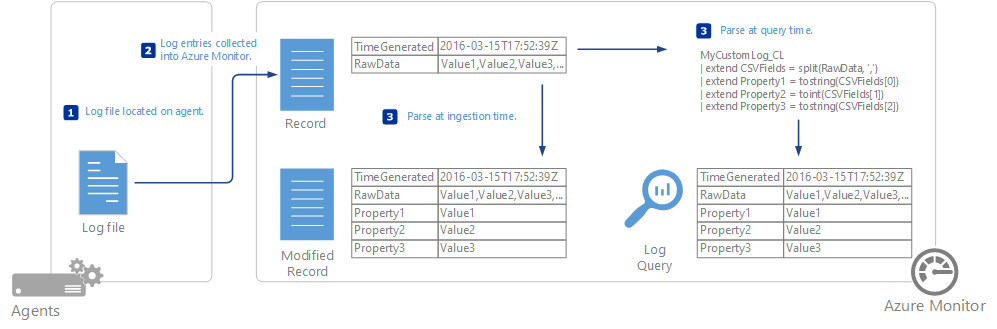
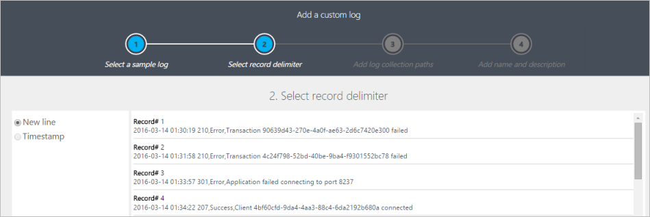
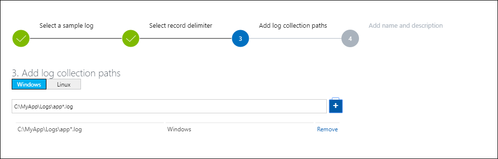
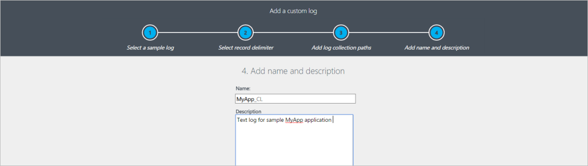
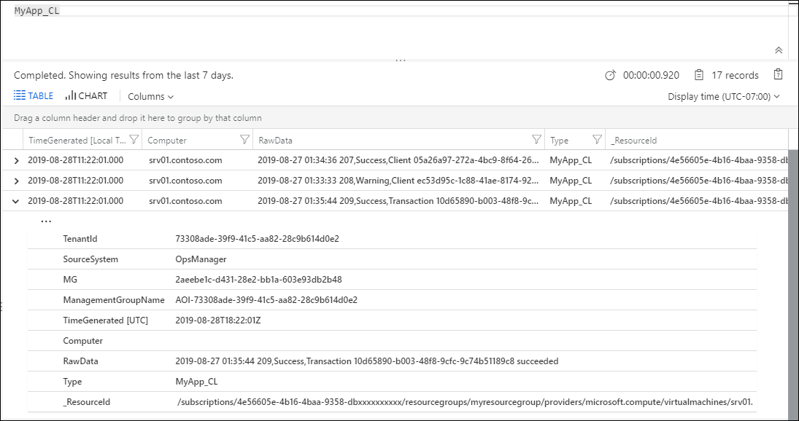
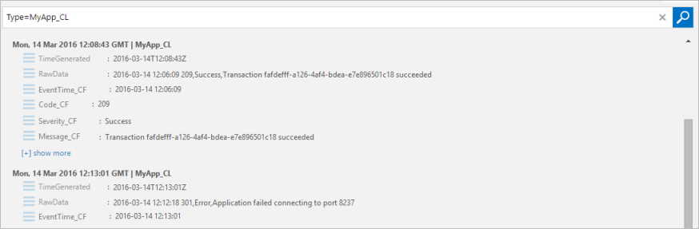

# Custom logs in Azure Monitor
The Custom Logs data source in Azure Monitor allows you to collect events from text files on both Windows and Linux computers. Many applications log information to text files instead of standard logging services such as Windows Event log or Syslog. Once collected, you can either parse the data into individual fields in your queries or extract the data during collection to individual fields.

The log files to be collected must match the following criteria.

- The log must either have a single entry per line or use a timestamp matching one of the following formats at the start of each entry.

    YYYY-MM-DD HH:MM:SS M/D/YYYY HH:MM:SS AM/PM Mon DD, YYYY HH:MM:SS yyMMdd HH:mm:ss ddMMyy HH:mm:ss MMM d hh:mm:ss dd/MMM/yyyy:HH:mm:ss zzz yyyy-MM-ddTHH:mm:ssK

- The log file must not allow circular logging or log rotation, where the file is overwritten with new entries.
- The log file must use ASCII or UTF-8 encoding.  Other formats such as UTF-16 are not supported.

>[!NOTE]
> If there are duplicate entries in the log file, Azure Monitor will collect them. However, the query results will be inconsistent where the filter results show more events than the result count. It will be important that you validate the log to determine if the application that creates it is causing this behavior and address it if possible before creating the custom log collection definition.  
>

>[!NOTE]
> A Log Analytics workspace supports the following limits:
> 
> * Only 500 custom logs can be created.
> * A table only supports up to 500 columns. 
> * The maximum number of characters for the column name is 500. 
>

## Defining a custom log
Use the following procedure to define a custom log file.  Scroll to the end of this article for a walkthrough of a sample of adding a custom log.

### Step 1. Open the Custom Log Wizard
The Custom Log Wizard runs in the Azure portal and allows you to define a new custom log to collect.

1. In the Azure portal, select **Log Analytics workspaces** > your workspace > **Advanced Settings**.
2. Click on **Data** > **Custom logs**.
3. By default, all configuration changes are automatically pushed to all agents.  For Linux agents, a configuration file is sent to the Fluentd data collector.  If you wish to modify this file manually on each Linux agent, then uncheck the box *Apply below configuration to my Linux machines*.
4. Click **Add+** to open the Custom Log Wizard.

### Step 2. Upload and parse a sample log
You start by uploading a sample of the custom log.  The wizard will parse and display the entries in this file for you to validate.  Azure Monitor will use the delimiter that you specify to identify each record.

**New Line** is the default delimiter and is used for log files that have a single entry per line.  If the line starts with a date and time in one of the available formats, then you can specify a **Timestamp** delimiter which supports entries that span more than one line.

If a timestamp delimiter is used, then the TimeGenerated property of each record stored in Azure Monitor will be populated with the date/time specified for that entry in the log file.  If a new line delimiter is used, then TimeGenerated is populated with date and time that Azure Monitor collected the entry.

1. Click **Browse** and browse to a sample file.  Note that this may button may be labeled **Choose File** in some browsers.
2. Click **Next**.
3. The Custom Log Wizard will upload the file and list the records that it identifies.
4. Change the delimiter that is used to identify a new record and select the delimiter that best identifies the records in your log file.
5. Click **Next**.

### Step 3. Add log collection paths
You must define one or more paths on the agent where it can locate the custom log.  You can either provide a specific path and name for the log file, or you can specify a path with a wildcard for the name. This supports applications that create a new file each day or when one file reaches a certain size. You can also provide multiple paths for a single log file.

For example, an application might create a log file each day with the date included in the name as in log20100316.txt. A pattern for such a log might be *log\*.txt* which would apply to any log file following the application’s naming scheme.

>[!NOTE]
> If your application creates a new log file each day or when it reaches a certain size, the Log Analytics agent for Linux does not discover them until after it is restarted. This is because the agent only enumerates and begins monitoring for patterns with the specified logs upon start up, and because of this you need to plan around it by automating the restart of the agent.  This limitation does not exist with the Log Analytics agent for Windows.  
>

The following table provides examples of valid patterns to specify different log files.

| Description | Path |
|:--- |:--- |
| All files in *C:\Logs* with .txt extension on Windows agent |C:\Logs\\\*.txt |
| All files in *C:\Logs* with a name starting with log and a .txt extension on Windows agent |C:\Logs\log\*.txt |
| All files in */var/log/audit* with .txt extension on Linux agent |/var/log/audit/*.txt |
| All files in */var/log/audit* with a name starting with log and a .txt extension on Linux agent |/var/log/audit/log\*.txt |

1. Select Windows or Linux to specify which path format you are adding.
2. Type in the path and click the **+** button.
3. Repeat the process for any additional paths.

### Step 4. Provide a name and description for the log
The name that you specify will be used for the log type as described above.  It will always end with _CL to distinguish it as a custom log.

1. Type in a name for the log.  The **\_CL** suffix is automatically provided.
2. Add an optional **Description**.
3. Click **Next** to save the custom log definition.

### Step 5. Validate that the custom logs are being collected
It may take up to an hour for the initial data from a new custom log to appear in Azure Monitor.  It will start collecting entries from the logs found in the path you specified from the point that you defined the custom log.  It will not retain the entries that you uploaded during the custom log creation, but it will collect already existing entries in the log files that it locates.

Once Azure Monitor starts collecting from the custom log, its records will be available with a log query.  Use the name that you gave the custom log as the **Type** in your query.

> [!NOTE]
> If the RawData property is missing from the query, you may need to close and reopen your browser.

### Step 6. Parse the custom log entries
The entire log entry will be stored in a single property called **RawData**.  You will most likely want to separate the different pieces of information in each entry into individual properties for each record. Refer to [Parse text data in Azure Monitor](../log-query/parse-text.md) for options on parsing **RawData** into multiple properties.

## Removing a custom log
Use the following process in the Azure portal to remove a custom log that you previously defined.

1. From the **Data** menu in the **Advanced Settings** for your workspace, select **Custom Logs** to list all your custom logs.
2. Click **Remove** next to the custom log to remove.

## Data collection
Azure Monitor will collect new entries from each custom log approximately every 5 minutes.  The agent will record its place in each log file that it collects from.  If the agent goes offline for a period of time, then Azure Monitor will collect entries from where it last left off, even if those entries were created while the agent was offline.

The entire contents of the log entry are written to a single property called **RawData**.  See [Parse text data in Azure Monitor](../log-query/parse-text.md) for methods to parse each imported log entry into multiple properties.

## Custom log record properties
Custom log records have a type with the log name that you provide and the properties in the following table.

| Property | Description |
|:--- |:--- |
| TimeGenerated |Date and time that the record was collected by Azure Monitor.  If the log uses a time-based delimiter then this is the time collected from the entry. |
| SourceSystem |Type of agent the record was collected from.   OpsManager – Windows agent, either direct connect or System Center Operations Manager   Linux – All Linux agents |
| RawData |Full text of the collected entry. You will most likely want to [parse this data into individual properties](../log-query/parse-text.md). |
| ManagementGroupName |Name of the management group for System Center Operations Manage agents.  For other agents, this is AOI-\<workspace ID\> |

## Sample walkthrough of adding a custom log
The following section walks through an example of creating a custom log.  The sample log being collected has a single entry on each line starting with a date and time and then comma-delimited fields for code, status, and message.  Several sample entries are shown below.

    2016-03-10 01:34:36 207,Success,Client 05a26a97-272a-4bc9-8f64-269d154b0e39 connected
    2016-03-10 01:33:33 208,Warning,Client ec53d95c-1c88-41ae-8174-92104212de5d disconnected
    2016-03-10 01:35:44 209,Success,Transaction 10d65890-b003-48f8-9cfc-9c74b51189c8 succeeded
    2016-03-10 01:38:22 302,Error,Application could not connect to database
    2016-03-10 01:31:34 303,Error,Application lost connection to database

### Upload and parse a sample log
We provide one of the log files and can see the events that it will be collecting.  In this case New Line is a sufficient delimiter.  If a single entry in the log could span multiple lines though, then a timestamp delimiter would need to be used.

### Add log collection paths
The log files will be located in *C:\MyApp\Logs*.  A new file will be created each day with a name that includes the date in the pattern *appYYYYMMDD.log*.  A sufficient pattern for this log would be *C:\MyApp\Logs\\\*.log*.

### Provide a name and description for the log
We use a name of *MyApp_CL* and type in a **Description**.

### Validate that the custom logs are being collected
We use a query of *Type=MyApp_CL* to return all records from the collected log.

### Parse the custom log entries
We use Custom Fields to define the *EventTime*, *Code*, *Status*, and *Message* fields and we can see the difference in the records that are returned by the query.

## Alternatives to custom logs
While custom logs are useful if your data fits the criteria listed about, but there are cases such as the following where you need another strategy:

- The data doesn't fit the required structure such as having the timestamp in a different format.
- The log file doesn't adhere to requirements such as file encoding or an unsupported folder structure.
- The data requires preprocessing or filtering  before collection. 

In the cases where your data can't be collected with custom logs, consider the following alternate strategies:

- Use a custom script or other method to write data to [Windows Events](data-sources-windows-events.md) or [Syslog](data-sources-syslog.md) which are collected by Azure Monitor. 
- Send the data directly to Azure Monitor using [HTTP Data Collector API](data-collector-api.md). An example using runbooks in Azure Automation is provided in [Collect log data in Azure Monitor with an Azure Automation runbook](runbook-datacollect.md).

## Next steps
* See [Parse text data in Azure Monitor](../log-query/parse-text.md) for methods to parse each imported log entry into multiple properties.
* Learn about [log queries](../log-query/log-query-overview.md) to analyze the data collected from data sources and solutions.