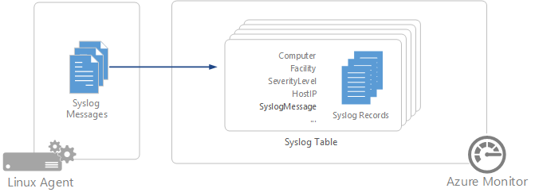

# Syslog data sources in Azure Monitor
Syslog is an event logging protocol that is common to Linux. Applications will send messages that may be stored on the local machine or delivered to a Syslog collector. When the Log Analytics agent for Linux is installed, it configures the local Syslog daemon to forward messages to the agent. The agent then sends the message to Azure Monitor where a corresponding record is created.  

> [!NOTE]
> Azure Monitor supports collection of messages sent by rsyslog or syslog-ng, where rsyslog is the default daemon. The default syslog daemon on version 5 of Red Hat Enterprise Linux, CentOS, and Oracle Linux version (sysklog) is not supported for syslog event collection. To collect syslog data from this version of these distributions, the [rsyslog daemon](http://rsyslog.com) should be installed and configured to replace sysklog.
>
>

The following facilities are supported with the Syslog collector:

* kern
* user
* mail
* daemon
* auth
* syslog
* lpr
* news
* uucp
* cron
* authpriv
* ftp
* local0-local7

For any other facility, [configure a Custom Logs data source](data-sources-custom-logs.md) in Azure Monitor.
 
## Configuring Syslog
The Log Analytics agent for Linux will only collect events with the facilities and severities that are specified in its configuration. You can configure Syslog through the Azure portal or by managing configuration files on your Linux agents.

### Configure Syslog in the Azure portal
Configure Syslog from the [Data menu in Advanced Settings](agent-data-sources.md#configuring-data-sources). This configuration is delivered to the configuration file on each Linux agent.

You can add a new facility by typing in its name and clicking **+**. For each facility, only messages with the selected severities will be collected.  Check the severities for the particular facility that you want to collect. You cannot provide any additional criteria to filter messages.

By default, all configuration changes are automatically pushed to all agents. If you want to configure Syslog manually on each Linux agent, then uncheck the box *Apply below configuration to my Linux machines*.

### Configure Syslog on Linux agent
When the [Log Analytics agent is installed on a Linux client](../../azure-monitor/learn/quick-collect-linux-computer.md), it installs a default syslog configuration file that defines the facility and severity of the messages that are collected. You can modify this file to change the configuration. The configuration file is different depending on the Syslog daemon that the client has installed.

> [!NOTE]
> If you edit the syslog configuration, you must restart the syslog daemon for the changes to take effect.
>
>

#### rsyslog
The configuration file for rsyslog is located at **/etc/rsyslog.d/95-omsagent.conf**. Its default contents are shown below. This collects syslog messages sent from the local agent for all facilities with a level of warning or higher.

    kern.warning       @127.0.0.1:25224
    user.warning       @127.0.0.1:25224
    daemon.warning     @127.0.0.1:25224
    auth.warning       @127.0.0.1:25224
    syslog.warning     @127.0.0.1:25224
    uucp.warning       @127.0.0.1:25224
    authpriv.warning   @127.0.0.1:25224
    ftp.warning        @127.0.0.1:25224
    cron.warning       @127.0.0.1:25224
    local0.warning     @127.0.0.1:25224
    local1.warning     @127.0.0.1:25224
    local2.warning     @127.0.0.1:25224
    local3.warning     @127.0.0.1:25224
    local4.warning     @127.0.0.1:25224
    local5.warning     @127.0.0.1:25224
    local6.warning     @127.0.0.1:25224
    local7.warning     @127.0.0.1:25224

You can remove a facility by removing its section of the configuration file. You can limit the severities that are collected for a particular facility by modifying that facility's entry. For example, to limit the user facility to messages with a severity of error or higher you would modify that line of the configuration file to the following:

    user.error    @127.0.0.1:25224

#### syslog-ng
The configuration file for syslog-ng is location at **/etc/syslog-ng/syslog-ng.conf**.  Its default contents are shown below. This collects syslog messages sent from the local agent for all facilities and all severities.   

    #
    # Warnings (except iptables) in one file:
    #
    destination warn { file("/var/log/warn" fsync(yes)); };
    log { source(src); filter(f_warn); destination(warn); };

    #OMS_Destination
    destination d_oms { udp("127.0.0.1" port(25224)); };

    #OMS_facility = auth
    filter f_auth_oms { level(alert,crit,debug,emerg,err,info,notice,warning) and facility(auth); };
    log { source(src); filter(f_auth_oms); destination(d_oms); };

    #OMS_facility = authpriv
    filter f_authpriv_oms { level(alert,crit,debug,emerg,err,info,notice,warning) and facility(authpriv); };
    log { source(src); filter(f_authpriv_oms); destination(d_oms); };

    #OMS_facility = cron
    filter f_cron_oms { level(alert,crit,debug,emerg,err,info,notice,warning) and facility(cron); };
    log { source(src); filter(f_cron_oms); destination(d_oms); };

    #OMS_facility = daemon
    filter f_daemon_oms { level(alert,crit,debug,emerg,err,info,notice,warning) and facility(daemon); };
    log { source(src); filter(f_daemon_oms); destination(d_oms); };

    #OMS_facility = kern
    filter f_kern_oms { level(alert,crit,debug,emerg,err,info,notice,warning) and facility(kern); };
    log { source(src); filter(f_kern_oms); destination(d_oms); };

    #OMS_facility = local0
    filter f_local0_oms { level(alert,crit,debug,emerg,err,info,notice,warning) and facility(local0); };
    log { source(src); filter(f_local0_oms); destination(d_oms); };

    #OMS_facility = local1
    filter f_local1_oms { level(alert,crit,debug,emerg,err,info,notice,warning) and facility(local1); };
    log { source(src); filter(f_local1_oms); destination(d_oms); };

    #OMS_facility = mail
    filter f_mail_oms { level(alert,crit,debug,emerg,err,info,notice,warning) and facility(mail); };
    log { source(src); filter(f_mail_oms); destination(d_oms); };

    #OMS_facility = syslog
    filter f_syslog_oms { level(alert,crit,debug,emerg,err,info,notice,warning) and facility(syslog); };
    log { source(src); filter(f_syslog_oms); destination(d_oms); };

    #OMS_facility = user
    filter f_user_oms { level(alert,crit,debug,emerg,err,info,notice,warning) and facility(user); };
    log { source(src); filter(f_user_oms); destination(d_oms); };

You can remove a facility by removing its section of the configuration file. You can limit the severities that are collected for a particular facility by removing them from its list.  For example, to limit the user facility to just alert and critical messages, you would modify that section of the configuration file to the following:

    #OMS_facility = user
    filter f_user_oms { level(alert,crit) and facility(user); };
    log { source(src); filter(f_user_oms); destination(d_oms); };

### Collecting data from additional Syslog ports
The Log Analytics agent listens for Syslog messages on the local client on port 25224.  When the agent is installed, a default syslog configuration is applied and found in the following location:

* Rsyslog: `/etc/rsyslog.d/95-omsagent.conf`
* Syslog-ng: `/etc/syslog-ng/syslog-ng.conf`

You can change the port number by creating two configuration files: a FluentD config file and a rsyslog-or-syslog-ng file depending on the Syslog daemon you have installed.  

* The FluentD config file should be a new file located in: `/etc/opt/microsoft/omsagent/conf/omsagent.d` and replace the value in the **port** entry with your custom port number.

        <source>
          type syslog
          port %SYSLOG_PORT%
          bind 127.0.0.1
          protocol_type udp
          tag oms.syslog
        </source>
        <filter oms.syslog.**>
          type filter_syslog
        </filter>

* For rsyslog, you should create a new configuration file located in: `/etc/rsyslog.d/` and replace the value %SYSLOG_PORT% with your custom port number.  

    > [!NOTE]
    > If you modify this value in the configuration file `95-omsagent.conf`, it will be overwritten when the agent applies a default configuration.
    >

        # OMS Syslog collection for workspace %WORKSPACE_ID%
        kern.warning              @127.0.0.1:%SYSLOG_PORT%
        user.warning              @127.0.0.1:%SYSLOG_PORT%
        daemon.warning            @127.0.0.1:%SYSLOG_PORT%
        auth.warning              @127.0.0.1:%SYSLOG_PORT%

* The syslog-ng config should be modified by copying the example configuration shown below and adding the custom modified settings to the end of the syslog-ng.conf configuration file located in `/etc/syslog-ng/`. Do **not** use the default label **%WORKSPACE_ID%_oms** or **%WORKSPACE_ID_OMS**, define a custom label to help distinguish your changes.  

    > [!NOTE]
    > If you modify the default values in the configuration file, they will be overwritten when the agent applies a default configuration.
    >

        filter f_custom_filter { level(warning) and facility(auth; };
        destination d_custom_dest { udp("127.0.0.1" port(%SYSLOG_PORT%)); };
        log { source(s_src); filter(f_custom_filter); destination(d_custom_dest); };

After completing the changes, the Syslog and the Log Analytics agent service needs to be restarted to ensure the configuration changes take effect.   

## Syslog record properties
Syslog records have a type of **Syslog** and have the properties in the following table.

| Property | Description |
|:--- |:--- |
| Computer |Computer that the event was collected from. |
| Facility |Defines the part of the system that generated the message. |
| HostIP |IP address of the system sending the message. |
| HostName |Name of the system sending the message. |
| SeverityLevel |Severity level of the event. |
| SyslogMessage |Text of the message. |
| ProcessID |ID of the process that generated the message. |
| EventTime |Date and time that the event was generated. |

## Log queries with Syslog records
The following table provides different examples of log queries that retrieve Syslog records.

| Query | Description |
|:--- |:--- |
| Syslog |All Syslogs. |
| Syslog &#124; where SeverityLevel == "error" |All Syslog records with severity of error. |
| Syslog &#124; summarize AggregatedValue = count() by Computer |Count of Syslog records by computer. |
| Syslog &#124; summarize AggregatedValue = count() by Facility |Count of Syslog records by facility. |

## Next steps
* Learn about [log queries](../../azure-monitor/log-query/log-query-overview.md) to analyze the data collected from data sources and solutions.
* Use [Custom Fields](../../azure-monitor/platform/custom-fields.md) to parse data from syslog records into individual fields.
* [Configure Linux agents](../../azure-monitor/learn/quick-collect-linux-computer.md) to collect other types of data.
