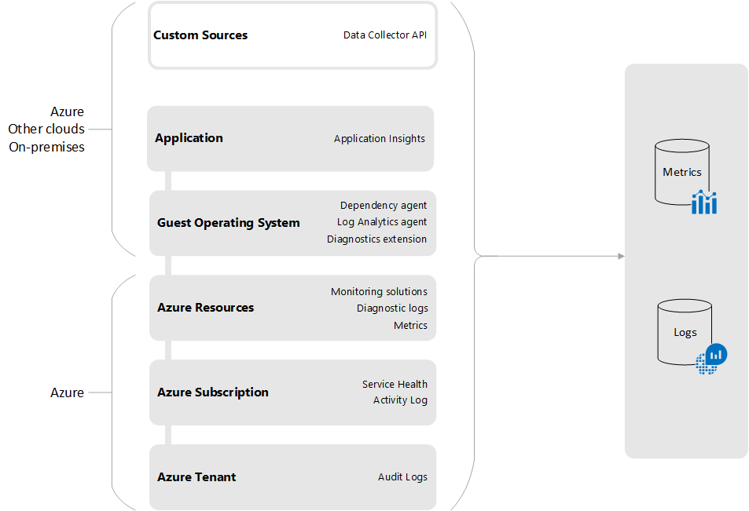
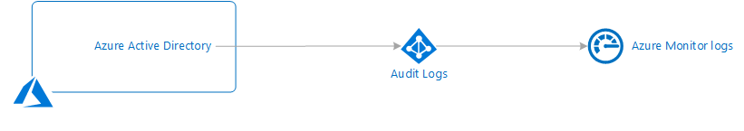
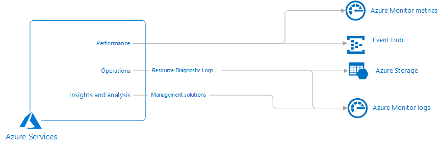
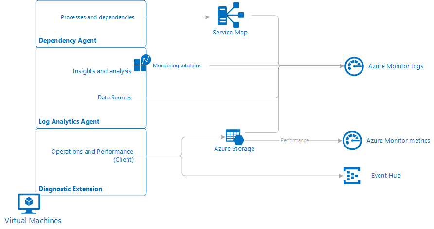
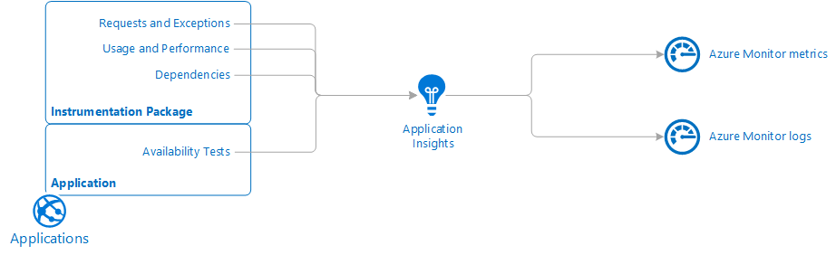
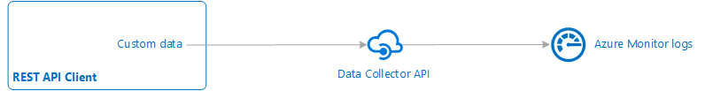

# Sources of monitoring data for Azure Monitor
Azure Monitor collects monitoring data into a [common data platform](data-platform.md) that includes [Logs](data-platform-logs.md) and [Metrics](data-platform-metrics.md) so they can be analyzed together using a common set of tools. Some data sources will write directly to these locations while others require configuration before being collected into this common platform. Some monitoring data 

This article describes the sources of data collected by Azure Monitor to monitor the health and performance of your  resources and the applications running on them. These resources could be in Azure, in another cloud, or on-premises.

Monitoring data in Azure comes from a variety of sources that can be organized into tiers, the highest tiers being your application and any operating systems and the lower tiers being components of Azure platform. This is illustrated in the following diagram with each tier described in detail in the following sections.

[!INCLUDE [azure-monitor-log-analytics-rebrand](../../../includes/azure-monitor-log-analytics-rebrand.md)]

## Azure tenant
Telemetry related to your Azure tenant is collected from tenant-wide services such as Azure Active Directory.

## Azure Active Directory Audit Logs
[Azure Active Directory reporting](../../active-directory/reports-monitoring/overview-reports.md) contains the history of sign-in activity and audit trail of changes made within a particular tenant. 

| Destination | Description |
|:---|:---|
| Logs | See [Integrate Azure AD logs with Azure Monitor logs (preview)](../../active-directory/reports-monitoring/howto-integrate-activity-logs-with-log-analytics) for details on configuring them to be collected in Azure Monitor. |

## Azure subscription
Telemetry related to the health and operation of Azure itself includes data about the operation and management of your Azure subscription. It includes service health data stored in the Azure Activity log.

### Azure Service Health
[Azure Service Health](service-notifications.md) provides information about the health of the Azure services in your subscription that your application and resources rely on. 

| Destination | Description |
|:---|:---|
| Activity Log Logs | Service Health records are stored in the [Azure Activity log](activity-logs-overview.md), so you can view them in the Activity Log Explorer or copy them into Azure Monitor Logs. |

### Azure Activity Log 
The [Azure Activity Log](activity-logs-overview.md) includes service health records along with records on any configuration changes made to your Azure resources. The Activity log is available to all Azure resources and represents their _external_ view.

| Destination | Description |
|:---|:---|
| Activity Log | The Activity Log is collected  its own store that you can view from the Azure Monitor menu or create Activity Log alerts. |
| Storage | Archive the [Activity log to storage](activity-log-export.md#archive-activity-log). |
| Logs | Copy the Activity Log to Azure Monitor Logs to analyze it with other monitoring data. |
| Event Hubs | Stream the Activity log to other locations using [Event Hubs](activity-log-export.md#stream-activity-log-to-event-hub). |

### Billing data
You can use [Azure Billing APIs](/azure/billing/billing-usage-rate-card-overview) to programmatically get insight into your Azure usage.

## Azure resources
Metrics and resource level diagnostic logs provide information about the _internal_ operation of Azure resources. These are available for most Azure services, and management solutions provide additional insights into particular services.

### Platform metrics 
Most Azure services will generate [platform metrics](data-platform-metrics.md) that reflect their performance and operation. The specific [metrics will vary for each type of resource](metrics-supported.md). 

| Destination | Description |
|:---|:---|
| Metrics | Platform metrics will automatically write to the Azure Monitor metrics database. Access platform metrics from [metrics explorer](metrics-getting-started.md).  |
| Logs | [Copy platform metrics to Logs](collect-azure-metrics-logs.md#azure-diagnostics-direct-to-log-analytics) for trending and other analysis using Log Analytics. |

### Resource diagnostic logs
[Diagnostic logs](diagnostic-logs-overview.md) provide insights into the internal operation of an Azure resource. The configuration requirements and content of these logs [varies by resource type](diagnostic-logs-schema.md). Diagnostic logs are not enabled by default. You must enable them and specify a destination for each resource. 

| Destination | Description |
|:---|:---|
| Storage | Send Diagnostic logs to [Azure storage](archive-diagnostic-logs.md) for archiving. 
| Logs | Send Diagnostic Logs [to Azure Monitor Logs](diagnostic-logs-stream-log-store.md) for analysis with other collected log data. Some resources can write directly to Azure Monitor while others write to a storage account before being [imported into Log Analytics](azure-storage-iis-table.md#use-the-azure-portal-to-collect-logs-from-azure-storage).
| EventHubs | Export Diagnostic logs to [Event Hub](../../event-hubs/event-hubs-about.md) for redirection to other services. | |

### Storage accounts 
Metrics for storage accounts are collected in Azure Monitor along with other resources, but logs are [written to the storage account](../../storage/common/storage-metrics-in-azure-monitor.md).

| Destination | Description |
|:---|:---|
| Metrics  | Automatically collected like other Azure resources. | 
| Storage  |  You can import these logs into a Log Analytics workspace in Azure Monitor, but this [requires custom configuration](https://azure.microsoft.com/blog/query-azure-storage-analytics-logs-in-azure-log-analytics/). You can also retrieve this data with the [Storage Analytics API](/rest/api/storageservices/storage-analytics).

### Monitoring Solutions 
[Monitoring solutions](../insights/solutions.md) collect data to provide additional insight into the operation of a particular service or application.

| Destination | Description |
|:---|:---|
| Logs | Monitoring solutions collect data into Azure Monitor logs where it may be analyzed using the [query language](../log-query/log-query-overview.md) or [views](view-designer.md) that are typically included in the solution. |

## Guest operating system
Compute resources in Azure, in other clouds, and on-premises have a guest operating system to monitor. With the installation of one or more agents, you can gather telemetry from the guest into the same monitoring tools as the Azure services themselves.

### Azure Diagnostic extension
Enabling the Azure Diagnostics extension for Azure Virtual machines allows you to collect logs and metrics from Azure compute resources including Azure Cloud Service (classic) Web and Worker Roles, Virtual Machines, Virtual Machine scale sets, and Service Fabric.

| Destination | Description |
|:---|:---|
| Storage | When you enable the Diagnostics Extension, it will [write to a storage account](diagnostics-extension-stream-event-hubs.md) by default. |
| Event Hubs | Configure the Diagnostics Extension to [send to Event Hubs](diagnostics-extension-stream-event-hubs.md) to stream the data to other locations.  |
| Application Insights |  |
| Metrics | When you configure the Diagnostics Extension to collect performance counters, they are written to the Azure Monitor metrics database.   |

### Log Analytics agent 
Comprehensive monitoring and management of your Windows or Linux virtual machines or physical computer is delivered with the Log Analytics agent. The virtual machine can be running in Azure, another cloud, or on-premises.

| Destination | Description |
|:---|:---|
| Logs | The Log Analytics agent connects to Azure Monitor either directly or through System Center Operations Manager and allows you to collect data from [data sources](agent-data-sources.md) that you configure or from [monitoring solutions](../insights/solutions.md) that provide additional insights into applications running on the virtual machine. |

### Dependency agent 
[Azure Monitor for VMs](../insights/vminsights-overview.md) requires a Dependency Agent on Windows and Linux virtual machines. This integrates with the Log Analytics agent to collects discovered data about processes running on the virtual machine and external process dependencies.

| Destination | Description |
|:---|:---|
| Logs | It stores this data in Azure Monitor Logs and visualizes the discovered interconnected components. |

To further understand the differences between the agents and which to use depending on your monitoring requirements, see [monitoring agents overview](agents-overview.md).

## Applications
In addition to telemetry that your application may write to the guest operating system, detailed application monitoring is done with [Application Insights](https://docs.microsoft.com/azure/application-insights/). Application Insights can collect data from applications running on a variety of platforms. The application can be running in Azure, another cloud, or on-premises.

### Application data
When you enable Application Insights for an application by installing an instrumentation package, it collects metrics and logs related to the performance and operation of the application. This includes detailed information about page views, application requests, and exceptions. Application Insights stores the data it collects in Azure Monitor. It includes extensive tools for analyzing this data, but you can also analyze it with data from other sources using tools such as metric analytics and log analytics.

You can also use Application Insights to [create a custom metric](../../application-insights/app-insights-api-custom-events-metrics.md).  This allows you to define your own logic for calculating a numeric value and then storing that value with other metrics that can be accessed from metric analytics and used for [Autoscale](autoscale-custom-metric.md) and metric alerts.

### Dependencies
In order to monitor different logical operations of an application, you must [collect telemetry across multiple components](../../application-insights/app-insights-transaction-diagnostics.md). Application Insights supports [distributed telemetry correlation](../../application-insights/application-insights-correlation.md) which identifies the dependencies between components allowing you to analyze them together.

### Availability tests
[Availability tests](../../application-insights/app-insights-monitor-web-app-availability.md) in Application Insights allow you to test the availability and responsiveness of your application from different locations on the public Internet. You can do a simple ping test to verify that the application is alive or use Visual Studio to create a web test that simulates a user scenario.  Availability tests don't require any instrumentation in the application.

## Custom sources
In addition to the standard tiers of an application, you may need to monitor other resources that have telemetry that can't be collected with the other data sources. For these resources, you need to write this data using an Azure Monitor API.

### Data Collector API
Azure Monitor can collect log data from any REST client using the [Data Collector API](../../azure-monitor/platform/data-collector-api.md). This allows you to create custom monitoring scenarios and extend monitoring to resources that don't expose telemetry through other sources.

## Next steps

- Learn more about the [types of monitoring data collected by Azure Monitor](data-platform.md) and how to view and analyze this data.
