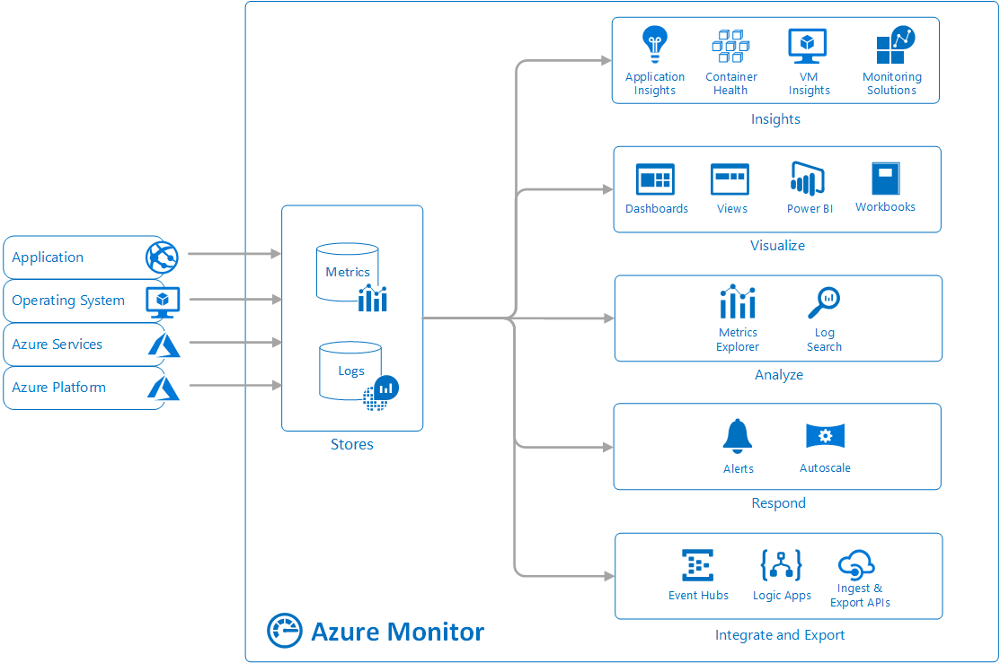
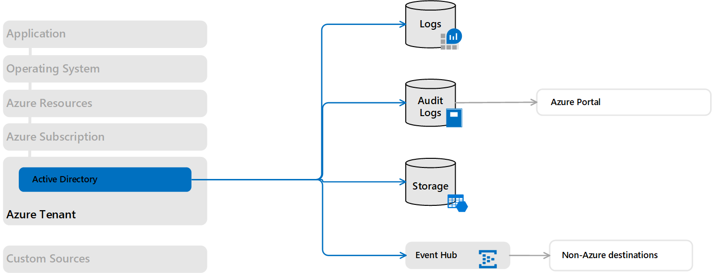
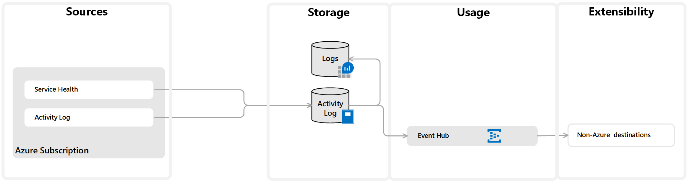
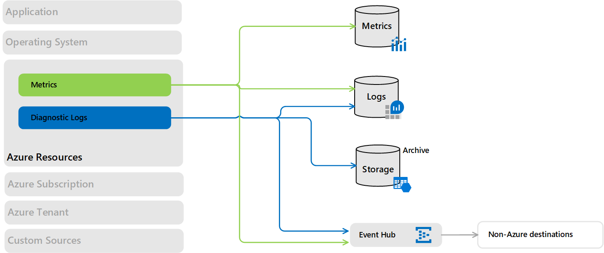
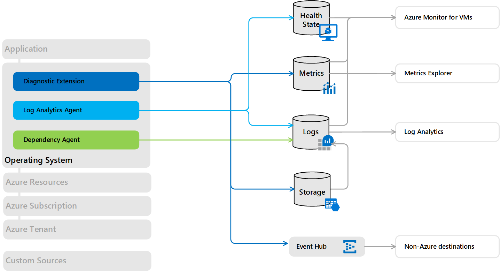

# Sources of monitoring data for Azure Monitor
Azure Monitor is based on a [common monitoring data platform](data-platform.md) that includes [Logs](data-platform-logs.md) and [Metrics](data-platform-metrics.md). Collecting data into this platform allows data from multiple resources to be analyzed together using a common set of tools in Azure Monitor. Monitoring data may also be sent to other locations to support certain scenarios, and some resources may write to other locations before they can be collected into Logs or Metrics.

This article describes the different sources of monitoring data collected by Azure Monitor in addition to the monitoring data created by Azure resources. Links are provided to detailed information on configuration required to collect this data to different locations.

## Application tiers

Sources of monitoring data from Azure applications can be organized into tiers, the highest tiers being your application itself and the lower tiers being components of Azure platform. The method of accessing data from each tier varies. The application tiers are summarized in the table below, and the sources of monitoring data in each tier are presented in the following sections. See [Monitoring data locations in Azure](data-locations.md) for a description of each data location and how you can access its data.

### Azure
The following table briefly describes the application tiers that are specific to Azure. Following the link for further details on each in the sections below.

| Tier | Description | Collection method |
|:---|:---|:---|
| [Azure Tenant](#azure-tenant) | Data about the operation of tenant-level Azure services, such as Azure Active Directory. | View AAD data in portal or configure collection to Azure Monitor using a tenant diagnostic setting. |
| [Azure subscription](#azure-subscription) | Data related to the health and management of cross-resource services in your Azure subscription such as Resource Manager and Service Health. | View in portal or configure collection to Azure Monitor using a log profile. |
| [Azure resources](#azure-resources) |  Data about the operation and performance of each Azure resource. | Metrics collected automatically, view in Metrics Explorer. Configure diagnostic settings to collect logs in Azure Monitor. Monitoring solutions and Insights available for more detailed monitoring for specific resource types. |

### Azure, other cloud, or on-premises 
The following table briefly describes the application tiers that may be in Azure, another cloud, or on-premises. Following the link for further details on each in the sections below.

| Tier | Description | Collection method |
|:---|:---|:---|
| [Operating system (guest)](#operating-system-guest) | Data about the operating system on compute resources. | Install Log Analytics agent to collect client data sources into Azure Monitor and Dependency agent to collect dependencies supporting Azure Monitor for VMs. For Azure virtual machines, install Azure Diagnostic Extension to collect logs and metrics into Azure Monitor. |
| [Application Code](#application-code) | Data about the performance and functionality of the actual application and code, including performance traces, application logs, and user telemetry. | Instrument your code to collect data into Application Insights. |
| [Custom sources](#custom-sources) | Data from external services or other components or devices. | Collect log or metrics data into Azure Monitor from any REST client. |

## Azure tenant
Telemetry related to your Azure tenant is collected from tenant-wide services such as Azure Active Directory.

### Azure Active Directory Audit Logs
[Azure Active Directory reporting](../../active-directory/reports-monitoring/overview-reports.md) contains the history of sign-in activity and audit trail of changes made within a particular tenant. 

| Destination | Description | Reference |
|:---|:---|:---|
| Azure Monitor Logs | Configure Azure AD logs to be collected in Azure Monitor to analyze them with other monitoring data. | [Integrate Azure AD logs with Azure Monitor logs (preview)](../../active-directory/reports-monitoring/howto-integrate-activity-logs-with-log-analytics.md) |
| Azure Storage | Export Azure AD logs to Azure Storage for archiving. | [Tutorial: Archive Azure AD logs to an Azure storage account (preview)](../../active-directory/reports-monitoring/quickstart-azure-monitor-route-logs-to-storage-account.md) |
| Event Hub | Stream Azure AD logs to other locations using Event Hubs. | [Tutorial: Stream Azure Active Directory logs to an Azure event hub (preview)](../../active-directory/reports-monitoring/tutorial-azure-monitor-stream-logs-to-event-hub.md). |

## Azure subscription
Telemetry related to the health and operation of your Azure subscription.

### Azure Activity log 
The [Azure Activity log](platform-logs-overview.md) includes service health records along with records on any configuration changes made to the resources in your Azure subscription. The Activity log is available to all Azure resources and represents their _external_ view.

| Destination | Description | Reference |
|:---|:---|
| Activity log | The Activity log is collected into its own data store that you can view from the Azure Monitor menu or use to create Activity log alerts. | [Query the Activity log in the Azure portal](activity-log-view.md#azure-portal) |
| Azure Monitor Logs | Configure Azure Monitor Logs to collect the Activity log to analyze it with other monitoring data. | [Collect and analyze Azure activity logs in Log Analytics workspace in Azure Monitor](activity-log-collect.md) |
| Azure Storage | Export the Activity log to Azure Storage for archiving. | [Archive Activity log](resource-logs-collect-storage.md)  |
| Event Hubs | Stream the Activity log to other locations using Event Hubs | [Stream Activity log to Event Hub](resource-logs-stream-event-hubs.md). |

### Azure Service Health
[Azure Service Health](../../service-health/service-health-overview.md) provides information about the health of the Azure services in your subscription that your application and resources rely on.

| Destination | Description | Reference |
|:---|:---|:---|
| Activity log Azure Monitor Logs | Service Health records are stored in the Azure Activity log, so you can view them in the Azure portal or perform any other activities you can perform with the Activity log. | [View service health notifications by using the Azure portal](service-notifications.md) |

## Azure resources
Metrics and resource logs provide information about the _internal_ operation of Azure resources. These are available for most Azure services, and monitoring solutions and insights collect additional data for particular services.

### Platform metrics 
Most Azure services will send [platform metrics](data-platform-metrics.md) that reflect their performance and operation directly to the metrics database. The specific [metrics will vary for each type of resource](metrics-supported.md). 

| Destination | Description | Reference |
|:---|:---|:---|
| Azure Monitor Metrics | Platform metrics will write to the Azure Monitor metrics database with no configuration. Access platform metrics from Metrics Explorer.  | [Getting started with Azure Metrics Explorer](metrics-getting-started.md) [Supported metrics with Azure Monitor](metrics-supported.md) |
| Azure Monitor Logs | Copy platform metrics to Logs for trending and other analysis using Log Analytics. | [Azure diagnostics direct to Log Analytics](resource-logs-collect-workspace.md) |
| Event Hubs | Stream metrics to other locations using Event Hubs. |[Stream Azure monitoring data to an event hub for consumption by an external tool](stream-monitoring-data-event-hubs.md) |

### Resource logs
[Resource logs](platform-logs-overview.md) provide insights into the _internal_ operation of an Azure resource.  Resource logs are created automatically, but you must create a diagnostic setting to specify a destination for them to collected for each resource.

The configuration requirements and content of resource logs vary by resource type, and not all services yet create them. See [Supported services, schemas, and categories for Azure resource logs](diagnostic-logs-schema.md) for details on each service and links to detailed configuration procedures. If the service isn't listed in this article, then that service doesn't currently create resource logs.

| Destination | Description | Reference |
|:---|:---|:---|
| Azure Monitor Logs | Send resource logs to Azure Monitor Logs for analysis with other collected log data. | [Collect Azure resource logs in Log Analytics workspace in Azure Monitor](resource-logs-collect-storage.md) |
| Storage | Send resource logs to Azure Storage for archiving. | [Archive Azure resource logs](resource-logs-collect-workspace.md) |
| Event Hubs | Stream resource logs to other locations using Event Hubs. |[Stream Azure resource logs to an event hub](resource-logs-stream-event-hubs.md) |

## Operating system (guest)
Compute resources in Azure, in other clouds, and on-premises have a guest operating system to monitor. With the installation of one or more agents, you can gather telemetry from the guest into Azure Monitor to analyze it with the same monitoring tools as the Azure services themselves.

### Azure Diagnostic extension
Enabling the Azure Diagnostics extension for Azure Virtual machines allows you to collect logs and metrics from the guest operating system of Azure compute resources including Azure Cloud Service (classic) Web and Worker Roles, Virtual Machines, virtual machine scale sets, and Service Fabric.

| Destination | Description | Reference |
|:---|:---|:---|
| Storage | Azure diagnostics extension always writes to an Azure Storage account. | [Install and configure Windows Azure diagnostics extension (WAD)](diagnostics-extension-windows-install.md) [Use Linux Diagnostic Extension to monitor metrics and logs](../../virtual-machines/extensions/diagnostics-linux.md) |
| Azure Monitor Metrics | When you configure the Diagnostics Extension to collect performance counters, they are written to the Azure Monitor metrics database. | [Send Guest OS metrics to the Azure Monitor metric store using a Resource Manager template for a Windows virtual machine](collect-custom-metrics-guestos-resource-manager-vm.md) |
| Event Hubs | Configure the Diagnostics Extension to stream the data to other locations using Event Hubs.  | [Streaming Azure Diagnostics data by using Event Hubs](diagnostics-extension-stream-event-hubs.md) [Use Linux Diagnostic Extension to monitor metrics and logs](../../virtual-machines/extensions/diagnostics-linux.md) |
| Application Insights Logs | Collect logs and performance counters from the compute resource supporting your application to be analyzed with other application data. | [Send Cloud Service, Virtual Machine, or Service Fabric diagnostic data to Application Insights](diagnostics-extension-to-application-insights.md) |

### Log Analytics agent 
Install the Log Analytics agent for comprehensive monitoring and management of your Windows or Linux virtual machines. The virtual machine can be running in Azure, another cloud, or on-premises.

| Destination | Description | Reference |
|:---|:---|:---|
| Azure Monitor Logs | The Log Analytics agent connects to Azure Monitor either directly or through System Center Operations Manager and allows you to collect data from data sources that you configure or from monitoring solutions that provide additional insights into applications running on the virtual machine. | [Agent data sources in Azure Monitor](agent-data-sources.md) [Connect Operations Manager to Azure Monitor](om-agents.md) |
| VM Storage | Azure Monitor for VMs uses the Log Analytics agent to store heath state information in a custom location. See the next section for more information.  |

### Azure Monitor for VMs 
[Azure Monitor for VMs](../insights/vminsights-overview.md) provides a customized monitoring experience for virtual machines providing features beyond core Azure Monitor functionality. It requires a Dependency Agent on Windows and Linux virtual machines that integrates with the Log Analytics agent to collect discovered data about processes running on the virtual machine and external process dependencies.

| Destination | Description | Reference |
|:---|:---|:---|
| Azure Monitor Logs | Stores data about processes and dependencies on the agent. | [Using Azure Monitor for VMs (preview) Map to understand application components](../insights/vminsights-maps.md) |

## Application Code
Detailed application monitoring in Azure Monitor is done with [Application Insights](https://docs.microsoft.com/azure/application-insights/) which collects data from applications running on a variety of platforms. The application can be running in Azure, another cloud, or on-premises.

### Application data
When you enable Application Insights for an application by installing an instrumentation package, it collects metrics and logs related to the performance and operation of the application. Application Insights stores the data it collects in the same Azure Monitor data platform used by other data sources. It includes extensive tools for analyzing this data, but you can also analyze it with data from other sources using tools such as Metrics Explorer and Log Analytics.

| Destination | Description | Reference |
|:---|:---|:---|
| Azure Monitor Logs | Operational data about your application including page views, application requests, exceptions, and traces. | [Analyze log data in Azure Monitor](../log-query/log-query-overview.md) |
|                    | Dependency information between application components to support Application Map and telemetry correlation. | [Telemetry correlation in Application Insights](../app/correlation.md)   [Application Map](../app/app-map.md) |
|            | Results of availability tests that test the availability and responsiveness of your application from different locations on the public Internet. | [Monitor availability and responsiveness of any web site](../app/monitor-web-app-availability.md) |
| Azure Monitor Metrics | Application Insights collects metrics describing the performance and operation of the application in addition to custom metrics that you define in your application into the Azure Monitor metrics database. | [Log-based and pre-aggregated metrics in Application Insights](../app/pre-aggregated-metrics-log-metrics.md) [Application Insights API for custom events and metrics](../app/api-custom-events-metrics.md) |
| Azure Storage | Send application data to Azure Storage for archiving. | [Export telemetry from Application Insights](../app/export-telemetry.md) |
|            | Details of availability tests are stored in Azure Storage. Use Application Insights in the Azure portal to download for local analysis. Results of availability tests are stored in Azure Monitor Logs. | [Monitor availability and responsiveness of any web site](../app/monitor-web-app-availability.md) |
|            | Profiler trace data is stored in Azure Storage. Use Application Insights in the Azure portal to download for local analysis.  | [Profile production applications in Azure with Application Insights](../app/profiler-overview.md) 
|            | Debug snapshot data that is captured for a subset of exceptions is stored in Azure Storage. Use Application Insights in the Azure portal to download for local analysis.  | [How snapshots work](../app/snapshot-debugger.md#how-snapshots-work) |

## Monitoring Solutions and Insights
[Monitoring solutions](../insights/solutions.md) and [Insights](../insights/insights-overview.md) collect data to provide additional insights into the operation of a particular service or application. They may address resources in different application tiers and even multiple tiers.

### Monitoring solutions

| Destination | Description | Reference
|:---|:---|:---|
| Azure Monitor Logs | Monitoring solutions collect data into Azure Monitor logs where it may be analyzed using the query language or [views](view-designer.md) that are typically included in the solution. | [Data collection details for monitoring solutions in Azure](../insights/solutions-inventory.md) |

### Azure Monitor for containers
[Azure Monitor for containers](../insights/container-insights-overview.md) provides a customized monitoring experience for [Azure Kubernetes Service (AKS)](/azure/aks/). It collects additional data about these resources described in the following table.

| Destination | Description | Reference |
|:---|:---|:---|
| Azure Monitor Logs | Stores monitoring data for AKS including inventory, logs, and events. Metric data is also stored in Logs in order to leverage its analysis functionality in the portal. | [Understand AKS cluster performance with Azure Monitor for containers](../insights/container-insights-analyze.md) |
| Azure Monitor Metrics | Metric data is stored in the metric database to drive visualization and alerts. | [View container metrics in metrics explorer](../insights/container-insights-analyze.md#view-container-metrics-in-metrics-explorer) |
| Azure Kubernetes Service | Provides direct access to your Azure Kubernetes Service (AKS) container logs (stdout/stderror), events, and pod metrics in the portal. | [How to view Kubernetes logs, events, and pod metrics in real-time ](../insights/container-insights-livedata-overview.md) |

### Azure Monitor for VMs
[Azure Monitor for VMs](../insights/vminsights-overview.md) provides a customized experience for monitoring virtual machines. A description of the data collected by Azure Monitor for VMs is included in the [Operating System (guest)](#operating-system-guest) section above.

## Custom sources
In addition to the standard tiers of an application, you may need to monitor other resources that have telemetry that can't be collected with the other data sources. For these resources, write this data to either Metrics or Logs using an Azure Monitor API.

| Destination | Method | Description | Reference |
|:---|:---|:---|:---|
| Azure Monitor Logs | Data Collector API | Collect log data from any REST client and store in Log Analytics workspace. | [Send log data to Azure Monitor with the HTTP Data Collector API (public preview)](data-collector-api.md) |
| Azure Monitor Metrics | Custom Metrics API | Collect metric data from any REST client and store in Azure Monitor metrics database. | [Send custom metrics for an Azure resource to the Azure Monitor metric store by using a REST API](metrics-store-custom-rest-api.md) |

## Other services
Other services in Azure write data to the Azure Monitor data platform. This allows you to analyze data collected by these services with data collected by Azure Monitor and leverage the same analysis and visualization tools.

| Service | Destination | Description | Reference |
|:---|:---|:---|:---|
| [Azure Security Center](/azure/security-center/) | Azure Monitor Logs | Azure Security Center stores the security data it collects in a Log Analytics workspace which allows it to be analyzed with other log data collected by Azure Monitor.  | [Data collection in Azure Security Center](../../security-center/security-center-enable-data-collection.md) |
| [Azure Sentinel](/azure/sentinel/) | Azure Monitor Logs | Azure Sentinel stores the data it collects from different data sources in a Log Analytics workspace which allows it to be analyzed with other log data collected by Azure Monitor.  | [Connect data sources](/azure/sentinel/quickstart-onboard) |

## Next steps

- Learn more about the [types of monitoring data collected by Azure Monitor](data-platform.md) and how to view and analyze this data.
- List the [different locations where Azure resources store data](data-locations.md) and how you can access it. 
