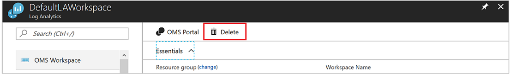
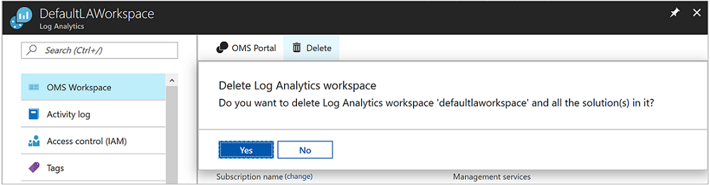

# Delete and restore Azure Log Analytics workspace

This article explains the concept of Azure Log Analytics workspace soft-delete and how to recover deleted workspace. 

## Considerations when deleting a workspace

When you delete a Log Analytics workspace, a soft-delete operation is performed to allow the recovery of the workspace including its data and connected agents within 14 days, whether the deletion was accidental or intentional. 
After the soft-delete period, the workspace resource and its data are non-recoverable – its data is queued for permanent deletion and completely purged within 30 days. The workspace name is 'released' and you can use it to create a new workspace.

> [!NOTE]
> The soft-delete behavior cannot be turned off. We will shortly add an option to override the soft-delete when using a ‘force’ tag in the delete operation.

You want to exercise caution when you delete a workspace because there might be important data and configuration that may negatively impact your service operation. Review what agents, solutions, and other Azure services and sources that store their data in Log Analytics, such as:

* Management solutions
* Azure Automation
* Agents running on Windows and Linux virtual machines
* Agents running on Windows and Linux computers in your environment
* System Center Operations Manager

The soft-delete operation deletes the workspace resource and any associated users’ permission is broken. If users are associated with other workspaces, then they can continue using Log Analytics with those other workspaces.

## Soft-delete behavior

The workspace delete operation removes the workspace Resource Manager resource, but its configuration and data are kept for 14 days, while giving the appearance that the workspace is deleted. Any agents and System Center Operations Manager management groups configured to report to the workspace remain in an orphaned state during the soft-delete period. The service further provides a mechanism for recovering the deleted workspace including its data and connected resources, essentially undoing the deletion.

> [!NOTE] 
> Installed solutions and linked services like your Azure Automation account are permanently removed from the workspace at deletion time and can’t be recovered. These should be reconfigured after the recovery operation to bring the workspace to its previously configured state.

You can delete a workspace using [PowerShell](https://docs.microsoft.com/powershell/module/azurerm.operationalinsights/remove-azurermoperationalinsightsworkspace?view=azurermps-6.13.0), [REST API](https://docs.microsoft.com/rest/api/loganalytics/workspaces/delete), or in the [Azure portal](https://portal.azure.com).

### Azure portal

1. To sign in, go to the [Azure portal](https://portal.azure.com). 
2. In the Azure portal, select **All services**. In the list of resources, type **Log Analytics**. As you begin typing, the list filters based on your input. Select **Log Analytics workspaces**.
3. In the list of Log Analytics workspaces, select a workspace and then click **Delete**  from the top of the middle pane.
   
4. When the confirmation message window appears asking you to confirm deletion of the workspace, click **Yes**.
   

### PowerShell
```PowerShell
PS C:\>Remove-AzOperationalInsightsWorkspace -ResourceGroupName "resource-group-name" -Name "workspace-name"
```

## Permanent workspace delete
The soft-delete method may not fit in some scenarios such as development and testing, where you need to repeat a deployment with the same settings and workspace name. In such cases you can permanently delete your workspace and “override” the soft-delete period. The permanent workspace delete operation releases the workplace name and you can create a new workspace using the same name.


> [!IMPORTANT]
> Use caution when permanently deleting your workspace since the operation is irreversible, and your workspace and its data won’t be recoverable.

The permanent workspace delete can currently be performed via REST API.

> [!NOTE]
> Any API request must include a Bearer authorization token in the request header.
>
> You can acquire the token using:
> - [App registrations](https://docs.microsoft.com/graph/auth/auth-concepts#access-tokens)
> - Navigate to Azure portal using the developer's console (F12) in the browser. Look in one of the **batch?** instances for the authentication string under **Request Headers**. This will be in the pattern *authorization: Bearer <token>*. Copy and add this to your API call as shown in the examples.
> - Navigate to the Azure REST documentation site. press **Try it** on any API, copy the Bearer token, and add it to your API call.
To permanently delete your workspace, use the [Workspaces - Delete REST]( https://docs.microsoft.com/rest/api/loganalytics/workspaces/delete) API call with a force tag:
>
> ```rst
> DELETE https://management.azure.com/subscriptions/<subscription-id>/resourcegroups/<resource-group-name>/providers/Microsoft.OperationalInsights/workspaces/<workspace-name>?api-version=2015-11-01-preview&force=true
> Authorization: Bearer eyJ0eXAiOiJKV1Qi….
> ```

## Recover workspace

If you have Contributor permissions to the subscription and resource group where the workspace was associated before the soft-delete operation, you can recover it during its soft-delete period including its data, configuration and connected agents. After the soft-delete period, the workspace is non-recoverable and assigned for permanent deletion. Names of deleted workspaces are preserved during the soft-delete period and can't be used when attempting to create a new workspace.  

You can recover a workspace by re-creating it using the following workspace create methods: [PowerShell](https://docs.microsoft.com/powershell/module/az.operationalinsights/New-AzOperationalInsightsWorkspace) or [REST API]( https://docs.microsoft.com/rest/api/loganalytics/workspaces/createorupdate) as long as the following properties are populated with the deleted workspace details:

* Subscription ID
* Resource Group name
* Workspace name
* Region

### PowerShell
```PowerShell
PS C:\>Select-AzSubscription "subscription-name-the-workspace-was-in"
PS C:\>New-AzOperationalInsightsWorkspace -ResourceGroupName "resource-group-name-the-workspace-was-in" -Name "deleted-workspace-name" -Location "region-name-the-workspace-was-in"
```

The workspace and all its data are brought back after the recovery operation. Solutions and linked services were permanently removed from the workspace when it was deleted and these should be reconfigured to bring the workspace to its previously configured state. Some of the data may not be available for query after the workspace recovery until the associated solutions are re-installed and their schemas are added to the workspace.

> [!NOTE]
> * Workspace recovery isn't supported in the [Azure portal](https://portal.azure.com). 
> * Re-creating a workspace during the soft-delete period gives an indication that this workspace name is already in use. 
> 
