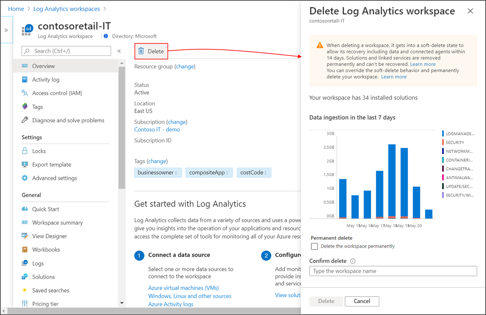
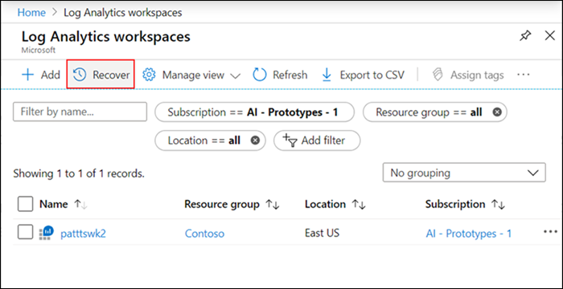
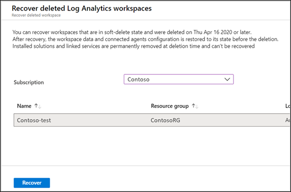

# Delete and recover Azure Log Analytics workspace

This article explains the concept of Azure Log Analytics workspace soft-delete and how to recover deleted workspace.

## Considerations when deleting a workspace

When you delete a Log Analytics workspace, a soft-delete operation is performed to allow the recovery of the workspace including its data and connected agents within 14 days, whether the deletion was accidental or intentional. 
After the soft-delete period, the workspace resource and its data are non-recoverable – its data is queued for permanent deletion and completely purged within 30 days. The workspace name is 'released' and you can use it to create a new workspace.

> [!NOTE]
> If you want to override the soft-delete behavior and permanently delete your workspace, follow the steps in [Permanent workspace delete](#permanent-workspace-delete).

You want to exercise caution when you delete a workspace because there might be important data and configuration that may negatively impact your service operation. Review what agents, solutions and other Azure services store their data in Log Analytics, such as:

* Management solutions
* Azure Automation
* Agents running on Windows and Linux virtual machines
* Agents running on Windows and Linux computers in your environment
* System Center Operations Manager

The soft-delete operation deletes the workspace resource and any associated users' permission is broken. If users are associated with other workspaces, then they can continue using Log Analytics with those other workspaces.

## Soft-delete behavior

The workspace delete operation removes the workspace Resource Manager resource, but its configuration and data are kept for 14 days, while giving the appearance that the workspace is deleted. Any agents and System Center Operations Manager management groups configured to report to the workspace remain in an orphaned state during the soft-delete period. The service further provides a mechanism for recovering the deleted workspace including its data and connected resources, essentially undoing the deletion.

> [!NOTE] 
> Installed solutions and linked services like your Azure Automation account are permanently removed from the workspace at deletion time and can't be recovered. These should be reconfigured after the recovery operation to bring the workspace to its previously configured state.

You can delete a workspace using [PowerShell](https://docs.microsoft.com/powershell/module/azurerm.operationalinsights/remove-azurermoperationalinsightsworkspace?view=azurermps-6.13.0), [REST API](https://docs.microsoft.com/rest/api/loganalytics/workspaces/delete), or in the [Azure portal](https://portal.azure.com).

### Azure portal

1. Sign in to the [Azure portal](https://portal.azure.com). 
2. In the Azure portal, select **All services**. In the list of resources, type **Log Analytics**. As you begin typing, the list filters based on your input. Select **Log Analytics workspaces**.
3. In the list of Log Analytics workspaces, select a workspace and then click **Delete**  from the top of the middle pane.
4. A confirmation page appears that shows the data ingestion to the workspace over the past week. Type in the name of the workspace to confirm and then click **Delete**.

   

### PowerShell
```PowerShell
PS C:\>Remove-AzOperationalInsightsWorkspace -ResourceGroupName "resource-group-name" -Name "workspace-name"
```

## Permanent workspace delete
The soft-delete method may not fit in some scenarios such as development and testing, where you need to repeat a deployment with the same settings and workspace name. In such cases you can permanently delete your workspace and "override" the soft-delete period. The permanent workspace delete operation releases the workspace name and you can create a new workspace using the same name.


> [!IMPORTANT]
> Use permanent workspace delete operation with caution since its irreversible and you won't be able to recover your workspace and its data.

Add '-force' tag to permanently delete your workspace:

```powershell
PS C:\>Remove-AzOperationalInsightsWorkspace -ResourceGroupName "resource-group-name" -Name "workspace-name" -Force
```

## Recover workspace
When you delete a Log Analytics workspace accidentally or intentionally, the service places the workspace in a soft-delete state making it inaccessible to any operation. The name of the deleted workspace is preserved during the soft-delete period and can't be used for creating a new workspace. After the soft-delete period, the workspace is non-recoverable, it is scheduled for permanent deletion and its name it released and can be used for creating a new workspace.

You can recover your workspace during the soft-delete period including its data, configuration and connected agents. You need to have Contributor permissions to the subscription and resource group where the workspace was located before the soft-delete operation. The workspace recover is performed by creating a Log Analytics workspace with the details of the deleted workspace including:

- Subscription ID
- Resource Group name
- Workspace name
- Region

### Azure portal

1. Sign in to the [Azure portal](https://portal.azure.com). 
2. In the Azure portal, select **All services**. In the list of resources, type **Log Analytics**. As you begin typing, the list filters based on your input. Select **Log Analytics workspaces**. You see the list of workspaces you have in the selected scope.
3. Click **Recover** on the top left menu to open a page with workspaces in soft-delete state that can be recovered.

   

4. Select the workspace and click **Recover** to recover that workspace.

   


### PowerShell
```PowerShell
PS C:\>Select-AzSubscription "subscription-name-the-workspace-was-in"
PS C:\>New-AzOperationalInsightsWorkspace -ResourceGroupName "resource-group-name-the-workspace-was-in" -Name "deleted-workspace-name" -Location "region-name-the-workspace-was-in"
```

The workspace and all its data are brought back after the recovery operation. Solutions and linked services were permanently removed from the workspace when it was deleted and these should be reconfigured to bring the workspace to its previously configured state. Some of the data may not be available for query after the workspace recovery until the associated solutions are re-installed and their schemas are added to the workspace.

> [!NOTE]
> * Re-creating a workspace during the soft-delete period gives an indication that this workspace name is already in use. 
 
## Troubleshooting

You must have at least *Log Analytics Contributor* permissions to delete a workspace.

* If you aren't sure if deleted workspace is in soft-delete state and can be recovered, click [Recover](#recover-workspace) in *Log Analytics workspaces* page to see a list of soft-deleted workspaces per subscription. Permanently deleted workspaces aren't included in the list.
* If you get an error message *This workspace name is already in use* or *conflict* when creating a workspace, it could be since:
  * The workspace name isn't available and being used by someone in your organization, or by other customer.
  * The workspace was deleted in the last 14 days and its name kept reserved for the soft-delete period. To override the soft-delete and permanently delete your workspace to create a new workspace with the same name, follow these steps to recover the workspace first and perform permanent delete:<br>
     1. [Recover](https://docs.microsoft.com/azure/azure-monitor/platform/delete-workspace#recover-workspace) your workspace.
     2. [Permanently delete](https://docs.microsoft.com/azure/azure-monitor/platform/delete-workspace#permanent-workspace-delete) your workspace.
     3. Create a new workspace using the same workspace name.
